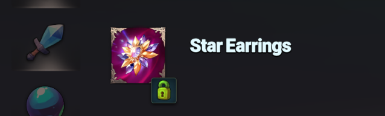
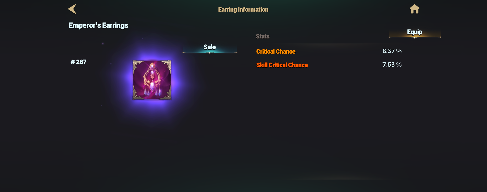

# 🍒 Earring



### 🍒 Earrings

Earrings **come with CP and SCP as base stats.**\
Equip the right earrings to unleash even greater combat power!

***

#### 🔹 Accessing the Earring Inventory

<figure><figcaption>
MainHUD
</figcaption></figure>

📌 **Tap the "Dashboard" button on the top-left of the main HUD.**\
📌 **The dashboard displays a summary of your currently equipped weapon.**\
📌 **Tap the "Equipment Bag" button at the bottom** to view your list of weapons, orbs, and accessories!

***

#### 🔹 Using the Earring List

<figure><figcaption></figcaption></figure>

📌 **Tap an earring from the list to view its details.**\
📌 **Here, you can equip or unequip earrings, and use the sort button on the top-left to organize your equipment.**

***

#### ⚠️ **Earring Stats & Important Notes**

🔹 **CP and SCP are granted as base stats.**\
🔹 **Compared to weapons and orbs, earrings have lower random option rates and values.**\
🔹 **CR is not granted as a random option.**

Choosing the right gear is key to maximizing your hero’s strength.\
Use the base stats of earrings wisely and create the ultimate battle strategy!

***

#### 🔹 Utilizing the Lock Feature

<figure><figcaption></figcaption></figure>

To prevent accidental use or dismantling, **take advantage of the equipment lock feature!**\
📌 **Tap the "Lock" button in the inventory to secure your earrings.**\
📌 **Locked gear benefits:**\
✅ **Moves to the top of the earring list** for easy access.\
✅ **Cannot be used as crafting material** – no risk of accidental dismantling!

***

#### 🔹 Viewing Earring Details

<figure><figcaption></figcaption></figure>

📌 **Tap any earring in the inventory to access the details page.**\
📌 Here, you can **check its stats,** [**sell**](../../../trade/market/trading-items/)**, and manage other features.**

💡 **Strategically utilize your earrings' base stats and random options to maximize your hero’s power!**



### 🍒 **귀걸이**

귀걸이에는 **CP와 SCP가 기본적으로 부여됩니다.**\
적절한 귀걸이를 장착하여 더욱 강력한 전투력을 발휘하세요!

***

#### 🔹 **귀걸이 목록 접근하기**

<figure><figcaption>
MainHUD
</figcaption></figure>

📌 **메인 HUD 좌측 상단의 "대시보드" 버튼을 터치하세요.**\
📌 **대시보드 중앙에서 현재 장착 중인 무기의 요약 정보를 확인할 수 있습니다.**\
📌 **하단의 "장비 가방" 버튼을 터치하면 보유 중인 무기, 오브, 악세서리 리스트를 확인할 수 있습니다!**

***

#### 🔹 **귀걸이 목록 활용하기**

<figure><figcaption></figcaption></figure>

📌 **귀걸이 목록에서 원하는 장비를 터치하면 상세 정보 페이지로 이동합니다.**\
📌 **이 목록에서 귀걸이를 장착하거나 해제할 수 있으며, 좌측 상단의 정렬 버튼을 이용해 원하는 순서로 정렬할 수도 있습니다.**

***

#### ⚠️ **귀걸이 옵션 & 주의사항**

🔹 **CP와 SCP가 기본 스탯으로 부여됩니다.**\
🔹 **무기 및 오브에 비해, 귀걸이의 랜덤 옵션 확률과 수치는 낮게 설정되어 있습니다.**\
🔹 **랜덤 옵션으로 CR이 부여되지 않습니다.**

전략적인 장비 선택이 영웅의 전투력을 결정합니다.\
귀걸이의 기본 스탯을 활용하고, 최적의 옵션을 조합해 **나만의 전투 스타일을 완성하세요!**

***

#### 🔹 **슬롯 잠금 기능 활용하기**

<figure><figcaption></figcaption></figure>

귀걸이를 실수로 사용하거나 분해하는 것을 방지하려면 **장비 잠금 기능을 활용**하세요!\
📌 **목록에서 "잠금" 버튼을 터치하면 해당 장비가 잠금 상태가 됩니다.**\
📌 **잠금된 장비의 장점:**\
✅ **귀걸이 목록의 최상단에 배치**되어 쉽게 확인 가능!\
✅ **제작 재료로 사용되지 않음** – 실수로 분해할 걱정 없음!

***

#### 🔹 **귀걸이 상세 정보 확인하기**

<figure><figcaption></figcaption></figure>

📌 **귀걸이 목록에서 원하는 장비를 터치하면 상세 정보 페이지로 이동**합니다.\
📌 이 페이지에서는 **귀걸이의 스탯 확인,** [**판매**](../../../trade/market/trading-items/) **등 모든 작업을 수행**할 수 있습니다.

💡 **귀걸이의 기본 스탯과 랜덤 옵션을 전략적으로 활용하여, 영웅을 더욱 강력하게 성장시키세요!**&#x20;



### 🍒 イヤリング

イヤリングには **CPとSCPが基本ステータスとして付与されます。**\
最適なイヤリングを装備し、さらに強力な戦闘力を発揮しましょう！

***

#### 🔹 イヤリングインベントリへのアクセス

<figure><figcaption>
MainHUD
</figcaption></figure>

📌 **メインHUD左上の「ダッシュボード」ボタンをタップ** してください。\
📌 **ダッシュボードでは現在装備している武器の概要パネルを確認** できます。\
📌 **画面下部の「装備バッグ」ボタンをタップ** すると、武器・オーブ・アクセサリーのリストを表示できます！

***

#### 🔹 イヤリングリストの活用

<figure><figcaption></figcaption></figure>

📌 **リスト内のイヤリングをタップすると、詳細ページが表示されます。**\
📌 **イヤリングの装備・解除** が可能で、左上の **「ソートボタン」** を使用して整理することもできます。

***

#### ⚠️ **イヤリングのステータス & 注意事項**

🔹 **CPとSCPが基本ステータスとして付与されます。**\
🔹 **武器やオーブに比べて、イヤリングのランダムオプションの確率と数値は低く設定されています。**\
🔹 **CRはランダムオプションとして付与されません。**

最適な装備を選ぶことで、英雄の戦闘力を最大限に引き出せます。\
イヤリングの基本ステータスを活かし、最強の戦闘戦略を構築しましょう！

***

#### 🔹 **ロック機能の活用**

<figure><figcaption></figcaption></figure>

誤使用や分解を防ぐために、**装備ロック機能を活用** しましょう！\
📌 **インベントリ内の「ロック」ボタンをタップ** すると、イヤリングがロックされます。\
📌 **ロックされた装備のメリット:**\
✅ **イヤリングリストの最上部に配置** され、簡単にアクセス可能。\
✅ **クラフト素材として使用不可** – 誤って分解する心配なし！

***

#### 🔹イヤリングの詳細確認

<figure><figcaption></figcaption></figure>

📌 **インベントリ内のイヤリングをタップすると、詳細ページに移動** できます。\
📌 ここでは **ステータスの確認、**[**販売**](../../../trade/market/trading-items/)**、その他の管理が可能** です。

💡 **イヤリングの基本ステータスとランダムオプションを活用し、英雄をさらに強化しましょう！**


