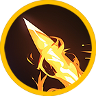
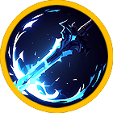
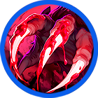
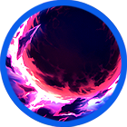
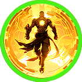
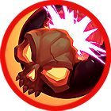
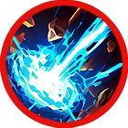
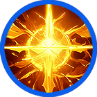
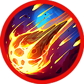
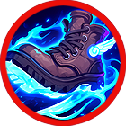

# 🔥 Skill pool - Weapon



<table data-full-width="true"><thead><tr><th width="181" align="center">Skill</th><th width="135" align="center">Icon</th><th width="103">Type</th><th width="613">contents</th></tr></thead><tbody><tr><td align="center">Point attack</td><td align="center"></td><td>Melee</td><td><ul><li>Aims for a vital spot, dealing damage to the enemy. </li><li>급소를 노려 일격을 날려 적에게 피해를 입힙니다. </li><li>急所を狙って一撃を放ち、敵にダメージを与えます。</li></ul>

</td></tr><tr><td align="center">Needle shot</td><td align="center"></td><td>Melee</td><td><ul><li>Quickly thrusts at the enemy, dealing damage four times. </li><li>빠르게 적을 찔러 피해를 4회 입힙니다. </li><li>素早く敵を突き、4回ダメージを与えます。</li></ul></td></tr><tr><td align="center">Mana blade</td><td align="center"></td><td>Melee</td><td><ul><li>Strikes with the force of mana, dealing damage three times. Enemies hit will have their MP consumption increased. </li><li>마나의 기운으로 일격을 가하여 적에게 피해를 3회 입힙니다. 피해를 입은 적은 MP 소모량이 증가합니다. </li><li>マナの力で一撃を加え、敵に3回ダメージを与えます。ダメージを受けた敵のMP消費量が増加します。</li></ul></td></tr><tr><td align="center">Half moon</td><td align="center"></td><td>Melee</td><td><ul><li>Delivers a crescent-shaped sword strike, dealing damage three times. The remaining power of the moon restores MP. </li><li>반달 모양의 검격 공격으로 적에게 피해를 3회 입힙니다. 검격에 남아있는 달의 힘으로 MP를 회복합니다. </li><li>半月型の剣気攻撃で敵に3回ダメージを与えます。剣気に残る月の力でMPが回復します。</li></ul></td></tr><tr><td align="center">Sword Master</td><td align="center"></td><td>Melee</td><td><ul><li>Unleashes a powerful sword strike, dealing damage three times and stunning the enemy. </li><li>경지에 오른 강력한 검격을 날려 적에게 피해를 3회 입히며 스턴 상태로 만듭니다. </li><li>境地に達した強力な剣撃を放ち、敵に3回ダメージを与え、スタン状態にします。</li></ul></td></tr><tr><td align="center">Star shot</td><td align="center"></td><td>Projectile</td><td><ul><li>Fires magical stars forward, dealing damage to the enemy. </li><li>별의 마법을 전방으로 발사하여 적에게 피해를 입힙니다. </li><li>星の魔法を前方に発射し、敵にダメージを与えます。</li></ul></td></tr><tr><td align="center">Canon Rush</td><td align="center"></td><td>Projectile</td><td><ul><li>Charges forward, dealing damage and knocking back enemies within range. </li><li>전방으로 강하게 돌진하여 범위 내 적에게 피해를 입히며 넉백시킵니다. </li><li>前方に強く突進し、範囲内の敵にダメージを与え、ノックバックさせます。</li></ul></td></tr><tr><td align="center">Dracula</td><td align="center"></td><td>Projectile</td><td><ul><li>Fires a blood-sucking orb forward, dealing damage. Your HP is restored, while enemies hit have their HP reduced. </li><li>전방으로 흡혈구를 날려 적에게 피해를 입힙니다. 공격 시 HP가 회복되고, 피해를 입은 적들의 HP가 감소됩니다. </li><li>吸血球を前方に放ち、敵にダメージを与えます。攻撃時にHPが回復し、ダメージを受けた敵のHPが減少します。</li></ul></td></tr><tr><td align="center">Burst shot</td><td align="center"></td><td>Projectile</td><td><ul><li>Fires multiple powerful projectiles forward, dealing damage to enemies. </li><li>전방으로 강력한 탄환을 다량 발사하여 적에게 피해를 입힙니다. </li><li>強力な弾丸を前方に多数発射し、敵にダメージを与えます。</li></ul></td></tr><tr><td align="center">Extocium</td><td align="center"></td><td>Projectile</td><td><ul><li>Unleashes the power of Extosium, firing a large mana ball forward. It deals damage and stuns the enemy. </li><li>엑스토시움의 힘을 개방하여 전방으로 광범위한 마나볼을 발사해 적에게 피해를 입히며 스턴 상태로 만듭니다. </li><li>エクストシウムの力を解放し、前方に大規模なマナボールを発射し、敵にダメージを与えスタン状態にします。</li></ul></td></tr><tr><td align="center">Berserker</td><td align="center"></td><td>Buff</td><td><ul><li>Becomes a berserker, increasing all critical hit and skill critical hit rates and bonuses. MP decreases every second during skill use. </li><li>광전사가 되어 모든 치명타 및 스킬 치명타 확률과 보너스를 증가시킵니다. 스킬 사용 중에는 초당 MP가 감소합니다. </li><li>バーサーカーになり、すべてのクリティカルヒットとスキルクリティカルヒットの確率とボーナスが増加します。スキル使用中は毎秒MPが減少します。</li></ul></td></tr><tr><td align="center">Immortal</td><td align="center"></td><td>Buff</td><td><ul><li>Creates a shield that blocks incoming damage. MP decreases every second during skill use. </li><li>불사의 힘으로 적의 데미지를 방어하는 실드를 생성합니다. 스킬 사용 중에는 초당 MP가 감소합니다. </li><li>不死の力で敵のダメージを防ぐシールドを生成します。スキル使用中は毎秒MPが減少します。</li></ul></td></tr><tr><td align="center">Psycho</td><td align="center"></td><td>AoE</td><td><ul><li>Rapidly fires bombs around you, dealing damage to enemies within range. </li><li>자신의 주변으로 폭탄을 마구마구 발사하여 범위 내 적들에게 피해를 입힙니다. </li><li>自分の周囲に爆弾を次々に発射し、範囲内の敵にダメージを与えます。</li></ul></td></tr><tr><td align="center">Three little pigs</td><td align="center"></td><td>Summon</td><td><ul><li>Summons three little pigs. The pigs attack nearby enemies. MP decreases every second during skill use. </li><li>아기돼지를 3마리 소환합니다. 아기돼지들은 가까운 적을 공격합니다. 스킬 사용 중에는 초당 MP가 감소합니다. </li><li>子豚を3匹召喚します。子豚たちは近くの敵を攻撃します。スキル使用中は毎秒MPが減少します。</li></ul></td></tr><tr><td align="center">Ghost</td><td align="center"></td><td>Summon</td><td><ul><li>Summons a ghost. The ghost attacks nearby enemies. MP decreases every second during skill use. </li><li>고스트를 소환합니다. 고스트는 가까운 적을 공격합니다. 스킬 사용 중에는 초당 MP가 감소합니다. </li><li>ゴーストを召喚します。ゴーストは近くの敵を攻撃します。スキル使用中は毎秒MPが減少します。</li></ul></td></tr><tr><td align="center">Spirit's Call</td><td align="center"></td><td>Summon</td><td><ul><li>Summons a giant ent that fires multiple magic projectiles dealing damage per tick. MP decreases every second during skill use. </li><li>자이언트 엔트를 소환합니다. 자이언트 엔트는 틱당 피해를 입히는 마법구를 다량 발사합니다. 스킬 사용 중에는 초당 MP가 감소합니다. </li><li>ジャイアントエントを召喚します。ジャイアントエントはティックごとにダメージを与える魔法弾を多数発射します。スキル使用中は毎秒MPが減少します。</li></ul></td></tr><tr><td align="center">Devil's Call</td><td align="center"></td><td>Summon</td><td><ul><li>Summons a demonized lizardman. The demon attacks nearby enemies. MP decreases every second during skill use. </li><li>악마가 된 리자드맨을 소환합니다. 악마는 가까운 적을 공격합니다. 스킬 사용 중에는 초당 MP가 감소합니다. </li><li>悪魔化したリザードマンを召喚します。悪魔は近くの敵を攻撃します。スキル使用中は毎秒MPが減少します。</li></ul></td></tr><tr><td align="center">Blizard</td><td align="center"></td><td>AoE</td><td><ul><li>Summons a powerful ice orb that deals damage per tick to enemies within range and reduces their movement speed with freezing cold. </li><li>강력한 마법 얼음구를 소환하여 범위 내의 적들에게 틱당 피해를 입히고, 강력한 냉기로 인해 대상의 이동 속도를 감소시킵니다. </li><li>強力な魔法の氷玉を召喚し、範囲内の敵にティックごとにダメージを与え、冷気によって移動速度を減少させます。</li></ul></td></tr><tr><td align="center">Guardian of light</td><td align="center"></td><td>Projectile</td><td><ul><li>Fires multiple light spheres forward that return like boomerangs, dealing damage and restoring your HP. </li><li>다량의 빛의 구가 전방으로 발사되었다가 부메랑처럼 돌아옵니다. 적에게 피해를 입히며 나의 HP를 회복합니다. </li><li>多数の光の玉が前方に発射され、ブーメランのように戻り、敵にダメージを与えながら自分のHPが回復します。</li></ul></td></tr><tr><td align="center">Meteo</td><td align="center"></td><td>AoE</td><td><ul><li>Summons a powerful fire orb that deals damage per tick to enemies within range. Enemies hit are burned and take additional damage. </li><li>강력한 마법 화염구를 소환하여 범위 내의 적들에게 틱당 피해를 입히고, 피해를 받은 적들은 화상에 걸려 추가 피해를 입습니다. </li><li>強力な魔法の火炎玉を召喚し、範囲内の敵にティックごとにダメージを与え、ダメージを受けた敵は火傷により追加ダメージを受けます。</li></ul></td></tr><tr><td align="center">Jump Attack</td><td align="center"></td><td>AoE</td><td><ul><li>Performs a jump attack, dealing damage to enemies within range and knocking them back. </li><li>점프 공격을 가하여 범위 내의 적들에게 피해를 입히고, 대상을 넉백시킵니다. </li><li>ジャンプ攻撃を行い、範囲内の敵にダメージを与え、ノックバックさせます。</li></ul></td></tr></tbody></table>
