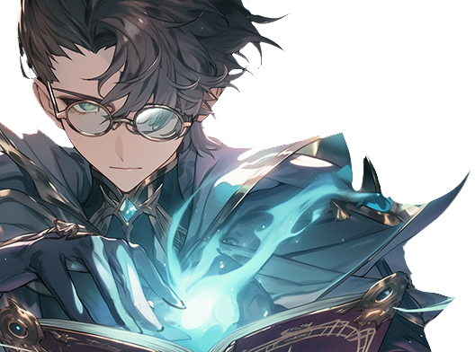

# 🪨 Aristo

<figure><figcaption></figcaption></figure>

💡[**Compatibility : S**](../../stats/elemental-bonus-damage.md)[**tone**](../../stats/elemental-bonus-damage.md)


[skill-pool-aristo.md](skill-pool-aristo.md)




#### 📒Aristo - Guardian of Wisdom and a Soul in Turmoil

Aristo is a distinguished scholar of the Kingdom of Asterica, tasked by the goddess Aruru with overseeing the research of Extocium and its enigmatic ruins. Once the mentor to a young Iskandar, he harbors an unyielding passion for mastering new technologies and passing that knowledge to others. His life has been a beacon of intellectual pursuit, yet a shadow has recently fallen over his heart—a secret burden imposed by King Sargon.

The king’s request stems from a harrowing experience on the battlefield, where he witnessed monstrous beings wielding the power of Extocium with devastating force. Determined to unravel their secrets, Sargon sought to capture them, but they yielded nothing. Desperate, he turned to Aristo with an audacious demand: to grant the power of Extocium to the first prince, a boy born with no affinity for it. Though Aristo reluctantly agreed to try, the request defies the laws of nature and gnaws at his conscience.

What troubles him most is the truth he glimpses in Sargon’s eyes. This is no mere fatherly wish to empower a son—it is fear, a dread of Iskandar’s rising star. Iskandar, with his natural bond to Extocium and growing sway in the court, looms as a threat to Sargon’s rule. Caught between his duty as a scholar devoted to truth and the king’s manipulative command, Aristo stands at a crossroads, his soul torn by doubt and destiny.



#### 📒아리스토 - 지식의 수호자와 갈등의 중심

아리스토는 아스테리카 왕국의 저명한 학자로, 여신 아루루의 명을 받아 엑스토시움과 그 신비로운 유적 연구를 총괄하는 막중한 임무를 맡고 있다. 그는 어린 시절 이스칸달의 스승으로서 그를 지도한 인연이 있으며, 새로운 기술을 탐구하고 후학들에게 전수하는 일에 누구보다 열정을 쏟는다. 그의 삶은 지식과 진보를 위한 헌신으로 빛나지만, 최근 그의 마음을 무겁게 짓누르는 고민이 생겼다.

그 고민은 사르곤 왕의 비밀스러운 부탁에서 비롯된다. 사르곤은 전선에서 엑스토시움의 힘을 자유자재로 다루는 강력한 괴물들을 목격한 뒤 그 비밀에 매혹되었다. 그는 괴물들을 사로잡아 그 힘의 근원을 알아내려 했으나 실패했고, 결국 아리스토에게 불가능에 가까운 요청을 던졌다. 바로 엑스토시움에 반응하지 않는 첫 번째 왕자에게 그 힘을 부여해 달라는 것이었다. 자연의 이치를 거스르는 이 요구에 아리스토는 당혹스러웠지만, 왕의 명령을 거역할 수 없어 노력하겠노라 약속했다.

그러나 아리스토의 마음은 불안으로 가득하다. 사르곤의 의도가 단순히 아들을 강하게 만들려는 부성애가 아니라는 것을 눈치챘기 때문이다. 왕의 눈빛에는 이스칸달을 향한 깊은 두려움과 경계가 담겨 있었다. 엑스토시움과 깊이 교감하며 왕실 내에서 영향력을 키워가는 이스칸달은 사르곤에게 위협으로 다가왔고, 아리스토는 자신이 왕의 정치적 계산에 이용되고 있음을 깨달았다. 지식의 수호자로서 진실을 지키고자 하는 그의 신념과 왕의 명령 사이에서, 아리스토는 깊은 갈등의 소용돌이에 빠져든다.



#### 📒アリスト - 知恵の守護者と内なる葛藤

アリストはアステリカ王国の名高い学者であり、女神アルルの命を受けて、エクストシウムとその神秘的な遺跡の研究を総括している。かつて幼いイスカンダルの師として彼を導いた縁があり、新しい技術を学び、後進に教えることに情熱を傾ける人物だ。彼の人生は知恵と進歩への献身で輝いているが、最近、心を重くする悩みが彼を襲った。

その悩みの発端は、サルゴン王からの秘密の依頼である。サルゴンは戦場でエクストシウムの力を操る恐ろしい怪物たちを目の当たりにし、その秘密に魅了された。彼は怪物たちを捕らえてその力の源を探ろうとしたが失敗に終わり、やがてアリストに無謀な願いを託した。エクストシウムに反応しない第一王子にその力を授けてほしいというのだ。自然の理に反するこの要求にアリストは困惑したが、王の命令を拒むことはできず、努力を約束した。

だが、彼の心は不安で満ちている。サルゴンの真意が、息子を強くしたいという純粋な願いではないと気づいたからだ。王の瞳には、イスカンダルへの深い恐れが宿っていた。エクストシウムと強く共鳴し、王室内での影響力を増すイスカンダルは、サルゴンにとって脅威だった。アリストは、自分が王の政治的な策略に利用されていることを悟る。知恵の守護者として真実を求める彼の信念と、王の命令との間で、アリストは激しい葛藤に飲み込まれていく。


