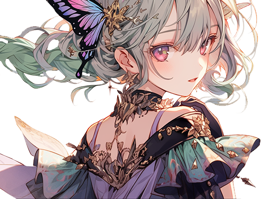

# 🔮 Aruru

<figure><figcaption></figcaption></figure>

💡[**Compatibility :** ](../../stats/elemental-bonus-damage.md)[**Dark**](../../stats/elemental-bonus-damage.md)


[skill-fool-aruru.md](skill-fool-aruru.md)




📒

Antique collector Owen had an old friend. When this friend had a child, Owen decided to gift a beautiful violet pebble, resembling the friend's eyes, and headed to his house.

The charming little child burst into loud cries as Owen was invited into the home. As the pebble Owen brought encountered the little child, the star engraved on it shone brightly and gently floated above her hand. Owen and his friend were so amazed that they couldn't close their mouths.

Aruru is the first human to react with EXTOCIUM, the first wizard. As the highest wizard of the Asterica kingdom, she gathers those who react with EXTOCIUM and leads the wizard knights.

Recently, she dreams nightly of a monster with black horns and wings destroying Asterica. Its appearance closely matches the descriptions in the ancient texts of EXTOCIUM, prompting her to research the content of these texts and the legends of the ancient kingdom of EXTOCIUM.



📒

골동품 수집가 오웬에게는 오래된 벗이 있었다. \
그 벗에게 아이가 생겨, \
오웬은 벗의 눈동자를 닮은 예쁜 보랏빛 돌멩이를 선물로 들고 그의 집으로 향한다. \
\
어여쁜 꼬마 아이는 오웬이 집에 초대되자 우렁차게 울어댔다. \
오웬이 들고온 돌멩이가 꼬마 아이와 조우하자, \
돌멩이에 새겨진 별 그림이 빛나며 그녀의 손 위에서 둥실둥실 떠올랐다. \
오웬과 그의 벗은 놀라서 입을 다물지 못한다. \
\
아루루는 최초로 엑스토시움과 반응한 인간, 최초의 위자드다. \
아스테리카 왕국의 최고 위자드로써, \
엑스토시움에 반응하는 이들을 모아 위자드 기사단을 지휘하고 있다. \
\
최근에는 밤마다 검은 뿔과 날개가 돋아난 괴물이 아스테리카를 파괴하는 꿈을 꾼다. \
그 모습이 엑스토시움의 고서에 쓰여진 문장과 흡사하여, 고서의 내용과 전설 속 엑스토시움 왕국의 유적을 조사하고 있다.



📒

古美術品コレクターのオーエンには古い友人がいました。その友人に子供ができたので、オーエンは友人の瞳を模した美しい紫色の小石をプレゼントとして持って、彼の家へ向かいました。

かわいらしい小さな子供は、オーエンが家に招かれると、大きな声で泣き出しました。オーエンが持ってきた小石が小さな子供と出会うと、その上に刻まれた星の図案が光り輝き、彼女の手の上でふわふわと浮かび上がりました。オーエンと彼の友人は驚いて口を閉じることができませんでした。

アルルは、EXTOCIUM（エクストシウム）に反応した最初の人間、最初のウィザードです。アステリカ王国の最高のウィザードとして、EXTOCIUMに反応する人々を集めてウィザードの騎士団を指揮しています。

最近では、夜ごとに黒い角と翼が生えた怪物がアステリカを破壊する夢を見ています。その姿は、EXTOCIUMの古文書に記された文章と酷似しており、古文書の内容と伝説のEXTOCIUM王国の遺跡を調査しています。


