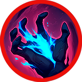

# 🔥 Skill fool - Aruru

### ❇️Video Guide



### ❇️Aruru‘s skill list     &#x20;

<table data-full-width="true"><thead><tr><th width="188">Skill</th><th width="100" align="center">Icon</th><th width="118"></th><th width="468">contents</th><th align="center">loot prob</th></tr></thead><tbody><tr><td>Goddess of all 만물의 여신 万物の女神</td><td align="center"></td><td><mark style="color:green;">Buff</mark></td><td>Increases your damage for a set duration, and critical hit rate and skill critical hit rate are increased. While using this skill, MP decreases every second. 🔹 정해진 시간 동안 자신의 데미지가 증가하고, 치명타 및 스킬 치명타 확률이 상승합니다. 스킬 사용 중에는 매 초마다 MP가 감소합니다. 🔹 一定時間、自分のダメージが増加し、クリティカル率およびスキルクリティカル率が上昇します。スキル使用中は、毎秒MPが減少します。</td><td align="center">15%</td></tr><tr><td>Clay of Enkidu 엔키두의 점토 エンキドゥの粘土</td><td align="center"></td><td><mark style="color:purple;">Summon</mark></td><td>Summons the powerful warrior Enkidu. Enkidu is summoned for a set duration and attacks nearby enemies with high attack power, with additional damage based on affinity. While using this skill, MP decreases every second. 🔹 강력한 전사 엔키두를 소환합니다. 엔키두는 정해진 시간 동안 소환되어 높은 공격력으로 가까운 적을 공격하며, 상성에 따른 부가 데미지가 증가합니다. 스킬 사용 중에는 매 초마다 MP가 감소합니다. 🔹 強力な戦士エンキドゥを召喚します。エンキドゥは一定時間召喚され、高い攻撃力で近くの敵を攻撃し、属性に応じた追加ダメージが増加します。スキル使用中は、毎秒MPが減少します。</td><td align="center">15%</td></tr><tr><td>Friend of Enkidu 엔키두의 절친 エンキドゥの親友</td><td align="center"></td><td><mark style="color:purple;">Summon</mark></td><td>Summons Gilgamesh, the best friend of Enkidu. Gilgamesh is summoned for a set duration and fires powerful star fragments forward. Enemies within the area take damage per projectile. MP decreases every second while the skill is active. 🔹 엔키두의 절친 길가메시를 소환합니다. 길가메시는 정해진 시간 동안 소환되어 전방으로 강력한 별의 파편을 발사합니다. 범위 내 적들은 탄당 피해를 입습니다. 스킬 사용 중에는 매 초마다 MP가 감소합니다. 🔹 エンキドゥの親友ギルガメッシュを召喚します。ギルガメッシュは一定時間召喚され、前方に強力な星の破片を発射します。範囲内の敵は弾ごとにダメージを受けます。スキル使用中は毎秒MPが減少します。</td><td align="center">15%</td></tr><tr><td>Absolute Fear 절대적인 공포 絶対的な恐怖</td><td align="center"></td><td><mark style="color:red;">AoE</mark></td><td>Fires a powerful dark orb, dealing damage to the enemy and knocking them back. Elemental bonus damage is increased. 🔹 강력한 암흑구를 발사하여 적에게 피해를 입히고, 넉백시킵니다. 상성에 따른 부가 데미지가 증가합니다. 🔹 強力な暗黒球を発射して敵にダメージを与え、ノックバックさせます。属性に応じた追加ダメージが増加します。</td><td align="center">15%</td></tr><tr><td>Awakening Despair 깨어나는 절망 目覚める絶望</td><td align="center"></td><td><mark style="color:red;">AoE</mark></td><td>Places a field in front that reduces enemy movement speed. Enemies standing on the field take damage per tick. 🔹 전방에 적의 이동속도가 감소하는 장판을 설치합니다. 장판 위에 있는 적들은 틱당 피해를 입습니다. 🔹 前方に敵の移動速度が減少するフィールドを設置します。フィールド上の敵はティックごとにダメージを受けます。</td><td align="center">10%</td></tr><tr><td>Destroying Star 파괴되는 별 破壊される星</td><td align="center"></td><td><mark style="color:blue;">Projectile</mark></td><td>Powerful star fragments are fired forward. Enemies within the area take damage per projectile, and elemental bonus damage is increased. 🔹 전방으로 강력한 별의 파편들이 발사됩니다. 범위 내 적들은 탄당 피해를 입으며, 상성에 따른 부가 데미지가 증가합니다. 🔹 前方に強力な星の破片が発射されます。範囲内の敵は弾ごとにダメージを受け、属性に応じた追加ダメージが増加します。</td><td align="center">15%</td></tr><tr><td>Black Light 흑광 黒鉱</td><td align="center"></td><td><mark style="color:red;">AoE</mark></td><td>Fires an absorbing dark orb that pulls enemies within the area for a set duration. Enemies within the area take damage per tick. 🔹 흡성하는 암흑구를 발사하여 범위 내 적들을 일정 시간 동안 끌어당깁니다. 범위 내 적들은 틱당 피해를 입습니다. 🔹 吸引する暗黒球を発射し、範囲内の敵を一定時間引き寄せます。範囲内の敵はティックごとにダメージを受けます。</td><td align="center">15%</td></tr></tbody></table>

