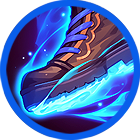
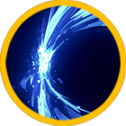
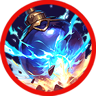
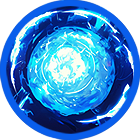
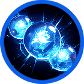
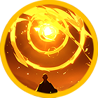

# 🔥 Skill fool - Elena

### ❇️Video Guide



### ❇️Elena‘s skill list&#x20;

<table data-full-width="true"><thead><tr><th width="157">Skill</th><th width="117" align="center">Icon</th><th width="115">Type</th><th width="500">contents</th><th align="center">loot prob</th></tr></thead><tbody><tr><td>Rush 돌격 突撃</td><td align="center"></td><td>Projectile</td><td>
Charges forward, dealing damage to enemies within the area and knocking them back. 

🔹 

전방으로 돌진하여 범위 내 적에게 피해를 입히고, 넉백시킵니다. 

🔹 

前方に突進し、範囲内の敵にダメージを与え、ノックバックさせます。
</td><td align="center">15%</td></tr><tr><td>Meditation 명상 瞑想</td><td align="center"></td><td>Buff</td><td>
Upon use, recovers MP and HP per second for a set duration, and increases damage. 

🔹 

사용 시 정해진 시간 동안 자신의 MP와 HP를 초당 회복하며, 데미지가 증가합니다. 

🔹 

使用すると、一定時間毎秒MPとHPが回復し、ダメージが増加します。
</td><td align="center">10%</td></tr><tr><td>Power attack 파워어택 パワーアタック</td><td align="center"></td><td>Melee</td><td>
Swings a powerful sword forward, dealing damage to enemies within the area and knocking them back. 

🔹 

전방으로 강력하게 검을 휘둘러 범위 내 적들에게 피해를 입히고, 넉백시킵니다. 

🔹 

前方に強力な剣を振り、範囲内の敵にダメージを与え、ノックバックさせます。
</td><td align="center">15%</td></tr><tr><td>Throwing bombs 폭탄던지기 爆弾投げ</td><td align="center"></td><td>AoE</td><td>
Throws multiple bombs forward, dealing damage to enemies within the area. 

🔹 

전방으로 다량의 폭탄을 던져 범위 내 적들에게 피해를 입힙니다. 

🔹 

前方に多数の爆弾を投げ、範囲内の敵にダメージを与えます。
</td><td align="center">15%</td></tr><tr><td>Wrong mana ball 잘못 만든 마나볼 間違って作ったMana Ball</td><td align="center"></td><td>Projectile</td><td>
Throws a massive mana ball forward, dealing damage per tick to enemies within the area and knocking them back. 

🔹 

전방으로 거대한 마나볼을 던져 범위 내 적들에게 틱당 피해를 입히고, 넉백시킵니다. 

🔹 

前方に巨大なマナボールを投げ、範囲内の敵にティックごとのダメージを与え、ノックバックさせます。
</td><td align="center">15%</td></tr><tr><td>Mana error 마나 조절 실패 Mana調節失敗</td><td align="center"></td><td>Projectile</td><td>
Fires multiple powerful mana balls forward, dealing damage per projectile to enemies within the area. 

🔹 

전방으로 강력한 마나볼이 다량 발사되어 범위 내 적들에게 탄당 피해를 입힙니다. 

🔹 

前方に強力なマナボールが多数発射され、範囲内の敵に弾ごとのダメージを与えます。
</td><td align="center">15%</td></tr><tr><td>Mysterious revelation 의문의 부름 疑問の呼び掛け</td><td align="center"></td><td>Melee</td><td>
A powerful aura of light emanates around Elena, dealing damage to enemies within the area and stunning them. 

🔹 

엘레나의 주변으로 강력한 빛의 가호가 발산되어 범위 내 적들에게 피해를 입히고 스턴 상태로 만듭니다. 

🔹 

エレナの周囲に強力な光の加護が放たれ、範囲内の敵にダメージを与え、スタン状態にします。
</td><td align="center">15%</td></tr></tbody></table>
