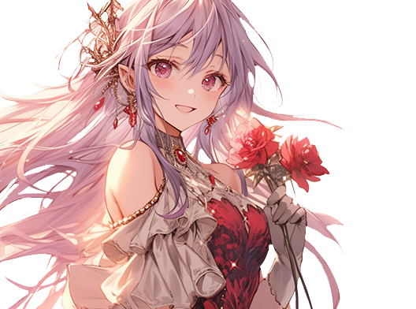
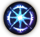

# ✴️ Ishtar

<figure><figcaption></figcaption></figure>

💡[**Compatibility : L**](../../stats/elemental-bonus-damage.md)[**ight**](../../stats/elemental-bonus-damage.md)


[skill-fool-ishtar.md](skill-fool-ishtar.md)




📒

Hair flowing in a light purple hue, ice-blue eyes that seem to bring forth an ice cave from beneath perpetual snow.&#x20;

Ishtar, the closest friend of Elena, born and raised in the Rottenhill orphanage.&#x20;

Her beauty shone even brighter against the backdrop of the crumbling Rottenhill. \
Her insatiable curiosity dreams of the vast world, \
and the desire within her wants to become stronger and more splendid.&#x20;

The days she listens to stories about the Asterica kingdom and the wizard knights from Parasiel, who occasionally comes to the village to trade, are her happiest days. \
One day, Parasiel, carrying EXTOCIUM, reveals that both Ishtar and Elena have the potential to be wizards.&#x20;

Ishtar, with her heart racing wildly, takes Elena's hand and embarks on a journey to join the wizard knights.



📒

연보라빛으로 찰랑이는 머릿결, \
만년설 아래 얼음굴을 가져다놓은 듯한 희푸른 눈동자. \
로튼힐 고아원에서 나고 자란, 엘레나와 가장 친한 벗 이슈타르.&#x20;

그녀의 아름다움은 다 쓰러져가는 로튼힐에서 더 밝게 빛났다. \
지칠 줄 모르는 그녀의호기심은 드넓은 세상을 꿈꾸게 하고, \
마음속에 내재된 욕망은 더 강하고 멋진 사람이 되고 싶게 한다. \
간혹 마을에 장사를 하러 오는 파라시엘에게 아스테리카 왕국과 위자드 기사단의 이야기를 듣는 날이 그녀에게는 가장 행복한 날이다.

어느 날 엑스토시움을 들고 온 파라시엘에 의해 \
이슈타르와 엘레나 모두 위자드의 소질이 있다는 사실을 알게된다. \
마음이 마구마구 날뛰는 이슈타르.

엘레나의 손을 붙잡고 위자드 기사단에 입단하기 위한 여정에 오른다.



📒

紫がかったライトパープルの髪、\
永遠の雪の下から氷の洞窟を持ってきたかのような薄青い瞳。

ロットンヒル孤児院で生まれ育ったエレナの最も親しい友人、\
イシュタール。彼女の美しさは、崩れかけたロットンヒルの背景でさらに明るく輝いた。\
尽きることのない好奇心は広大な世界を夢見させ、\
内に秘めた欲求はより強く素晴らしい人になりたいと思わせる。

時折、商売で村に来るパラシエルからアステリカ王国とウィザード騎士団の話を聞く日は、\
彼女にとって最も幸せな日である。ある日、\
EXTOCIUMを持ってきたパラシエルによって、\
イシュタールとエレナは共にウィザードの資質があることを知る。

心が激しく躍るイシュタールは、エレナの手を取り、\
ウィザード騎士団に加入するための旅に出る。


