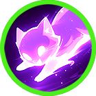

# 🔥 Skill fool - Ishtar

### ❇️Video Guide



### ❇️Ishtar‘s skill list &#x20;

<table data-full-width="true"><thead><tr><th width="208">Skill</th><th width="111" align="center">Icon</th><th>Type</th><th width="475">Contents</th><th align="center">loot prob</th></tr></thead><tbody><tr><td>Beautiful Star 아름다운 별 美しい星</td><td align="center"></td><td><mark style="color:green;">Buff</mark></td><td>For a set duration, your damage increases. MP decreases every second while the skill is active.  🔹 정해진 시간 동안 자신의 데미지가 상승합니다. 스킬 사용 중에는 매 초마다 MP가 감소합니다.  🔹 一定時間、自身のダメージが増加します。スキル使用中は毎秒MPが減少します。</td><td align="center">15%</td></tr><tr><td>Little Demon 장난꾸러기 いたずら坊主</td><td align="center"></td><td><mark style="color:green;">Buff</mark></td><td>For a set duration, your movement speed and damage increase. MP decreases every second while the skill is active. 🔹  정해진 시간 동안 이동속도와 데미지가 증가합니다. 스킬 사용 중에는 매 초마다 MP가 감소합니다.  🔹  一定時間、自身の移動速度とダメージが増加します。スキル使用中は毎秒MPが減少します。</td><td align="center">15%</td></tr><tr><td>Rage 격노 激怒</td><td align="center"></td><td><mark style="color:blue;">Projectile</mark></td><td>Fires multiple light orbs forward, dealing damage per projectile to enemies. Elemental bonus damage is increased. 🔹  전방으로 다수의 빛 구를 발사하여 적에게 탄당 피해를 입힙니다. 상성에 따른 부가 데미지가 증가합니다.  🔹  前方に多数の光の球を発射し、敵に弾ごとのダメージを与えます。属性に応じた追加ダメージが増加します。</td><td align="center">15%</td></tr><tr><td>Ishtar Gate 이슈타르의 문 Ishtarの門</td><td align="center"></td><td><mark style="color:green;">Buff</mark></td><td>Quickly teleports behind the target.  For a set duration, your AP and SAP increase, and AGI is boosted. 🔹  타겟의 등 뒤로 재빠르게 텔레포트합니다.  정해진 시간 동안 AP와 SAP가 증가하고, 민첩성이 증가합니다. 🔹  ターゲットの背後に素早くテレポートします。 一定時間、APとSAPが増加し、敏捷性（AGI）が上昇します。</td><td align="center">10%</td></tr><tr><td>Babylon's Cry 바빌론의 함성 バビロンの歓声</td><td align="center"></td><td>AoE</td><td>A broad area is struck by a radiant cry, dealing damage per tick to enemies within the area. Elemental bonus damage is increased.  🔹  넓은 범위에 함성의 빛이 떨어져 범위 내 적들에게 틱당 피해를 입힙니다. 상성에 따른 부가 데미지가 증가합니다.  🔹  広範囲に叫びの光が降り注ぎ、範囲内の敵にティックごとにダメージを与えます。属性に応じた追加ダメージが増加します。</td><td align="center">15%</td></tr><tr><td>Glare 섬광 閃光</td><td align="center"></td><td>Pr<mark style="color:blue;">ojectile</mark></td><td>Fires multiple light orbs in a 360-degree radius, dealing damage per projectile to enemies and knocking them back. Elemental bonus damage is increased.  🔹  360도 범위로 다수의 빛 구를 발사하여 적에게 탄당 피해를 입히며 넉백시킵니다. 상성에 따른 부가 데미지가 증가합니다.  🔹  360度にわたり光の球を多数発射し、敵に弾ごとのダメージを与え、ノックバックさせます。属性に応じた追加ダメージが増加します。</td><td align="center">15%</td></tr><tr><td>Annihilation 섬멸 殲滅</td><td align="center"></td><td>Melee</td><td>Swings a powerful sword in a 360-degree radius, dealing damage to enemies. Elemental bonus damage is increased. 🔹  360도 범위로 강력한 검을 휘둘러 적에게 피해를 입힙니다. 상성에 따른 부가 데미지가 증가합니다.  🔹  360度にわたり強力な剣を振り、敵にダメージを与えます。属性に応じた追加ダメージが増加します。</td><td align="center">15%</td></tr></tbody></table>
