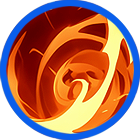

# 🔥 Skill fool - Iskandar

### ❇️Video Guide



### ❇️Iskandar‘s skill list  

<table data-full-width="true"><thead><tr><th width="206">Skill</th><th width="109" align="center">Icon</th><th width="102">Type</th><th width="489">contents</th><th align="center">loot prob</th></tr></thead><tbody><tr><td>Great Conqueror 위대한 정복자 偉大な征服者</td><td align="center"></td><td>Buff</td><td>Generates a shield that reduces enemy damage by a certain amount for a set duration. MP decreases every second while the skill is active.  🔹  정해진 시간 동안 적의 데미지를 일정량 감소시키는 실드를 생성합니다. 스킬 사용 중에는 매 초마다 MP가 감소합니다.  🔹  一定時間、敵のダメージを一定量減少させるシールドを生成します。スキル使用中は毎秒MPが減少します。</td><td align="center">15%</td></tr><tr><td>End of the world 세상의 끝 世界の終わり</td><td align="center"></td><td>Projectile</td><td>Throws a long-range flaming shuriken forward, dealing damage per projectile to enemies. Elemental bonus damage is increased.  🔹  전방으로 사거리가 긴 불타는 표창을 투척하여 적에게 탄당 피해를 입힙니다. 상성에 따른 부가 데미지가 증가합니다.  🔹  前方に長射程の燃える手裏剣を投げ、敵に弾ごとのダメージを与えます。属性に応じた追加ダメージが増加します。</td><td align="center">15%</td></tr><tr><td>Wandering 유랑 流浪</td><td align="center"></td><td>Projectile</td><td>
Charges forward, dealing damage to enemies within the area and knocking them back.  🔹 

전방으로 돌진하여 범위 내 적들에게 피해를 입히며, 적을 넉백시킵니다. 

🔹 

前方に突進し、範囲内の敵にダメージを与え、ノックバックさせます。
</td><td align="center">15%</td></tr><tr><td>Wrath of fire 화염의 분노 火炎の怒り</td><td align="center"></td><td>Buff</td><td>
For a set duration, your skill reload time decreases, movement speed increases, and damage increases. MP decreases every second while the skill is active. 

🔹 

정해진 시간 동안 스킬 리로드 타임이 감소하고, 이동속도가 증가하며, 데미지가 증가합니다. 스킬 사용 중에는 매 초마다 MP가 감소합니다. 

🔹 

一定時間、スキルのリロード時間が減少し、移動速度が増加し、ダメージが増加します。スキル使用中は毎秒MPが減少します。
</td><td align="center">15%</td></tr><tr><td>Fighting Sprit 화염의 투지 火炎の闘志</td><td align="center"></td><td>Buff</td><td>
For a set duration, your damage increases. MP decreases every second while the skill is active. 

🔹 

정해진 시간 동안 자신의 데미지가 상승합니다. 스킬 사용 중에는 매 초마다 MP가 감소합니다. 

🔹

 一定時間、自身のダメージが増加します。スキル使用中は毎秒MPが減少します。
</td><td align="center">15%</td></tr><tr><td>Will Destroy 멸망시키리라 滅ぼします</td><td align="center"></td><td>Projectile</td><td>
Fires a massive firestorm forward, dealing damage per tick to enemies within the area and knocking them back. Elemental bonus damage is increased. 

🔹 

전방으로 거대한 화염폭풍을 날려보내어 범위 내 적들에게 틱당 피해를 입히며, 넉백시킵니다. 상성에 따른 부가 데미지가 증가합니다. 

🔹 

前方に巨大な火炎嵐を放ち、範囲内の敵にティックごとのダメージを与え、ノックバックさせます。属性に応じた追加ダメージが増加します。
</td><td align="center">15%</td></tr><tr><td>Red Bombardment 붉은 폭격 赤い爆撃</td><td align="center"></td><td>AoE</td><td>
Summons a meteor of fire in a wide area, dealing damage per tick to enemies within the area. Elemental bonus damage is increased. 

🔹 

광역 범위에 화염 운석을 소환하여 범위 내 적들에게 틱당 피해를 입힙니다. 상성에 따른 부가 데미지가 증가합니다. 

🔹 

広範囲に火炎の隕石を召喚し、範囲内の敵にティックごとのダメージを与えます。属性に応じた追加ダメージが増加します。
</td><td align="center">10%</td></tr></tbody></table>
