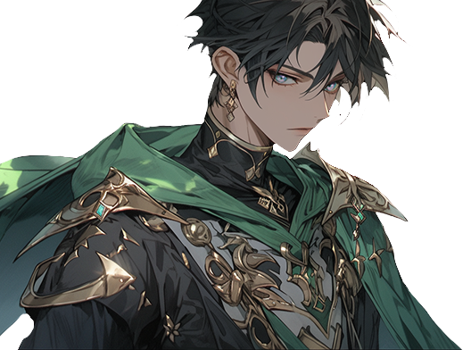

# 🍀 Tammuz

<figure><figcaption></figcaption></figure>

💡[**Compatibility :** ](../../stats/elemental-bonus-damage.md)[**Leaf**](../../stats/elemental-bonus-damage.md)


[skill-fool-tammuz.md](skill-fool-tammuz.md)




📒

Tammuz became a companion on the journey to the Asterica kingdom \
with Elena and Ishtar after helping them when they were attacked \
by a mushroom monster upon leaving Rottenhill.&#x20;

A free-spirited shepherd boy, he uses a rare form of healing magic in the kingdom. \
Ishtar grows fond of Tammuz, \
but sometimes she is taken aback by the inexplicable ferocity that lingers in his eyes.



📒

로튼힐을 떠나온 엘레나와 이슈타르가 버섯괴물에게 공격 당했을 때 \
도와준 것이 인연이 되어 함께 아스테리카 왕국으로 떠나는 길동무가 된다.&#x20;

자유 분방한 양치기 소년으로, 왕국에선 흔치 않은 회복 마법을 사용한다. \
이슈타르는 탐무즈를 좋아하게 되지만, \
간혹 그의 눈에 서려있는 알 수 없는 살기에 당황스러울 때가 있다.



📒

ロットンヒルを離れたエレナとイシュタールがキノコの\
怪物に襲われた時に助けたことが縁となり、\
一緒にアステリカ王国への旅に出る仲間となったタムズ。

自由奔放な羊飼いの少年で、王国では珍しい回復魔法を使う。\
イシュタールはタムズのことを好きになるが、\
時々彼の目に宿る説明できない殺気に戸惑うことがある。


