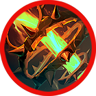

# 🔥 Skill fool - Tammuz

### ❇️Video Guide



### ❇️Tammuz‘s skill list &#x20;

<table data-full-width="true"><thead><tr><th width="208">Skill</th><th width="108" align="center">Icon</th><th width="115">Type</th><th width="479">contents</th><th align="center">loot prob</th></tr></thead><tbody><tr><td>Tammuz's blessing 탐무즈의 축복 TAmmuzの祝福</td><td align="center"></td><td>Buff</td><td>
Upon use, recovers HP per second for a set duration and reduces the damage you take. MP decreases every second while the skill is active. 

🔹 

사용 시 정해진 시간 동안 자신의 HP를 초당 회복하고, 내가 받는 데미지가 감소합니다. 스킬 사용 중에는 매 초마다 MP가 감소합니다. 

🔹 

使用すると、一定時間毎秒HPが回復し、自身が受けるダメージが減少します。スキル使用中は毎秒MPが減少します。
</td><td align="center">15%</td></tr><tr><td>Sheep Sheep Sheep 양양양이 많아요 羊羊羊が多いです</td><td align="center"></td><td>Summon</td><td>
Summons 3 mischievous sheep. The sheep attack nearby enemies with their attack power for a set duration. Elemental bonus damage is increased. 

🔹 

불량한 양 3마리가 소환됩니다. 양들은 정해진 시간 동안 소환되어 가까운 적을 공격합니다. 상성에 따른 부가 데미지가 증가합니다. 

🔹 

3匹の不良な羊が召喚されます。羊は一定時間召喚され、近くの敵を攻撃します。属性に応じた追加ダメージが増加します。
</td><td align="center">15%</td></tr><tr><td>Life is a Thorny road 인생은 가시밭길 人生は茨の道</td><td align="center"></td><td>AoE</td><td>
Summons thorny bushes forward, dealing damage to enemies. Elemental bonus damage is increased. 

🔹 

전방으로 가시 덤불을 소환하여 적에게 피해를 입힙니다. 상성에 따른 부가 데미지가 증가합니다. 

🔹 

前方に棘の茂みを召喚し、敵にダメージを与えます。属性に応じた追加ダメージが増加します。
</td><td align="center">15%</td></tr><tr><td>Flower of blessing 축복의 꽃 祝福の花</td><td align="center"></td><td>Buff</td><td>
Upon use, recovers HP per second for a set duration and increases damage. MP decreases every second while the skill is active. 

🔹 

사용 시 정해진 시간 동안 자신의 HP를 초당 회복하고, 데미지가 증가합니다. 스킬 사용 중에는 매 초마다 MP가 감소합니다. 

🔹 

使用すると、一定時間毎秒HPが回復し、ダメージが増加します。スキル使用中は毎秒MPが減少します。
</td><td align="center">15%</td></tr><tr><td>Poisonous weed 독초 毒草</td><td align="center"></td><td>AoE</td><td>
Spreads a poisonous field made of toxic plants. Enemies standing on the field take damage per tick, and affected targets suffer a movement speed reduction debuff for a set duration. 

🔹 

독초로 만들어진 독장판을 뿌려 적이 장판 위에 서 있는 동안 틱당 피해를 입습니다. 피해를 입은 타겟은 정해진 시간 동안 이동속도가 감소하는 디버프에 걸립니다. 

🔹 

毒草で作られた毒のフィールドを撒きます。フィールド上にいる敵はティックごとのダメージを受け、ダメージを受けたターゲットは一定時間移動速度が減少するデバフにかかります。
</td><td align="center">15%</td></tr><tr><td>Piercing a thorn 가시뚫기 とげ抜き</td><td align="center"></td><td>AoE</td><td>
Launches a powerful thorny bush attack forward, dealing damage to enemies and knocking them back. Elemental bonus damage is increased. 

🔹 

전방으로 강력한 가시덤불 공격을 가하여 적에게 피해를 입히고, 넉백시킵니다. 상성에 따른 부가 데미지가 증가합니다. 

🔹

 前方に強力な棘の茂みを攻撃し、敵にダメージを与え、ノックバックさせます。属性に応じた追加ダメージが増加します。
</td><td align="center">15%</td></tr><tr><td>Suhyangmi 수향미 水香味</td><td align="center"></td><td>Projectile</td><td>
Fires a large amount of golden aromatic rice forward. Each hit deals damage to enemies and stuns them due to the enticing aroma. 

🔹 

황금빛 수향미를 전방으로 다량 발사하여 적에게 탄당 피해를 입히며, 고소한 냄새에 적들이 당황하여 스턴 상태가 됩니다. 

🔹 

大量の黄金の香り米を前方に発射し、敵にヒットごとにダメージを与え、香ばしい香りで敵が混乱しスタン状態になります。
</td><td align="center">10%</td></tr></tbody></table>
