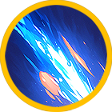

# 🔥 Skill fool - Tiamat

### ❇️Video Guide



### ❇️Tiamat‘s skill list   

<table data-full-width="true"><thead><tr><th width="207">Skill</th><th width="106" align="center">Icon</th><th width="105">Type</th><th width="479">contents</th><th align="center">loot prob</th></tr></thead><tbody><tr><td>Waves 파도 波濤</td><td align="center"></td><td>Buff</td><td>
Creates a shield for a set duration that increases your damage and reduces enemy damage. MP decreases every second while the skill is active. 

🔹 

정해진 시간 동안 나의 데미지가 상승하고, 적의 데미지를 감소시키는 실드를 생성합니다. 스킬 사용 중에는 매 초마다 MP가 감소합니다. 

🔹 

一定時間、自身のダメージを増加させ、敵のダメージを減少させるシールドを生成します。スキル使用中は毎秒MPが減少します。
</td><td align="center">15%</td></tr><tr><td>Rain of destruction 멸망의 비 滅亡の碑</td><td align="center"></td><td>Melee</td><td>
Fires a powerful water spell forward, dealing damage per tick to enemies. Elemental bonus damage is increased. 

🔹 

전방으로 강력한 물의 마법을 발사하여 적에게 틱당 피해를 입힙니다. 상성에 따른 부가 데미지가 증가합니다. 

🔹 

前方に強力な水の魔法を発射し、敵にティックごとのダメージを与えます。属性に応じた追加ダメージが増加します。
</td><td align="center">15%</td></tr><tr><td>Water ball 워터볼 ウォーターボール</td><td align="center"></td><td>Projectile</td><td>
A powerful water ball is thrown like a boomerang and returns, dealing damage per hit to enemies within the area and briefly stunning them. Elemental bonus damage is increased. 

🔹 

강력한 워터볼이 부메랑처럼 발사되었다 돌아오며 범위 내 적들에게 타격당 피해를 입히고, 적들은 짧은 스턴 상태가 됩니다. 상성에 따른 부가 데미지가 증가합니다. 

🔹 

強力なウォーターボールがブーメランのように発射され、戻ってきて範囲内の敵にヒットごとにダメージを与え、短時間スタンさせます。属性に応じた追加ダメージが増加します。
</td><td align="center">15%</td></tr><tr><td>Sinking 침몰 沈没</td><td align="center"></td><td>AoE</td><td>
Fires an absorbing water orb that pulls enemies within the area for a set duration. Enemies within the area take damage per tick. 

🔹 

흡성하는 물의 구를 발사하여 범위 내 적들을 일정 시간 동안 끌어당깁니다. 범위 내 적들은 틱당 피해를 입습니다. 

🔹

 吸引する水の球を発射し、範囲内の敵を一定時間引き寄せます。範囲内の敵はティックごとのダメージを受けます。
</td><td align="center">10%</td></tr><tr><td>Salt Flower 소금꽃 塩の花</td><td align="center"></td><td>AoE</td><td>
Throws salt flowers at enemies in front, dealing damage per hit. Enemies within the area are briefly stunned and afflicted with a corrosion debuff, taking damage per second for a set duration. 

🔹 

전방의 적들에게 소금꽃을 뿌려 타격당 피해를 입힙니다. 범위 내 적들은 짧은 스턴 상태가 되며, 일정 시간 동안 초당 피해를 입히는 부식 디버프에 걸립니다. 

🔹 

前方の敵に塩の花を撒き、ヒットごとにダメージを与えます。範囲内の敵は短時間スタン状態になり、一定時間、毎秒ダメージを与える腐食デバフにかかります。
</td><td align="center">15%</td></tr><tr><td>Healing power of water 물의 치유 水の癒し</td><td align="center"></td><td>Buff</td><td>
For a set duration, your damage increases and HP regenerates per second. MP decreases every second while the skill is active. 

🔹 

정해진 시간 동안 자신의 데미지가 상승하고, 초당 HP가 회복됩니다. 스킬 사용 중에는 매 초마다 MP가 감소합니다. 

🔹 

一定時間、自身のダメージが増加し、毎秒HPが回復します。スキル使用中は毎秒MPが減少します。
</td><td align="center">15%</td></tr><tr><td>Water Storm 물의 폭풍 水の嵐</td><td align="center"></td><td>Projectile</td><td>
Fires a waterstorm forward, dealing damage per tick to enemies within the area, and advancing until it dissipates. Elemental bonus damage is increased. 

🔹 

전방으로 물의 폭풍을 날려보내어 범위 내 적들에게 틱당 피해를 입히며 소멸할 때까지 전진합니다. 상성에 따른 부가 데미지가 증가합니다. 

🔹 

前方に水の嵐を放ち、範囲内の敵にティックごとのダメージを与え、消滅するまで前進します。属性に応じた追加ダメージが増加します。
</td><td align="center">15%</td></tr></tbody></table>
