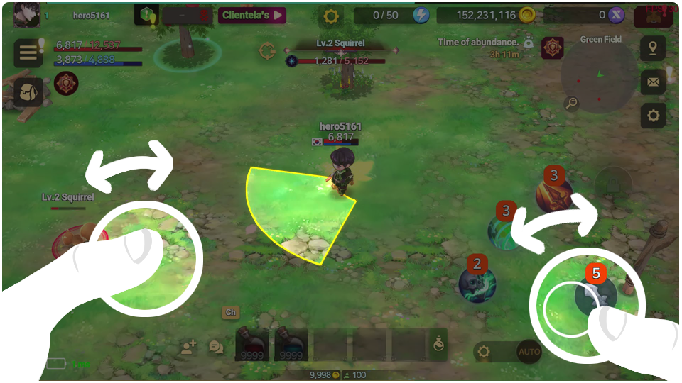

# 🏹 How to Battle



💡**Welcome to EXTOCIUM! Shall we learn some basic controls?**

1️⃣[Movement ](how-to-battle.md#id-1-movement)\
2️⃣[Using Skills ](how-to-battle.md#id-2-using-skills)\
3️⃣[Skill Cooldown ](how-to-battle.md#id-3-skill-cooldown)\
4️⃣[Auto ](how-to-battle.md#id-4-auto)\
5️⃣[Quick Slot](how-to-battle.md#id-5-quick-slot)

<figure><figcaption></figcaption></figure>

EXTOCIUM is optimized for mobile devices.

#### 1️⃣Movement

Move your character by dragging in the joystick area on the left.

#### 2️⃣Using Skills

There are four skill slots and one normal attack slot on the right, totaling five slots. Hero's skills 1 and 2 are placed in the leftmost slots 1 and 2, weapon skill in slot 3, and inherited hero skill in slot 4.

* Touch a skill slot once to use the skill towards a nearby attackable target.
* If no target is nearby, the skill is used in the direction the character is facing.&#x20;
* Drag your finger in the skill slot area to display the yellow range where the skill can be used. Moving your finger changes the direction of the skill, and releasing your finger will fire the skill.&#x20;
* To fight effectively in EXTOCIUM, you need to simultaneously control movement and skill usage to create moving shots. Practice maintaining distance and responding appropriately to opponents!

#### 3️⃣Skill Cooldown

Skill availability is determined by the following three factors:

* Skill reload time&#x20;
* Magazine capacity&#x20;
* Skill world cooldown

<figure><figcaption></figcaption></figure>

👉Skill reload time refers to the reload time per bullet inherent to each skill.

<figure><figcaption></figcaption></figure>

When a skill is used, a cooldown UI appears in the orange panel at the top of the skill slot. Once this black mask completes a full circle, one bullet is reloaded.


❓[Invest in CHA among primary stats to reduce reload time.](heroes/stats/special-stats/#eng)


<figure><figcaption></figcaption></figure>

👉The magazine capacity for skills is displayed in the orange panel at the top of the skill slot. Most skills are defined as 2 or 3 shots, and normal attacks as 5 shots. If bullets are loaded, it means you can use the skill continuously for the displayed number of times.

<figure><figcaption></figcaption></figure>

👉World cooldown is an unconditional time interval within which skills can be used. Investing in CHA will not reduce the world cooldown. When a skill is used, the skill image will have a black mask rotating clockwise, indicating the world cooldown.

#### 4️⃣Auto

<figure><figcaption></figcaption></figure>

👉Touch the auto button to initiate auto hunting. Touch the gear next to the auto button to access auto settings. Note, using auto settings requires [TP.](traning.md#eng)

<figure><figcaption></figcaption></figure>

👉In auto settings, you can select which skills to use, which not to use, your character's movement range, and your target. After setting it according to each character's purpose, turn on the auto button.


❓Be cautious with auto hunting once you exceed level 25! You could become a target for [PK](../contents/pk/#eng).


#### 5️⃣Quick Slot

For quick response during combat, keep potions or food in your quick slot!

<figure><figcaption></figcaption></figure>

👉Open the inventory, and simply drag & drop an item to the quick slot at the bottom of the main HUD to register it. Touch the potion icon on the right side of the quick slot menu to access quick slot settings.

<figure><figcaption></figcaption></figure>

👉As shown in the image, if the HP potion is checked and set to gauge 20, the potion will be automatically used when my character's HP falls below 20%. Adjust settings according to your situation.



**💡EXTOCIUM에 오신 것을 환영합니다! 간단한 조작 방법을 익혀볼까요?**

1️⃣[이동](how-to-battle.md#id-1)\
2️⃣[스킬 사용](how-to-battle.md#id-2)\
3️⃣[스킬 쿨타임](how-to-battle.md#id-3)\
4️⃣[오토](how-to-battle.md#id-4)\
5️⃣[퀵슬롯](how-to-battle.md#id-5)

<figure><figcaption></figcaption></figure>

EXTOCIUM은 모바일 기기에 최적화 되어 있습니다.&#x20;

#### 1️⃣이동

좌측 조그 영역을 움직여 캐릭터를 이동 시킬 수 있습니다.

#### 2️⃣스킬 사용

우측에 스킬 슬롯 4종, 일반 공격 1종, 총 5개의 슬롯이 존재합니다.\
영웅의 스킬 1,2번이 좌측 1,2번 슬롯에 들어가고, 무기 스킬이 3번 슬롯, 계승 영웅 스킬이 4번 슬롯에 위치하게 됩니다.

* 스킬 슬롯을 1번 터치하면, 근처의 공격 가능한 대상의 위치로 1회 스킬을 사용합니다.
* 이 때, 근처에 공격 대상이 없다면 캐릭터의 전진 방향으로 1회 스킬을 사용합니다.
* 스킬 슬롯 영역에서 손가락을 드래그하면, 스킬을 사용할 수 있는 노란색 범위가 출력됩니다. 이 때, 손가락을 움직여 방향을 바꾸면 스킬 방향이 변경됩니다. 이 상태에서 손을 떼면 스킬이 발사됩니다.
* EXTOCIUM에 전투를 잘 하려면 조그 컨트롤과 스킬 사용을 동시에 진행하여 무빙샷을 만들어야 합니다. 상대와 거리를 유지하며 적절하게 대응하는 연습을 해보세요!

#### 3️⃣스킬 쿨타임

스킬은 아래 세 가지 항목에 의해 사용 가능 여부가 판단됩니다.

* 스킬 리로드 타임
* 탄장전 개수
* 스킬 월드 쿨타임

<figure><figcaption></figcaption></figure>

👉스킬 리로드 타임은 각 스킬이 고유하게 가지고 있는 스킬의 탄 당 장전 시간을 의미합니다.&#x20;

<figure><figcaption></figcaption></figure>

스킬을 사용하면 스킬 슬롯의 상단 주황색 탄 개수 패널에 쿨타임 UI가 생성됩니다. 이 검은 마스크가 한 바퀴를 모두 돌면 탄 1개가 다시 리로드 됩니다.


❓[1차 스탯 중 CHA 등에 투자하여 리로드 타임을 감소시킬 수 있습니다. ](heroes/stats/special-stats/#undefined-1)


<figure><figcaption></figcaption></figure>

👉스킬의 탄 장전 개수는 스킬 슬롯 상단 주황색 패널에 표시됩니다. 대부분의 스킬은 2회 또는 3회로 정의되어 있으며, 일반공격은 5회로 정의되어 있습니다. 탄이 장전되어 있다면, 표시된 횟수 만큼은 연속적으로 사용할 수 있음을 의미합니다.

<figure><figcaption></figcaption></figure>

👉월드 쿨타임은 스킬을 사용할 수 있는 무조건적으로 제한된 시간 간격입니다. CHA 스탯에 투자하더라도, 월드 쿨타임을 줄일 수는 없습니다. 스킬 사용 시 스킬 이미지에 검은 마스크가 시계 방향으로 회전하게 되는데, 이 UI가 월드 쿨타임의 표시 입니다.

#### 4️⃣오토

<figure><figcaption></figcaption></figure>

👉오토 버튼을 터치하면, 오토 사냥을 실행할 수 있습니다. 오토 버튼 좌측 톱니바퀴를 터치하면 오토 세팅을 사용할 수 있습니다. 단, 오토 세팅을 사용하려면 [TP](traning.md#undefined-1)가 필요합니다.

<figure><figcaption></figcaption></figure>

👉오토 세팅에서 내가 사용할 스킬과 사용하지 않을 스킬, 내 캐릭터의 이동 범위, 내가 타겟할 대상을 설정할 수 있습니다. 각 캐릭터의 목적에 맞게 세팅한 후, 오토버튼을 켜면 됩니다.


❓레벨 25를 넘게 되면 오토 사냥에 주의해주세요! [PK](../contents/pk/#undefined-1)의 대상이 될 수 있습니다.


#### 5️⃣퀵슬롯

전투 시 빠른 대응을 위해 포션이나 음식을 퀵슬롯에 두고 사용하세요!

<figure><figcaption></figcaption></figure>

👉인벤토리를 열고, 메인 HUD 하단 퀵슬롯에 아이템을 드래그&드랍 하면 간단하게 퀵슬롯 등록이 완료됩니다. 퀵슬롯 메뉴 우측에 포션 모양 아이콘을 터치하면 퀵슬롯 세팅이 가능합니다.

<figure><figcaption></figcaption></figure>

👉위 화면처럼 HP 포션에 사용 체크가 되어있고, 게이지가 20으로 설정되어 있다면 내 캐릭터의 HP가 20% 아래로 떨어졌을 때 포션이 자동 사용됩니다. 사용자의 상황에 따라 설정을 조절하면 됩니다.



**💡EXTOCIUMへようこそ！基本的な操作方法を学びましょうか？**

1️⃣[移動](how-to-battle.md#id-1-yi-dong) \
2️⃣[スキル使用 ](how-to-battle.md#id-2sukiru)\
3️⃣[スキルクールダウン](how-to-battle.md#id-3sukirukrudaun) \
4️⃣[オート ](how-to-battle.md#id-4to)\
5️⃣[クイックスロット](how-to-battle.md#id-5kuikkusurotto)

<figure><figcaption></figcaption></figure>

EXTOCIUM은 모바일 기기에 최적화 되어 있습니다.&#x20;

#### 1️⃣移動

左側のジョイスティックエリアをドラッグしてキャラクターを移動させます。

#### 2️⃣スキル使用

右側に4つのスキルスロットと1つの通常攻撃スロットがあり、合計5つのスロットがあります。 ヒーローのスキル1、2が左側の1、2番スロットに配置され、武器スキルが3番スロット、継承ヒーロースキルが4番スロットに配置されます。

* スキルスロットを1回タッチすると、近くの攻撃可能な対象に向かってスキルが使用されます。
* 近くに攻撃対象がいない場合は、キャラクターの前方向にスキルが使用されます。
* スキルスロットエリアで指をドラッグすると、スキルが使用可能な黄色い範囲が表示されます。指を動かすとスキルの方向が変わり、指を離すとスキルが発射されます。
* EXTOCIUMで効果的に戦うためには、ジョグコントロールとスキル使用を同時に行い、移動ショットを作る必要があります。相手との距離を保ちながら適切に対応する練習をしましょう！

#### 3️⃣スキルクールダウン

スキルの使用可能かどうかは、以下の3つの項目によって決まります。

* スキルリロード時間&#x20;
* 弾薬数&#x20;
* スキルワールドクールダウン

<figure><figcaption></figcaption></figure>

👉スキルリロード時間は、各スキルが固有に持つ弾ごとのリロード時間を意味します。

<figure><figcaption></figcaption></figure>

スキルを使用すると、スキルスロットの上部のオレンジ色パネルにクールダウンUIが表示されます。この黒いマスクが一周すると、1発の弾が再リロードされます。


❓[主要ステータスのCHAに投資してリロード時間を短縮できます。](heroes/stats/special-stats/#ri-ben-yu)


<figure><figcaption></figcaption></figure>

👉スキルの弾薬数は、スキルスロットの上部のオレンジ色パネルに表示されます。ほとんどのスキルは2回または3回と定義されており、通常攻撃は5回と定義されています。弾が装填されている場合、表示された回数だけ連続して使用できることを意味します。

<figure><figcaption></figcaption></figure>

👉ワールドクールダウンは、スキルを使用できる無条件の時間間隔です。CHAに投資しても、ワールドクールダウンは短縮できません。スキル使用時、スキル画像には時計回りに回転する黒いマスクが表示され、これがワールドクールダウンの表示です。

#### 4️⃣オート

<figure><figcaption></figcaption></figure>

👉オートボタンをタッチすると、オート狩りを実行できます。オートボタンの左の歯車をタッチすると、オート設定を使用できます。ただし、オート設定を使用するには[TP](traning.md#ri-ben-yu)が必要です。

<figure><figcaption></figcaption></figure>

👉オート設定では、使用するスキルと使用しないスキル、キャラクターの移動範囲、ターゲットにする対象を設定できます。各キャラクターの目的に合わせて設定した後、オートボタンをオンにします。


❓レベル25を超えると、オート狩りに注意してください！ [PK](../contents/pk/#ri-ben-yu)の対象になる可能性があります。


#### 5️⃣クイックスロット

戦闘中に素早く対応するために、ポーションや食べ物をクイックスロットに入れて使用してください！

<figure><figcaption></figcaption></figure>

👉インベントリを開き、メインHUDの下部のクイックスロットにアイテムをドラッグ＆ドロップすると、簡単にクイックスロット登録が完了します。クイックスロットメニューの右側にあるポーションの形のアイコンをタッチすると、クイックスロット設定が可能です。

<figure><figcaption></figcaption></figure>

👉上の画像のように、HPポーションに使用チェックがされており、ゲージが20に設定されている場合、私のキャラクターのHPが20%以下になったときにポーションが自動使用されます。ユーザーの状況に応じて設定を調整してください。



\-
