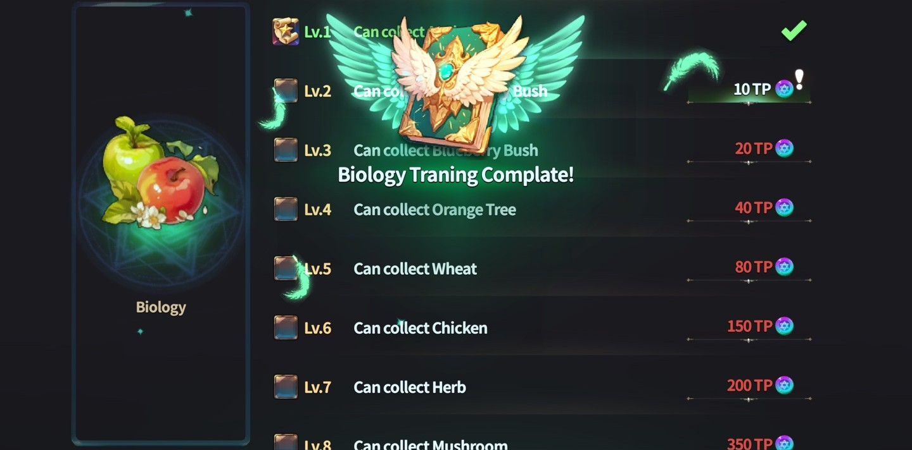

# 🍎 How to Collect



#### 🌿 Gathering Guide

In Extocium, you can't just click and collect.\
To gather items, you first need to earn **TP (Training Points)** through hunting,\
and use them in the **Training tab** to unlock gathering skills.

**Follow the steps below in order!**

***

#### 📍 How to Gather – Step by Step

**① Open the Dashboard**

🎯 Click the **helmet icon** on the left side of the game screen.

<figure><figcaption></figcaption></figure>

***

**② Click the Training Tab**

📘 In the bottom-left of the dashboard, click the **“Training” tab**.

<figure><figcaption></figcaption></figure>

***

**③ Select Biology & Use TP**

🧬 Click **“Biology”** in the upper menu.\
You’ll see gathering-related skills.\
Spend TP to unlock them one by one.

<figure><figcaption></figcaption></figure>

<figure><figcaption></figcaption></figure>

***

**④ Start Gathering**

🌾 When you approach a gathering spot,\
a **gather button** will appear.\
Click it to start gathering.

<figure><figcaption></figcaption></figure>

***

#### ⚙️ Want to Auto-Gather?

Too much clicking? No worries.\
Use the auto-gather function for convenience!

<figure><figcaption></figcaption></figure>

<figure><figcaption></figcaption></figure>

 



#### 🌿 채집 가이드

엑스토시움에서는 단순히 클릭만으로 채집이 되지 않아요.\
먼저, 사냥을 통해 얻는 TP(Training Point)를 모아 기술을 연마해야 채집이 가능해집니다.

**아래 단계를 순서대로 따라해 보세요!**

***

#### 📍 채집 방법 – Step by Step

**① 대시보드로 이동**

🎯 **게임 화면 좌측의 ‘투구 아이콘’을 클릭**해 대시보드로 들어가세요. 

<figure><figcaption></figcaption></figure>

***

**② 기술 연마 탭 클릭**

📘 대시보드 좌측 하단에 있는 **‘기술 연마(Training)’ 탭을 클릭**해 주세요.

<figure><figcaption></figcaption></figure>

***

**③ Biology 선택 & TP 사용**

🧬 상단 메뉴에서 **‘생물학’를 클릭**하면,\
채집과 관련된 항목들이 나타납니다.\
하나씩 **TP를 소모해 오픈**해 주세요!

<figure><figcaption></figcaption></figure>

<figure><figcaption></figcaption></figure>

***

**④ 채집하기**

🌾 채집물 근처로 다가가면,\
화면에 채집 버튼이 활성화돼요.\
클릭하면 채집이 진행됩니다.

<figure><figcaption></figcaption></figure>

***

#### ⚙️ 오토 채집을 원하시나요?

반복 채집이 번거로울 땐, 자동 채집 기능을 활용해보세요!\
**오토 채집 설정 방법은 아래 이미지를 참고**해 주세요.

<figure><figcaption></figcaption></figure>

<figure><figcaption></figcaption></figure>



#### 🌿 採集ガイド

エクストシウムでは、ただクリックするだけでは採集できません。\
まずは狩りで\*\*TP（トレーニングポイント）\*\*を集めて、\
**トレーニング画面**で採集スキルを習得する必要があります。

**以下のステップに沿って進めてみましょう！**

***

#### 📍 採集の方法 – ステップガイド

**① ダッシュボードを開く**

🎯 ゲーム画面左側の**ヘルメットアイコン**をクリックしてください。

<figure><figcaption></figcaption></figure>

***

**② トレーニングタブをクリック**

📘 ダッシュボード左下にある\*\*「トレーニング」タブ\*\*をクリックします。

<figure><figcaption></figcaption></figure>

***

**③ Biologyを選んでTPを使用**

🧬 上部メニューから「Biology」を選択すると、\
採集に関するスキルが表示されます。\
TPを使って一つずつアンロックしていきましょう。!

<figure><figcaption></figcaption></figure>

<figure><figcaption></figcaption></figure>

***

**④ 採集する**

🌾 採集ポイントに近づくと、\
採集ボタンが表示されます。\
クリックすると採集が開始されます。

<figure><figcaption></figcaption></figure>

***

#### ⚙️ オート採集を使いたい方へ

手動が面倒な時は、オート採集機能が便利です！\
**設定方法は以下の画像をご覧ください。**

<figure><figcaption></figcaption></figure>

<figure><figcaption></figcaption></figure>


