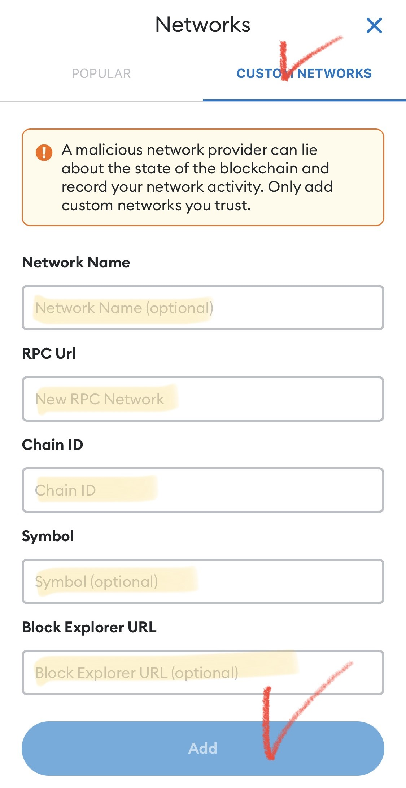

# 2️⃣ Adding a BSC network to MetaMask


**Watching the video will make it easier!**&#x20;




#### 🔹 **How to Add the Binance Smart Chain (BSC) Network** 🔹

EXTOCIUM operates on the **Binance Smart Chain (BSC)**.\
To fully enjoy all features, you must **add the BSC network to your MetaMask wallet**.\
Follow the steps below to set it up easily!&#x20;

#### ✅ **1. Install the MetaMask App**

📌 First, **download and install the official MetaMask app** from your store.\
👇 For detailed installation instructions, check the **official MetaMask link**.


Check out more details on the official MetaMask website!


❗[When installing the wallet, be sure to write down the recovery phrase on paper and store it in a place where it won't be lost!](precautions.md#eng-1)

***

#### ✅ **2. Open the Network Settings**

1️⃣ **Launch the MetaMask app**.\
2️⃣ **Tap (click) the network selection area** at the top of the screen (marked with a red circle in the image).

<figure><figcaption>
Touch the "Wallet"
</figcaption></figure>


The red circled area is where you set the 'Network' in MetaMask. \
The default setting of MetaMask is the 'Ethereum Network'. \
**When using EXTOCIUM, it must always be set to the BSC network.**


#### ✅ **3. Add Binance Smart Chain**

1️⃣ In the network selection screen, **tap "Add Network"**.

<figure><figcaption>
Add Network - Binance Chain
</figcaption></figure>

2️⃣ From the list, select **"Binance Smart Chain"** or **"BNB Smart Chain"**.

<figure><figcaption></figcaption></figure>

3️⃣ Done! ✅ Your MetaMask wallet is now connected to the BSC network.

<figure><figcaption></figcaption></figure>


📌 **How to check:**\
If the network name at the top of your wallet says **BNB Smart Chain or Binance Smart Chain**, it has been successfully added!


***

#### ❓ **What if BSC is not listed?**

If the network does not appear automatically, you must **add it manually**.

<figure><figcaption>
Custom Network
</figcaption></figure>

1️⃣ **Tap "Add Network"**.\
2️⃣ Select **"Custom Network"** in the top-right menu.\
3️⃣ Enter the following details and **tap "Add"** to complete the setup!


👉Network Name : **Binance Smart Chain**\
**👉**RPC URL : [**https://bsc-dataseed.binance.org**](https://bsc-dataseed.binance.org/)\
**👉**Chain ID : **56**\
**👉**Symbol : **BNB**\
**👉**Block Explorer URL : [**https://bscscan.com**](https://bscscan.com/)


Your MetaMask wallet is now connected to **BSC Network**! \
Enjoy a seamless and secure blockchain experience in EXTOCIUM!



#### 🔹 **바이낸스 스마트 체인(BSC) 네트워크 추가 방법** 🔹

엑스토시움(EXTOCIUM)은 **바이낸스 스마트 체인(BSC)** 을 기반으로 운영됩니다.\
따라서 **메타마스크(MetaMask) 지갑에 BSC 네트워크를 추가**해야 게임의 모든 기능을 원활하게 이용할 수 있습니다.\
아래 단계를 따라 차근차근 설정해 보세요!&#x20;

#### ✅ **1. 메타마스크 앱 설치하기**

📌 먼저, **공식 스토어에서 메타마스크 앱을 다운로드하여 설치**하세요.\
👇 자세한 설치 방법은 **메타마스크 공식 링크**를 참고하세요.


메타마스크 공식 홈페이지에서 더 자세한 내용을 확인하세요!


❗[지갑을 설치 할 때 입력한 복구 구문을 반드시 종이에 적어 잃어버리지 않을 장소에 보관하세요!](precautions.md#undefined-3)

***

#### ✅ **2. 네트워크 설정 화면으로 이동하기**

1️⃣ **메타마스크 앱을 실행**한 후,\
2️⃣ 화면 상단의 **네트워크 선택 영역(빨간 동그라미 표시된 부분)을 터치(클릭)** 하세요.

<figure><figcaption>
Touch the "Wallet"
</figcaption></figure>


빨간 동그라미 영역이 메타마스크에서 '네트워크'를 설정하는 영역입니다. \
메타마스크의 초기 설정값은 '이더리움 네트워크' 입니다. \
**EXTOCIUM을 사용할 때는 항상 BSC 네트워크로 세팅 되어 있어야 합니다.**


#### ✅ **3. Binance Smart Chain 추가하기**

1️⃣ 네트워크 선택 화면에서 **"네트워크 추가" 버튼**을 터치하세요.

<figure><figcaption>
Add Network - Binance Chain
</figcaption></figure>

2️⃣ 목록에서 **"Binance Smart Chain"** 또는 **"BNB Smart Chain"** 을 선택하세요.

<figure><figcaption></figcaption></figure>

3️⃣ 완료! ✅ 이제 메타마스크 지갑이 BSC 네트워크를 사용할 준비가 되었습니다.

<figure><figcaption></figcaption></figure>


📌 **확인 방법:**\
지갑 상단의 네트워크 표시 부분이 **BNB Smart Chain 또는 Binance Smart Chain**으로 설정되어 있으면 성공적으로 추가된 것입니다!


***

#### ❓ **네트워크 목록에 BSC가 없을 경우?**

네트워크가 자동으로 표시되지 않는다면, **수동으로 추가**해 주세요!

<figure><figcaption>
Custom Network
</figcaption></figure>

1️⃣ **"네트워크 추가" 버튼을 터치**한 후,\
2️⃣ 우측 상단의 **"커스텀 네트워크"** 메뉴를 선택하세요.\
3️⃣ 아래 정보를 입력한 후, **"Add" 버튼을 터치(클릭)** 하면 완료됩니다!


👉Network Name : **Binance Smart Chain**\
**👉**RPC URL : [**https://bsc-dataseed.binance.org**](https://bsc-dataseed.binance.org/)\
**👉**Chain ID : **56**\
**👉**Symbol : **BNB**\
**👉**Block Explorer URL : [**https://bscscan.com**](https://bscscan.com/)


이제 메타마스크 지갑이 **BSC 네트워크와 연결**되었습니다! \
엑스토시움에서 더욱 자유롭고 안전한 블록체인 경험을 즐겨보세요!&#x20;



#### 🔹 **Binance Smart Chain (BSC) ネットワークの追加方法** 🔹

EXTOCIUMは **Binance Smart Chain (BSC)** 上で動作します。\
すべての機能を快適に利用するために、**MetaMaskウォレットにBSCネットワークを追加** する必要があります。\
以下の手順で簡単に設定しましょう！

#### ✅ **1. MetaMaskアプリをインストール**

📌 まず、**公式ストアからMetaMaskアプリをダウンロード・インストール** してください。\
👇 詳しいインストール方法は、**MetaMask公式リンク** を確認してください。


MetaMaskの公式ホームページで詳細をご確認ください！


❗[ウォレットをインストールする際に入力したリカバリーフレーズは、必ず紙に書き留めて、失くさない場所に保管してください！](precautions.md#ri-ben-yu-1)

***

#### ✅ **2. ネットワーク設定を開く**

1️⃣ **MetaMaskアプリを起動** します。\
2️⃣ **画面上部のネットワーク選択エリア（赤い丸で示された部分）をタップ（クリック）** してください。

<figure><figcaption>
Touch the "Wallet"
</figcaption></figure>


赤い円で囲まれたエリアはMetaMaskで「ネットワーク」を設定する場所です。MetaMaskの初期設定値は「イーサリアムネットワーク」です。\
**EXTOCIUMを使用するときは、常にBSCネットワークに設定されている必要があります。**


#### ✅ **3. Binance Smart Chain を追加**

1️⃣ **ネットワーク選択画面** で **「ネットワークを追加」** をタップします。

<figure><figcaption>
Add Network - Binance Chain
</figcaption></figure>

2️⃣ リストから **「Binance Smart Chain」** または **「BNB Smart Chain」** を選択してください。

<figure><figcaption></figcaption></figure>

3️⃣ 完了！ ✅ これでMetaMaskウォレットがBSCネットワークに接続されました。

<figure><figcaption></figcaption></figure>


📌 **確認方法:**\
ウォレットの上部に **BNB Smart Chain または Binance Smart Chain** と表示されていれば、正しく追加されています！


***

#### ❓ **ネットワークがリストにない場合？**

BSCネットワークが自動で表示されない場合は、**手動で追加** しましょう！

<figure><figcaption>
Custom Network
</figcaption></figure>

1️⃣ **「ネットワークを追加」** をタップします。\
2️⃣ 画面右上の **「カスタムネットワーク」** を選択してください。\
3️⃣ 以下の情報を入力し、**「追加」** をタップすれば完了です！


👉Network Name : **Binance Smart Chain**\
**👉**RPC URL : [**https://bsc-dataseed.binance.org**](https://bsc-dataseed.binance.org/)\
**👉**Chain ID : **56**\
**👉**Symbol : **BNB**\
**👉**Block Explorer URL : [**https://bscscan.com**](https://bscscan.com/)


これでMetaMaskウォレットが **BSCネットワークと接続** されました！ \
EXTOCIUMで安全でスムーズなブロックチェーン体験をお楽しみください！




[connecting-games-and-metamask.md](connecting-games-and-metamask.md)

