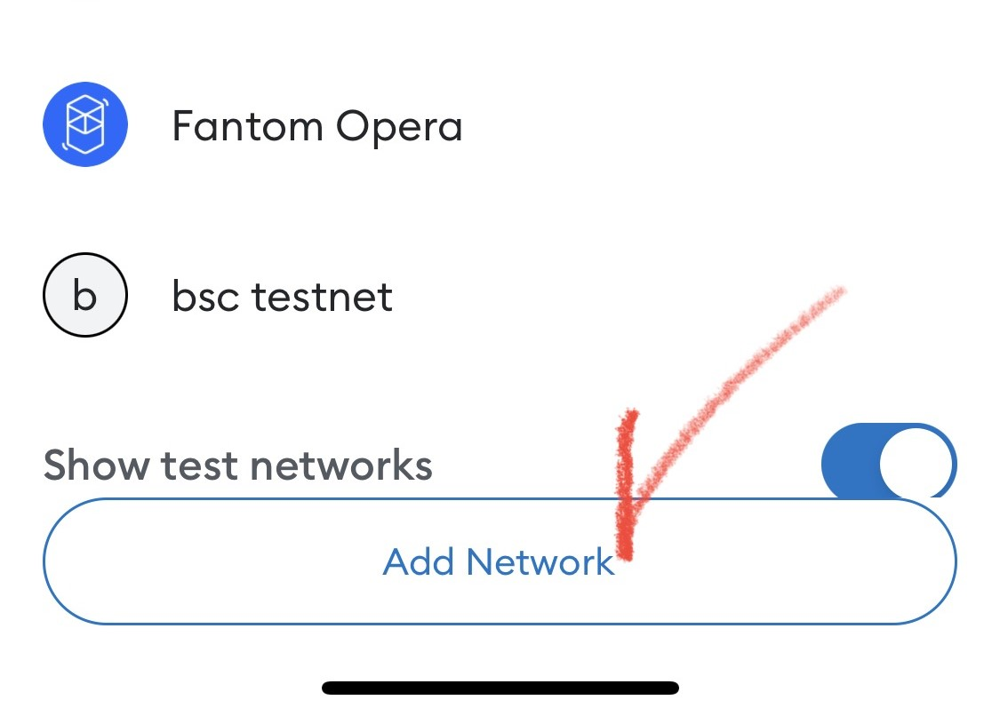

# 2️⃣ Adding a BSC network to MetaMask


**Watching the video will make it easier!** 




1️⃣**First, please install the official MetaMask app from each store.** \
👇For more detailed instructions, please refer to the link below.

{% embed url="https://support.metamask.io/hc/ko/articles/360015489531-MetaMask-%EC%8B%9C%EC%9E%91%ED%95%98%EA%B8%B0" %}
Check out more details on the official MetaMask website!


❗[When installing the wallet, be sure to write down the recovery phrase on paper and store it in a place where it won't be lost!](precautions.md#eng-1)

***

> 🦊All NFTs and tokens used in EXTOCIUM are based on the Binance Smart Chain (BSC). Therefore, to fully enjoy the game, you need to add the BSC network to MetaMask.

2️⃣**Access the MetaMask app and try touching (clicking) the area circled in red in the image below.**

<figure><figcaption>
Touch the "Wallet"
</figcaption></figure>


The red circled area is where you set the 'Network' in MetaMask. The default setting of MetaMask is the 'Ethereum Network'. When using EXTOCIUM, it must always be set to the BSC network.


3️⃣**Touch (click) the 'Add Network' button marked with a check in the image below.**

<figure><figcaption>
Add Network - Binance Chain
</figcaption></figure>

**4️⃣From the list, select 'Binance Smart Chain' or 'BNB Smart Chain'.**

<figure><figcaption></figcaption></figure>

**👉**Simple, right? The addition of the BSC network is now complete!**🎉**

<figure><figcaption></figcaption></figure>


The area underlined at the top of the wallet should be set to BNB Smart Chain or Binance Smart Chain, as shown in the image above!


***

❓**If the network does not exist, please follow the guide below.**

<figure><figcaption>
Custom Network
</figcaption></figure>

**After touching the 'Add Network' button**, select the '**Custom Networks**' menu in the top right corner, enter the following information into each field, and touch (click) the '**Add**' button to complete the registration!

&#x20;                                              👉Network Name : **Binance Smart Chain**\
&#x20;                                              **👉**RPC URL : [**https://bsc-dataseed.binance.org**](https://bsc-dataseed.binance.org/)\
&#x20;                                              **👉**Chain ID : **56**\
&#x20;                                              **👉**Symbol : **BNB**\
&#x20;                                              **👉**Block Explorer URL : [**https://bscscan.com**](https://bscscan.com/)



1️⃣**우선, 각 스토어의 공식 메타마스크 앱을 설치해주세요.** \
👇자세한 설명은 아래 공식 링크를 참조해주세요.

{% embed url="https://support.metamask.io/hc/ko/articles/360015489531-MetaMask-%EC%8B%9C%EC%9E%91%ED%95%98%EA%B8%B0" %}
메타마스크 공식 홈페이지에서 더 자세한 내용을 확인하세요!


❗[지갑을 설치 할 때 입력한 복구 구문을 반드시 종이에 적어 잃어버리지 않을 장소에 보관하세요!](precautions.md#undefined-3)

***

> 🦊EXTOCIUM 게임에서 사용되는 NFT 및 토큰은 모두 바이낸스 스마트 체인 (BSC)를 기반으로 합니다. 따라서 게임을 완전하게 즐기려면 메타마스크에 BSC 네트워크를 추가해야 합니다.&#x20;

2️⃣**메타마스크 앱에 접속하여** **아래 이미지의 빨간 동그라미 부분을 터치(클릭) 해 보세요.**&#x20;

<figure><figcaption>
Touch the "Wallet"
</figcaption></figure>


빨간 동그라미 영역이 메타마스크에서 '네트워크'를 설정하는 영역입니다. 메타마스크의 초기 설정값은 '이더리움 네트워크' 입니다. EXTOCIUM을 사용할 때는 항상 BSC 네트워크로 세팅 되어 있어야 합니다.


3️⃣**아래 이미지에 체크 표시된 ‘네트워크 추가’ 버튼을 터치(클릭)하세요.**

<figure><figcaption>
Add Network - Binance Chain
</figcaption></figure>

**4️⃣목록에서 'Binance Smart Chain' 혹은 'BNB Smart Chain'을 선택하세요.**&#x20;

<figure><figcaption></figcaption></figure>

**👉**간단하죠? BSC 네트워크 추가가 완료되었습니다!**🎉**

<figure><figcaption></figcaption></figure>


지갑 상단에 밑줄 친 영역이 위 이미지와 같이 BNB Smart Chain 혹은 Binance Smart Chain으로 설정되어 있으면 됩니다!


***

❓**만약 네트워크가 존재하지 않을 경우, 아래 가이드를 따라해 주세요.**

<figure><figcaption>
Custom Network
</figcaption></figure>

**‘네트워크 추가’ 버튼 터치 후,** 우측 상단에 '**커스텀 네트워크'** 메뉴를 선택하고, 아래 정보를 각 칸에 입력해주세요. 그리고 '**Add**'버튼을 터치(클릭)하면 등록이 완료됩니다!

&#x20;                                              👉Network Name : **Binance Smart Chain**\
&#x20;                                              **👉**RPC URL : [**https://bsc-dataseed.binance.org**](https://bsc-dataseed.binance.org/)\
&#x20;                                              **👉**Chain ID : **56**\
&#x20;                                              **👉**Symbol : **BNB**\
&#x20;                                              **👉**Block Explorer URL : [**https://bscscan.com**](https://bscscan.com/)



1️⃣**まず、各ストアの公式MetaMaskアプリをインストールしてください。**\
👇詳細な説明は以下の公式リンクを参照してください。

{% embed url="https://support.metamask.io/hc/ko/articles/360015489531-MetaMask-%EC%8B%9C%EC%9E%91%ED%95%98%EA%B8%B0" %}
MetaMaskの公式ホームページで詳細をご確認ください！


❗[ウォレットをインストールする際に入力したリカバリーフレーズは、必ず紙に書き留めて、失くさない場所に保管してください！](precautions.md#ri-ben-yu-1)

***

> 🦊EXTOCIUMで使用されるすべてのNFTおよびトークンは、バイナンススマートチェーン（BSC）を基盤としています。そのため、ゲームを完全に楽しむには、MetaMaskにBSCネットワークを追加する必要があります。

2️⃣**MetaMaskアプリにアクセスして、以下の画像の赤い円で囲まれたエリアをタッチ（クリック）してみてください。**

<figure><figcaption>
Touch the "Wallet"
</figcaption></figure>


赤い円で囲まれたエリアはMetaMaskで「ネットワーク」を設定する場所です。MetaMaskの初期設定値は「イーサリアムネットワーク」です。EXTOCIUMを使用するときは、常にBSCネットワークに設定されている必要があります。


3️⃣**下記の画像にチェックマークされた「ネットワーク追加」ボタンをタッチ（クリック）してください。**

<figure><figcaption>
Add Network - Binance Chain
</figcaption></figure>

**4️⃣リストから「Binance Smart Chain」または「BNB Smart Chain」を選択してください。**

<figure><figcaption></figcaption></figure>

**👉**簡単でしょう？ BSCネットワークの追加が完了しました！**🎉**

<figure><figcaption></figcaption></figure>


ウォレットの上部に下線が引かれたエリアが、上記の画像のようにBNB Smart ChainまたはBinance Smart Chainに設定されていればOKです！


***

❓**ネットワークが存在しない場合は、以下のガイドに従ってください。**

<figure><figcaption>
Custom Network
</figcaption></figure>

**「ネットワーク追加」ボタンをタッチした後**、右上&#x306E;**「カスタムネットワーク」**&#x30E1;ニューを選択し、以下の情報を各フィールドに入力してください。そして、**「追加」**&#x30DC;タンをタッチ（クリック）すると登録が完了します！

&#x20;                                              👉Network Name : **Binance Smart Chain**\
&#x20;                                              **👉**RPC URL : [**https://bsc-dataseed.binance.org**](https://bsc-dataseed.binance.org/)\
&#x20;                                              **👉**Chain ID : **56**\
&#x20;                                              **👉**Symbol : **BNB**\
&#x20;                                              **👉**Block Explorer URL : [**https://bscscan.com**](https://bscscan.com/)


