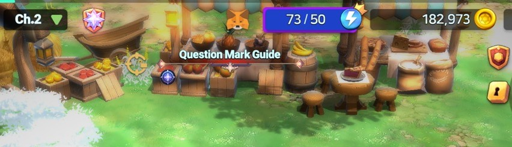

# 3️⃣ Connecting games and MetaMask


**Watching the video will make it easier!**&#x20;




#### 🔗 **Connecting the Game with MetaMask**

Want to connect MetaMask to the game? No worries! \
Just follow the steps below to set it up easily. 🦊✨

***

#### ✅ **1. Start Connecting MetaMask**

1️⃣ Tap the **fox icon (🦊) at the top center of the main HUD**.

<figure><figcaption></figcaption></figure>

2️⃣ A pop-up will appear, giving you two connection options.

<figure><figcaption></figcaption></figure>


[1️⃣](connecting-games-and-metamask.md#id-1-qr)[QR Login](connecting-games-and-metamask.md#method-1-qr-login-using-metamask-on-mobile)

[2️⃣App Load Login](connecting-games-and-metamask.md#method-2-app-load-login-using-metamask-on-the-same-device)


***

#### 🔹 **Method 1: QR Login (Using MetaMask on Mobile)**

💡 **If you're playing the game on a PC emulator, you can log in using the QR code with your MetaMask mobile app.**

> 
>
> 📌 **Already connected a wallet before?**
>
> * Simply check the **wallet address and network (Binance Smart Chain)** at the top and proceed.
>
> 
>
>
>
> 📌 **Connecting for the first time?**\
> 1️⃣ Make sure **Binance Smart Chain is set up** in MetaMask.\
> 2️⃣ Select the **wallet address** you want to connect and tap the **camera icon** in the top right of the MetaMask app.
>
> .png>)
>
>
>
> 3️⃣ When the camera opens, **scan the QR code displayed in the game**.
>
> 
>
>
>
> 4️⃣ Shortly after, a **connection approval request pop-up** will appear in MetaMask.\
> 5️⃣ Tap **"Connect"** to complete the connection.

***

#### 🔹 **Method 2: App Load Login (Using MetaMask on the Same Device)**

📌 **If you're playing the game on the same device where MetaMask is installed, use the "APP LOAD" button.**

If connecting within the device, you can load the wallet through the APP LOAD button.

> .png>)
>
> 1️⃣ Tap **"APP LOAD"**, and the MetaMask app will launch automatically.
>
> 2️⃣ **Important Notes:**
>
> * Make sure **MetaMask is already installed** on your device.
> * **If you have multiple accounts**, open MetaMask first and select the wallet you want to use.
>
> 
>
> &#x20;
>
> 3️⃣ A **connection approval request pop-up** will appear in MetaMask. \
> Tap **"Connect"** to complete the process.
>
> .jpg>)

***

#### ✅ **2. Confirm Connection Status**

🎉 **Once connected, the fox icon (🦊) at the top center of the main HUD will become active!**


📌 **Wallet Connection Maintenance**

* **For security reasons, MetaMask does not keep the connection active indefinitely.**
* **If you need to make a transaction, reconnect your wallet in advance.**


<figure><figcaption></figcaption></figure>

📌 **Check Wallet Status & Transaction History**

* Tap the **fox icon** to view your **current wallet connection status and transaction history**.

***

🛑[Having trouble connecting your wallet? Please refer to this tab!](commonly-issues.md)



#### 🔗 **게임과 메타마스크 연결하기**

게임에서 메타마스크를 연결하는 방법이 궁금하신가요? 걱정 마세요! \
아래 단계를 따라 쉽게 연결할 수 있습니다. 🦊✨

***

#### ✅ **1. 메타마스크 연결 시작하기**

1️⃣ **메인 HUD 중앙 상단**에 있는 **여우 버튼(🦊)** 을 터치하세요.

<figure><figcaption></figcaption></figure>

2️⃣ 팝업 창이 뜨면, 두 가지 방법 중 하나를 선택할 수 있습니다.

<figure><figcaption></figcaption></figure>


[1️⃣QR 로그인 하기](connecting-games-and-metamask.md#id-1-qr)

[2️⃣앱로드 로그인 하기](connecting-games-and-metamask.md#id-2)


***

#### 🔹 **방법 1: QR 로그인 (모바일 메타마스크 사용)**

💡 **PC 에뮬레이터에서 게임을 실행 중이라면, 모바일 메타마스크 앱을 이용하여 QR 로그인을 진행할 수 있습니다.**

> 
>
> 📌 **기존에 연결된 지갑이 있다면?**
>
> * 상단에서 **지갑 주소와 네트워크(Binance Smart Chain)** 를 확인하고 접속하면 됩니다!
>
>
>
> 
>
>
>
> 📌 **처음 지갑을 연결하는 경우?**\
> 1️⃣ **Binance Smart Chain 네트워크가 설정되었는지 확인**하세요.\
> 2️⃣ 연결할 **지갑 주소를 선택**한 후, **메타마스크 앱 화면 우측 상단의 카메라 버튼**을 터치하세요.
>
> .png>)
>
> 3️⃣ 카메라가 실행되면 **게임 화면의 QR 코드를 스캔**하세요.
>
> 
>
> &#x20;
>
> 4️⃣ 잠시 후, 메타마스크 앱에 **"연결 승인 요청" 팝업**이 나타납니다.\
> 5️⃣ **"연결" 버튼을 터치하여 연결을 완료하세요.**

***

#### 🔹 **방법 2: 앱 로드 로그인 (기기 내 메타마스크 사용)**

📌 **게임을 실행한 기기에서 직접 연결하려면, "APP LOAD" 버튼을 사용하면 됩니다.**

> .png>)
>
> 1️⃣ **"APP LOAD" 버튼을 터치**하면, 메타마스크 앱이 자동으로 실행됩니다.
>
> 2️⃣ **주의사항:**
>
> * 기기 내에 **메타마스크 앱이 설치되어 있어야 합니다.**
> * **여러 개의 지갑 계정을 사용 중이라면**, 사전에 메타마스크 앱을 열어 **사용할 지갑을 선택**해 주세요.
>
> 
>
> &#x20;
>
> 3️⃣ 메타마스크 앱에 **"연결 승인 요청" 팝업**이 표시되면, **"연결" 버튼을 터치하여 완료**하세요.
>
> .jpg>)

***

#### ✅ **2. 연결 완료 및 확인하기**

🎉 **연결이 완료되면, 메인 HUD 중앙 상단의 여우 버튼(🦊)이 활성화됩니다!**


❓ **지갑 연결 유지 관련 안내**

* **보안 문제로 인해, 메타마스크 지갑은 장시간 자동 연결이 유지되지 않습니다.**
* **지갑 거래가 필요할 경우, 사전에 지갑을 다시 연결하는 것을 추천합니다.**


<figure><figcaption></figcaption></figure>

📌 **지갑 연결 상태 및 거래 내역 확인하기**

* 활성화된 **여우 버튼을 터치하면**, 현재 연결된 지갑 상태 및 거래 내역을 확인할 수 있습니다.

***

🛑[지갑 연결에 문제가 생겼나요? 이 탭을 참조해주세요!](commonly-issues.md)



#### 🔗 **ゲームとMetaMaskを接続する方法**

ゲームでMetaMaskを接続したいですか？心配いりません！\
以下の手順に従えば、簡単にセットアップできます。 🦊✨

***

#### ✅ **1. MetaMaskの接続を開始する**

1️⃣ **メインHUDの中央上部にある🦊アイコン**をタップします。

<figure><figcaption></figcaption></figure>

2️⃣ ポップアップが表示され、2つの接続方法が選択できます。

<figure><figcaption></figcaption></figure>


[1️⃣QRログイン](connecting-games-and-metamask.md#id-1-qrroguinmobairunometamaskwo)

[2️⃣アプリロードログイン](connecting-games-and-metamask.md#id-2-appurdoroguinjidebaisudemetamaskwo)


***

#### 🔹 **方法1: QRログイン（モバイルのMetaMaskを使用）**

💡 **PCエミュレーターでゲームをプレイしている場合は、モバイル版MetaMaskを使用してQRコードでログインできます。**

> 
>
> 📌 **すでにウォレットを接続済みの場合?**
>
> * 上部に表示される **ウォレットアドレスとネットワーク（Binance Smart Chain）** を確認し、そのまま接続してください。
>
>
>
> 
>
> 📌 **初めてウォレットを接続する場合?**\
> 1️⃣ **MetaMaskでBinance Smart Chainが設定されていることを確認** します。\
> 2️⃣ **接続したいウォレットアドレスを選択** し、MetaMaskアプリの右上にある **カメラアイコン** をタップします。
>
>
>
> .png>)
>
> 3️⃣ カメラが起動したら、**ゲーム画面のQRコードをスキャン** します。
>
>
>
> 
>
> &#x20;
>
> 4️⃣ しばらくすると、MetaMaskに **「接続承認リクエスト」ポップアップ** が表示されます。\
> 5️⃣ **「接続」ボタンをタップして完了** します。

***

#### 🔹 **方法2: アップロードログイン（同じデバイスでMetaMaskを使用）**

📌 **ゲームをプレイしているデバイス内で直接接続する場合は、「APP LOAD」ボタンを使用します。**

> .png>)
>
>
>
> 1️⃣ **「APP LOAD」ボタンをタップ** すると、MetaMaskアプリが自動的に起動します。\
> 2️⃣ **注意事項:**
>
> * **MetaMaskアプリが事前にインストールされている必要があります。**
> * **複数のウォレットアカウントを使用している場合** は、事前にMetaMaskアプリを開き、使用するウォレットを選択してください。
>
> 
>
> &#x20;
>
> 3️⃣ **「接続承認リクエスト」ポップアップ** が表示されたら、**「接続」ボタンをタップして完了** します。
>
> 

***

#### ✅ **2. 接続完了 & 確認方法**

🎉 **接続が完了すると、メインHUD中央上部の🦊アイコンがアクティブになります！**


📌 **ウォレット接続の維持について**

* **セキュリティ上の理由により、MetaMaskの接続は長時間自動で維持されません。**
* **取引を行う前に、再接続することをおすすめします。**


<figure><figcaption></figcaption></figure>

📌 **ウォレットの状態 & 取引履歴の確認**

* **🦊アイコンをタップすると、現在のウォレット接続状況と取引履歴を確認** できます。

***

🛑[ウォレットの接続に問題がありますか？このタブを参照してください！](commonly-issues.md)


