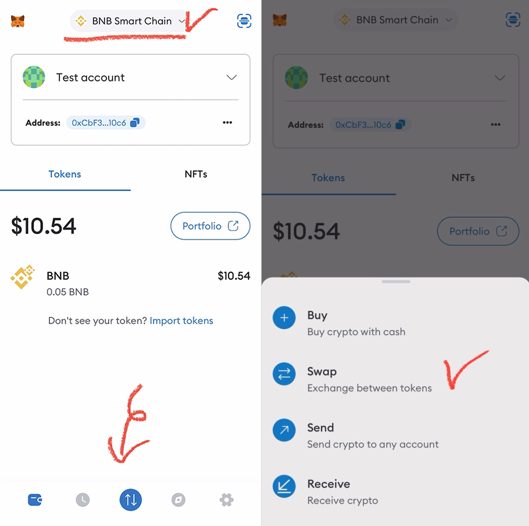
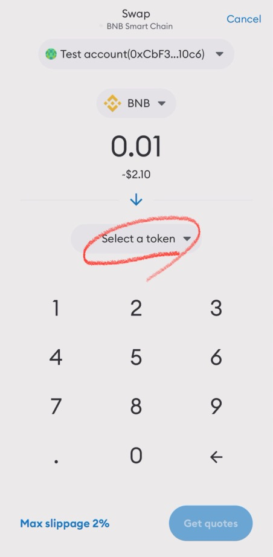
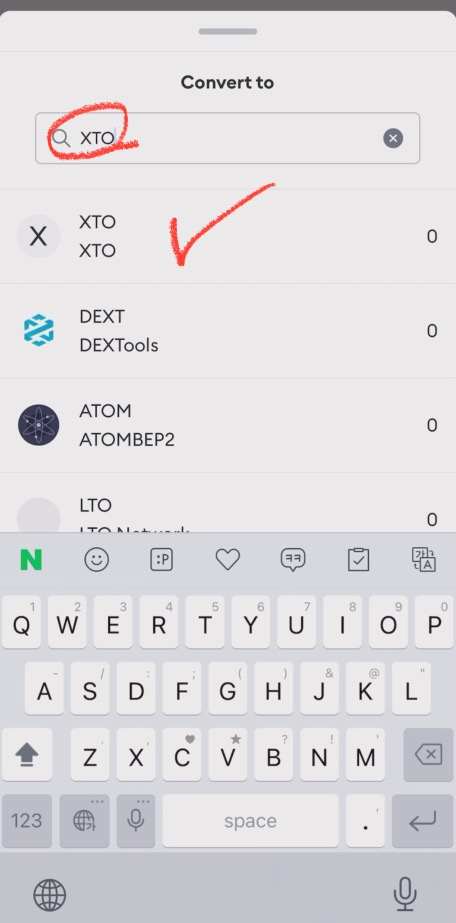
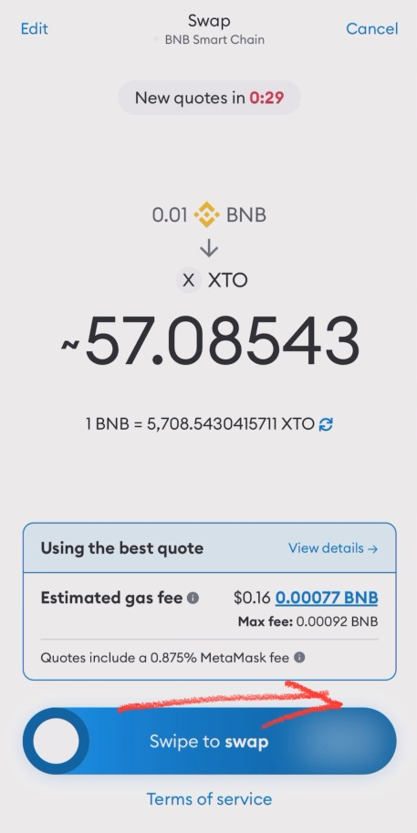
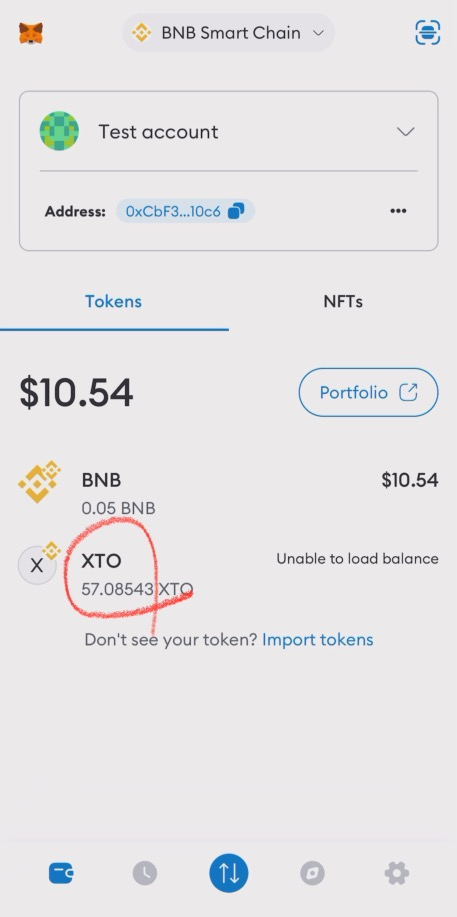

# 🦊 Swap on MetaMask

🛑 This information may be updated later than the game server data.\
🛑 이 내용은 게임 서버 데이터보다 늦게 업데이트 될 수 있습니다.\
🛑 この情報はゲームサーバーデータよりも遅れて更新される場合があります。



### 🔄 **Swap XTO on MetaMask**

With the MetaMask app, you can **easily swap XTO ↔ BNB**!\
Follow the steps below to complete your swap quickly and securely. 🦊✨

***

#### ✅ **1. Select the BSC Network on MetaMask**

📌 **Open your MetaMask wallet and select the Binance Smart Chain (BSC) network.**\
📌 If **XTO is already registered**, swapping will be more convenient! (📍[How to Register XTO Token](import-xto-tokens.md#eng))

Then, **tap the "Swap" button** on the screen.

<figure><figcaption>
Main Screen
</figcaption></figure>

***

#### ✅ **2. Set Tokens on the Swap Screen**

📌 The **top section (BNB)** is for the token you want to sell.\
📌 The **bottom section ("Select a token")** is for the token you want to receive.\
📌 🔄 **Tap the blue arrow button to switch the positions of the two tokens.**\
📌 **Set the token you want to receive at the bottom** and then **tap "Select a token."**

<figure><figcaption>
Swap Screen
</figcaption></figure>

***

#### ✅ **3. Select XTO Token**

📌 When the **"Convert to" pop-up** appears, enter **XTO** in the search bar.\
📌 If **XTO does not appear**, you may need to register it as a [**custom token**](import-xto-tokens.md#id-2.-enter-custom-token-information).

Once **XTO appears on the screen, tap to select it.**

<figure><figcaption>
Search XTO
</figcaption></figure>

***

#### ✅ **4. Enter the BNB Amount & Tap "Get Quotes"**

📌 Ensure that **XTO is now listed on the Swap screen.**\
📌 **Since XTO is categorized as a custom token, double-check before proceeding.**\
📌 Enter the amount of **BNB you wish to swap**, then scroll down and **tap the "Get Quotes" button.**

<figure><figcaption>
Swap screen
</figcaption></figure>

***

#### ✅ **5. Confirm & Complete the Swap**

📌 🦊 **After the fox loading screen, the final swap confirmation screen will appear.**\
📌 Review the fees and XTO price, then **swipe "Swipe to swap" to complete the transaction.**\
📌 **If your BNB balance is insufficient, the swipe function will not work.**

<figure><figcaption>
Swipe to Swap
</figcaption></figure>

***

#### ✅ **6. Check Transaction Completion**

📌 Once the swap is completed, you will return to the **wallet main screen**, and a **"Complete" pop-up** will appear.\
📌 **After a few seconds, check your wallet to confirm that BNB has been deducted and XTO has been added.**

Now your XTO swap is complete! 🚀

<figure><figcaption>
Transaction Complete
</figcaption></figure>

You can check your transaction details in MetaMask or [BscScan](https://bscscan.com/).

<figure><figcaption>
Transaction Result
</figcaption></figure>



### 🔄 **메타마스크에서 XTO 스왑(Swap)하기**

메타마스크 앱을 이용하면 **XTO ↔ BNB 스왑을 간편하게** 진행할 수 있습니다!\
아래 안내를 따라 XTO를 쉽게 교환해 보세요. 🦊✨

***

#### ✅ **1. 메타마스크에서 BSC 네트워크 선택**

📌 **MetaMask 지갑에 접속한 후, 반드시 BSC 네트워크를 선택하세요.**\
📌 XTO 토큰이 이미 등록되어 있다면 더욱 편리하게 사용할 수 있습니다! (📍[XTO 토큰 등록 방법](import-xto-tokens.md#undefined-1))

그다음, **Swap(스왑) 버튼을 터치하세요.**

<figure><figcaption>
Main Screen
</figcaption></figure>

***

#### ✅ **2. Swap 화면에서 토큰 설정하기**

📌 Swap 화면에서 **위쪽(BNB)** 은 판매할 토큰, **아래쪽("Select a token")** 은 구매할 토큰을 설정하는 영역입니다.\
📌 🔄 **파란 화살표 버튼을 누르면 두 토큰의 위치를 변경할 수 있습니다.**\
📌 **받고 싶은 토큰을 아래에 설정**한 후, **"Select a token"을 터치**하세요.

<figure><figcaption>
Swap Screen
</figcaption></figure>

***

#### ✅ **3. XTO 토큰 선택하기**

📌 **"Convert to" 팝업이 뜨면, XTO를 검색하여 선택하세요.**\
📌 만약 **XTO가 검색되지 않는다면,** [**커스텀 토큰**](import-xto-tokens.md#id-2.-custom-token)**을 등록해야 합니다.**

화면에 **XTO 토큰이 표시되면 터치하여 선택**합니다.

<figure><figcaption>
Search XTO
</figcaption></figure>

***

#### ✅ **4. 스왑할 BNB 금액 입력 & Get Quotes 버튼 터치**

📌 Swap 화면에 **XTO가 등록된 것을 확인하세요.**\
📌 XTO는 **커스텀 토큰으로 분류**되므로, **반드시 확인 후 진행**해야 합니다!\
📌 원하는 BNB 금액을 입력한 후, 화면 하단의 **"Get Quotes" 버튼을 터치**하세요.

<figure><figcaption>
Swap screen
</figcaption></figure>

***

#### ✅ **5. 최종 스왑 진행하기**

📌 🦊 **여우 로딩 화면이 끝나면 최종 스왑 확인 화면이 나타납니다.**\
📌 수수료 및 XTO 가격을 확인한 후, **"Swipe to swap"을 밀어서 거래를 완료하세요.**\
📌 **BNB 잔액이 부족하면 스와이프 기능이 작동하지 않습니다!**

<figure><figcaption>
Swipe to Swap
</figcaption></figure>

***

#### ✅ **6. 거래 완료 및 확인하기**

📌 스왑이 완료되면, **지갑 메인 화면으로 돌아가 "Complete" 팝업이 표시됩니다.**\
📌 몇 초 후, 지갑에서 **BNB가 차감되고 XTO가 충전된 것을 확인할 수 있습니다.**

이제 MetaMask에서 XTO 스왑이 완료되었습니다! 🚀

<figure><figcaption>
Transaction Complete
</figcaption></figure>

거래 내역은 MetaMask 또는 [BscScan](https://bscscan.com/)을 통해 확인할 수 있습니다.

<figure><figcaption>
Transaction Result
</figcaption></figure>



### 🔄 **MetaMaskでXTOをスワップする方法**

MetaMaskアプリを使用すると、**XTO ↔ BNB のスワップを簡単に** 行えます！\
以下の手順に従って、スムーズに交換しましょう。 🦊✨

***

#### ✅ **1. MetaMaskでBSCネットワークを選択**

📌 **MetaMaskウォレットを開き、Binance Smart Chain（BSC）ネットワークを選択します。**\
📌 **XTOトークンがすでに登録されていると、より便利に使用できます！** (📍[XTOトークンの登録方法](import-xto-tokens.md#ri-ben-yu))

その後、**画面に表示される「Swap」ボタンをタップ** してください。

<figure><figcaption>
Main Screen
</figcaption></figure>

***

#### ✅ **2. Swap画面でトークンを設定**

📌 **上部の「BNB」部分** には売却するトークンを設定します。\
📌 **下部の「Select a token」部分** には購入するトークンを設定します。\
📌 🔄 **青い矢印ボタンをタップすると、2つのトークンの位置を入れ替えることができます。**\
📌 **受け取りたいトークンを下に設定し、「Select a token」をタップしてください。**

<figure><figcaption>
Swap Screen
</figcaption></figure>

***

#### ✅ **3. XTOトークンを選択**

📌 **「Convert to」ポップアップ** が表示されたら、**XTO** を検索してください。\
📌 [**カスタムトークン**](import-xto-tokens.md#id-2-kasutamutkunnowo)**が登録されている場合、XTOがメニューに表示されます。**

XTOが表示されたら **タップして選択** してください。

<figure><figcaption>
Search XTO
</figcaption></figure>

***

#### ✅ **4. BNBの金額を入力し、「Get Quotes」をタップ**

📌 **Swap画面にXTOが登録されたことを確認してください。**\
📌 **XTOはカスタムトークンとして分類されるため、必ず確認してから進めてください。**\
📌 **支払うBNBの金額を入力** し、画面下部の **「Get Quotes」ボタンをタップ** してください。

<figure><figcaption>
Swap screen
</figcaption></figure>

***

#### ✅ **5. スワップを確定**

📌 🦊 **キツネのローディング画面が終了すると、最終スワップ確認画面が表示されます。**\
📌 **手数料とXTO価格を確認し、「Swipe to swap」をスワイプして取引を完了してください。**\
📌 **BNB残高が不足している場合、スワイプ機能は動作しません。**

<figure><figcaption>
Swipe to Swap
</figcaption></figure>

***

#### ✅ **6. 取引完了 & 確認方法**

📌 **スワップが完了すると、ウォレットのメイン画面に戻り、「Complete」ポップアップが表示されます。**\
📌 **数秒後、ウォレットでBNBが差し引かれ、XTOが追加されたことを確認してください。**

**これでXTOのスワップが完了しました！** 🚀&#x20;

<figure><figcaption>
Transaction Complete
</figcaption></figure>

取引履歴は **MetaMaskまたは**[**BscScan**](https://bscscan.com/) で確認できます。

<figure><figcaption>
Transaction Result
</figcaption></figure>





