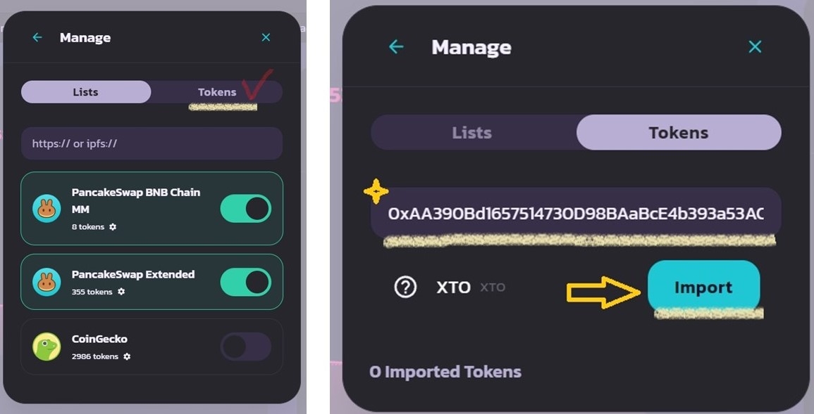

# 🥞 Swap on PancakeSwap



### 🥞 **Swap XTO on PancakeSwap**

You can **trade XTO freely on PancakeSwap** as well!\
Follow the steps below to **swap XTO securely and efficiently**. 🚀✨

<figure><figcaption>
PancakeSwap
</figcaption></figure>

***

#### ✅ **1. Access PancakeSwap & Connect Your Wallet**

📌 Go to the **official PancakeSwap homepage**.\
📌 Click the **"Connect Wallet" button** in the top-right corner and connect with **MetaMask**.

<figure><figcaption>
PancakeSwap Homepage
</figcaption></figure>

***

#### ✅ **2. Navigate to the Swap Page**

1️⃣ Click **"Trade" > "Swap"** in the **top-left menu**.\
2️⃣ The swap interface will appear, with the default setting as **BNB → CAKE**.

* **BNB**: The token you are selling
* **CAKE**: The token you will receive

📌 **Click on the token name to change it to a different token.**\
📌 **To swap XTO, you must replace CAKE with XTO!**

<figure><figcaption>
Manage Tokens 1
</figcaption></figure>

***

#### ✅ **3. Add XTO Token**

📌 If XTO does not appear in the token list, add it manually by following these steps:

1️⃣ Click on the **"CAKE" section** to open the token selection screen.\
2️⃣ In the pop-up window, click **"Token Management"**.\
3️⃣ Select **"Tokens"**, then enter the **XTO contract address** below.

📌 **XTO Contract Address:**\
`0xAA390Bd1657514730D98BAaBcE4b393a53ACD579`

<figure><figcaption>
Manage Tokens 2
</figcaption></figure>

***

#### ✅ **4. Copy XTO Contract Address from the Game**

📌 You can also **copy the XTO contract address directly from the game screen** for convenience!\
📌 Paste the copied address into **PancakeSwap’s "Add Token" field** to quickly register XTO.

<figure><figcaption>
Token Address
</figcaption></figure>

***

#### ✅ **5. Swap XTO**

1️⃣ **Select XTO**, then enter the amount of BNB or XTO you wish to swap.\
2️⃣ Review the details and **click "Swap" to proceed with the transaction.**\
3️⃣ A **MetaMask confirmation pop-up** will appear—click **"Confirm"** to approve the swap.

📌 **Important!**\
✅ **Check the slippage settings before swapping.**\
✅ Transaction speed may vary depending on network congestion.

<figure><figcaption></figcaption></figure>

***

#### 🎉 **Transaction Completion & Verification**

✅ After the swap is successful, check your **MetaMask wallet balance**.\
✅ You can also view the transaction details in the **PancakeSwap "Transaction History"**.

Now, you can **trade XTO freely on PancakeSwap**! 🚀✨



### 🥞 **PancakeSwap에서 XTO 스왑(Swap)하기**

XTO는 **PancakeSwap에서도 자유롭게 거래 가능**합니다!\
아래 안내를 따라 **XTO를 안전하게 스왑(Swap)하고 거래**하세요. 🚀✨

<figure><figcaption>
PancakeSwap
</figcaption></figure>

***

#### ✅ **1. PancakeSwap 접속 및 지갑 연결**

📌 **PancakeSwap 공식 홈페이지**로 이동합니다.\
📌 우측 상단의 **"Connect Wallet" 버튼을 눌러 MetaMask와 연결**하세요.

<figure><figcaption>
PancakeSwap Homepage
</figcaption></figure>

***

#### ✅ **2. 스왑(Swap) 페이지로 이동**

1️⃣ **홈페이지 좌측 상단**의 **"Trade" > "Swap" 버튼**을 클릭하세요.\
2️⃣ 스왑 화면이 나타나며, 기본적으로 **BNB → CAKE 스왑 설정**이 되어 있습니다.

* **BNB**: 내가 판매할 코인
* **CAKE**: 내가 받을 코인

📌 **각 토큰 부분을 클릭하면 다른 코인으로 변경 가능**합니다.\
📌 **XTO를 스왑하려면, CAKE 대신 XTO를 선택해야 합니다!**

<figure><figcaption>
Manage Tokens 1
</figcaption></figure>

***

#### ✅ **3. XTO 토큰 추가하기**

📌 기본 목록에 XTO가 보이지 않는다면, 아래 방법으로 추가하세요!

1️⃣ **"CAKE" 부분을 클릭**하여 변경 화면을 엽니다.\
2️⃣ 팝업 창에서 **"토큰 관리(Token Management)"** 버튼을 클릭하세요.\
3️⃣ **"토큰(Token)" 메뉴를 선택**한 후, 아래 XTO 컨트랙트 주소를 입력합니다.

📌 **XTO 컨트랙트 주소:**\
`0xAA390Bd1657514730D98BAaBcE4b393a53ACD579`

<figure><figcaption>
Manage Tokens 2
</figcaption></figure>

***

#### ✅ **4. 게임 화면에서 XTO 컨트랙트 주소 복사하기**

📌 더욱 간편하게 **게임 내 XTO 컨트랙트 주소를 직접 복사**할 수도 있습니다!\
📌 복사한 주소를 **PancakeSwap의 "토큰 추가" 창에 붙여넣으면 XTO를 쉽게 불러올 수 있습니다.**

<figure><figcaption>
Token Address
</figcaption></figure>

***

#### ✅ **5. XTO 스왑 진행하기**

1️⃣ **XTO 토큰을 선택한 후, 스왑할 BNB 또는 XTO의 수량을 입력하세요.**\
2️⃣ 가격을 확인한 후, **"Swap" 버튼을 눌러 거래를 진행합니다.**\
3️⃣ **MetaMask에서 거래 확인 팝업이 뜨면 "확인"을 눌러 승인하세요.**

📌 **주의!**\
✅ **스왑을 진행하기 전에 슬리피지(Slippage) 설정을 확인하세요.**\
✅ 네트워크 상황에 따라 거래 속도가 다를 수 있습니다.

<figure><figcaption></figcaption></figure>

***

#### 🎉 **거래 완료 및 확인**

✅ 거래가 완료되면, MetaMask에서 **잔액을 확인**할 수 있습니다.\
✅ PancakeSwap의 **거래 내역(Transaction History)** 에서 스왑 결과를 확인하세요.

이제 PancakeSwap에서도 XTO를 자유롭게 거래할 수 있습니다! 🚀✨



### 🥞 **PancakeSwapでXTOをスワップする方法**

PancakeSwapでも **XTOを自由に取引** できます！\
以下の手順に従って、安全にXTOをスワップしましょう。 🚀✨

<figure><figcaption>
PancakeSwap
</figcaption></figure>

***

#### ✅ **1. PancakeSwapにアクセスし、ウォレットを接続**

📌 **PancakeSwap公式サイト** にアクセスします。\
📌 **右上の「Connect Wallet」ボタンをクリックし、MetaMaskを接続** してください。

<figure><figcaption>
PancakeSwap Homepage
</figcaption></figure>

***

#### ✅ **2. スワップページへ移動**

1️⃣ **左上の「Trade」 > 「Swap」ボタン** をクリックします。\
2️⃣ **スワップ画面** が表示され、デフォルトでは **BNB → CAKE** の設定になっています。

* **BNB**: 売却するトークン
* **CAKE**: 受け取るトークン

📌 **トークン名をクリックすると、別のトークンに変更可能です。**\
📌 **XTOをスワップする場合は、CAKEの代わりにXTOを選択してください！**

<figure><figcaption>
Manage Tokens 1
</figcaption></figure>

***

#### ✅ **3. XTOトークンを追加**

📌 **XTOがリストに表示されない場合は、手動で追加** してください。

1️⃣ **「CAKE」部分をクリック** してトークン選択画面を開きます。\
2️⃣ **ポップアップウィンドウで「トークン管理 (Token Management)」をクリック** します。\
3️⃣ **「トークン (Tokens)」を選択** し、以下の **XTOコントラクトアドレス** を入力してください。

📌 **XTO コントラクトアドレス:**\
`0xAA390Bd1657514730D98BAaBcE4b393a53ACD579`

<figure><figcaption>
Manage Tokens 2
</figcaption></figure>

***

#### ✅ **4. ゲーム画面からXTOコントラクトアドレスをコピー**

📌 **ゲーム画面からXTOのコントラクトアドレスを直接コピー** することも可能です！\
📌 コピーしたアドレスを **PancakeSwapの「トークン追加」フィールドに貼り付け** て、XTOを登録してください。

<figure><figcaption>
Token Address
</figcaption></figure>

***

#### ✅ **5. XTOのスワップを実行**

1️⃣ **XTOトークンを選択し、スワップするBNBまたはXTOの数量を入力** します。\
2️⃣ **詳細を確認し、「Swap」ボタンをクリック** して取引を進めてください。\
3️⃣ **MetaMaskの確認ポップアップ** が表示されたら、**「確認 (Confirm)」をクリック** してスワップを承認します。

📌 **重要！**\
✅ **スリッページ設定 (Slippage) を事前に確認してください。**\
✅ **ネットワークの混雑状況により、取引速度が変わる可能性があります。**

<figure><figcaption></figcaption></figure>

***

#### 🎉 **取引完了 & 確認方法**

✅ **スワップが完了すると、MetaMaskウォレットで残高を確認** できます。\
✅ **PancakeSwapの「取引履歴 (Transaction History)」で取引の詳細を確認** してください。

これで **PancakeSwapでXTOの取引が可能** になりました！ 🚀✨



