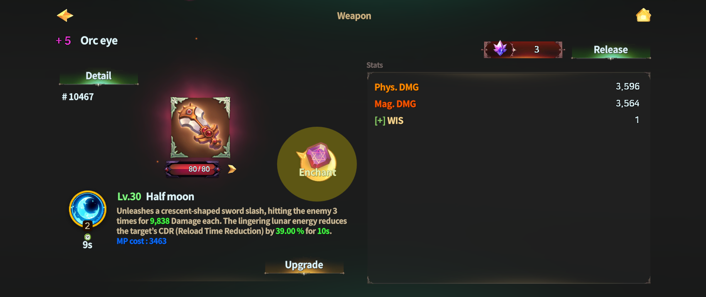

# 1️⃣ Weapon Enchantment



### ◾ Weapon Enchantment

Weapon Enchantment is a system that grants special power to weapons, allowing them to deal higher damage in combat.\
This guide explains how to access Weapon Enchantment, understand the Enchantment screen, and check stage-based effects and bonus effects.

***

#### 1️⃣ Accessing Enchantment

You can access Enchantment from the equipment’s information screen.

* On the equipment information screen,\
  tap the **\[Enchantment]** button to move to the Enchantment screen.

<figure><figcaption></figcaption></figure>

***

#### 2️⃣ Enchantment Screen Overview

On the Enchantment screen, you can check the following information:

* Required materials and gold
* Enchantment success rate
* Expected stat increase upon successful Enchantment

<figure><figcaption></figcaption></figure>

At the top of the screen, there are slots that support Enchantment.

* **Top-left purple slot**\
  You can equip an item that increases the Enchantment success rate.\
  Regardless of success or failure,\
  **1 item is consumed per Enchantment attempt** once equipped.

<figure><figcaption></figcaption></figure>

* **Top-right purple slot**\
  You can equip an item that prevents weapon destruction.\
  Regardless of success or failure,\
  **1 item is consumed per Enchantment attempt** once equipped.

<figure><figcaption></figcaption></figure>


#### Caution

If Enchantment fails, the weapon may be destroyed.\
For more details, please refer to the **\[**[**Enchantment Failed**](enchantment-failed.md)**]** guide.


***

#### 3️⃣ Enchantment Stage Effects and Materials

As the Weapon Enchantment stage increases, the weapon’s base stats are enhanced.

* **Phys. DMG (Physical Damage)**
* **Mag. DMG (Magic Damage)**

Stat increase calculation is as follows:

* **Formula**\
  Current Value + (Base Value × Enchantment Stage Increase Rate (%))
* Phys. DMG / Mag. DMG values are applied up to **two decimal places**,\
  and any additional decimals are rounded down.
* Depending on the weapon’s grade,\
  a **+13 Enchantment** from the previous grade\
  is adjusted to be similar in value to a **+4 Enchantment** of the next grade.

<table><thead><tr><th width="75.79156494140625">Lv</th><th width="117.54156494140625">Success Rate (%)</th><th width="272.29150390625">Effect</th><th width="169">Required Materials</th><th>Required Gold</th></tr></thead><tbody><tr><td>1</td><td>100</td><td>🔺Phys. DMG/Mag. DMG <mark style="color:blue;"><strong>*2%</strong></mark></td><td>Flint x3</td><td>10</td></tr><tr><td>2</td><td>95</td><td>🔺Phys. DMG/Mag. DMG  <mark style="color:blue;"><strong>*3%</strong></mark></td><td>Flint  x10</td><td>30</td></tr><tr><td>3</td><td>92</td><td>🔺Phys. DMG/Mag. DMG  <mark style="color:blue;"><strong>*5%</strong></mark></td><td>Extocium Fragment x5</td><td>150</td></tr><tr><td>4</td><td>85</td><td>🔺Phys. DMG/Mag. DMG  <mark style="color:blue;"><strong>*8%</strong></mark></td><td>Extocium Fragment x10</td><td>500</td></tr><tr><td>5</td><td>75</td><td>🔺Phys. DMG/Mag. DMG  <mark style="color:blue;"><strong>*10%</strong></mark></td><td>Extocium Fragment x20</td><td>1,500</td></tr><tr><td>6</td><td>60</td><td>🔺Phys. DMG/Mag. DMG  <mark style="color:blue;"><strong>*10%</strong></mark></td><td>Extocium  x1</td><td>2,500</td></tr><tr><td>7</td><td>50</td><td>🔺Phys. DMG/Mag. DMG  <mark style="color:blue;"><strong>*10%</strong></mark></td><td>Extocium x5</td><td>5,000</td></tr><tr><td>8</td><td>40</td><td>🔺Phys. DMG/Mag. DMG  <mark style="color:blue;"><strong>*12%</strong></mark></td><td>Extocium x10</td><td>10,000</td></tr><tr><td>9</td><td>30</td><td>🔺Phys. DMG/Mag. DMG  <mark style="color:blue;"><strong>*12%</strong></mark></td><td>Extocium x15</td><td>20,000</td></tr><tr><td>10</td><td>20</td><td>🔺Phys. DMG/Mag. DMG  <mark style="color:blue;"><strong>*12%</strong></mark></td><td>Extocium x20</td><td>30,000</td></tr><tr><td>11</td><td>10</td><td>🔺Phys. DMG/Mag. DMG  <mark style="color:blue;"><strong>*15%</strong></mark></td><td>Extocium x25</td><td>40,000</td></tr><tr><td>12</td><td>9</td><td>🔺Phys. DMG/Mag. DMG  <mark style="color:blue;"><strong>*15%</strong></mark></td><td>Extocium x30</td><td>55,000</td></tr><tr><td>13</td><td>8</td><td>🔺Phys. DMG/Mag. DMG  <mark style="color:blue;"><strong>*15%</strong></mark></td><td>Extocium x35</td><td>80,000</td></tr></tbody></table>

***

#### 4️⃣ Bonus Effects by Enchantment Stage

Every weapon gains additional [**Primary Stats**](../heroes/stats/special-stats/) each time it reaches an Enchantment stage that is a multiple of **+5**.

* **Example**\
  If a weapon reaches **+10 Enchantment**,\
  it receives **two chances** to obtain Primary Stats.
* The granted stat is randomly selected from **six types of Primary Stats**.
* The minimum and maximum values of obtainable stats\
  are determined based on the table shown below.

<table><thead><tr><th width="116">Grade</th><th width="248">Equipment</th><th>Effect</th></tr></thead><tbody><tr><td>1</td><td>Wooden sword, Bronze sword, Steel sword, Flamberg</td><td>🔺Primary Stat 1 ~ 1</td></tr><tr><td>2</td><td>Paladin's Sword, Orc eye, Damascus</td><td>🔺Primary Stat 1 ~ 2</td></tr><tr><td>3</td><td>Savage Sword</td><td>🔺Primary Stat 1 ~ 3</td></tr><tr><td>4</td><td>Awakening Darkness</td><td>🔺Primary Stat 2 ~ 4</td></tr><tr><td>5</td><td>Sword of light</td><td>🔺Primary Stat 2 ~ 5</td></tr></tbody></table>



### ◾ Weapon Enchantment (무기 인챈트)

무기 인챈트는 무기에 특별한 힘을 부여하여 전투에서 더 높은 피해를 줄 수 있게 만드는 시스템입니다.\
이 가이드에서는 무기 인챈트의 진행 방법과 화면 구성, 단계별 효과와 부가 효과에 대해 안내합니다.

***

#### 1️⃣ 인챈트 진입하기

인챈트는 각 장비의 **정보 화면**에서 진입할 수 있습니다.

* 장비 정보 화면에서 **\[인챈트] 버튼**을 터치하면 인챈트 화면으로 이동합니다.

<figure><figcaption></figcaption></figure>

***

#### 2️⃣ 인챈트 화면 설명

인챈트 화면에서는 아래와 같은 정보를 확인할 수 있습니다.

* 인챈트에 필요한 **재료 및 골드**
* **인챈트 성공 확률**
* 인챈트 성공 시 증가하는 **스탯의 기댓값**

<figure><figcaption></figcaption></figure>

또한, 화면 상단에는 인챈트를 보조하는 슬롯이 존재합니다.

* **좌측 상단 보라색 슬롯**\
  인챈트 **성공 확률 보조 아이템**을 장착할 수 있습니다.\
  해당 아이템은 성공/실패 여부와 관계없이 장착한 상태에서 인챈트를 진행하면\
  **인챈트 1회당 1개가 소모**됩니다.

<figure><figcaption></figcaption></figure>

* **우측 상단 보라색 슬롯**\
  무기 **파괴 방지 아이템**을 장착할 수 있습니다.\
  해당 아이템 역시 성공/실패 여부와 관계없이 장착한 상태에서 인챈트를 진행하면\
  **인챈트 1회당 1개가 소모**됩니다.

<figure><figcaption></figcaption></figure>


#### 주의

인챈트 실패 시 무기가 파괴될 수 있습니다.\
자세한 내용은 **\[**[**Enchantment Failed**](enchantment-failed.md)**]** 가이드를 참고해 주세요.


***

#### 3️⃣ 인챈트 단계별 효과 및 재료

무기 인챈트 단계가 상승하면 무기의 기본 스탯이 강화됩니다.

* **Phys. DMG (물리 데미지)**
* **Mag. DMG (마법 데미지)**

스탯 증가 계산 방식은 다음과 같습니다.

* 증가 공식\
  현재값 + (초기값 × 인챈트 단계별 상승률(n%) )
* Phys. DMG / Mag. DMG는 **소수점 둘째 자리까지 적용**되며, 그 이하 값은 버림 처리됩니다.
* 무기의 **그레이드**에 따라 이전 그레이드의 **+13 인챈트 값**은\
  다음 그레이드의 **+4 인챈트 값과 유사**한 수준으로 조정됩니다.

<table><thead><tr><th width="75.79156494140625">단계</th><th width="117.54156494140625">성공 확률(%)</th><th width="272.29150390625">효과</th><th width="169">필요 재료</th><th>필요 골드</th></tr></thead><tbody><tr><td>1</td><td>100</td><td>🔺Phys. DMG/Mag. DMG <mark style="color:blue;"><strong>*2%</strong></mark></td><td>부싯돌  x3</td><td>10</td></tr><tr><td>2</td><td>95</td><td>🔺Phys. DMG/Mag. DMG  <mark style="color:blue;"><strong>*3%</strong></mark></td><td>부싯돌  x10</td><td>30</td></tr><tr><td>3</td><td>92</td><td>🔺Phys. DMG/Mag. DMG  <mark style="color:blue;"><strong>*5%</strong></mark></td><td>엑스토시움 조각 x5</td><td>150</td></tr><tr><td>4</td><td>85</td><td>🔺Phys. DMG/Mag. DMG  <mark style="color:blue;"><strong>*8%</strong></mark></td><td>엑스토시움 조각 x10</td><td>500</td></tr><tr><td>5</td><td>75</td><td>🔺Phys. DMG/Mag. DMG  <mark style="color:blue;"><strong>*10%</strong></mark></td><td>엑스토시움 조각 x20</td><td>1,500</td></tr><tr><td>6</td><td>60</td><td>🔺Phys. DMG/Mag. DMG  <mark style="color:blue;"><strong>*10%</strong></mark></td><td>엑스토시움 x1</td><td>2,500</td></tr><tr><td>7</td><td>50</td><td>🔺Phys. DMG/Mag. DMG  <mark style="color:blue;"><strong>*10%</strong></mark></td><td>엑스토시움 x5</td><td>5,000</td></tr><tr><td>8</td><td>40</td><td>🔺Phys. DMG/Mag. DMG  <mark style="color:blue;"><strong>*12%</strong></mark></td><td>엑스토시움 x10</td><td>10,000</td></tr><tr><td>9</td><td>30</td><td>🔺Phys. DMG/Mag. DMG  <mark style="color:blue;"><strong>*12%</strong></mark></td><td>엑스토시움 x15</td><td>20,000</td></tr><tr><td>10</td><td>20</td><td>🔺Phys. DMG/Mag. DMG  <mark style="color:blue;"><strong>*12%</strong></mark></td><td>엑스토시움 x20</td><td>30,000</td></tr><tr><td>11</td><td>10</td><td>🔺Phys. DMG/Mag. DMG  <mark style="color:blue;"><strong>*15%</strong></mark></td><td>엑스토시움 x25</td><td>40,000</td></tr><tr><td>12</td><td>9</td><td>🔺Phys. DMG/Mag. DMG  <mark style="color:blue;"><strong>*15%</strong></mark></td><td>엑스토시움 x30</td><td>55,000</td></tr><tr><td>13</td><td>8</td><td>🔺Phys. DMG/Mag. DMG  <mark style="color:blue;"><strong>*15%</strong></mark></td><td>엑스토시움 x35</td><td>80,000</td></tr></tbody></table>

***

#### 4️⃣ 인챈트 단계별 부가 효과

모든 무기는 인챈트 **+5 단계 단위**를 달성할 때마다 추가로[ **1차 스탯**](../heroes/stats/special-stats/)이 부여됩니다.

* 예시:\
  무기 인챈트가 **+10**일 경우 총 **2회**의 1차 스탯 획득 기회가 주어집니다.
* 부여되는 스탯은 **1차 스탯 6종 중 1종이 랜덤**으로 적용됩니다.
* 획득 가능한 스탯의 **최소\~최대값 범위**는 아래 도표 기준에 따라 결정됩니다.

<table><thead><tr><th width="116">그레이드</th><th width="248">장비</th><th>효과</th></tr></thead><tbody><tr><td>1</td><td>목검, 청동검, 강철검, 플람베르그</td><td>🔺1차 스탯 값 1 ~ 1</td></tr><tr><td>2</td><td>팔라딘의 검, 오크의 눈, 다마스커스</td><td>🔺1차 스탯 값 1 ~ 2</td></tr><tr><td>3</td><td>야만의검</td><td>🔺1차 스탯 값 1 ~ 3</td></tr><tr><td>4</td><td>깨어나는 어둠</td><td>🔺1차 스탯 값 2 ~ 4</td></tr><tr><td>5</td><td>빛의 검</td><td>🔺1차 스탯 값 2 ~ 5</td></tr></tbody></table>



### ◾ Weapon Enchantment（武器エンチャント）

武器エンチャントは、武器に特別な力を付与し、\
戦闘でより高いダメージを与えられるようにするシステムです。\
このガイドでは、武器エンチャントの進行方法や画面構成、\
段階別の効果と付加効果についてご案内します。

***

#### 1️⃣ エンチャントへの進入

エンチャントは、各装備の情報画面から進入できます。

* 装備情報画面&#x3067;**［エンチャント］** ボタンをタップすると、エンチャント画面へ移動します。

<figure><figcaption></figcaption></figure>

***

#### 2️⃣ エンチャント画面の説明

エンチャント画面では、以下の情報を確認できます。

* エンチャントに必要な素材およびゴールド
* エンチャント成功確率
* エンチャント成功時に増加するステータスの期待値

<figure><figcaption></figcaption></figure>

また、画面上部にはエンチャントを補助するスロットがあります。

* **左上の紫色スロット**\
  エンチャント成功確率を補助するアイテムを装着できます。\
  成功・失敗に関係なく、\
  装着した状態でエンチャントを行うと\
  **1回につき1個消費**されます。

<figure><figcaption></figcaption></figure>

* **右上の紫色スロット**\
  武器破壊を防止するアイテムを装着できます。\
  こちらも成功・失敗に関係なく、エンチャント1回につき **1個消費**されます。

<figure><figcaption></figcaption></figure>


#### 注意

エンチャントに失敗すると、武器が破壊される可能性があります。\
詳細は **［**[**Enchantment Failed**](enchantment-failed.md)**］** ガイドをご確認ください。


***

#### 3️⃣ エンチャント段階別効果と素材

武器エンチャントの段階が上がると、武器の基本ステータスが強化されます。

* **Phys. DMG（物理ダメージ）**
* **Mag. DMG（魔法ダメージ）**

ステータス増加の計算方法は以下の通りです。

* **計算式**\
  現在値 +（初期値 × エンチャント段階別上昇率（％））
* Phys. DMG / Mag. DMG は\
  **小数点第2位まで適用**され、それ以下の数値は切り捨てられます。
* 武器のグレードに応じて、\
  以前のグレードの **＋13エンチャント値**は、\
  次のグレードの **＋4エンチャント値**と\
  ほぼ同等になるよう調整されます。

<table><thead><tr><th width="75.79156494140625">段階</th><th width="117.54156494140625">成功確率（％）</th><th width="272.29150390625">効果</th><th width="169">必要材料</th><th>必要ゴールド</th></tr></thead><tbody><tr><td>1</td><td>100</td><td>🔺Phys. DMG/Mag. DMG <mark style="color:blue;"><strong>*2%</strong></mark></td><td>フリント  x3</td><td>10</td></tr><tr><td>2</td><td>95</td><td>🔺Phys. DMG/Mag. DMG  <mark style="color:blue;"><strong>*3%</strong></mark></td><td>フリント x10</td><td>30</td></tr><tr><td>3</td><td>92</td><td>🔺Phys. DMG/Mag. DMG  <mark style="color:blue;"><strong>*5%</strong></mark></td><td>エクストシウム彫刻 x5</td><td>150</td></tr><tr><td>4</td><td>85</td><td>🔺Phys. DMG/Mag. DMG  <mark style="color:blue;"><strong>*8%</strong></mark></td><td>エクストシウム彫刻 x10</td><td>500</td></tr><tr><td>5</td><td>75</td><td>🔺Phys. DMG/Mag. DMG  <mark style="color:blue;"><strong>*10%</strong></mark></td><td>エクストシウム彫刻 x20</td><td>1,500</td></tr><tr><td>6</td><td>60</td><td>🔺Phys. DMG/Mag. DMG  <mark style="color:blue;"><strong>*10%</strong></mark></td><td>エクストシウム x1</td><td>2,500</td></tr><tr><td>7</td><td>50</td><td>🔺Phys. DMG/Mag. DMG  <mark style="color:blue;"><strong>*10%</strong></mark></td><td>エクストシウム x5</td><td>5,000</td></tr><tr><td>8</td><td>40</td><td>🔺Phys. DMG/Mag. DMG  <mark style="color:blue;"><strong>*12%</strong></mark></td><td>エクストシウム x10</td><td>10,000</td></tr><tr><td>9</td><td>30</td><td>🔺Phys. DMG/Mag. DMG  <mark style="color:blue;"><strong>*12%</strong></mark></td><td>エクストシウム x15</td><td>20,000</td></tr><tr><td>10</td><td>20</td><td>🔺Phys. DMG/Mag. DMG  <mark style="color:blue;"><strong>*12%</strong></mark></td><td>エクストシウム x20</td><td>30,000</td></tr><tr><td>11</td><td>10</td><td>🔺Phys. DMG/Mag. DMG  <mark style="color:blue;"><strong>*15%</strong></mark></td><td>エクストシウム x25</td><td>40,000</td></tr><tr><td>12</td><td>9</td><td>🔺Phys. DMG/Mag. DMG  <mark style="color:blue;"><strong>*15%</strong></mark></td><td>エクストシウム x30</td><td>55,000</td></tr><tr><td>13</td><td>8</td><td>🔺Phys. DMG/Mag. DMG  <mark style="color:blue;"><strong>*15%</strong></mark></td><td>エクストシウム x35</td><td>80,000</td></tr></tbody></table>

***

#### 4️⃣ エンチャント段階別付加効果

すべての武器は、エンチャント **＋5段階ごと**に 追加で **一次ステータス**が付与されます。

* **例**\
  武器エンチャントが **＋10**の場合、\
  合計 **2回**の一次ステータス獲得チャンスが与えられます。
* 付与されるステータスは、\
  **一次ステータス6種類の中からランダム**で1つ選ばれます。
* 獲得可能なステータスの 最小～最大値は、下記の表を基準として決定されます。

<table><thead><tr><th width="116">グレード</th><th width="248">装備</th><th>効果</th></tr></thead><tbody><tr><td>1</td><td>木剣, 青銅の剣, 鋼鉄の剣, フランベルグ</td><td>🔺一次ステータス 1 ~ 1</td></tr><tr><td>2</td><td>パラディンの剣, オークの目, ダマスカス</td><td>🔺一次ステータス 1 ~ 2</td></tr><tr><td>3</td><td>野蛮の剣</td><td>🔺一次ステータス 1 ~ 3</td></tr><tr><td>4</td><td>目覚める闇</td><td>🔺一次ステータス 2 ~ 4</td></tr><tr><td>5</td><td>光の剣</td><td>🔺一次ステータス 2 ~ 5</td></tr></tbody></table>



<em>※ This guide was written based on the game status as of January 5, 2026,</em>  <em>and its contents may change with future updates.</em>

