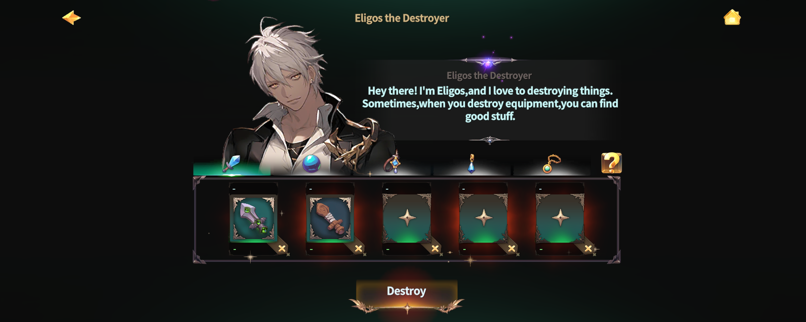

# 💥 Equipment destruction



### ◾ Equipment Destruction

Equipment Destruction is a system that allows you\
to directly select and destroy Equipment through NPC **Eligos**, and obtain byproducts in return.


Equipment Destruction is **different from Equipment being destroyed during Enchanting**.\
These two systems are separate and should not be confused.

* **Eligos Equipment Destruction**:\
  The player manually selects Equipment to destroy and receives byproducts.
* [**Enchant Equipment Destruction**](../enchantment/enchantment-failed.md#enchantment-failed):\
  Equipment may be destroyed probabilistically during the Enchant process,\
  and this is **not related** to the byproduct chart on this page.


***

### ◾ Eligos Location

Equipment Destruction can be performed at the following location.

* [Rottenhill](../../field-info/rotten-hill/) > [Magic Shop](../../field-info/rotten-hill/magic-shop/) > [**NPC Eligos**](../../field-info/rotten-hill/magic-shop/npc-magic-shop.md#the-breaker-of-arms)

***

### ◾ How to Proceed with Equipment Destruction

#### 1. Talk to Eligos

After speaking with Eligos, the Equipment Destruction screen will appear.

<figure><figcaption></figcaption></figure>

#### 2. Select Equipment to Destroy

Select the Equipment you wish to destroy, then proceed with the destruction.

<figure><figcaption></figcaption></figure>

#### 3. Destruction Complete & Byproducts Obtained

Once Equipment Destruction is complete, you will obtain byproducts.

<figure><figcaption></figcaption></figure>


### Notes

The amount of byproducts obtained may vary depending on whether the Equipment is **bound**.\
In particular, destroying **bound Equipment** may result in fewer byproducts.


***

### ◾ Equipment Destruction Byproduct Chart

The byproducts obtainable by destroying Equipment \
through Eligos can be checked in the chart below.

🔸 [**Equipment Destruction Byproduct Chart**](equipment-destruction.md#equipment-destruction-3)

***

### ◾ Related Pages

The item drop probabilities for Rune Destruction can be checked on the page below.\
👉 [**Go to Skill Rune Destruction Probability Guide**](../hero-ascension/succession/skill-rune.md#skill-rune-destruction-probability-guide)



### ◾ 장비 파괴 (Equipment Destruction)

장비 파괴는 NPC **엘리고스**를 통해 원하는 장비를 직접 선택하여 파괴하고,\
부산물을 획득하는 시스템입니다.


장비 파괴는 **인챈트(강화) 진행 중 발생하는 장비 파괴**와 서로 다른 시스템입니다.

* **엘리고스 장비 파괴**: 플레이어가 장비를 선택해 직접 파괴하고 부산물을 획득합니다.
* [**인챈트 장비 파괴**](../enchantment/enchantment-failed.md): 인챈트 과정에서 확률로 장비가 파괴될 수 있으며, \
  본 페이지의 부산물 차트와는 구분됩니다.


***

### ◾ 엘리고스 위치

장비 파괴는 아래 위치에서 진행할 수 있습니다.

* [로튼힐](../../field-info/rotten-hill/) > [마법 상점](../../field-info/rotten-hill/magic-shop/) > [**NPC 엘리고스**](../../field-info/rotten-hill/magic-shop/npc-magic-shop.md#the-breaker-of-arms)

***

### ◾ 장비 파괴 진행 방법

#### 1. 엘리고스와 대화하기

엘리고스와 대화하면 장비를 파괴할 수 있는 화면이 표시됩니다.

<figure><figcaption></figcaption></figure>

#### 2. 파괴할 장비 선택하기

파괴할 장비를 선택한 후 파괴를 진행할 수 있습니다.

<figure><figcaption></figcaption></figure>

#### 3. 파괴 완료 및 부산물 획득

장비 파괴가 완료되면 부산물을 획득합니다.

<figure><figcaption></figcaption></figure>


### 주의 사항

장비 파괴는 **장비의 귀속 여부**에 따라 획득하는 부산물 수량이 달라질 수 있습니다.\
특히, **귀속 장비**를 파괴할 경우 부산물이 더 적게 획득될 수 있습니다.


***

### ◾ 장비 파괴 부산물 차트

엘리고스를 통해 장비를 파괴했을 때 획득할 수 있는 부산물은 아래 차트에서 확인할 수 있습니다.

🔸 [**장비 파괴 부산물 차트**](equipment-destruction.md#equipment-destruction-1)

***

### ◾ 관련 페이지 안내

룬 파괴 시 획득 가능한 아이템 확률은 아래 페이지에서 확인할 수 있습니다.\
👉 [**스킬 룬 파괴 확률 안내 바로가기**](../hero-ascension/succession/skill-rune.md#skill-rune-destruction-probability-guide)



### ◾ 装備破壊（Equipment Destruction）

装備破壊は、NPC **エリゴス** を通じて、任意の装備を直接選択して破壊し、\
副産物を獲得できるシステムです。


装備破壊は、**エンチャント（強化）進行中に発生する装備破壊**とは 異なるシステムです。

* **エリゴス装備破壊**：\
  プレイヤーが装備を選択して直接破壊し、副産物を獲得します。
* [**エンチャント装備破壊**](../enchantment/enchantment-failed.md#enchanto)：\
  エンチャント過程において、確率により装備が破壊される場合がありますが、\
  本ページの副産物チャートとは **関係ありません**。


***

### ◾ エリゴスの位置

装備破壊は、以下の場所で行うことができます。

* [ロッテンヒル](../../field-info/rotten-hill/) ＞ [魔法ショップ](../../field-info/rotten-hill/magic-shop/) ＞ [**NPC エリゴス**](../../field-info/rotten-hill/magic-shop/npc-magic-shop.md#the-breaker-of-arms)

***

### ◾ 装備破壊の進行方法

#### 1. エリゴスと会話する

エリゴスと会話すると、装備を破壊できる画面が表示されます。

<figure><figcaption></figcaption></figure>

#### 2. 破壊する装備を選択する

破壊したい装備を選択し、装備破壊を進行できます。

<figure><figcaption></figcaption></figure>

#### 3. 破壊完了・副産物獲得

装備破壊が完了すると、副産物を獲得します。

<figure><figcaption></figcaption></figure>


### 注意事項

装備破壊で獲得できる副産物の数量は、装備の **帰属状態** によって異なる場合があります。\
特に、**帰属装備** を破壊した場合、獲得できる副産物が 少なくなることがあります。


***

### ◾ 装備破壊副産物チャート

エリゴスを通じて装備を破壊した際に 獲得できる副産物は、以下のチャートから確認できます。

🔸 [**装備破壊副産物チャート**](equipment-destruction.md#equipment-destruction-2)

***

### ◾ 関連ページ案内

ルーン破壊時に獲得可能な アイテム確率については、以下のページから確認できます。\
👉 [スキルルーン破壊確率案内へ](../hero-ascension/succession/skill-rune.md#sukirurn-2)



### 💔Equipment Destruction

Weapon

**Wooden sword**:&#x20;

🔹Gold: 1 \~ 1 🔹Broken Power: 1 \~ 1 (100%) 🔹Crystal of destruction: 1 \~ 1 (10%) 🔹Crystal of courage: 1 \~ 1 (10%)

**Bronze sword**:&#x20;

🔹Gold: 5 \~ 10 🔹Broken Power: 1 \~ 2 (100%) 🔹Crystal of destruction: 1 \~ 2 (10%) 🔹Crystal of courage: 1 \~ 2 (10%)

**Steel sword**:&#x20;

🔹Gold: 50 \~ 200 🔹Broken Power: 2 \~ 3 (100%) 🔹Arena seal: 1 \~ 2 (5%) 🔹Crystal of destruction: 1 \~ 2 (15%) 🔹Crystal of courage: 1 \~ 2 (15%)

**Flamberg:**&#x20;

🔹Gold: 500 \~ 1000 🔹Broken Power: 5 \~ 8 (100%) 🔹Arena seal: 1 \~ 3 (10%) 🔹Crystal of destruction: 3 \~ 4 (50%) 🔹Crystal of courage: 3 \~ 4 (50%)

**Paladin's Sword:**

🔹Gold: 2000 \~ 5000 🔹Broken Power: 10 \~ 15 (100%) 🔹Arena seal: 1 \~ 4 (20%) 🔹Crystal of destruction: 5 \~ 7 (80%) 🔹Crystal of courage: 5 \~ 7 (80%)

**Orc eye:**&#x20;

🔹Gold: 25000 \~ 40000 🔹Broken Power: 40 \~ 50 (100%) 🔹Arena seal: 2 \~ 5 (50%) 🔹Crystal of destruction: 8 \~ 10 (100%) 🔹Crystal of courage: 8 \~ 10 (100%)

**Damascus:**

🔹Gold: 50000 \~ 70000 🔹Broken Power: 60 \~ 80 (100%) 🔹Arena seal: 3 \~ 6 (60%) 🔹Crystal of destruction: 15 \~ 20 (100%) 🔹Crystal of courage: 15 \~ 20 (100%)

**Savage Sword**:&#x20;

🔹Gold: 80000 \~ 100000 🔹Broken Power: 120 \~ 200 (100%) 🔹Arena seal: 4 \~ 7 (80%) 🔹Crystal of destruction: 25 \~ 40 (100%) 🔹Crystal of courage: 25 \~ 40 (100%)

**Oracle Sword**:&#x20;

🔹Gold: 120000 \~ 200000 🔹Broken Power: 400 \~ 500 (100%) 🔹**Mystic stone :** 1 \~ 1 (5%) 🔹Arena seal: 5 \~ 8 (100%) 🔹Crystal of destruction: 70 \~ 80 (100%) 🔹Crystal of courage: 70 \~ 80 (100%)

**Devil's sword:**&#x20;

🔹Gold: 300000 \~ 400000 🔹Broken Power: 600 \~ 700 (100%) 🔹**Mystic stone :** 1 \~ 1 (20%) 🔹Arena seal: 10 \~ 10 (100%) 🔹Crystal of destruction: 100 \~ 200 (100%) 🔹Crystal of courage: 100 \~ 200 (100%)

**Awakening Darkness :**

🔹Gold: 800000 \~ 1000000 🔹Broken Power: 1000 \~ 1200 (100%) 🔹**Mystic stone :** 1 \~ 2 (30%) 🔹Arena seal: 12 \~ 12 (100%) 🔹Crystal of destruction: 360 \~ 500 (100%) 🔹Crystal of courage: 360 \~ 500 (100%)

**Sword of light**:&#x20;

🔹Gold: 1500000 \~ 2000000 🔹Broken Power: 1500 \~ 2000 (100%) 🔹**Mystic stone :** 2 \~ 3 (40%) 🔹Arena seal: 14 \~ 14 (100%) 🔹Crystal of destruction: 700 \~ 800 (100%) 🔹Crystal of courage: 700 \~ 800 (100%)

Orb

**Orb of Wind**:&#x20;

🔹Gold: 1 \~ 1 🔹Broken Power: 1 \~ 1 (100%) 🔹Crystal of destruction: 1 \~ 1 (10%) 🔹Crystal of courage: 1 \~ 1 (10%)

**Dark Orb**:&#x20;

🔹Gold: 5 \~ 10 🔹Broken Power: 1 \~ 2 (100%) 🔹Crystal of destruction: 1 \~ 2 (10%) 🔹Crystal of courage: 1 \~ 2 (10%)

**Abyssal Orb**:&#x20;

🔹Gold: 50 \~ 200 🔹Broken Power: 2 \~ 3 (100%) 🔹Arena seal: 1 \~ 2 (5%) 🔹Crystal of destruction: 1 \~ 2 (15%) 🔹Crystal of courage: 1 \~ 2 (15%)

**Orb of Clarity**:&#x20;

🔹Gold: 500 \~ 1000 🔹Broken Power: 5 \~ 8 (100%) 🔹Arena seal: 1 \~ 3 (10%) 🔹Crystal of destruction: 3 \~ 4 (50%) 🔹Crystal of courage: 3 \~ 4 (50%)

**Wind of Fire**:&#x20;

🔹Gold: 2000 \~ 5000 🔹Broken Power: 10 \~ 15 (100%) 🔹Arena seal: 1 \~ 4 (20%) 🔹Crystal of destruction: 5 \~ 7 (80%) 🔹Crystal of courage: 5 \~ 7 (80%)

**Wings of Light**:&#x20;

🔹Gold: 25000 \~ 40000 🔹Broken Power: 40 \~ 50 (100%) 🔹Arena seal: 2 \~ 5 (50%) 🔹Crystal of destruction: 8 \~ 10 (100%) 🔹Crystal of courage: 8 \~ 10 (100%)

**Explosion Energy**:&#x20;

🔹Gold: 50000 \~ 70000 🔹Broken Power: 60 \~ 80 (100%) 🔹Arena seal: 3 \~ 6 (60%) 🔹Crystal of destruction: 15 \~ 20 (100%) 🔹Crystal of courage: 15 \~ 20 (100%)

**Devil's Hand**:&#x20;

🔹Gold: 85000 \~ 105000 🔹Broken Power: 120 \~ 200 (100%) 🔹Arena seal: 4 \~ 7 (80%) 🔹Crystal of destruction: 25 \~ 40 (100%) 🔹Crystal of courage: 25 \~ 40 (100%)

**Devil's Wings**:&#x20;

🔹Gold: 150000 \~ 250000 🔹Broken Power: 400 \~ 500 (100%) 🔹**Mystic stone:** 1 \~ 1 (8%) 🔹Arena seal: 5 \~ 8 (100%) 🔹Crystal of destruction: 70 \~ 80 (100%) 🔹Crystal of courage: 70 \~ 80 (100%)

**Orb of Judgment**:&#x20;

🔹Gold: 400000 \~ 500000 🔹Broken Power: 600 \~ 700 (100%) 🔹**Mystic stone:** 1 \~ 1 (20%) 🔹Arena seal: 10 \~ 10 (100%) 🔹Crystal of destruction: 100 \~ 200 (100%) 🔹Crystal of courage: 100 \~ 200 (100%)

**Rainbow**:&#x20;

🔹Gold: 800000 \~ 1000000 🔹Broken Power: 1000 \~ 1200 (100%) 🔹**Mystic stone:** 1 \~ 2 (30%) 🔹Arena seal: 12 \~ 12 (100%) 🔹Crystal of destruction: 360 \~ 500 (100%) 🔹Crystal of courage: 360 \~ 500 (100%)

**Water Wrath**:&#x20;

🔹Gold: 1500000 \~ 2000000 🔹Broken Power: 1500 \~ 2000 (100%) 🔹**Mystic stone:** 2 \~ 3 (40%) 🔹Arena seal: 14 \~ 14 (100%) 🔹Crystal of destruction: 700 \~ 800 (100%) 🔹Crystal of courage: 700 \~ 800 (100%)

Neckless

**Crystal Necklace**:&#x20;

🔹Gold: 1 \~ 1 🔹Broken Power: 1 \~ 1 (100%) 🔹Crystal of destruction: 1 \~ 1 (10%) 🔹Crystal of courage: 1 \~ 1 (10%)

**Adventurer's Necklace**:&#x20;

🔹Gold: 3 \~ 8 🔹Broken Power: 1 \~ 1 (100%) 🔹Crystal of destruction: 1 \~ 1 (10%) 🔹Crystal of courage: 1 \~ 1 (10%)

**Mage's Necklace**:&#x20;

🔹Gold: 30 \~ 100 🔹Broken Power: 1 \~ 1 (100%) 🔹Arena seal: 1 \~ 1 (3%) 🔹Crystal of destruction: 1 \~ 2 (15%) 🔹Crystal of courage: 1 \~ 2 (15%)

**Elf's Necklace**:&#x20;

🔹Gold: 300 \~ 500 🔹Broken Power: 2 \~ 4 (100%) 🔹Arena seal: 1 \~ 2 (8%) 🔹Crystal of destruction: 3 \~ 4 (30%) 🔹Crystal of courage: 3 \~ 4 (30%)

**Spirit's Necklace**:&#x20;

🔹Gold: 800 \~ 2000 🔹Broken Power: 6 \~ 10 (100%) 🔹Arena seal: 1 \~ 3 (10%) 🔹Crystal of destruction: 5 \~ 6 (50%) 🔹Crystal of courage: 5 \~ 6 (50%)

**Salamander's Necklace**:&#x20;

🔹Gold: 5000 \~ 10000 🔹Broken Power: 15 \~ 25 (100%) 🔹Arena seal: 2 \~ 4 (30%) 🔹Crystal of destruction: 7 \~ 8 (60%) 🔹Crystal of courage: 7 \~ 8 (60%)

**Inferno's Necklace**:&#x20;

🔹Gold: 20000 \~ 40000 🔹Broken Power: 30 \~ 40 (100%) 🔹Arena seal: 3 \~ 5 (40%) 🔹Crystal of destruction: 10 \~ 12 (70%) 🔹Crystal of courage: 10 \~ 12 (70%)

**Mermaid's Necklace**:&#x20;

🔹Gold: 60000 \~ 80000 🔹Broken Power: 50 \~ 60 (100%) 🔹Arena seal: 4 \~ 6 (60%) 🔹Crystal of destruction: 14 \~ 18 (80%) 🔹Crystal of courage: 14 \~ 18 (80%)

**Emperor's Necklace**:&#x20;

🔹Gold: 100000 \~ 150000 🔹Broken Power: 80 \~ 120 (100%) 🔹**Mystic stone:** 1 \~ 1 (3%) 🔹Arena seal: 5 \~ 7 (80%) 🔹Crystal of destruction: 20 \~ 25 (90%) 🔹Crystal of courage: 20 \~ 25 (90%)

**Necklace of Tears**:&#x20;

🔹Gold: 200000 \~ 300000 🔹Broken Power: 140 \~ 200 (100%) 🔹**Mystic stone:** 1 \~ 1 (8%) 🔹Arena seal: 8 \~ 9 (100%) 🔹Crystal of destruction: 40 \~ 60 (100%) 🔹Crystal of courage: 40 \~ 60 (100%)

**Star Necklace**:&#x20;

🔹Gold: 400000 \~ 600000 🔹Broken Power: 220 \~ 300 (100%) 🔹**Mystic stone:** 1 \~ 1 (12%) 🔹Arena seal: 10 \~ 12 (100%) 🔹Crystal of destruction: 80 \~ 100 (100%) 🔹Crystal of courage: 80 \~ 100 (100%)

**Butterfly Necklace**:&#x20;

🔹Gold: 700000 \~ 800000 🔹Broken Power: 350 \~ 450 (100%) 🔹**Mystic stone:** 1 \~ 2 (20%) 🔹Arena seal: 13 \~ 13 (100%) 🔹Crystal of destruction: 150 \~ 250 (100%) 🔹Crystal of courage: 150 \~ 250 (100%)

Bracelet

**Crystal Bracelet**:&#x20;

🔹Gold: 1 \~ 1 🔹Broken Power: 1 \~ 1 (100%) 🔹Crystal of destruction: 1 \~ 1 (10%) 🔹Crystal of courage: 1 \~ 1 (10%)

**Adventurer's Bracelet**:&#x20;

🔹Gold: 3 \~ 8 🔹Broken Power: 1 \~ 1 (100%) 🔹Crystal of destruction: 1 \~ 1 (10%) 🔹Crystal of courage: 1 \~ 1 (10%)

**Mage's Bracelet**:&#x20;

🔹Gold: 30 \~ 100 🔹Broken Power: 1 \~ 1 (100%) 🔹Arena seal: 1 \~ 1 (3%) 🔹Crystal of destruction: 1 \~ 2 (15%) 🔹Crystal of courage: 1 \~ 2 (15%)

**Elf's Bracelet**:&#x20;

🔹Gold: 300 \~ 500 🔹Broken Power: 2 \~ 4 (100%) 🔹Arena seal: 1 \~ 2 (8%) 🔹Crystal of destruction: 3 \~ 4 (30%) 🔹Crystal of courage: 3 \~ 4 (30%)

**Spirit's Bracelet**:&#x20;

🔹Gold: 800 \~ 2000 🔹Broken Power: 6 \~ 10 (100%) 🔹Arena seal: 1 \~ 3 (10%) 🔹Crystal of destruction: 5 \~ 6 (50%) 🔹Crystal of courage: 5 \~ 6 (50%)

**Salamander's Bracelet**:&#x20;

🔹Gold: 5000 \~ 10000 🔹Broken Power: 15 \~ 25 (100%) 🔹Arena seal: 2 \~ 4 (30%) 🔹Crystal of destruction: 7 \~ 8 (60%) 🔹Crystal of courage: 7 \~ 8 (60%)

**Inferno's Bracelet**:&#x20;

🔹Gold: 20000 \~ 40000 🔹Broken Power: 30 \~ 40 (100%) 🔹Arena seal: 3 \~ 5 (40%) 🔹Crystal of destruction: 10 \~ 12 (70%) 🔹Crystal of courage: 10 \~ 12 (70%)

**Mermaid's Bracelet**:&#x20;

🔹Gold: 60000 \~ 80000 🔹Broken Power: 50 \~ 60 (100%) 🔹Arena seal: 4 \~ 6 (60%) 🔹Crystal of destruction: 14 \~ 18 (80%) 🔹Crystal of courage: 14 \~ 18 (80%)

**Emperor's Bracelet**:&#x20;

🔹Gold: 100000 \~ 150000 🔹Broken Power: 80 \~ 120 (100%) 🔹**Mystic stone:** 1 \~ 1 (3%) 🔹Arena seal: 5 \~ 7 (80%) 🔹Crystal of destruction: 20 \~ 25 (90%) 🔹Crystal of courage: 20 \~ 25 (90%)

**Bracelet of Tears**:&#x20;

🔹Gold: 200000 \~ 300000 🔹Broken Power: 140 \~ 200 (100%) 🔹**Mystic stone:** 1 \~ 1 (8%) 🔹Arena seal: 8 \~ 9 (100%) 🔹Crystal of destruction: 40 \~ 60 (100%) 🔹Crystal of courage: 40 \~ 60 (100%)

**Star Bracelet**:&#x20;

🔹Gold: 400000 \~ 600000 🔹Broken Power: 220 \~ 300 (100%) 🔹**Mystic stone:** 1 \~ 1 (12%) 🔹Arena seal: 10 \~ 12 (100%) 🔹Crystal of destruction: 80 \~ 100 (100%) 🔹Crystal of courage: 80 \~ 100 (100%)

**Butterfly Bracelet**:&#x20;

🔹Gold: 700000 \~ 800000 🔹Broken Power: 350 \~ 450 (100%) 🔹**Mystic stone:** 1 \~ 2 (20%) 🔹Arena seal: 13 \~ 13 (100%) 🔹Crystal of destruction: 150 \~ 250 (100%) 🔹Crystal of courage: 150 \~ 250 (100%)

Earing

**Crystal Earrings**:&#x20;

🔹Gold: 1 \~ 1 🔹Broken Power: 1 \~ 1 (100%) 🔹Crystal of destruction: 1 \~ 1 (10%) 🔹Crystal of courage: 1 \~ 1 (10%)

**Mage's Earrings**:&#x20;

🔹Gold: 30 \~ 100 🔹Broken Power: 1 \~ 1 (100%) 🔹Arena seal: 1 \~ 2 (3%) 🔹Crystal of destruction: 1 \~ 2 (15%) 🔹Crystal of courage: 1 \~ 2 (15%)

**Spirit's Earrings**:&#x20;

🔹Gold: 800 \~ 2000 🔹Broken Power: 6 \~ 10 (100%) 🔹Arena seal: 1 \~ 3 (10%) 🔹Crystal of destruction: 5 \~ 6 (50%) 🔹Crystal of courage: 5 \~ 6 (50%)

**Earrings of Inferno**:&#x20;

🔹Gold: 20000 \~ 40000 🔹Broken Power: 30 \~ 40 (100%) 🔹Arena seal: 3 \~ 5 (40%) 🔹Crystal of destruction: 10 \~ 12 (70%) 🔹Crystal of courage: 10 \~ 12 (70%)

**Emperor's Earrings**:&#x20;

🔹Gold: 100000 \~ 150000 🔹Broken Power: 80 \~ 120 (100%) 🔹**Mystic stone:** 1 \~ 1 (3%) 🔹Arena seal: 5 \~ 7 (80%) 🔹Crystal of destruction: 20 \~ 25 (90%) 🔹Crystal of courage: 20 \~ 25 (90%)

**Star Earrings**:&#x20;

🔹Gold: 400000 \~ 600000 🔹Broken Power: 220 \~ 300 (100%) 🔹**Mystic stone:** 1 \~ 1 (12%) 🔹Arena seal: 10 \~ 12 (100%) 🔹Crystal of destruction: 80 \~ 100 (100%) 🔹Crystal of courage: 80 \~ 100 (100%)

**Butterfly Earrings**:&#x20;

🔹Gold: 700000 \~ 800000 🔹Broken Power: 350 \~ 450 (100%) 🔹**Mystic stone:** 1 \~ 2 (20%) 🔹Arena seal: 13 \~ 13 (100%) 🔹Crystal of destruction: 150 \~ 250 (100%) 🔹Crystal of courage: 150 \~ 250 (100%)

<em>※ This guide was written based on the game status as of January 7, 2026,</em>  <em>and its contents may change with future updates.</em>

