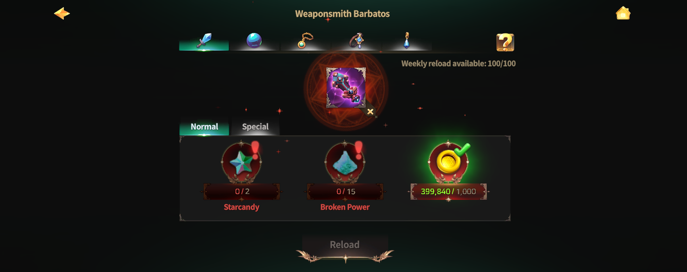
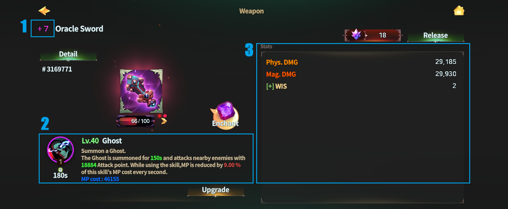

# 🔁 Reload Equipment



### ◾ Reload Equipment

Reload Equipment is a system that allows you to reset the **skills and stats** of your Equipment,\
including Weapons, Orbs, and Accessories.

Through Reload,\
you can reconfigure existing Equipment and try out various combat styles.

***

### ◾ Reload Equipment NPC Location

Reload Equipment can be performed at the following location.

* [Rottenhill](../../field-info/rotten-hill/) > [Magic Shop](../../field-info/rotten-hill/magic-shop/) > [NPC **Barbatos**](../../field-info/rotten-hill/magic-shop/npc-magic-shop.md#barbatos-barubatosu)

You can proceed with Reload Equipment by talking to **Barbatos**.

<figure><figcaption></figcaption></figure>

***

### ◾ How to Proceed with Reload Equipment

After speaking with Barbatos, you will be taken to the Reload Equipment screen.

<figure><figcaption></figcaption></figure>

On the Reload screen, you can select the following Equipment to perform Reload.

> Weapon, Orb, Necklace, Bracelet, Earrings

<figure><figcaption></figcaption></figure>

***

### ◾ Reload Equipment Types

> There are two methods for equipment reload: \[**Normal, Special**].\
> .png>)

***

### ◾ Rules Applied During Reload

<figure><figcaption></figcaption></figure>

<table><thead><tr><th width="235">Categories:</th><th>Normal</th><th>Special</th></tr></thead><tbody><tr><td>1️⃣ <strong>Equipment Enchantment Level</strong></td><td><mark style="color:red;"><strong>Reset</strong></mark></td><td>Maintain</td></tr><tr><td>2️⃣ <strong>(Weapon) Skill Level</strong></td><td><mark style="color:red;"><strong>Reset</strong></mark></td><td>Maintain</td></tr><tr><td>2️⃣ <strong>(Weapon) Skill Type</strong></td><td><mark style="color:purple;"><strong>Reload</strong></mark></td><td><mark style="color:purple;"><strong>Reload</strong></mark></td></tr><tr><td>3️⃣ <strong>Equipment Stats</strong></td><td><mark style="color:purple;"><strong>Reload</strong></mark></td><td><mark style="color:purple;"><strong>Reload</strong></mark></td></tr></tbody></table>


When Reloading Equipment, **fixed stats** (such as STR and DEX) remain unchanged.\
The Equipment’s **min–max rolled stats** are re-rolled.

For <mark style="color:purple;">**Special Reload**</mark>, if the Equipment has an **Enchant Level of 5 or higher**,\
the Enchant bonus is also re-rolled.


The materials required for each Reload type can be checked below.

| Normal                                                               | Special                                                                                                         |
| -------------------------------------------------------------------- | --------------------------------------------------------------------------------------------------------------- |
| 
Star Candy (Amount required increases with weapon grade)
   | 
<strong>For Weapons:</strong> Weapon - Special Reload x 1 (Purchase from XTO Shop)
                 |
| 
Broken Power (Amount required increases with weapon grade)
 | 
<strong>For Orbs and Accessories:</strong> Equipment - Special Reload x 1 (Purchase from XTO Shop)
 |
| 
Gold (Amount required increases with weapon grade)
         |                                                                                                                 |




### ◾ 장비 리로드 (Reload Equipment)

장비 리로드는 무기, 오브, 액세서리의 스킬과 스탯을 다시 설정할 수 있는 시스템입니다.\
리로드를 통해 기존 장비를 새로운 구성으로 변경하여 다양한 전투 스타일을 시도할 수 있습니다.

***

### ◾ 장비 리로드 NPC 위치

장비 리로드는 아래 위치에서 진행할 수 있습니다.

* [로튼힐](../../field-info/rotten-hill/) > [마법 상점](../../field-info/rotten-hill/magic-shop/) > [NPC **바르바토스**](../../field-info/rotten-hill/magic-shop/npc-magic-shop.md#barbatos-barubatosu)

바르바토스와 대화하면 장비 리로드를 진행할 수 있습니다.

<figure><figcaption></figcaption></figure>

***

### ◾ 장비 리로드 진행 방법

바르바토스와 대화하면, 장비 리로드 화면으로 이동합니다.

<figure><figcaption></figcaption></figure>

리로드 화면에서는 아래 장비를 선택하여 리로드를 진행할 수 있습니다.

> 무기, 오브, 목걸이, 팔찌, 귀걸이

<figure><figcaption></figcaption></figure>

***

### ◾ 장비 리로드 방식

> 장비 리로드에는 \[**일반, 스페셜**]의 2가지 방식이 존재합니다.\
> .png>)

***

### ◾ 리로드 시 적용 규칙

<figure><figcaption></figcaption></figure>

<table><thead><tr><th width="230">구분</th><th>일반</th><th>스페셜</th></tr></thead><tbody><tr><td><strong>1️⃣장비 인챈트 레벨</strong></td><td><mark style="color:red;"><strong>초기화</strong></mark></td><td>유지</td></tr><tr><td><strong>2️⃣(무기) 스킬 레벨</strong></td><td><mark style="color:red;"><strong>초기화</strong></mark></td><td>유지</td></tr><tr><td><strong>2️⃣(무기) 스킬 종류</strong></td><td><mark style="color:purple;"><strong>리로드</strong></mark></td><td><mark style="color:purple;"><strong>리로드</strong></mark></td></tr><tr><td><strong>3️⃣장비 스탯</strong></td><td><mark style="color:purple;"><strong>리로드</strong></mark></td><td><mark style="color:purple;"><strong>리로드</strong></mark></td></tr></tbody></table>


**장비의 고정 스탯 ( STR, DEX 등 ) 은 고정상태를 유지합니다.**

**장비의 min \~ max 루팅 스탯은 다시 루팅됩니다.**

<mark style="color:purple;">**스페셜 :**</mark>**&#x20;장비에 인챈트 레벨이 5 이상인 경우, 인챈트 보너스 역시 다시 루팅됩니다.**


각 리로드 방식에 필요한 재료는 아래 내용을 통해 확인할 수 있습니다.

| 일반                                  | 스페셜                                                                       |
| ----------------------------------- | ------------------------------------------------------------------------- |
| 
별사탕 ( 무기 단계마다 필요량 증가 )
    | 
<strong>무기인 경우:</strong> 무기 - 스페셜 리로드 x1 ( XTO 상점 구매 )
       |
| 
부서진 힘  ( 무기 단계마다 필요량 증가 )
 | 
<strong>오브, 악세사리인 경우:</strong> 장비 - 스페셜 리로드 x1 ( XTO 상점 구매 )
 |
| 
골드 ( 무기 단계마다 필요량 증가 )
     |                                                                           |



### ◾ 装備リロード（Reload Equipment）

装備リロードは、武器・オーブ・アクセサリーの\
**スキルおよびステータスを再設定**できるシステムです。

リロードを通じて、既存の装備を新しい構成に変更し、\
さまざまな戦闘スタイルを試すことができます。

***

### ◾ 装備リロードNPCの位置

装備リロードは、以下の場所で行うことができます。

* [ロッテンヒル](../../field-info/rotten-hill/) ＞ [魔法ショップ](../../field-info/rotten-hill/magic-shop/) ＞ [NPC **バルバトス**](../../field-info/rotten-hill/magic-shop/npc-magic-shop.md#barbatos-barubatosu)

バルバトスと会話すると、装備リロードを進行できます。

<figure><figcaption></figcaption></figure>

***

### ◾ 装備リロード進行方法

バルバトスと会話すると、装備リロード画面に移動します。

<figure><figcaption></figcaption></figure>

リロード画面では、以下の装備を選択して リロードを行うことができます。

> 武器, オーブ, ネックレス, ブレスレット, イヤリング

<figure><figcaption></figcaption></figure>

***

### ◾ 装備リロード方式

> 装備リロードには\[**通常、スペシャル**]の2つの方式があります。\
> .png>)

***

### ◾ リロード時に適用されるルール

<figure><figcaption></figcaption></figure>

<table><thead><tr><th width="266">区分:</th><th>通常</th><th>スペシャル</th></tr></thead><tbody><tr><td>1️⃣ <strong>装備のエンチャントレベル</strong></td><td><mark style="color:red;"><strong>リセット</strong></mark></td><td>維持</td></tr><tr><td>2️⃣ <strong>(武器) スキルレベル</strong></td><td><mark style="color:red;"><strong>リセット</strong></mark></td><td>維持</td></tr><tr><td>2️⃣ <strong>(武器) スキルの種類</strong></td><td><mark style="color:purple;"><strong>リロード</strong></mark></td><td><mark style="color:purple;"><strong>リロード</strong></mark></td></tr><tr><td>3️⃣ <strong>装備のステータス</strong></td><td><mark style="color:purple;"><strong>リロード</strong></mark></td><td><mark style="color:purple;"><strong>リロード</strong></mark></td></tr></tbody></table>


装備リロードを行っても、**固定ステータス**（STR、DEX など）は 変更されず、そのまま維持されます。装備の **最小～最大ルーティングステータス**は 再度ルーティングされます。

<mark style="color:purple;">**スペシャルリロード**</mark>を行う場合、装備の **エンチャントレベルが5以上**であれば、\
エンチャントボーナスも 再度ルーティングされます。


各リロード方式に必要な素材は、以下の内容から確認できます。

| 通常                                 | スペシャル                                                                       |
| ---------------------------------- | --------------------------------------------------------------------------- |
| 
星のキャンディ (武器の段階ごとに必要量が増加)
 | 
<strong>武器の場合：</strong> 武器 - スペシャルリロード x1 (XTOショップで購入)
         |
| 
壊れた力 (武器の段階ごとに必要量が増加)
    | 
<strong>オーブ・アクセサリーの場合：</strong> 装備 - スペシャルリロード x1 (XTOショップで購入)
 |
| 
ゴールド (武器の段階ごとに必要量が増加)
    |                                                                             |




<em>※ This guide was written based on the game status as of January 7, 2026,</em>  <em>and its contents may change with future updates.</em>

