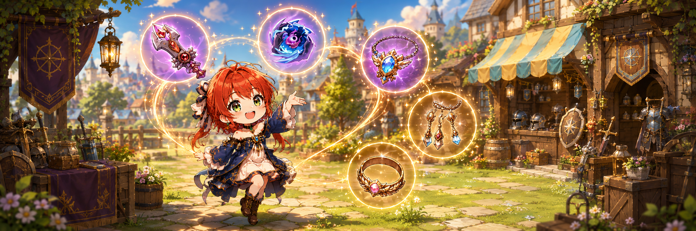

# ⚔️ Equipment

<figure><figcaption></figcaption></figure>



### ⚔️ Equipment&#x20;

Equipment is one of the most important factors that determines\
a character’s **combat power** and **play style**.

Change your weapon, and the way you fight changes.\
Equip Orbs and Accessories, and your character’s very nature begins to shift.

On this page, you can get a clear overview of\
all equipment systems available in **EXTOCIUM**.

***

#### ◾Equipment Overview

Equipment in EXTOCIUM is divided into the following **four categories**.\
Select each category to view its stats, growth methods, and related systems.

* &#x20;**Weapon**&#x20;

Determines a character’s **base attack power** and **combat style**.

* Each weapon has its own unique stats and skill pool
* Weapons have the greatest influence on how you fight in battle


[weapon](weapon/)


* &#x20;**Orb**

A support item that **amplifies a character’s abilities**.

* Greatly improves combat efficiency through additional stats and special effects


[orb](orb/)


* **Accessories**

Equipment consisting of **necklaces, bracelets, and earrings**.

* Used to fine-tune stats or strengthen the character in a specific direction


[accessories](accessories/)


* &#x20;**Enchantment**

A reinforcement system that **adds extra effects to equipment**.

* Even the same piece of equipment can perform very differently\
  depending on its Enchantment


[enchantment](../enchantment/)




### ⚔️ Equipment (장비)

장비는 캐릭터의 **전투력과 플레이 스타일을 결정하는 가장 중요한 요소**입니다.\
무기를 바꾸면 싸우는 방식이 달라지고,\
오브와 장신구를 착용하면 캐릭터의 성격 자체가 바뀝니다.

이 페이지에서는\
EXTOCIUM에서 사용할 수 있는 **모든 장비 시스템의 큰 흐름**을 한눈에 확인할 수 있습니다.

***

#### ◾ 장비 구성 한눈에 보기

EXTOCIUM의 장비는 크게 아래 네 가지로 나뉩니다.\
각 항목을 선택하면 해당 장비의 스탯, 성장 방식, 관련 시스템을 확인할 수 있습니다.

* &#x20;**Weapon (무기)**

캐릭터의 기본 공격력과 전투 방식을 결정합니다.\
무기마다 고유한 스탯과 스킬 풀이 존재하며, 전투 스타일에 가장 큰 영향을 줍니다.


[weapon](weapon/)


* &#x20;**Orb (오브)**

캐릭터의 능력을 증폭시키는 보조 장비입니다.\
추가 스탯과 특수 효과를 통해 전투 효율을 크게 끌어올릴 수 있습니다.


[orb](orb/)


* **Accessories (장신구)**

목걸이, 팔찌, 귀걸이로 구성된 장비입니다.\
세부 스탯을 보완하거나 특정 방향으로 캐릭터를 강화할 수 있습니다.


[accessories](accessories/)


* &#x20;**Enchantment (인챈트)**

장비에 추가 효과를 부여하는 강화 요소입니다.\
같은 장비라도 인챈트에 따라 성능 차이가 크게 벌어질 수 있습니다.


[enchantment](../enchantment/)




### ⚔️ 装備（Equipment）

装備は、キャラクターの**戦闘力**や**プレイスタイル**を決定する\
最も重要な要素です。

武器を変えれば戦い方が変わり、\
オーブや装身具を装備すれば、キャラクターの性格そのものが変わります。

このページでは、\
**EXTOCIUM**で使用できるすべての装備システムの全体像を\
一目で確認することができます。

***

#### ◾ 装備構成一覧

EXTOCIUMの装備は、主に以下の**4つのカテゴリ**に分かれています。\
各項目を選択すると、装備のステータスや成長方式、\
関連システムを確認できます。

* &#x20;**武器（Weapon）**

キャラクターの**基本攻撃力**と**戦闘スタイル**を決定します。

* 武器ごとに固有のステータスとスキルプールを所持
* 戦闘スタイルに最も大きな影響を与える装備です


[weapon](weapon/)


* &#x20;**オーブ（Orb）**

キャラクターの能力を**増幅**させる補助装備です。

* 追加ステータスや特殊効果によって、戦闘効率を大きく向上させます


[orb](orb/)


* **装身具（Accessories）**

**ネックレス・ブレスレット・イヤリング**で構成される装備です。

* ステータスを補完したり、特定の方向へキャラクターを強化できます


[accessories](accessories/)


* &#x20;**エンチャント（Enchantment）**

装備に**追加効果を付与する強化要素**です。

* 同じ装備であっても、\
  エンチャント内容によって性能に大きな差が生まれます


[enchantment](../enchantment/)




<em>※ This guide was written based on the game status as of December 31, 2025,</em>  <em>and its contents may change with future updates.</em>

