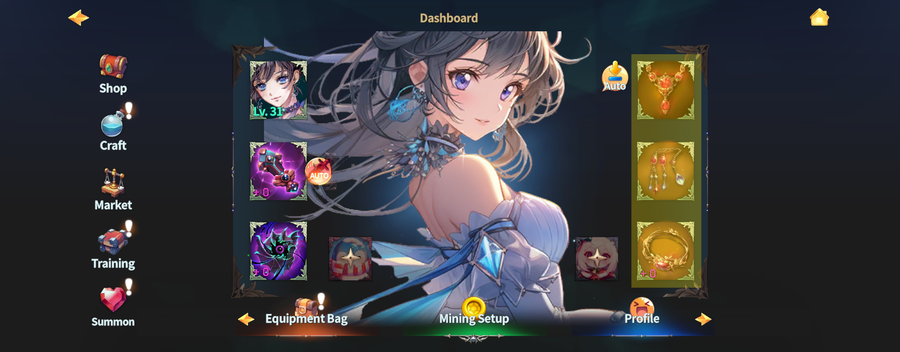

# 💝 Accessories

<figure><figcaption></figcaption></figure>



### ✨ Accessories

Accessories are equipment composed of **Necklaces, Bracelets, and Earrings**\
that enhance a Hero’s attributes and improve overall combat performance.

Each accessory provides different stats, and depending on how they are combined,\
a Hero’s growth direction and play style can change.

***

#### ◾ Accessory Types

Select each category to view detailed information and related systems.

* **Necklace**&#x20;


[necklace.md](necklace.md)


* **Bracelet**


[bracelet.md](bracelet.md)


* **Earring**&#x20;


[earring.md](earring.md)


***

#### ◾ Please Note

* Accessories **do not** receive the random option **CDR (Reduces skill reload time)**
* Compared to Weapons and Orbs,\
  the **probability and values of random options** on Accessories are set lower

***

✨ A well-balanced accessory combination is a key factor in completing your combat build.



### ✨ Accessories (악세서리)

악세서리는 **목걸이, 팔찌, 귀걸이**로 구성된 장비로, 영웅의 능력치를 보완하고 전투 성능을 강화합니다.\
각 악세서리는 서로 다른 능력치를 제공하며, 조합에 따라 캐릭터의 성장 방향이 달라집니다.

***

#### ◾ 악세서리 구성

각 항목을 선택하면 해당 악세서리의 상세 정보와 시스템을 확인할 수 있습니다.

* **Necklace (목걸이)**


[necklace.md](necklace.md)


* **Bracelet (팔찌)**


[bracelet.md](bracelet.md)


* **Earring (귀걸이)**


[earring.md](earring.md)


***

#### ◾ 알아두세요

* 악세서리에는 **재장전 시간 감소 (CDR) 랜덤 옵션이 부여되지 않습니다.**
* 무기 및 오브에 비해, 악세서리의 랜덤 옵션 **확률과 수치는 낮게 설정**되어 있습니다.

***

✨ 적절한 악세서리 조합은 전투력의 완성도를 높이는 중요한 요소입니다.



### ✨ アクセサリー（Accessories）

アクセサリーは、**ネックレス・ブレスレット・イヤリング**で構成される装備で、\
ヒーローの能力値を補完し、戦闘性能を強化します。

各アクセサリーは異なるステータスを持ち、その組み合わせによって、\
キャラクターの成長方向やプレイスタイルが変化します。

***

#### ◾ アクセサリー構成

各項目を選択すると、該当アクセサリーの詳細情報や関連システムを確認できます。

* **ネックレス（Necklace）**


[necklace.md](necklace.md)


* **ブレスレット（Bracelet）**


[bracelet.md](bracelet.md)


* **イヤリング（Earring）**


[earring.md](earring.md)


***

#### ◾ ご注意ください

* アクセサリーには、**CDR（リロード時間短縮）** のランダムオプションは付与されません
* 武器やオーブと比べて、\
  アクセサリーの **ランダムオプション発生確率および数値は低め** に設定されています

***

✨ 適切なアクセサリーの組み合わせは、戦闘力の完成度を高める重要な要素です。



<em>※ This guide was written based on the game status as of January 5, 2026,</em>  <em>and its contents may change with future updates.</em>

