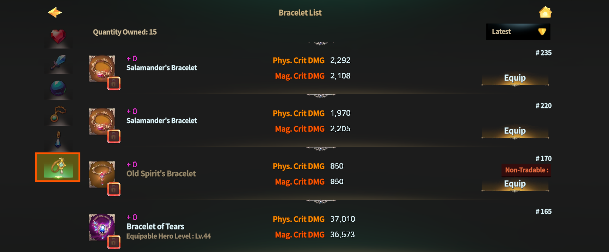
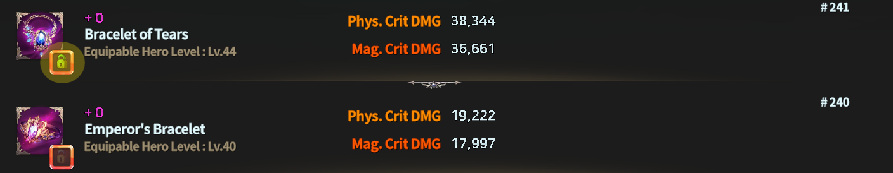
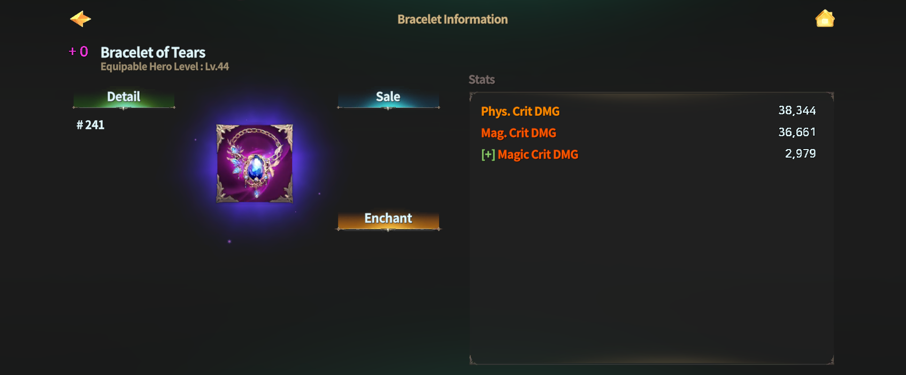

# 🙌 Bracelet



### 📿 Bracelet&#x20;

Bracelets are accessories specialized in **enhancing Critical Damage**.\
They amplify burst potential for both **physical and magical attacks**,\
making them ideal for combat styles that focus on explosive damage.

***

#### ◾ Bracelet Stat Guide

* Bracelets are granted the following **base stats**:
  * **Phys. Crit DMG** (Increases Physical Critical Damage)
  * **Mag. Crit DMG** (Increases Magical Critical Damage)
* Compared to Weapons and Orbs,\
  the **probability and values of random options** on Bracelets are set lower.

💡 [**Fixed Stat Option Range**](bracelet.md#bracelet-fixed-stat-option-range)\
💡 [**Random Stat Option Range**](bracelet.md#random-stat-option-range)


⚠️ Minimum and maximum option values may be adjusted\
to percentage-based values depending on balance changes.


***

#### ◾ How to Access the Bracelet List

1️⃣ Tap the **Dashboard button** at the top-left of the main screen.

<figure><figcaption></figcaption></figure>

2️⃣ Tap the **Equipment Bag** at the bottom of the Dashboard.

<figure><figcaption></figcaption></figure>

3️⃣ In the **Accessories tab**, select the **Bracelet icon** to view your list of owned Bracelets.

<figure><figcaption></figcaption></figure>

***

#### ◾ Using the Bracelet List

From the Bracelet list, you can perform the following actions:

* Equip and unequip Bracelets
* Sort Bracelets
* View detailed Bracelet information

<figure><figcaption></figcaption></figure>

Use the **Sort button at the top-right** to organize the list based on your preferred criteria.

***

#### ◾ Bracelet Lock Feature

Important Bracelets can be protected using the **Lock feature**.

* Tap the **lock-shaped icon** in the list to set the selected Bracelet to a locked state.

<figure><figcaption></figcaption></figure>

Locked Bracelets have the following properties:

* Always displayed at the **top of the Bracelet list**
* Cannot be used as **crafting materials**
* Cannot be used as **enhancement materials**

***

#### ◾ Bracelet Details

Tap a Bracelet in the list to open its **detail page**.

<figure><figcaption></figcaption></figure>

From the detail page, you can:

* Check Bracelet stats
* [Sell](../../../economy/trade/market/) the Bracelet
* (For NFT Bracelets) View related information

***

Bracelets are accessories that **complete the power of a single critical hit**.\
Build around **Phys. Crit DMG** and **Mag. Crit DMG**\
to perfect a combat style that matches your offensive focus.



### 📿 Bracelet (팔찌)

팔찌는 **치명타 피해를 강화**하는 데 특화된 악세서리입니다.\
물리·마법 공격 모두의 폭발력을 끌어올려,\
순간 화력을 중시하는 전투 스타일에 적합합니다.

***

#### ◾ 팔찌 스탯 안내

* 팔찌에는 다음 기본 스탯이 부여됩니다.
  * **Phys. Crit DMG** (물리 치명타 피해 증가)
  * **Mag. Crit DMG** (마법 치명타 피해 증가)
* 무기 및 오브에 비해, 팔찌의 **랜덤 옵션 확률과 수치는 낮게 설정**되어 있습니다.

💡 [**고정 스탯 옵션 범위**](bracelet.md#bracelet-fixed-stat-option-range) \
💡 [**확률 스탯 옵션 범위**](bracelet.md#probabilistic-stat-option-range)


⚠️ 옵션의 최소\~최대값은 밸런스 조정에 따라 일부 수치가 **비율 기준**으로 변경될 수 있습니다.


***

#### ◾ 팔찌 목록 접근 방법

1️⃣ 메인 화면 좌측 상단의 **대시보드** 버튼을 터치합니다.

<figure><figcaption></figcaption></figure>

2️⃣ 대시보드 하단의 **장비 가방**을 터치합니다.

<figure><figcaption></figcaption></figure>

3️⃣ 악세서리 탭에서 **팔찌 아이콘**을 선택하면 보유 중인 팔찌 목록을 확인할 수 있습니다.

<figure><figcaption></figcaption></figure>

***

#### ◾ 팔찌 목록 활용

팔찌 목록에서는 다음 작업을 할 수 있습니다.

* 팔찌 장착 및 해제
* 팔찌 정렬
* 팔찌 상세 정보 확인

<figure><figcaption></figcaption></figure>

우측 상단의 정렬 버튼을 통해 원하는 기준으로 목록을 정렬할 수 있습니다.

***

#### ◾ 팔찌 잠금 기능

중요한 팔찌는 **잠금 기능**을 활용해 보호할 수 있습니다.

* 목록에서 **자물쇠 모양 버튼**을 터치하면\
  해당 팔찌가 잠금 상태로 설정됩니다.

<figure><figcaption></figcaption></figure>

잠금된 팔찌는 다음과 같은 특징이 있습니다.

* 팔찌 목록에서 **항상 상단에 표시**됩니다.
* **제작 재료로 사용되지 않습니다.**
* **강화 재료로 사용되지 않습니다.**

***

#### ◾ 팔찌 상세정보

팔찌 목록에서 원하는 장비를 터치하면 **상세 정보 페이지**로 이동합니다.

<figure><figcaption></figcaption></figure>

상세 정보 페이지에서는 다음 작업을 할 수 있습니다.

* 팔찌 스탯 확인
* 팔찌 [판매](../../../economy/trade/market/)
* (NFT 팔찌의 경우) 관련 정보 확인

***

팔찌는 **치명타 한 방의 위력을 완성하는 악세서리**입니다.\
Phys. Crit DMG(물리 치명타 데미지)와 Mag. Crit DMG(마법 치명타 데미지)를 중심으로, \
자신의 공격 성향에 맞는 전투 스타일을 완성해 보세요.



### 📿 ブレスレット（Bracelet）

ブレスレットは、**クリティカルダメージの強化**に特化したアクセサリーです。\
物理・魔法の両方の攻撃における瞬間火力を高め、\
一撃の威力を重視する戦闘スタイルに適しています。

***

#### ◾ ブレスレットのステータス案内

* ブレスレットには、以下の **基本ステータス** が付与されます。
  * **Phys. Crit DMG**（物理クリティカルダメージ増加）
  * **Mag. Crit DMG**（魔法クリティカルダメージ増加）
* 武器やオーブと比べて、\
  ブレスレットの **ランダムオプション発生確率および数値は低め** に設定されています。

💡 [**固定ステータスオプション範囲**](bracelet.md#bracelet-fixed-stat-option-range)\
💡 [**ランダムステータスオプション範囲**](bracelet.md#random-stat-option-range)&#x20;


⚠️ オプションの最小値～最大値は、\
バランス調整により一部が割合基準に変更される場合があります。


***

#### ◾ ブレスレット一覧へのアクセス方法

1️⃣ メイン画面左上の **ダッシュボードボタン** をタップします。

<figure><figcaption></figcaption></figure>

2️⃣ ダッシュボード下部の **装備バッグ** をタップします。

<figure><figcaption></figcaption></figure>

3️⃣ **アクセサリータブ** で **ブレスレットアイコン** を選択すると、\
所持中のブレスレット一覧を確認できます。

<figure><figcaption></figcaption></figure>

***

#### ◾ ブレスレット一覧の活用

ブレスレット一覧では、以下の操作が可能です。

* ブレスレットの装備・解除
* ブレスレットの並び替え
* ブレスレット詳細情報の確認

<figure><figcaption></figcaption></figure>

**画面右上** の並び替えボタンを使用すると、お好みの条件で一覧を並び替えることができます。

***

#### ◾ ブレスレットのロック機能

重要なブレスレットは、**ロック機能** を活用して保護できます。

* 一覧で **鍵アイコン** をタップすると、該当ブレスレットはロック状態に設定されます。

<figure><figcaption></figcaption></figure>

ロックされたブレスレットの特徴：

* ブレスレット一覧の **最上部に固定表示** されます
* **制作素材として使用されません**
* **強化素材として使用されません**

***

#### ◾ ブレスレット詳細情報

ブレスレット一覧で装備をタップすると、**詳細情報ページ** に移動します。

<figure><figcaption></figcaption></figure>

詳細情報ページでは、以下の操作が可能です。

* ブレスレットのステータス確認
* ブレスレットの[販売](../../../economy/trade/market/)
* （NFTブレスレットの場合）関連情報の確認

***

ブレスレットは、**クリティカル一撃の威力を完成させるアクセサリー**です。\
**Phys. Crit DMG(物理クリDMG)** と **Mag. Crit DMG(魔法クリDMG)** を軸に、\
ご自身の攻撃傾向に合った戦闘スタイルを完成させてみてください。



<em>※ This guide was written based on the game status as of January 5, 2026,</em>  <em>and its contents may change with future updates.</em>

#### 💡Bracelet Fixed Stat Option Range

<table data-header-hidden><thead><tr><th></th><th width="98.9090576171875"></th><th></th><th></th><th></th><th></th></tr></thead><tbody><tr><td><strong>Bracelet</strong></td><td><strong>Equip Lv.</strong></td><td><strong>Min Phys. Crit DMG</strong></td><td><strong>Max Phys. Crit DMG</strong></td><td><strong>Min Mag. Crit DMG</strong></td><td><strong>Max Mag. Crit DMG</strong></td></tr><tr><td>Crystal Bracelet</td><td>4</td><td>24</td><td>26</td><td>24</td><td>26</td></tr><tr><td>Adventurer's Bracelet</td><td>9</td><td>100</td><td>112</td><td>100</td><td>112</td></tr><tr><td>Mage's Bracelet</td><td>13</td><td>190</td><td>224</td><td>190 </td><td>224</td></tr><tr><td>Elf's Bracelet</td><td>18</td><td>400</td><td>512</td><td>400</td><td>512</td></tr><tr><td>Spirit's Bracelet</td><td>24</td><td>900</td><td>1,152</td><td>900</td><td>1,152</td></tr><tr><td>Salamander's Bracelet</td><td>28</td><td>1,960</td><td>2,336</td><td>1,960</td><td>2,336</td></tr><tr><td>Inferno's Bracelet</td><td>32</td><td>3,960</td><td>4,880</td><td>3,960</td><td>4,880</td></tr><tr><td>Mermaid's Bracelet</td><td>36</td><td>8,300</td><td>9,920</td><td>8,300</td><td>9,920</td></tr><tr><td>Emperor's Bracelet</td><td>40</td><td>17,000</td><td>20,080</td><td>17,000</td><td>20,080</td></tr><tr><td>Bracelet of Tears</td><td>44</td><td>34,000</td><td>40,800</td><td>34,000</td><td>40,800</td></tr><tr><td>Star Bracelet</td><td>48</td><td>69,000</td><td>83,200</td><td>69,000</td><td>83,200</td></tr><tr><td>Butterfly Bracelet</td><td>54</td><td>133,760</td><td>164,524</td><td>133,760</td><td>164,524</td></tr></tbody></table>

#### 💡Random Stat Option Range

📢 The table is long, so use the scrollbar below to scroll left and right to view the full table!

| **Bracelet**          | **STR prob** | **Min STR** | **Max STR** | **DEX prob** | **Min DEX** | **Max DEX** | **INT prob** | Min INT | Max INT | CON prob | Min CON | Max CON | WIZ prob | Min WIZ | Max WIZ | CHA prob | Min CHA | **Max** **CHA** | **Phys. DMG prob** | **Min Phys. DMG** | **Max Phys. DMG** | **HP prob**  | **Min HP** | **Max HP** | **MP prob** | **Min MP** | **Max MP** | **Phys. Crit DMG prob** | **Min Phys. Crit DMG** | **Max Phys. Crit DMG** | **Phys. Crit % prob** | **Min Phys. Crit %** | **Max Phys. Crit %** | **Mag. DMG prob** | **Min Mag. DMG** | **Max Mag. DMG** | **Mag. Crit DMG prob** | **Min Mag. Crit DMG** | **Max Mag. Crit DMG** | **Mag. Crit % prob** | **Min Mag. Crit %**  | **Max Mag. Crit %** |
| --------------------- | ------------ | ----------- | ----------- | ------------ | ----------- | ----------- | ------------ | ------- | ------- | -------- | ------- | ------- | -------- | ------- | ------- | -------- | ------- | --------------- | ------------------ | ----------------- | ----------------- | ------------ | ---------- | ---------- | ----------- | ---------- | ---------- | ----------------------- | ---------------------- | ---------------------- | --------------------- | -------------------- | -------------------- | ----------------- | ---------------- | ---------------- | ---------------------- | --------------------- | --------------------- | -------------------- | -------------------- | ------------------- |
| Crystal Bracelet      | 0.5          | 1           | 1           | 0.5          | 1           | 1           | 0.5          | 1       | 1       | 0.5      | 1       | 1       | 0.5      | 1       | 1       | 0.5      | 1       | 1               | 8                  | 3                 | 9                 | 8            | 23         | 68         | 8           | 23         | 68         | 8                       | 3                      | 9                      | 5                     | 0.1                  | 0.3                  | 8                 | 3                | 9                | 8                      | 3                     | 9                     | 5                    | 0.1                  | 0.3                 |
| Adventurer's Bracelet | 0.5          | 1           | 1           | 0.5          | 1           | 1           | 0.5          | 1       | 1       | 0.5      | 1       | 1       | 0.5      | 1       | 1       | 0.5      | 1       | 1               | 8                  | 6                 | 19                | 8            | 48         | 144        | 8           | 48         | 144        | 8                       | 6                      | 19                     | 5                     | 0.1                  | 0.4                  | 8                 | 6                | 19               | 8                      | 6                     | 19                    | 5                    | 0.1                  | 0.4                 |
| Mage's Bracelet       | 0.5          | 1           | 1           | 0.5          | 1           | 1           | 0.5          | 1       | 1       | 0.5      | 1       | 1       | 0.5      | 1       | 1       | 0.5      | 1       | 1               | 8                  | 14                | 41                | 8            | 103        | 308        | 8           | 103        | 308        | 8                       | 14                     | 41                     | 5                     | 0.1                  | 0.5                  | 8                 | 14               | 41               | 8                      | 14                    | 41                    | 5                    | 0.1                  | 0.5                 |
| Elf's Bracelet        | 0.5          | 1           | 1           | 0.5          | 1           | 1           | 0.5          | 1       | 1       | 0.5      | 1       | 1       | 0.5      | 1       | 1       | 0.5      | 1       | 1               | 8                  | 29                | 88                | 8            | 220        | 659        | 8           | 220        | 659        | 8                       | 29                     | 88                     | 5                     | 0.1                  | 0.6                  | 8                 | 29               | 88               | 8                      | 29                    | 88                    | 5                    | 0.1                  | 0.6                 |
| Spirit's Bracelet     | 1            | 1           | 2           | 1            | 1           | 2           | 1            | 1       | 2       | 1        | 1       | 2       | 1        | 1       | 2       | 1        | 1       | 2               | 8                  | 63                | 188               | 8            | 470        | 1,411      | 8           | 470        | 1,411      | 8                       | 63                     | 188                    | 5                     | 0.1                  | 0.7                  | 8                 | 63               | 188              | 8                      | 63                    | 188                   | 5                    | 0.1                  | 0.7                 |
| Salamander's Bracelet | 1            | 1           | 2           | 1            | 1           | 2           | 1            | 1       | 2       | 1        | 1       | 2       | 1        | 1       | 2       | 1        | 1       | 2               | 8                  | 134               | 403               | 8            | 1,007      | 3,020      | 8           | 1,007      | 3,020      | 8                       | 134                    | 403                    | 5                     | 0.1                  | 0.8                  | 8                 | 134              | 403              | 8                      | 134                   | 403                   | 5                    | 0.1                  | 0.8                 |
| Inferno's Bracelet    | 1            | 1           | 2           | 1            | 1           | 2           | 1            | 1       | 2       | 1        | 1       | 2       | 1        | 1       | 2       | 1        | 1       | 2               | 8                  | 287               | 862               | 8            | 2,154      | 6,462      | 8           | 2,154      | 6,462      | 8                       | 287                    | 862                    | 5                     | 0.1                  | 0.9                  | 8                 | 287              | 862              | 8                      | 287                   | 862                   | 5                    | 0.1                  | 0.9                 |
| Mermaid's Bracelet    | 1            | 1           | 2           | 1            | 1           | 2           | 1            | 1       | 2       | 1        | 1       | 2       | 1        | 1       | 2       | 1        | 1       | 2               | 8                  | 615               | 1,844             | 8            | 4,610      | 13,829     | 8           | 4,610      | 13,829     | 8                       | 615                    | 1,844                  | 5                     | 0.1                  | 1                    | 8                 | 615              | 1,844            | 8                      | 615                   | 1,844                 | 5                    | 0.1                  | 1                   |
| Emperor's Bracelet    | 1.5          | 1           | 3           | 1.5          | 1           | 3           | 1.5          | 1       | 3       | 1.5      | 1       | 3       | 1.5      | 1       | 3       | 1.5      | 1       | 3               | 8                  | 1,315             | 3,946             | 8            | 9,864      | 29,592     | 8           | 9,864      | 29,592     | 8                       | 1,315                  | 3,946                  | 5                     | 0.1                  | 1.1                  | 8                 | 1,315            | 3,946            | 8                      | 1,315                 | 3,946                 | 5                    | 0.1                  | 1.1                 |
| Bracelet of Tears     | 1.5          | 1           | 3           | 1.5          | 1           | 3           | 1.5          | 1       | 3       | 1.5      | 1       | 3       | 1.5      | 1       | 3       | 1.5      | 1       | 3               | 8                  | 2,815             | 8,444             | 8            | 21,109     | 63,326     | 8           | 21,109     | 63,326     | 8                       | 2,815                  | 8,444                  | 5                     | 0.1                  | 1.2                  | 8                 | 2,815            | 8,444            | 8                      | 2,815                 | 8,444                 | 5                    | 0.1                  | 1.2                 |
| Star Bracelet         | 1.5          | 1           | 3           | 1.5          | 1           | 3           | 1.5          | 1       | 3       | 1.5      | 1       | 3       | 1.5      | 1       | 3       | 1.5      | 1       | 3               | 8                  | 6,023             | 18,069            | 8            | 45,173     | 135,518    | 8           | 45,173     | 135,518    | 8                       | 6,023                  | 18,069                 | 5                     | 0.4                  | 1.3                  | 8                 | 6,023            | 18,069           | 8                      | 6,023                 | 18,069                | 5                    | 0.4                  | 1.3                 |

