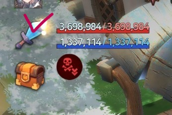
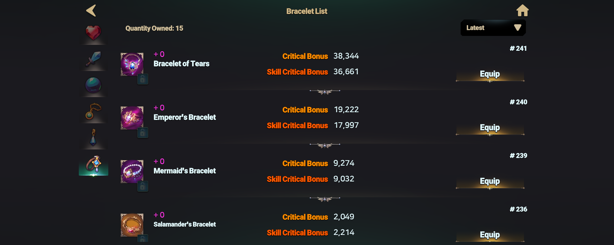
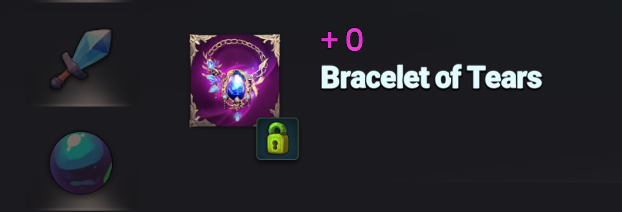
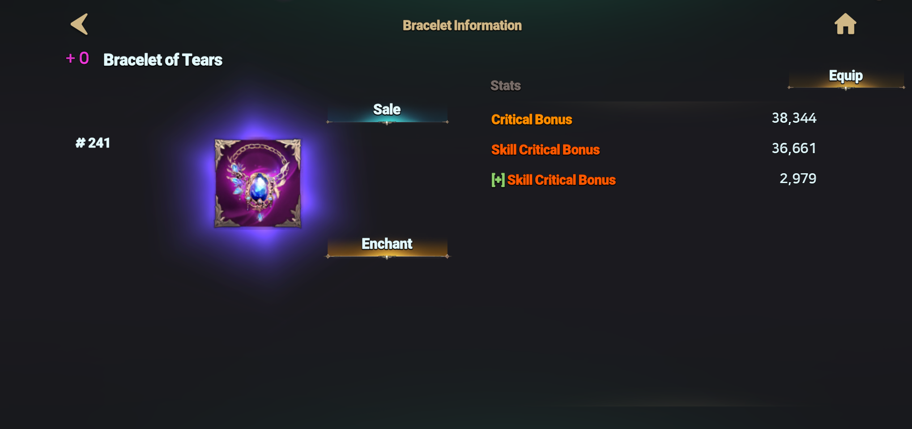

# 🙌 Bracelet



### 📿 **Bracelet**

Bracelets **come with CB and SCB as base stats.**

💡 [**Fixed Stat Option Range** ](bracelet.md#bracelet-fixed-stat-option-range)\
**💡** [**Probabilistic Stat Option Range**](bracelet.md#probabilistic-stat-option-range)


⚠️ The minimum and maximum values of options may be adjusted based on a percentage due to balance updates.


Equip the right bracelet to unleash even greater combat power!

***

#### 🔹 Accessing the Bracelet Inventory

<figure><figcaption>
MainHUD
</figcaption></figure>

📌 **Tap the "Dashboard" button on the top-left of the main HUD.**\
📌 **The dashboard displays a summary of your currently equipped weapon.**

<figure><figcaption></figcaption></figure>

📌 **Tap the "Equipment Bag" button at the bottom** to view your list of weapons, orbs, and accessories!

***

#### 🔹 **Using the Bracelet Inventory**

<figure><figcaption></figcaption></figure>

📌 **Tap a bracelet from the list to view its details.**\
📌 **Here, you can equip or unequip bracelets, and use the sort button on the top-left to organize your equipment.**

***

#### ⚠️ **Bracelet Stats & Important Notes**

🔹 **CB and SCB are granted as base stats.**\
🔹 **Compared to weapons and orbs, bracelets have lower random option rates and values.**\
🔹 **CR is not granted as a random option.**

Choosing the right gear is key to maximizing your hero’s strength.\
Use the base stats of bracelets wisely and create the ultimate battle strategy!

***

#### 🔹 **Utilizing the Lock Feature**

<figure><figcaption></figcaption></figure>

To prevent accidental use or dismantling, **take advantage of the equipment lock feature!**\
📌 **Tap the "Lock" button in the inventory to secure your bracelet.**\
📌 **Locked gear benefits:**\
✅ **Moves to the top of the bracelet list** _for easy access_.\
✅ **Cannot be used as crafting material** – _no risk of accidental dismantling!_\
✅ **Cannot be used as enhancement material** – _prevents unintentional consumption!_

***

#### 🔹 **Viewing Bracelet Details**

<figure><figcaption></figcaption></figure>

📌 **Tap any bracelet in the inventory to access the details page.**\
📌 Here, you can **check its stats,** [**sell**](../../../economy/trade/market/trading-items/)**, and manage other features.**

💡 **Strategically utilize your bracelet’s base stats and random options to maximize your hero’s power!**



#### 📿 **팔찌**

팔찌에는 **CB와 SCB가 기본적으로 부여됩니다.**

💡 [**고정 스탯 옵션 범위**](bracelet.md#bracelet-fixed-stat-option-range) \
💡 [**확률 스탯 옵션 범위**](bracelet.md#probabilistic-stat-option-range)


⚠️ 옵션의 최소\~최대값은 밸런스 수정에 따라 일부 값이 '비율 기준'으로 조정될 수 있습니다.


적절한 팔찌를 장착하여 더욱 강력한 전투력을 발휘하세요!

***

#### 🔹 **팔찌 목록 접근하기**

<figure><figcaption>
MainHUD
</figcaption></figure>

📌 **메인 HUD 좌측 상단의 "대시보드" 버튼을 터치하세요.**\
📌 **대시보드 중앙에서 현재 장착 중인 무기의 요약 정보를 확인할 수 있습니다.**

<figure><figcaption></figcaption></figure>

📌 **하단의 "장비 가방" 버튼을 터치하면 보유 중인 무기, 오브, 악세서리 리스트를 확인할 수 있습니다!**

***

#### 🔹 **팔찌 목록 활용하기**

<figure><figcaption></figcaption></figure>

📌 **팔찌 목록에서 원하는 장비를 터치하면 상세 정보 페이지로 이동합니다.**\
📌 **이 목록에서 팔찌를 장착하거나 해제할 수 있으며, 좌측 상단의 정렬 버튼을 이용해 원하는 순서로 정렬할 수도 있습니다.**

***

#### ⚠️ **팔찌 옵션 & 주의사항**

🔹 **CB와 SCB가 기본 스탯으로 부여됩니다.**\
🔹 **무기 및 오브에 비해, 팔찌의 랜덤 옵션 확률과 수치는 낮게 설정되어 있습니다.**\
🔹 **랜덤 옵션으로 CR이 부여되지 않습니다.**

전략적인 장비 선택이 영웅의 전투력을 결정합니다.\
팔찌의 기본 스탯을 활용하고, 최적의 옵션을 조합해 **나만의 전투 스타일을 완성하세요!**

***

#### 🔹 **슬롯 잠금 기능 활용하기**

<figure><figcaption></figcaption></figure>

팔찌를 실수로 사용하거나 분해하는 것을 방지하려면 **장비 잠금 기능을 활용**하세요!\
📌 **목록에서 "잠금" 버튼을 터치하면 해당 장비가 잠금 상태가 됩니다.**\
📌 **잠금된 장비의 장점:**\
✅ **팔찌 목록의 최상단에 배치**되어 _쉽게 확인 가능!_\
✅ **제작 재료로 사용되지 않음** – _실수로 분해할 걱정 없음!_\
✅ **강화 재료로 사용되지 않음** – _실수로 소모될 위험 없음!_

***

#### 🔹 **팔찌 상세 정보 확인하기**

<figure><figcaption></figcaption></figure>

📌 **팔찌 목록에서 원하는 장비를 터치하면 상세 정보 페이지로 이동**합니다.\
📌 이 페이지에서는 **팔찌의 스탯 확인,** [**판매**](../../../economy/trade/market/trading-items/) **등 모든 작업을 수행**할 수 있습니다.

💡 **팔찌의 기본 스탯과 랜덤 옵션을 전략적으로 활용하여, 영웅을 더욱 강력하게 성장시키세요!**&#x20;



### 📿 **ブレスレット**

ブレスレットには **CBとSCBが基本ステータスとして付与されます。**

**💡** [**固定ステータスオプションの範囲** ](bracelet.md#bracelet-fixed-stat-option-range)\
**💡** [**確率ステータスオプションの範囲**](bracelet.md#probabilistic-stat-option-range)


⚠️ オプションの最小～最大値は、バランス調整により一部の値が「割合基準」で調整される場合があります。


最適なブレスレットを装備し、さらに強力な戦闘力を発揮しましょう！

***

#### 🔹 **ブレスレットインベントリへのアクセス**

<figure><figcaption>
MainHUD
</figcaption></figure>

📌 **メインHUD左上の「ダッシュボード」ボタンをタップ** してください。\
📌 **ダッシュボードでは現在装備している武器の概要パネルを確認** できます。

<figure><figcaption></figcaption></figure>

📌 **画面下部の「装備バッグ」ボタンをタップ** すると、武器・オーブ・アクセサリーのリストを表示できます！

***

#### 🔹 **ブレスレットインベントリの活用**

<figure><figcaption></figcaption></figure>

📌 **リスト内のブレスレットをタップすると、詳細ページが表示されます。**\
📌 **ブレスレットの装備・解除** が可能で、左上の **「ソートボタン」** を使用して整理することもできます。

***

#### ⚠️ **ブレスレットのステータス & 注意事項**

🔹 **CBとSCBが基本ステータスとして付与されます。**\
🔹 **武器やオーブに比べて、ブレスレットのランダムオプションの確率と数値は低く設定されています。**\
🔹 **CRはランダムオプションとして付与されません。**

最適な装備を選ぶことで、英雄の戦闘力を最大限に引き出せます。\
ブレスレットの基本ステータスを活かし、最強の戦闘戦略を構築しましょう！

***

#### 🔹 **ロック機能の活用**

<figure><figcaption></figcaption></figure>

誤使用や分解を防ぐために、**装備ロック機能を活用** しましょう！\
📌 **インベントリ内の「ロック」ボタンをタップ** すると、ブレスレットがロックされます。\
📌 **ロックされた装備のメリット:**\
✅ **ブレスレットリストの最上部に配置** され、_簡単にアクセス可能_。\
✅ **クラフト素材として使用不可** – _誤って分解する心配なし！_\
✅ **強化素材として使用不可** – _意図せず消費するリスクなし！_

***

#### 🔹 **ブレスレットの詳細確認**

<figure><figcaption></figcaption></figure>

📌 **インベントリ内のブレスレットをタップすると、詳細ページに移動** できます。\
📌 ここでは **ステータスの確認、**[**販売**](../../../economy/trade/market/trading-items/)**、その他の管理が可能** です。

💡 **ブレスレットの基本ステータスとランダムオプションを活用し、英雄をさらに強化しましょう！**



<em>※ This guide was written based on the game status as of January 5, 2026,</em>  <em>and its contents may change with future updates.</em>

#### 💡Bracelet Fixed Stat Option Range

<table data-header-hidden><thead><tr><th></th><th width="98.9090576171875"></th><th></th><th></th><th></th><th></th></tr></thead><tbody><tr><td><strong>Bracelet</strong></td><td><strong>Equip Lv.</strong></td><td><strong>Min Phys. Crit DMG</strong></td><td><strong>Max Phys. Crit DMG</strong></td><td><strong>Min Mag. Crit DMG</strong></td><td><strong>Max Mag. Crit DMG</strong></td></tr><tr><td>Crystal Bracelet</td><td>4</td><td>24</td><td>26</td><td>24</td><td>26</td></tr><tr><td>Adventurer's Bracelet</td><td>9</td><td>100</td><td>112</td><td>100</td><td>112</td></tr><tr><td>Mage's Bracelet</td><td>13</td><td>190</td><td>224</td><td>190 </td><td>224</td></tr><tr><td>Elf's Bracelet</td><td>18</td><td>400</td><td>512</td><td>400</td><td>512</td></tr><tr><td>Spirit's Bracelet</td><td>24</td><td>900</td><td>1,152</td><td>900</td><td>1,152</td></tr><tr><td>Salamander's Bracelet</td><td>28</td><td>1,960</td><td>2,336</td><td>1,960</td><td>2,336</td></tr><tr><td>Inferno's Bracelet</td><td>32</td><td>3,960</td><td>4,880</td><td>3,960</td><td>4,880</td></tr><tr><td>Mermaid's Bracelet</td><td>36</td><td>8,300</td><td>9,920</td><td>8,300</td><td>9,920</td></tr><tr><td>Emperor's Bracelet</td><td>40</td><td>17,000</td><td>20,080</td><td>17,000</td><td>20,080</td></tr><tr><td>Bracelet of Tears</td><td>44</td><td>34,000</td><td>40,800</td><td>34,000</td><td>40,800</td></tr><tr><td>Star Bracelet</td><td>48</td><td>69,000</td><td>83,200</td><td>69,000</td><td>83,200</td></tr><tr><td>Butterfly Bracelet</td><td>54</td><td>133,760</td><td>164,524</td><td>133,760</td><td>164,524</td></tr></tbody></table>

#### 💡Probabilistic Stat Option Range

📢 The table is long, so use the scrollbar below to scroll left and right to view the full table!

| **Bracelet**          | **STR prob** | **Min STR** | **Max STR** | **DEX prob** | **Min DEX** | **Max DEX** | **INT prob** | Min INT | Max INT | CON prob | Min CON | Max CON | WIZ prob | Min WIZ | Max WIZ | CHA prob | Min CHA | **Max** **CHA** | **Phys. DMG prob** | **Min Phys. DMG** | **Max Phys. DMG** | **HP prob**  | **Min HP** | **Max HP** | **MP prob** | **Min MP** | **Max MP** | **Phys. Crit DMG prob** | **Min Phys. Crit DMG** | **Max Phys. Crit DMG** | **Phys. Crit % prob** | **Min Phys. Crit %** | **Max Phys. Crit %** | **Mag. DMG prob** | **Min Mag. DMG** | **Max Mag. DMG** | **Mag. Crit DMG prob** | **Min Mag. Crit DMG** | **Max Mag. Crit DMG** | **Mag. Crit % prob** | **Min Mag. Crit %**  | **Max Mag. Crit %** |
| --------------------- | ------------ | ----------- | ----------- | ------------ | ----------- | ----------- | ------------ | ------- | ------- | -------- | ------- | ------- | -------- | ------- | ------- | -------- | ------- | --------------- | ------------------ | ----------------- | ----------------- | ------------ | ---------- | ---------- | ----------- | ---------- | ---------- | ----------------------- | ---------------------- | ---------------------- | --------------------- | -------------------- | -------------------- | ----------------- | ---------------- | ---------------- | ---------------------- | --------------------- | --------------------- | -------------------- | -------------------- | ------------------- |
| Crystal Bracelet      | 0.5          | 1           | 1           | 0.5          | 1           | 1           | 0.5          | 1       | 1       | 0.5      | 1       | 1       | 0.5      | 1       | 1       | 0.5      | 1       | 1               | 8                  | 3                 | 9                 | 8            | 23         | 68         | 8           | 23         | 68         | 8                       | 3                      | 9                      | 5                     | 0.1                  | 0.3                  | 8                 | 3                | 9                | 8                      | 3                     | 9                     | 5                    | 0.1                  | 0.3                 |
| Adventurer's Bracelet | 0.5          | 1           | 1           | 0.5          | 1           | 1           | 0.5          | 1       | 1       | 0.5      | 1       | 1       | 0.5      | 1       | 1       | 0.5      | 1       | 1               | 8                  | 6                 | 19                | 8            | 48         | 144        | 8           | 48         | 144        | 8                       | 6                      | 19                     | 5                     | 0.1                  | 0.4                  | 8                 | 6                | 19               | 8                      | 6                     | 19                    | 5                    | 0.1                  | 0.4                 |
| Mage's Bracelet       | 0.5          | 1           | 1           | 0.5          | 1           | 1           | 0.5          | 1       | 1       | 0.5      | 1       | 1       | 0.5      | 1       | 1       | 0.5      | 1       | 1               | 8                  | 14                | 41                | 8            | 103        | 308        | 8           | 103        | 308        | 8                       | 14                     | 41                     | 5                     | 0.1                  | 0.5                  | 8                 | 14               | 41               | 8                      | 14                    | 41                    | 5                    | 0.1                  | 0.5                 |
| Elf's Bracelet        | 0.5          | 1           | 1           | 0.5          | 1           | 1           | 0.5          | 1       | 1       | 0.5      | 1       | 1       | 0.5      | 1       | 1       | 0.5      | 1       | 1               | 8                  | 29                | 88                | 8            | 220        | 659        | 8           | 220        | 659        | 8                       | 29                     | 88                     | 5                     | 0.1                  | 0.6                  | 8                 | 29               | 88               | 8                      | 29                    | 88                    | 5                    | 0.1                  | 0.6                 |
| Spirit's Bracelet     | 1            | 1           | 2           | 1            | 1           | 2           | 1            | 1       | 2       | 1        | 1       | 2       | 1        | 1       | 2       | 1        | 1       | 2               | 8                  | 63                | 188               | 8            | 470        | 1,411      | 8           | 470        | 1,411      | 8                       | 63                     | 188                    | 5                     | 0.1                  | 0.7                  | 8                 | 63               | 188              | 8                      | 63                    | 188                   | 5                    | 0.1                  | 0.7                 |
| Salamander's Bracelet | 1            | 1           | 2           | 1            | 1           | 2           | 1            | 1       | 2       | 1        | 1       | 2       | 1        | 1       | 2       | 1        | 1       | 2               | 8                  | 134               | 403               | 8            | 1,007      | 3,020      | 8           | 1,007      | 3,020      | 8                       | 134                    | 403                    | 5                     | 0.1                  | 0.8                  | 8                 | 134              | 403              | 8                      | 134                   | 403                   | 5                    | 0.1                  | 0.8                 |
| Inferno's Bracelet    | 1            | 1           | 2           | 1            | 1           | 2           | 1            | 1       | 2       | 1        | 1       | 2       | 1        | 1       | 2       | 1        | 1       | 2               | 8                  | 287               | 862               | 8            | 2,154      | 6,462      | 8           | 2,154      | 6,462      | 8                       | 287                    | 862                    | 5                     | 0.1                  | 0.9                  | 8                 | 287              | 862              | 8                      | 287                   | 862                   | 5                    | 0.1                  | 0.9                 |
| Mermaid's Bracelet    | 1            | 1           | 2           | 1            | 1           | 2           | 1            | 1       | 2       | 1        | 1       | 2       | 1        | 1       | 2       | 1        | 1       | 2               | 8                  | 615               | 1,844             | 8            | 4,610      | 13,829     | 8           | 4,610      | 13,829     | 8                       | 615                    | 1,844                  | 5                     | 0.1                  | 1                    | 8                 | 615              | 1,844            | 8                      | 615                   | 1,844                 | 5                    | 0.1                  | 1                   |
| Emperor's Bracelet    | 1.5          | 1           | 3           | 1.5          | 1           | 3           | 1.5          | 1       | 3       | 1.5      | 1       | 3       | 1.5      | 1       | 3       | 1.5      | 1       | 3               | 8                  | 1,315             | 3,946             | 8            | 9,864      | 29,592     | 8           | 9,864      | 29,592     | 8                       | 1,315                  | 3,946                  | 5                     | 0.1                  | 1.1                  | 8                 | 1,315            | 3,946            | 8                      | 1,315                 | 3,946                 | 5                    | 0.1                  | 1.1                 |
| Bracelet of Tears     | 1.5          | 1           | 3           | 1.5          | 1           | 3           | 1.5          | 1       | 3       | 1.5      | 1       | 3       | 1.5      | 1       | 3       | 1.5      | 1       | 3               | 8                  | 2,815             | 8,444             | 8            | 21,109     | 63,326     | 8           | 21,109     | 63,326     | 8                       | 2,815                  | 8,444                  | 5                     | 0.1                  | 1.2                  | 8                 | 2,815            | 8,444            | 8                      | 2,815                 | 8,444                 | 5                    | 0.1                  | 1.2                 |
| Star Bracelet         | 1.5          | 1           | 3           | 1.5          | 1           | 3           | 1.5          | 1       | 3       | 1.5      | 1       | 3       | 1.5      | 1       | 3       | 1.5      | 1       | 3               | 8                  | 6,023             | 18,069            | 8            | 45,173     | 135,518    | 8           | 45,173     | 135,518    | 8                       | 6,023                  | 18,069                 | 5                     | 0.4                  | 1.3                  | 8                 | 6,023            | 18,069           | 8                      | 6,023                 | 18,069                | 5                    | 0.4                  | 1.3                 |

