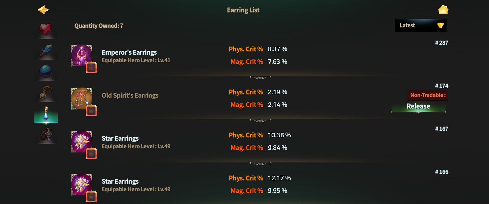
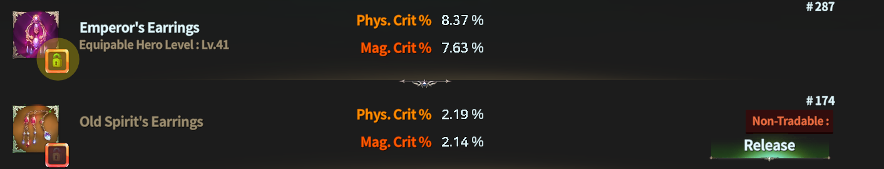
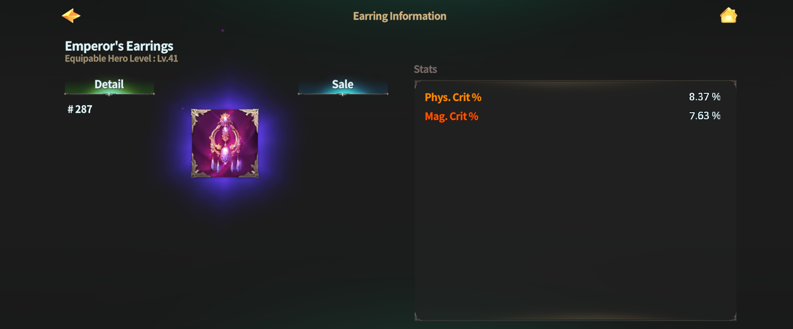

# 🍒 Earring



### 🍒 Earring

Earrings are accessories that specialize in **enhancing Critical Hit Chance**.\
By increasing the probability that attacks land as critical hits,\
they play a key role in improving **consistent combat efficiency**.

***

#### ◾ Earring Stat Guide

* Earrings are granted the following **base stats**:
  * **Phys. Crit %** (Physical Critical Hit Chance)
  * **Mag. Crit %** (Magical Critical Hit Chance)
* Compared to Weapons and Orbs,\
  the **probability and values of random options** on Earrings are set lower.

💡 [**Fixed Stat Option Range**](earring.md#earring-fixed-stat-option-range)\
💡 [**Random Stat Option Range**](earring.md#random-stat-option-range)


⚠️ Minimum and maximum option values may be adjusted\
to percentage-based values depending on balance changes.


***

#### ◾ How to Access the Earring List

1️⃣ Tap the **Dashboard button** at the top-left of the main screen.

<figure><figcaption></figcaption></figure>

2️⃣ Tap the **Equipment Bag** at the bottom of the Dashboard.

<figure><figcaption></figcaption></figure>

3️⃣ In the **Accessories tab**, select the **Earring icon** to view your list of owned Earrings.

<figure><figcaption></figcaption></figure>

***

#### ◾ Using the Earring List

From the Earring list, you can perform the following actions:

* Equip and unequip Earrings
* Sort Earrings
* View detailed Earring information

<figure><figcaption></figcaption></figure>

Use the **Sort button at the top-right** to organize the list based on your preferred criteria.

***

#### ◾ Earring Lock Feature

Important Earrings can be protected using the **Lock feature**.

* Tap the **lock-shaped icon** in the list to set the selected Earring to a locked state.

<figure><figcaption></figcaption></figure>

Locked Earrings have the following properties:

* Always displayed at the **top of the Earring list**
* Cannot be used as **crafting materials**

***

#### ◾ Earring Details

Tap an Earring in the list to open its **detail page**.

<figure><figcaption></figcaption></figure>

From the detail page, you can:

* Check Earring stats
* [Sell](../../../economy/trade/market/) the Earring
* (For NFT Earrings) View related information

***

Earrings are **key accessories for completing critical hit frequency**.\
Build around **Phys. Crit %** and **Mag. Crit %**\
to fine-tune an attack probability that fits your combat style.



### 🍒 Earring (귀걸이)

귀걸이는 **치명타 확률을 강화**하는 악세서리입니다.\
공격이 치명타로 이어질 확률을 높여, 지속적인 전투 효율을 끌어올리는 데 중요한 역할을 합니다.

***

#### ◾ 귀걸이 스탯 안내

* 귀걸이에는 다음 기본 스탯이 부여됩니다.
  * **Phys. Crit %** (물리 치명타 확률)
  * **Mag. Crit %** (마법 치명타 확률)
* 무기 및 오브에 비해, 귀걸이의 **랜덤 옵션 확률과 수치는 낮게 설정**되어 있습니다.

**💡** [**고정 스탯 옵션 범위** ](earring.md#earring-fixed-stat-option-range)\
**💡** [**확률 스탯 옵션 범위**](earring.md#probabilistic-stat-option-range)


⚠️ 옵션의 최소\~최대값은 밸런스 조정에 따라 일부 수치가 **비율 기준**으로 변경될 수 있습니다.


***

#### ◾ 귀걸이 목록 접근 방법

1️⃣ 메인 화면 좌측 상단의 **대시보드** 버튼을 터치합니다.

<figure><figcaption></figcaption></figure>

2️⃣ 대시보드 하단의 **장비 가방**을 터치합니다.

<figure><figcaption></figcaption></figure>

3️⃣ 악세서리 탭에서 **귀걸이 아이콘**을 선택하면 보유 중인 귀걸이 목록을 확인할 수 있습니다.

<figure><figcaption></figcaption></figure>

***

#### ◾ 귀걸이 목록 활용

귀걸이 목록에서는 다음 작업을 할 수 있습니다.

* 귀걸이 장착 및 해제
* 귀걸이 정렬
* 귀걸이 상세 정보 확인

<figure><figcaption></figcaption></figure>

우측 상단의 정렬 버튼을 통해 원하는 기준으로 목록을 정렬할 수 있습니다.

***

#### ◾ 귀걸이 잠금 기능

중요한 귀걸이는 **잠금 기능**을 활용해 보호할 수 있습니다.

* 목록에서 **자물쇠 모양 버튼**을 터치하면 해당 귀걸이가 잠금 상태로 설정됩니다.

<figure><figcaption></figcaption></figure>

잠금된 귀걸이는 다음과 같은 특징이 있습니다.

* 귀걸이 목록에서 **항상 상단에 표시**됩니다.
* **제작 재료로 사용되지 않습니다.**

***

#### ◾ 귀걸이 상세정보

귀걸이 목록에서 원하는 장비를 터치하면 **상세 정보 페이지**로 이동합니다.

<figure><figcaption></figcaption></figure>

상세 정보 페이지에서는 다음 작업을 할 수 있습니다.

* 귀걸이 스탯 확인
* 귀걸이 판매
* (NFT 귀걸이의 경우) 관련 정보 확인

***

귀걸이는 **치명타 발생 빈도를 완성하는 핵심 악세서리**입니다.\
Phys. Crit %와 Mag. Crit %를 중심으로, 자신의 전투 스타일에 맞는 공격 확률을 설계해 보세요.



### 🍒 イヤリング（Earring）

イヤリングは、**クリティカル発生確率の強化**に特化したアクセサリーです。\
攻撃がクリティカルヒットになる確率を高めることで、\
**安定した戦闘効率**を引き上げる重要な役割を果たします。

***

#### ◾ イヤリングのステータス案内

* イヤリングには、以下の **基本ステータス** が付与されます。
  * **Phys. Crit %**（物理クリ率）
  * **Mag. Crit %**（魔法クリ率）
* 武器やオーブと比べて、\
  イヤリングの **ランダムオプション発生確率および数値は低め** に設定されています。

💡 [**固定ステータスオプション範囲**](earring.md#earring-fixed-stat-option-range)\
💡 [**ランダムステータスオプション範囲**](earring.md#random-stat-option-range)


⚠️ オプションの最小値～最大値は、\
バランス調整により一部が割合基準に変更される場合があります。


***

#### ◾ イヤリング一覧へのアクセス方法

1️⃣ メイン画面左上の **ダッシュボードボタン** をタップします。

<figure><figcaption></figcaption></figure>

2️⃣ ダッシュボード下部の **装備バッグ** をタップします。

<figure><figcaption></figcaption></figure>

3️⃣ **アクセサリータブ** で **イヤリングアイコン** を選択すると、\
所持中のイヤリング一覧を確認できます。

<figure><figcaption></figcaption></figure>

***

#### ◾ イヤリング一覧の活用

イヤリング一覧では、以下の操作が可能です。

* イヤリングの装備・解除
* イヤリングの並び替え
* イヤリング詳細情報の確認

<figure><figcaption></figcaption></figure>

**画面右上** の並び替えボタンを使用すると、お好みの条件で一覧を並び替えることができます。

***

#### ◾ イヤリングのロック機能

重要なイヤリングは、**ロック機能** を使って保護できます。

* 一覧で **鍵アイコン** をタップすると、該当イヤリングはロック状態に設定されます。

<figure><figcaption></figcaption></figure>

ロックされたイヤリングの特徴：

* イヤリング一覧の **最上部に固定表示** されます
* **制作素材として使用されません**

***

#### ◾ イヤリング詳細情報

イヤリング一覧で装備をタップすると、**詳細情報ページ** に移動します。

<figure><figcaption></figcaption></figure>

詳細情報ページでは、以下の操作が可能です。

* イヤリングのステータス確認
* イヤリングの[販売](../../../economy/trade/market/)
* （NFTイヤリングの場合）関連情報の確認

***

イヤリングは、**クリティカル発生頻度を完成させる中核アクセサリー**です。\
**物理クリ率** と **魔法クリ率** を軸に、\
自分の戦闘スタイルに合った攻撃確率を設計してみてください。



<em>※ This guide was written based on the game status as of January 5, 2026,</em>  <em>and its contents may change with future updates.</em>

#### **💡Earring Fixed Stat Option Range**

<table><thead><tr><th width="149"></th><th width="97.091064453125"></th><th width="123.45458984375"></th><th width="118.181884765625"></th><th></th><th></th></tr></thead><tbody><tr><td><strong>Earring</strong></td><td><strong>Equip Lv.</strong></td><td><strong>Min Phys. Crit %</strong></td><td><strong>Max Phys. Crit %</strong></td><td><strong>Min Mag. Crit %</strong></td><td><strong>Max Mag. Crit %</strong></td></tr><tr><td>Crystal Earrings</td><td>6</td><td>0.5</td><td>0.8</td><td>0.5</td><td>0.8</td></tr><tr><td>Mage's Earrings</td><td>15</td><td>1</td><td>2</td><td>1</td><td>2</td></tr><tr><td>Spirit's Earrings</td><td>25</td><td>2.5</td><td>4</td><td>2.5</td><td>4</td></tr><tr><td>Inferno's Earrings</td><td>33</td><td>4.5</td><td>6</td><td>4.5</td><td>6</td></tr><tr><td>Emperor's Earrings</td><td>41</td><td>6.5</td><td>9</td><td>6.5</td><td>9</td></tr><tr><td>Star Earrings</td><td>49</td><td>9.5</td><td>12.5</td><td>9.5</td><td>12.5</td></tr><tr><td>Butterfly Earrings</td><td>55</td><td>13</td><td>16.5</td><td>13</td><td>16.5</td></tr></tbody></table>

#### 💡 Random Stat Option Range

📢 The table is long, so use the scrollbar below to scroll left and right to view the full table!

<table><thead><tr><th width="149"></th><th width="96.181884765625"></th><th width="92.5455322265625"></th><th width="98.9090576171875"></th><th width="104.3636474609375"></th><th width="96.1817626953125"></th><th></th><th></th><th></th><th></th><th></th><th></th><th></th><th></th><th></th><th></th><th></th><th></th><th></th><th></th><th></th><th></th><th></th><th></th><th></th><th></th><th></th><th></th><th></th><th></th><th></th><th></th><th></th><th></th><th></th><th></th><th></th><th></th><th></th><th></th><th></th><th></th><th></th></tr></thead><tbody><tr><td><strong>Earring</strong></td><td><strong>STR prob</strong></td><td><strong>Min STR</strong></td><td><strong>Max STR</strong></td><td><strong>DEX prob</strong></td><td><strong>Min DEX</strong></td><td><strong>Max DEX</strong></td><td><strong>INT prob</strong></td><td><strong>Min INT</strong></td><td><strong>Max INT</strong></td><td><strong>CON prob</strong></td><td><strong>Min CON</strong></td><td><strong>Max CON</strong></td><td><strong>WIZ prob</strong></td><td><strong>Min WIZ</strong></td><td><strong>Max WIZ</strong></td><td><strong>CHA prob</strong></td><td><strong>Min CHA</strong></td><td><strong>Max CHA</strong></td><td><strong>Phys. DMG prob</strong></td><td><strong>Min Phys. DMG</strong></td><td><strong>Max Phys. DMG</strong></td><td><strong>HP prob</strong></td><td><strong>Min HP</strong></td><td><strong>Max HP</strong></td><td><strong>MP prob</strong></td><td><strong>Min MP</strong></td><td><strong>Max MP</strong></td><td><strong>Phys. Crit DMG prob</strong></td><td><strong>Min Phys. Crit DMG</strong></td><td><strong>Max Phys. Crit DMG</strong></td><td><strong>Phys. Crit % prob</strong></td><td><strong>Min Phys. Crit %</strong></td><td><strong>Max Phys. Crit %</strong></td><td><strong>Mag. DMG prob</strong></td><td><strong>Min Mag. DMG</strong></td><td><strong>Max Mag. DMG</strong></td><td><strong>Mag. Crit DMG prob</strong></td><td><strong>Min Mag. Crit DMG</strong></td><td><strong>Max Mag. Crit DMG</strong></td><td><strong>Mag. Crit % prob</strong></td><td><strong>Min Mag. Crit %</strong></td><td><strong>Max Mag. Crit %</strong></td></tr><tr><td>Crystal Earrings</td><td>1</td><td>1</td><td>1</td><td>1</td><td>1</td><td>1</td><td>1</td><td>1</td><td>1</td><td>1</td><td>1</td><td>1</td><td>1</td><td>1</td><td>1</td><td>1</td><td>1</td><td>1</td><td>8</td><td>3</td><td>9</td><td>8</td><td>23</td><td>68</td><td>8</td><td>23</td><td>68</td><td>8</td><td>3</td><td>9</td><td>5</td><td>0.1</td><td>0.3</td><td>8</td><td>3</td><td>9</td><td>8</td><td>9</td><td>9</td><td>5</td><td>0.1</td><td>0.3</td></tr><tr><td>Mage's Earrings</td><td>1</td><td>1</td><td>1</td><td>1</td><td>1</td><td>1</td><td>1</td><td>1</td><td>1</td><td>1</td><td>1</td><td>1</td><td>1</td><td>1</td><td>1</td><td>1</td><td>1</td><td>1</td><td>8</td><td>14</td><td>41</td><td>8</td><td>103</td><td>308</td><td>8</td><td>103</td><td>308</td><td>8</td><td>14</td><td>41</td><td>5</td><td>0.1</td><td>0.5</td><td>8</td><td>14</td><td>41</td><td>8</td><td>14</td><td>41</td><td>5</td><td>0.1</td><td>0.5</td></tr><tr><td>Spirit's Earrings</td><td>1.5</td><td>1</td><td>1</td><td>1.5</td><td>1</td><td>1</td><td>1.5</td><td>1</td><td>1</td><td>1.5</td><td>1</td><td>1</td><td>1.5</td><td>1</td><td>1</td><td>1.5</td><td>1</td><td>1</td><td>8</td><td>63</td><td>188</td><td>8</td><td>470</td><td>1,411</td><td>8</td><td>470</td><td>1,411</td><td>8</td><td>63</td><td>188</td><td>5</td><td>0.1</td><td>0.7</td><td>8</td><td>63</td><td>188</td><td>8</td><td>63</td><td>188</td><td>5</td><td>0.1</td><td>0.7</td></tr><tr><td>Inferno's Earrings</td><td>1.5</td><td>1</td><td>1</td><td>1.5</td><td>1</td><td>1</td><td>1.5</td><td>1</td><td>1</td><td>1.5</td><td>1</td><td>1</td><td>1.5</td><td>1</td><td>1</td><td>1.5</td><td>1</td><td>1</td><td>8</td><td>287</td><td>862</td><td>8</td><td>2,154</td><td>6,462</td><td>8</td><td>2,154</td><td>6,462</td><td>8</td><td>287</td><td>862</td><td>5</td><td>0.1</td><td>0.9</td><td>8</td><td>287</td><td>862</td><td>8</td><td>287</td><td>862</td><td>5</td><td>0.1</td><td>0.9</td></tr><tr><td>Emperor's Earrings</td><td>1.5</td><td>1</td><td>2</td><td>1.5</td><td>1</td><td>2</td><td>1.5</td><td>1</td><td>2</td><td>1.5</td><td>1</td><td>2</td><td>1.5</td><td>1</td><td>2</td><td>1.5</td><td>1</td><td>2</td><td>8</td><td>1,315</td><td>3,946</td><td>8</td><td>9,864</td><td>29,592</td><td>8</td><td>9,864</td><td>29,592</td><td>8</td><td>1,315</td><td>3,946</td><td>5</td><td>0.1</td><td>1.1</td><td>8</td><td>1,315</td><td>3,946</td><td>8</td><td>1,315</td><td>3,946</td><td>5</td><td>0.1</td><td>1.1</td></tr><tr><td>Star Earrings</td><td>2</td><td>1</td><td>2</td><td>2</td><td>1</td><td>2</td><td>2</td><td>1</td><td>2</td><td>2</td><td>1</td><td>2</td><td>2</td><td>1</td><td>2</td><td>2</td><td>1</td><td>2</td><td>8</td><td>6,023</td><td>18,069</td><td>8</td><td>45,173</td><td>135,518</td><td>8</td><td>45,173</td><td>135,518</td><td>8</td><td>6,023</td><td>18,069</td><td>5</td><td>0.4</td><td>1.3</td><td>8</td><td>6,023</td><td>18,069</td><td>8</td><td>6,023</td><td>18,069</td><td>5</td><td>0.4</td><td>1.3</td></tr></tbody></table>
