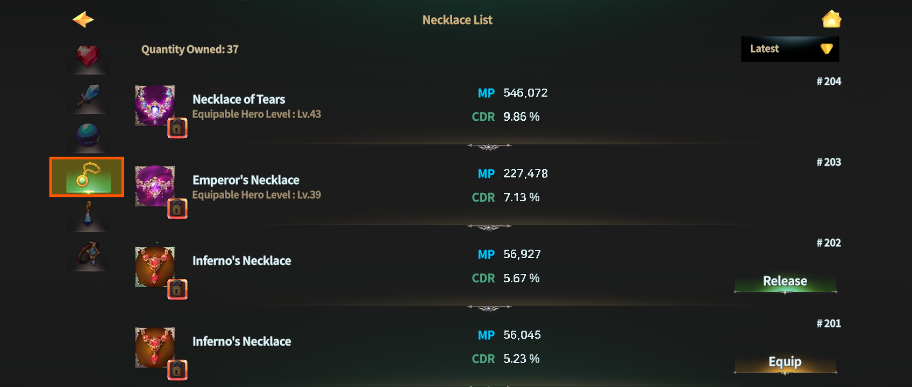
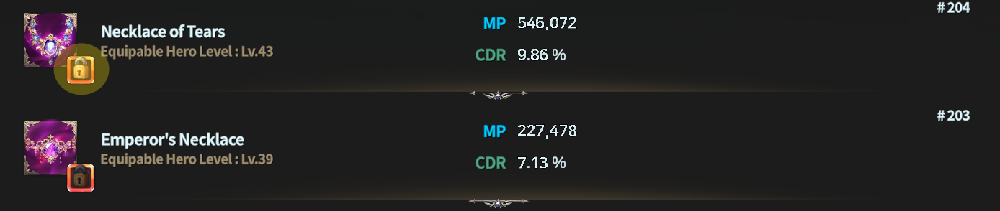
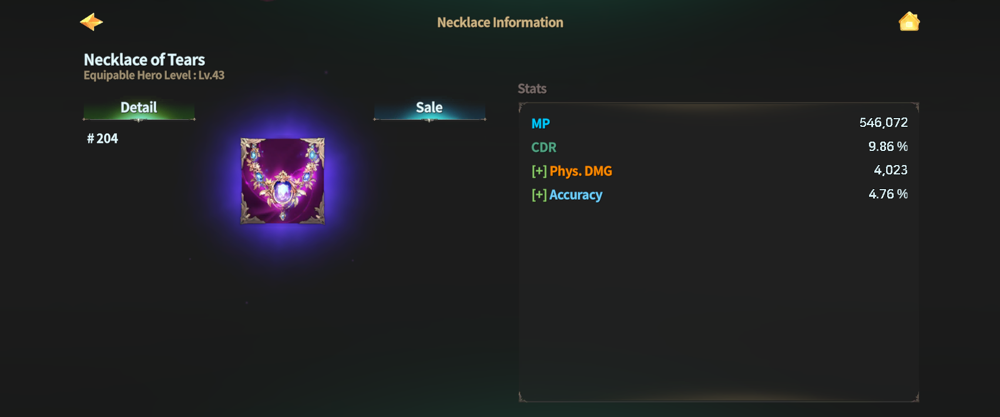

# 📿 Necklace



### 📿 Necklace

Necklaces are accessories that **naturally provide MP and CDR (Reduces skill reload time)**.\
They play a key role in maintaining a stable combat flow\
and increasing how frequently skills can be used.

***

#### ◾ Necklace Stat Guide

💡 Check the **fixed stat option ranges** [**HERE**](necklace.md#necklace-fixed-stat-option-range).\
💡 Check the **randomly looted option ranges** [**HERE**](necklace.md#probabilistic-stat-option-range).


⚠️ Minimum and maximum option values may be adjusted to **percentage-based values**\
depending on balance changes.


***

#### ◾ How to Access the Necklace List

1️⃣ Tap the **Dashboard button** at the top-left of the main screen.

<figure><figcaption></figcaption></figure>

2️⃣ Tap the **Equipment Bag** at the bottom of the Dashboard.

<figure><figcaption></figcaption></figure>

3️⃣ In the **Accessories tab**, select the **Necklace icon** to view your list of owned Necklaces.

<figure><figcaption></figcaption></figure>

***

#### ◾ Using the Necklace List

From the Necklace list, you can perform the following actions:

* Equip and unequip Necklaces
* Sort Necklaces
* View detailed Necklace information

<figure><figcaption></figcaption></figure>

You can sort the list based on your preferred criteria using the **Sort button at the top-right**.

***

#### ◾ Necklace Lock Feature

Important Necklaces can be protected using the **Lock feature**.\
Tap the **lock-shaped icon** in the list to lock a Necklace.

<figure><figcaption></figcaption></figure>

Locked Necklaces have the following properties:

* Always displayed at the **top of the Necklace list**
* Cannot be used as **crafting materials**

***

#### ◾ Necklace Details

Tap a Necklace in the list to open its **detail page**.

<figure><figcaption></figcaption></figure>

From the detail page, you can:

* Check Necklace stats
* [Sell](../../../economy/trade/market/) the Necklace
* (For NFT Necklaces) View related information

***

Necklaces are **key accessories for controlling combat tempo**.\
By building around **MP and CDR**, optimize your setup to match your personal combat style.



### 📿 Necklace (목걸이)

목걸이는 **MP와 스킬 재사용 대기시간 감소(CDR)** 가 기본으로 부여되는 악세서리입니다.\
전투의 흐름을 안정적으로 유지하고, 스킬 활용 빈도를 높이는 데 중요한 역할을 합니다.

***

#### ◾ 목걸이 스탯 안내

💡 [**여기**](necklace.md#necklace-fixed-stat-option-range)에서 **고정 스탯 옵션 범위**를 확인하세요.\
💡 [**여기**](necklace.md#range-of-probabilistically-looted-options)에서 **확률적으로 루팅되는 옵션 범위**를 확인하세요!


⚠️ 옵션의 최소\~최대값은 밸런스 조정에 따라 일부 수치가 **비율 기준**으로 변경될 수 있습니다.


***

#### ◾ 목걸이 목록 접근 방법

1️⃣ 메인 화면 좌측 상단의 **대시보드** 버튼을 터치합니다.

<figure><figcaption></figcaption></figure>

2️⃣ 대시보드 하단의 **장비 가방**을 터치합니다.

<figure><figcaption></figcaption></figure>

3️⃣ 악세서리 탭에서 **목걸이 아이콘**을 선택하면 보유 중인 목걸이 목록을 확인할 수 있습니다.

<figure><figcaption></figcaption></figure>

***

#### ◾ 목걸이 목록 활용

목걸이 목록에서는 다음 작업을 할 수 있습니다.

* 목걸이 장착 및 해제
* 목걸이 정렬
* 목걸이 상세 정보 확인

<figure><figcaption></figcaption></figure>

우측 상단의 정렬 버튼을 통해 원하는 기준으로 목록을 정렬할 수 있습니다.

***

#### ◾ 목걸이 잠금 기능

중요한 목걸이는 **잠금 기능**을 활용해 보호할 수 있습니다.

* 목록에서 **자물쇠 모양 버튼**을 터치하면 해당 목걸이가 **잠금 상태로 설정**됩니다.

<figure><figcaption></figcaption></figure>

잠금된 목걸이는 다음과 같은 특징이 있습니다.

* 목걸이 목록에서 **항상 상단에 표시**됩니다.
* **제작 재료로 사용되지 않습니다.**

***

#### ◾ 목걸이 상세정보

목걸이 목록에서 원하는 장비를 터치하면 **상세 정보 페이지**로 이동합니다.

<figure><figcaption></figcaption></figure>

상세 정보 페이지에서는 다음 작업을 할 수 있습니다.

* 목걸이 스탯 확인
* 목걸이 [판매](../../../economy/trade/market/)
* (NFT 목걸이의 경우) 관련 정보 확인

***

목걸이는 **전투 템포를 조절하는 핵심 악세서리**입니다.\
MP와 CDR을 중심으로 한 스탯 구성을 통해, 자신의 전투 스타일에 맞는 운용을 완성해 보세요.



### 📿 ネックレス（Necklace）

ネックレスは、**MP** と\
**CDR（リロード時間短縮）** が基本で付与されるアクセサリーです。\
戦闘の流れを安定させ、スキルの使用頻度を高めるうえで重要な役割を果たします。

***

#### ◾ ネックレスのステータス案内

💡 固定ステータスオプションの範囲は [**こちら**](necklace.md#necklace-fixed-stat-option-range) から確認できます。\
💡 確率でドロップするオプションの範囲は [**こちら**](necklace.md#probabilistic-stat-option-range) をご確認ください。


⚠️ オプションの最小値～最大値は、\
バランス調整により一部が割合基準に変更される場合があります。


***

#### ◾ ネックレス一覧へのアクセス方法

1️⃣ メイン画面左上の **ダッシュボードボタン** をタップします。

<figure><figcaption></figcaption></figure>

2️⃣ ダッシュボード下部の **装備バッグ** をタップします。

<figure><figcaption></figcaption></figure>

3️⃣ **アクセサリータブ** で **ネックレスアイコン** を選択すると、\
所持中のネックレス一覧を確認できます。

<figure><figcaption></figcaption></figure>

***

#### ◾ ネックレス一覧の活用

ネックレス一覧では、以下の操作が可能です。

* ネックレスの装備・解除
* ネックレスの並び替え
* ネックレス詳細情報の確認

<figure><figcaption></figcaption></figure>

**画面右上** の並び替えボタンを使用すると、お好みの条件で一覧を並び替えることができます。

***

#### ◾ ネックレスのロック機能

重要なネックレスは、**ロック機能** を使って保護できます。\
一覧で **鍵アイコン** をタップすると、該当ネックレスはロック状態になります。

<figure><figcaption></figcaption></figure>

ロックされたネックレスの特徴：

* ネックレス一覧の **最上部に固定表示** されます
* **制作素材として使用されません**

***

#### ◾ ネックレス詳細情報

ネックレス一覧から装備をタップすると、**詳細情報ページ** に移動します。

<figure><figcaption></figcaption></figure>

詳細情報ページでは、以下の操作が可能です。

* ネックレスのステータス確認
* ネックレスの[販売](../../../economy/trade/market/)
* （NFTネックレスの場合）関連情報の確認

***

ネックレスは、**戦闘テンポを左右する重要なアクセサリー**です。\
MPと **CDR（リロード時間短縮）** を軸にした構成で、\
自分の戦闘スタイルに合った運用を完成させてみてください。



<em>※ This guide was written based on the game status as of January 5, 2026,</em>  <em>and its contents may change with future updates.</em>

#### 💡Necklace Fixed Stat Option Range

<table data-header-hidden data-full-width="true"><thead><tr><th></th><th width="116.181884765625"></th><th></th><th></th><th></th><th></th></tr></thead><tbody><tr><td><strong>Necklace</strong></td><td><strong>Equip Lv.</strong></td><td><strong>Min MP</strong></td><td><strong>Max MP</strong></td><td><strong>Min CDR</strong></td><td><strong>Max CDR</strong></td></tr><tr><td>Crystal Necklace</td><td>3</td><td>550</td><td>600</td><td>0.5</td><td>0.8</td></tr><tr><td>Adventurer's Necklace</td><td>8</td><td>1,100</td><td>1,280</td><td>0.9</td><td>1.2</td></tr><tr><td>Mage's Necklace</td><td>12</td><td>2,300</td><td>2,740</td><td>1.4</td><td>2</td></tr><tr><td>Elf's Necklace</td><td>17</td><td>4,800</td><td>5,860</td><td>2.2</td><td>2.8</td></tr><tr><td>Spirit's Necklace</td><td>23</td><td>10,500</td><td>12,540</td><td>3</td><td>3.8</td></tr><tr><td>Salamander's Necklace</td><td>27</td><td>21,500</td><td>26,840</td><td>4</td><td>4.8</td></tr><tr><td>Inferno's Necklace</td><td>31</td><td>48,000</td><td>57,440</td><td>5</td><td>5.8</td></tr><tr><td>Mermaid's Necklace</td><td>35</td><td>100,000</td><td>122,920</td><td>6</td><td>6.8</td></tr><tr><td>Emperor's Necklace</td><td>39</td><td>220,000</td><td>263,040</td><td>7</td><td>8</td></tr><tr><td>Necklace of Tears</td><td>43</td><td>480,000</td><td>562,900</td><td>8.2</td><td>10.8</td></tr><tr><td>Star Necklace</td><td>47</td><td>1,000,000</td><td>1,204,600</td><td>11</td><td>12.8</td></tr><tr><td>Butterfly Necklace</td><td>53</td><td>2,100,000</td><td>2,577,840</td><td>13</td><td>13.8</td></tr></tbody></table>

#### 💡Probabilistic Stat Option Range

📢 The table is long, so use the scrollbar below to scroll left and right to view the full table!

<table data-header-hidden data-full-width="true"><thead><tr><th></th><th></th><th></th><th></th><th></th><th></th><th></th><th></th><th></th><th></th><th></th><th></th><th></th><th></th><th></th><th></th><th></th><th></th><th></th><th></th><th></th><th></th><th></th><th></th><th></th><th></th><th></th><th></th><th></th><th width="128"></th><th></th><th></th><th></th><th></th><th></th><th></th><th></th><th></th><th></th><th></th><th></th><th></th><th></th></tr></thead><tbody><tr><td><strong>Necklace</strong></td><td><strong>STR prob</strong></td><td><strong>Min STR</strong></td><td><strong>Max STR</strong></td><td><strong>DEX prob</strong></td><td><strong>Min DEX</strong></td><td><strong>Max DEX</strong></td><td><strong>INT prob</strong></td><td><strong>Min INT</strong></td><td><strong>Max INT</strong></td><td><strong>CON prob</strong></td><td><strong>Min CON</strong></td><td><strong>Max CON</strong></td><td><strong>WIZ prob</strong></td><td><strong>Min WIZ</strong></td><td><strong>Max WIZ</strong></td><td><strong>CHA prob</strong></td><td><strong>Min CHA</strong></td><td><strong>Max CHA</strong></td><td><strong>Phys. DMG prob</strong></td><td><strong>Min Phys. DMG</strong></td><td><strong>Max Phys. DMG</strong></td><td><strong>HP prob</strong></td><td><strong>Min HP</strong></td><td><strong>Max HP</strong></td><td><strong>MP prob</strong></td><td><strong>Min MP</strong></td><td><strong>Max MP</strong></td><td>Phys. Crit DMG <strong>prob</strong></td><td><strong>Min Phys. Crit DMG</strong></td><td><strong>Max Phys. Crit DMG</strong></td><td><strong>Phys. Crit % prob</strong></td><td><strong>Min Phys. Crit %</strong></td><td><strong>Max Phys. Crit %</strong></td><td><strong>Mag. DMG prob</strong></td><td><strong>Min Mag. DMG</strong></td><td><strong>Max Mag. DMG</strong></td><td><strong>Mag. Crit DMG prob</strong></td><td><strong>Min Mag. Crit DMG</strong></td><td><strong>Max Mag. Crit DMG</strong></td><td><strong>Mag. Crit % prob</strong></td><td><strong>Min Mag. Crit %</strong></td><td><strong>Max Mag. Crit %</strong></td></tr><tr><td>Crystal Necklace</td><td>0.5</td><td>1</td><td>1</td><td>0.5</td><td>1</td><td>1</td><td>0.5</td><td>1</td><td>1</td><td>0.5</td><td>1</td><td>1</td><td>0.5</td><td>1</td><td>1</td><td>0.5</td><td>1</td><td>1</td><td>8</td><td>3</td><td>9</td><td>8</td><td>23</td><td>68</td><td>8</td><td>23</td><td>68</td><td>8</td><td>3</td><td>9</td><td>5</td><td>0.1</td><td>0.3</td><td>8</td><td>3</td><td>9</td><td>8</td><td>3</td><td>9</td><td>5</td><td>0.1</td><td>0.3</td></tr><tr><td>Adventurer's Necklace</td><td>0.5</td><td>1</td><td>1</td><td>0.5</td><td>1</td><td>1</td><td>0.5</td><td>1</td><td>1</td><td>0.5</td><td>1</td><td>1</td><td>0.5</td><td>1</td><td>1</td><td>0.5</td><td>1</td><td>1</td><td>8</td><td>6</td><td>19</td><td>8</td><td>48</td><td>144</td><td>8</td><td>48</td><td>144</td><td>8</td><td>6</td><td>19</td><td>5</td><td>0.1</td><td>0.4</td><td>8</td><td>6</td><td>19</td><td>8</td><td>6</td><td>19</td><td>5</td><td>0.1</td><td>0.4</td></tr><tr><td>Mage's Necklace</td><td>0.5</td><td>1</td><td>1</td><td>0.5</td><td>1</td><td>1</td><td>0.5</td><td>1</td><td>1</td><td>0.5</td><td>1</td><td>1</td><td>0.5</td><td>1</td><td>1</td><td>0.5</td><td>1</td><td>1</td><td>8</td><td>14</td><td>41</td><td>8</td><td>103</td><td>308</td><td>8</td><td>103</td><td>308</td><td>8</td><td>14</td><td>41</td><td>5</td><td>0.1</td><td>0.5</td><td>8</td><td>14</td><td>41</td><td>8</td><td>14</td><td>41</td><td>5</td><td>0.1</td><td>0.5</td></tr><tr><td>Elf's Necklace</td><td>0.5</td><td>1</td><td>1</td><td>0.5</td><td>1</td><td>1</td><td>0.5</td><td>1</td><td>1</td><td>0.5</td><td>1</td><td>1</td><td>0.5</td><td>1</td><td>1</td><td>0.5</td><td>1</td><td>1</td><td>8</td><td>29</td><td>88</td><td>8</td><td>220</td><td>659</td><td>8</td><td>220</td><td>659</td><td>8</td><td>29</td><td>88</td><td>5</td><td>0.1</td><td>0.6</td><td>8</td><td>29</td><td>88</td><td>8</td><td>29</td><td>88</td><td>5</td><td>0.1</td><td>0.6</td></tr><tr><td>Spirit's Necklace</td><td>1</td><td>1</td><td>2</td><td>1</td><td>1</td><td>2</td><td>1</td><td>1</td><td>2</td><td>1</td><td>1</td><td>2</td><td>1</td><td>1</td><td>2</td><td>1</td><td>1</td><td>2</td><td>8</td><td>63</td><td>188</td><td>8</td><td>470</td><td>1,411</td><td>8</td><td>470</td><td>1411</td><td>8</td><td>63</td><td>188</td><td>5</td><td>0.1</td><td>0.7</td><td>8</td><td>63</td><td>188</td><td>8</td><td>63</td><td>188</td><td>5</td><td>0.1</td><td>0.7</td></tr><tr><td>Salamander's Necklace</td><td>1</td><td>1</td><td>2</td><td>1</td><td>1</td><td>2</td><td>1</td><td>1</td><td>2</td><td>1</td><td>1</td><td>2</td><td>1</td><td>1</td><td>2</td><td>1</td><td>1</td><td>2</td><td>8</td><td>134</td><td>403</td><td>8</td><td>1,007</td><td>3,020</td><td>8</td><td>1,007</td><td>3,020</td><td>8</td><td>134</td><td>403</td><td>5</td><td>0.1</td><td>0.8</td><td>8</td><td>134</td><td>403</td><td>8</td><td>134</td><td>403</td><td>5</td><td>0.1</td><td>0.8</td></tr><tr><td>Inferno's Necklace</td><td>1</td><td>1</td><td>2</td><td>1</td><td>1</td><td>2</td><td>1</td><td>1</td><td>2</td><td>1</td><td>1</td><td>2</td><td>1</td><td>1</td><td>2</td><td>1</td><td>1</td><td>2</td><td>8</td><td>287</td><td>862</td><td>8</td><td>2,154</td><td>6,462</td><td>8</td><td>2,154</td><td>6,462</td><td>8</td><td>287</td><td>862</td><td>5</td><td>0.1</td><td>0.9</td><td>8</td><td>287</td><td>862</td><td>8</td><td>287</td><td>862</td><td>5</td><td>0.1</td><td>0.9</td></tr><tr><td>Mermaid's Necklace</td><td>1</td><td>1</td><td>2</td><td>1</td><td>1</td><td>2</td><td>1</td><td>1</td><td>2</td><td>1</td><td>1</td><td>2</td><td>1</td><td>1</td><td>2</td><td>1</td><td>1</td><td>2</td><td>8</td><td>615</td><td>1,844</td><td>8</td><td>4,610</td><td>13,829</td><td>8</td><td>4,610</td><td>13,829</td><td>8</td><td>615</td><td>1,844</td><td>5</td><td>0.1</td><td>1</td><td>8</td><td>615</td><td>1,844</td><td>8</td><td>615</td><td>1,844</td><td>5</td><td>0.1</td><td>1</td></tr><tr><td>Emperor's Necklace</td><td>1.5</td><td>1</td><td>3</td><td>1.5</td><td>1</td><td>3</td><td>1.5</td><td>1</td><td>3</td><td>1.5</td><td>1</td><td>3</td><td>1.5</td><td>1</td><td>3</td><td>1.5</td><td>1</td><td>3</td><td>8</td><td>1,315</td><td>3,946</td><td>8</td><td>9,864</td><td>29,592</td><td>8</td><td>9,864</td><td>29,592</td><td>8</td><td>1,315</td><td>3,946</td><td>5</td><td>0.1</td><td>1.1</td><td>8</td><td>1,315</td><td>3,946</td><td>8</td><td>1,315</td><td>3,946</td><td>5</td><td>0.1</td><td>1.1</td></tr><tr><td>Necklace of Tears</td><td>1.5</td><td>1</td><td>3</td><td>1.5</td><td>1</td><td>3</td><td>1.5</td><td>1</td><td>3</td><td>1.5</td><td>1</td><td>3</td><td>1.5</td><td>1</td><td>3</td><td>1.5</td><td>1</td><td>3</td><td>8</td><td>2,815</td><td>8,444</td><td>8</td><td>21,109</td><td>63,326</td><td>8</td><td>21,109</td><td>63,326</td><td>8</td><td>2,815</td><td>8,444</td><td>5</td><td>0.1</td><td>1.2</td><td>8</td><td>2,815</td><td>8,444</td><td>8</td><td>2,815</td><td>8,444</td><td>5</td><td>0.1</td><td>1.2</td></tr><tr><td>Star Necklace</td><td>1.5</td><td>1</td><td>3</td><td>1.5</td><td>1</td><td>3</td><td>1.5</td><td>1</td><td>3</td><td>1.5</td><td>1</td><td>3</td><td>1.5</td><td>1</td><td>3</td><td>1.5</td><td>1</td><td>3</td><td>8</td><td>6,023</td><td>18,069</td><td>8</td><td>45,173</td><td>135,518</td><td>8</td><td>45,173</td><td>135,518</td><td>8</td><td>6,023</td><td>18,069</td><td>5</td><td>0.4</td><td>1.3</td><td>8</td><td>6,023</td><td>18,069</td><td>8</td><td>6,023</td><td>18,069</td><td>5</td><td>0.4</td><td>1.3</td></tr></tbody></table>

