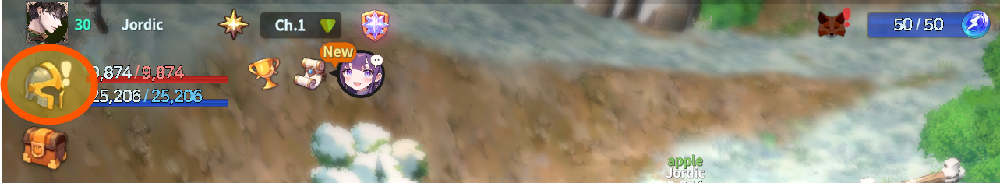
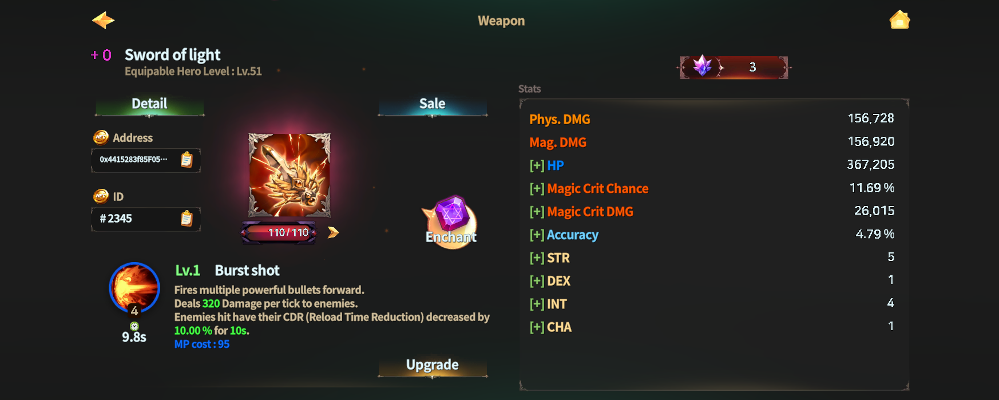

# ⚔️ Weapon



### ⚔️ Weapon&#x20;

Weapons are the core equipment that determine your character’s attack power and combat style.\
Each weapon has unique stats and a weapon skill, and your combat flow changes depending on the weapon you equip.

Every weapon is assigned **one weapon skill**.\
Combine weapon skills with hero skills to build your own optimal skill setup.

***

#### ◾Before Using Weapons

To equip a weapon, you must meet the **hero level requirement**.\
You can use **Enchant** to create stronger weapons,\
but weapons may be destroyed during the enchant process.

Weapons are connected to various systems such as growth, enhancement, and trading.

***

#### ◾How to Check Weapons

You can check your weapons in the following order:

1️⃣ Tap the **helmet icon** at the top-left of the main screen to open the Dashboard.

<figure><figcaption></figcaption></figure>

2️⃣ In the center of the Dashboard, \
you can see a **summary panel** of the currently equipped weapon.

<figure><figcaption></figcaption></figure>

3️⃣ Tap the weapon image to view detailed information about the equipped weapon.

<figure><figcaption></figcaption></figure>

4️⃣ Tap the **Equipment Bag** at the bottom of the screen to view your weapon list.

<figure><figcaption></figcaption></figure>

5️⃣ Tap a **slot** in the weapon list to open the weapon’s detail panel.

<figure><figcaption></figcaption></figure>

* On this screen, you can equip or unequip weapons.
* You can also sort weapons using the sort button at the top-right.

6️⃣ In the weapon detail panel, you can access Enchant, check stats, sell the weapon, and view information for NFT registration.

<figure><figcaption></figcaption></figure>


#### Don’t miss the Weapon Lock Feature!

Tap the **lock-shaped icon** in the weapon list to lock a weapon.\
Locked weapons have the following characteristics:

* Always displayed at the top of the weapon list
* Cannot be enchanted
* Cannot be used as crafting materials


<figure><figcaption></figcaption></figure>

***

#### ◾ Weapon Detail Information

<figure><figcaption></figcaption></figure>

Tap **Detail** on the weapon information screen to view the weapon’s record information.

* **Production Date**: The date the weapon was created
* **Owner**: The current owner of the weapon
* **Kill Record**: Records of enemies defeated with this weapon
  * Kill Monster
  * Kill Field Boss
  * Kill Player
* **Sale History**: Weapon sales history

※ _Displayed information may vary depending on the weapon’s status (such as NFT registration)._

> **For more weapon-related features, please refer to the sections below.**

<table data-view="cards"><thead><tr><th align="center"></th><th></th><th></th><th data-hidden data-card-cover data-type="image">Cover image</th><th data-hidden data-card-target data-type="content-ref"></th></tr></thead><tbody><tr><td align="center">💡<strong>Weapon Stats</strong></td><td>Check the stat information applied to the weapon!</td><td></td><td data-object-fit="fill"><a href="../../../.gitbook/assets/dash8.png">dash8.png</a></td><td><a href="weapon-stats.md">weapon-stats.md</a></td></tr><tr><td align="center">💡<strong>Weapon Skills</strong> </td><td>Check the skill information of the weapon!</td><td></td><td data-object-fit="contain"><a href="../../../.gitbook/assets/dash7.png">dash7.png</a></td><td><a href="weapon-skill-info/">weapon-skill-info</a></td></tr><tr><td align="center">💡 <strong>Weapon Sale</strong></td><td>Want to sell your weapon?</td><td></td><td><a href="../../../.gitbook/assets/dash12.png">dash12.png</a></td><td><a href="../../../economy/trade/market/">market</a></td></tr><tr><td align="center">💡<strong>Weapon NFT Information</strong></td><td>Use this information if your weapon is an NFT!</td><td></td><td data-object-fit="contain"><a href="../../../.gitbook/assets/dash9.png">dash9.png</a></td><td><a href="../../../economy/trade/market/trading-nfts/register-nft-to-wallet.md">register-nft-to-wallet.md</a></td></tr><tr><td align="center">💡<strong>Weapon Enchant</strong></td><td>Make your weapon even stronger!</td><td></td><td><a href="../../../.gitbook/assets/dash10.png">dash10.png</a></td><td><a href="../../enchantment/">enchantment</a></td></tr><tr><td align="center">💡<strong>Weapon Detail Information</strong> </td><td>Check your weapon’s record!</td><td></td><td><a href="../../../.gitbook/assets/dash11.png">dash11.png</a></td><td><a href="./#weapon-detail-information">#weapon-detail-information</a></td></tr></tbody></table>



### ⚔️ Weapon (무기)

무기는 캐릭터의 공격력과 전투 방식을 결정하는 핵심 장비입니다.\
무기마다 고유한 스탯과 스킬이 존재하며,\
장착한 무기에 따라 전투 흐름이 크게 달라집니다.

모든 무기에는 **1종의 무기 스킬**이 부여됩니다.\
영웅 스킬과 조합하여 자신만의 스킬 구성을 만들 수 있습니다.

***

#### ◾무기 이용 전 알아두세요

* 무기를 장착하려면 **영웅 레벨 조건**을 만족해야 합니다.
* 더 강한 무기를 만들기 위해 **인챈트**를 진행할 수 있으며,\
  **인챈트 과정에서 무기가 파괴될 수 있습니다.**
* 무기는 성장과 강화, 거래 등 다양한 시스템과 연결되어 있습니다.

***

#### ◾무기 확인 방법

무기는 다음 순서로 확인할 수 있습니다.

1️⃣ 메인 화면 좌측 상단의 **투구 아이콘**을 터치하여 대시보드에 진입합니다.

<figure><figcaption></figcaption></figure>

2️⃣ 대시보드 중앙에서 현재 **장착 중인 무기의 축약 정보 패널**을 확인할 수 있습니다.

<figure><figcaption></figcaption></figure>

3️⃣ 무기 이미지를 터치하면 장착 중인 무기의 상세 정보를 확인할 수 있습니다.

<figure><figcaption></figcaption></figure>

4️⃣ 화면 하단의 **장비 가방**을 터치하면 보유 중인 무기 목록을 확인할 수 있습니다.

<figure><figcaption></figcaption></figure>

5️⃣ 무기 목록에서 **슬롯을 터치**하면 해당 무기의 상세 정보 패널로 이동합니다.

<figure><figcaption></figcaption></figure>

* 이 화면에서 무기를 장착하거나 해제할 수 있습니다.
* 우측 상단의 정렬 버튼을 통해 무기를 정렬할 수 있습니다.

6️⃣ 무기 상세 정보 패널에서는 인챈트, 스탯 확인, 판매, NFT 등록에 필요한 정보를 확인할 수 있습니다.

<figure><figcaption></figcaption></figure>


#### **잠깐! 슬롯 잠금 기능을 놓치지 마세요!**

무기 목록에서 **자물쇠 모양 버튼**을 터치하면 해당 무기는 잠금 상태로 설정됩니다.\
잠금된 무기는 다음과 같은 특징이 있습니다.

* 무기 목록에서 **항상 상단에 표시**됩니다.
* **인챈트가 불가능**합니다.
* 제작 재료로 사용되지 않습니다.


<figure><figcaption></figcaption></figure>

***

#### ◾ 무기 상세정보

<figure><figcaption></figcaption></figure>

무기 정보 화면에서 **상세정보**를 누르면 해당 무기의 기록 정보를 확인할 수 있습니다.

* **Production Date**: 무기가 제작된 날짜
* **Owner**: 현재 무기의 소유자
* **Kill Record**: 해당 무기로 처치한 기록
  * 처치한 몬스터
  * 처치한 필드 보스
  * 처치한 유저
* **Sale History**: 무기의 판매 기록

_※ 표시되는 항목은 무기의 상태(NFT 여부 등)에 따라 달라질 수 있습니다._

> **무기와 관련된 상세 기능은 아래 항목을 참고해 주세요.**

<table data-view="cards"><thead><tr><th></th><th></th><th></th><th data-hidden data-card-cover data-type="image">Cover image</th><th data-hidden data-card-target data-type="content-ref"></th></tr></thead><tbody><tr><td>💡<strong>무기 스탯</strong></td><td>무기에 부여되는 스탯 정보를 확인하세요!</td><td></td><td data-object-fit="fill"><a href="../../../.gitbook/assets/dash8.png">dash8.png</a></td><td><a href="weapon-stats.md">weapon-stats.md</a></td></tr><tr><td>💡<strong>무기 스킬</strong></td><td>무기가 가진 스킬 정보를 확인하세요!</td><td></td><td data-object-fit="contain"><a href="../../../.gitbook/assets/dash7.png">dash7.png</a></td><td><a href="weapon-skill-info/">weapon-skill-info</a></td></tr><tr><td>💡<strong>무기 판매</strong></td><td>무기를 판매하고 싶으신가요?</td><td></td><td><a href="../../../.gitbook/assets/dash12.png">dash12.png</a></td><td><a href="../../../economy/trade/market/">market</a></td></tr><tr><td>💡<strong>무기의 NFT 정보</strong></td><td>무기가 NFT인 경우 이 정보를 활용하세요!</td><td></td><td data-object-fit="contain"><a href="../../../.gitbook/assets/dash9.png">dash9.png</a></td><td><a href="../../../economy/trade/market/trading-nfts/register-nft-to-wallet.md">register-nft-to-wallet.md</a></td></tr><tr><td>💡<strong>무기 인챈트</strong></td><td>무기를 더욱 강하게 만들어보세요!</td><td></td><td><a href="../../../.gitbook/assets/dash10.png">dash10.png</a></td><td><a href="../../enchantment/">enchantment</a></td></tr><tr><td>💡<strong>무기 상세 정보</strong></td><td>내 무기의 기록을 확인하세요!</td><td></td><td><a href="../../../.gitbook/assets/dash11.png">dash11.png</a></td><td><a href="./#undefined-6">#undefined-6</a></td></tr></tbody></table>



### ⚔️ Weapon（武器）

武器はキャラクターの攻撃力や戦闘スタイルを決定する、重要な装備です。\
武器ごとに固有のステータスやスキルが存在し、\
装備する武器によって戦闘の流れが大きく変わります。

すべての武器には**1種類の武器スキル**が付与されます。\
英雄スキルと組み合わせて、自分だけのスキル構成を作ることができます。

***

#### ◾武器利用前の注意事項

武器を装備するには、**英雄レベル条件**を満たす必要があります。\
より強力な武器を作るために**エンチャント**を行うことができますが、\
エンチャント中に武器が破壊される場合があります。

武器は成長、強化、取引など、さまざまなシステムと連動しています。

***

#### ◾武器の確認方法

武器は以下の手順で確認できます。

1️⃣ メイン画面左上の**ヘルメットアイコン**をタップして、ダッシュボードに移動します。

<figure><figcaption></figcaption></figure>

2️⃣ ダッシュボード中央で、現在装備中の武器の**簡易情報パネル**を確認できます。

<figure><figcaption></figcaption></figure>

3️⃣ 武器の画像をタップすると、装備中の武器の詳細情報を確認できます。

<figure><figcaption></figcaption></figure>

4️⃣ 画面下部の**装備バッグ**をタップすると、所持中の武器一覧を確認できます。

<figure><figcaption></figcaption></figure>

5️⃣ 武器一覧で**スロットをタップ**すると、該当武器の詳細情報パネルに移動します。

<figure><figcaption></figcaption></figure>

* この画面で武器の装備・解除が可能です。
* 右上の並び替えボタンで武器を整理できます。

6️⃣ 武器の詳細情報パネルでは、\
エンチャント、ステータス確認、販売、NFT登録に必要な情報を確認できます。

<figure><figcaption></figcaption></figure>


#### 武器一覧で**鍵マークのボタン**をタップすると、武器がロック状態になります。

ロックされた武器には、以下の特徴があります。

* 武器一覧の最上段に表示されます
* エンチャントができなくなります
* 製作素材として使用されません


<figure><figcaption></figcaption></figure>

***

#### ◾ 武器詳細情報

<figure><figcaption></figcaption></figure>

武器情報画面で**詳細情報（Detail）**&#x3092;タップすると、その武器の記録情報を確認できます。

* **Production Date**：武器が製作された日時
* **Owner**：現在の武器の所有者
* **Kill Record**：その武器で討伐した記録
  * Kill Monster
  * Kill Field Boss
  * Kill Player
* **Sale History**：武器の販売履歴

※ _表示される項目は、武器の状態（NFT登録の有無など）により異なる場合があります。_

> **武器に関する詳細な機能は、以下の項目をご確認ください。**

<table data-view="cards"><thead><tr><th align="center"></th><th></th><th></th><th data-hidden data-card-cover data-type="image">Cover image</th><th data-hidden data-card-target data-type="content-ref"></th></tr></thead><tbody><tr><td align="center">💡<strong>武器ステータス</strong></td><td>武器に付与されているステータス情報を確認しましょう！</td><td></td><td data-object-fit="fill"><a href="../../../.gitbook/assets/dash8.png">dash8.png</a></td><td><a href="weapon-stats.md">weapon-stats.md</a></td></tr><tr><td align="center">💡<strong>武器スキル</strong> </td><td>武器が持つスキル情報を確認しましょう！</td><td></td><td data-object-fit="contain"><a href="../../../.gitbook/assets/dash7.png">dash7.png</a></td><td><a href="weapon-skill-info/">weapon-skill-info</a></td></tr><tr><td align="center">💡<strong>武器販売</strong></td><td>武器を販売したいですか？</td><td></td><td><a href="../../../.gitbook/assets/dash12.png">dash12.png</a></td><td><a href="../../../economy/trade/market/">market</a></td></tr><tr><td align="center">💡<strong>武器のNFT情報</strong></td><td>武器がNFTの場合、この情報を活用しましょう！</td><td></td><td data-object-fit="contain"><a href="../../../.gitbook/assets/dash9.png">dash9.png</a></td><td><a href="../../../economy/trade/market/trading-nfts/register-nft-to-wallet.md">register-nft-to-wallet.md</a></td></tr><tr><td align="center">💡<strong>武器エンチャント</strong></td><td>武器をさらに強化しましょう！</td><td></td><td><a href="../../../.gitbook/assets/dash10.png">dash10.png</a></td><td><a href="../../enchantment/">enchantment</a></td></tr><tr><td align="center">💡<strong>武器詳細情報</strong> </td><td>自分の武器の記録を確認しましょう！</td><td></td><td><a href="../../../.gitbook/assets/dash11.png">dash11.png</a></td><td><a href="./#wu-qi-xiang-xi-qing-bao">#wu-qi-xiang-xi-qing-bao</a></td></tr></tbody></table>



<em>※ This guide was written based on the game status as of December 31, 2025,</em>  <em>and its contents may change with future updates.</em>

