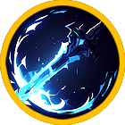
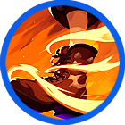
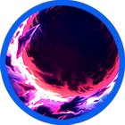
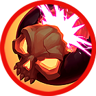
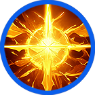
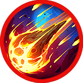
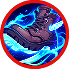

# 🔥 Skill pool - Weapon


[skill-probability-table.md](skill-probability-table.md)


<table data-full-width="true"><thead><tr><th width="181" align="center">Skill</th><th width="135" align="center">Icon</th><th width="103">Type</th><th width="613">contents</th></tr></thead><tbody><tr><td align="center">Point attack</td><td align="center"></td><td>Melee</td><td>
<strong>EN</strong> Aims for a vital spot, dealing damage to the enemy.

<strong>KR</strong> 급소를 노려 일격을 날려 적에게 피해를 입힙니다.

<strong>JP</strong> 急所を狙って一撃を放ち、敵にダメージを与えます。
</td></tr><tr><td align="center">Needle shot</td><td align="center"></td><td>Melee</td><td>
<strong>EN</strong> Quickly thrusts at the enemy, dealing damage four times.

<strong>KR</strong> 빠르게 적을 찔러 피해를 4회 입힙니다.

<strong>JP</strong> 素早く敵を突き、4回ダメージを与えます。
</td></tr><tr><td align="center">Mana blade</td><td align="center"></td><td>Melee</td><td>
<strong>EN</strong> Strikes the enemy with mana, dealing damage three times. Enemies hit will use more MP when casting skills.

<strong>KR</strong> 마나의 힘으로 적을 공격해 피해를 3회 입힙니다. 공격에 맞은 적은 스킬 사용 시 MP 소모량이 증가합니다.

<strong>JP</strong> マナの力で敵を攻撃し、3回ダメージを与えます。 攻撃を受けた敵は、スキル使用時のMP消費量が増加します。
</td></tr><tr><td align="center">Half moon</td><td align="center"></td><td>Melee</td><td>
<strong>EN</strong> Delivers a crescent-shaped sword strike, dealing damage three times. The remaining power of the moon restores MP.

<strong>KR</strong> 반달 모양의 검격으로 적을 공격해 피해를 3회 입힙니다. 남아 있는 달의 힘으로 MP를 회복합니다.

<strong>JP</strong> 半月型の剣撃で敵を攻撃し、3回ダメージを与えます。 残された月の力によってMPが回復します。
</td></tr><tr><td align="center">Sword Master</td><td align="center"></td><td>Melee</td><td>
<strong>EN</strong> Unleashes a powerful sword strike, dealing damage three times and stunning the enemy.

<strong>KR</strong> 강력한 검격을 날려 적에게 피해를 3회 입히고, 스턴 상태로 만듭니다.

<strong>JP</strong> 強力な剣撃を放ち、敵に3回ダメージを与え、スタン状態にします。
</td></tr><tr><td align="center">Star shot</td><td align="center"></td><td>Projectile</td><td>
<strong>EN</strong> Fires magical stars forward, dealing damage to the enemy.

<strong>KR</strong> 별의 마법을 전방으로 발사해 적에게 피해를 입힙니다.

<strong>JP</strong> 星の魔法を前方に発射し、敵にダメージを与えます。
</td></tr><tr><td align="center">Canon Rush</td><td align="center"></td><td>Projectile</td><td>
<strong>EN</strong> Charges forward, dealing damage and knocking back enemies within range.

<strong>KR</strong> 전방으로 돌진해 범위 내 적에게 피해를 입히고 넉백시킵니다.

<strong>JP</strong> 前方に突進し、範囲内の敵にダメージを与え、ノックバックさせます。
</td></tr><tr><td align="center">Dracula</td><td align="center"></td><td>Projectile</td><td>
<strong>EN</strong> Fires a blood-draining orb forward, dealing damage. You recover HP, and enemies hit lose HP.

<strong>KR</strong> 전방으로 흡혈 구체를 발사해 적에게 피해를 입힙니다. 공격 시 자신의 HP가 회복되며, 맞은 적의 HP는 감소합니다.

<strong>JP</strong> 吸血の球を前方に放ち、敵にダメージを与えます。 攻撃時に自身のHPが回復し、命中した敵のHPは減少します。
</td></tr><tr><td align="center">Burst shot</td><td align="center"></td><td>Projectile</td><td>
<strong>EN</strong> Fires multiple powerful projectiles forward, dealing damage to enemies.

<strong>KR</strong> 전방으로 강력한 탄환을 여러 발 발사해 적에게 피해를 입힙니다.

<strong>JP</strong> 強力な弾丸を前方に複数発射し、敵にダメージを与えます。
</td></tr><tr><td align="center">Extocium</td><td align="center"></td><td>Projectile</td><td>
<strong>EN</strong> Unleashes the power of Extosium, firing a wide-area mana ball forward. It deals damage and stuns enemies hit.

<strong>KR</strong> 엑스토시움의 힘을 개방해 전방으로 <strong>광범위한 마나볼</strong>을 발사합니다. 마나볼에 맞은 적은 피해를 입고 스턴 상태가 됩니다.

<strong>JP</strong> エクストシウムの力を解放し、前方に<strong>広範囲のマナボール</strong>を発射します。 命中した敵にダメージを与え、スタン状態にします。
</td></tr><tr><td align="center">Berserker</td><td align="center"></td><td>Buff</td><td>
<strong>EN</strong> Enters a berserk state, increasing all critical hit rates and critical damage bonuses. MP decreases every second while the skill is active.

<strong>KR</strong> 광전사 상태가 되어 모든 치명타 확률과 치명타 피해 보너스가 증가합니다. 스킬이 유지되는 동안 MP가 초당 감소합니다.

<strong>JP</strong> バーサーカー状態になり、すべてのクリティカル確率とクリティカルダメージボーナスが増加します。スキル発動中は毎秒MPが減少します。
</td></tr><tr><td align="center">Immortal</td><td align="center"></td><td>Buff</td><td>
<strong>EN</strong> Creates a shield that blocks incoming damage. MP decreases every second while the skill is active.

<strong>KR</strong> 불사의 힘으로 받는 피해를 막아주는 실드를 생성합니다. 스킬이 유지되는 동안 MP가 초당 감소합니다.

<strong>JP</strong> 不死の力で受けるダメージを防ぐシールドを生成します。 スキル発動中は毎秒MPが減少します。
</td></tr><tr><td align="center">Psycho</td><td align="center"></td><td>AoE</td><td>
<strong>EN</strong> Repeatedly fires bombs around you, dealing damage to enemies within range. <strong>KR</strong> 자신의 주변으로 폭탄을 마구마구 발사해 범위 내 적들에게 피해를 입힙니다.

<strong>JP</strong> 自分の周囲に爆弾を次々と発射し、範囲内の敵にダメージを与えます。
</td></tr><tr><td align="center">Three little pigs</td><td align="center"></td><td>Summon</td><td>
<strong>EN</strong> Summons three little pigs. The pigs attack nearby enemies. MP decreases every second while the skill is active.

<strong>KR</strong> 아기돼지 3마리를 소환합니다. 아기돼지들은 주변의 적을 공격합니다. 스킬이 유지되는 동안 MP가 초당 감소합니다.

<strong>JP</strong> 子豚を3匹召喚します。子豚たちは周囲の敵を攻撃します。 スキル発動中は毎秒MPが減少します。
</td></tr><tr><td align="center">Ghost</td><td align="center"></td><td>Summon</td><td>
<strong>EN</strong> Summons a ghost. The ghost attacks nearby enemies. MP decreases every second while the skill is active.

<strong>KR</strong> 고스트를 소환합니다. 고스트는 주변의 적을 공격합니다. 스킬이 유지되는 동안 MP가 초당 감소합니다.

<strong>JP</strong> ゴーストを召喚します。ゴーストは周囲の敵を攻撃します。 スキル発動中は毎秒MPが減少します。
</td></tr><tr><td align="center">Spirit's Call</td><td align="center"></td><td>Summon</td><td>
<strong>EN</strong> Summons a giant ent. The giant ent fires multiple magic projectiles, dealing damage per tick. MP decreases every second while the skill is active.

<strong>KR</strong> 자이언트 엔트를 소환합니다. 자이언트 엔트는 마법 구체를 여러 개 발사해 틱당 피해를 입힙니다. 스킬이 유지되는 동안 MP가 초당 감소합니다.

<strong>JP</strong> ジャイアントエントを召喚します。 ジャイアントエントは魔法弾を複数発射し、ティックごとにダメージを与えます。 スキル発動中は毎秒MPが減少します。
</td></tr><tr><td align="center">Devil's Call</td><td align="center"></td><td>Summon</td><td>
<strong>EN</strong> Summons a demonized lizardman. The demonized lizardman attacks nearby enemies. MP decreases every second while the skill is active.

<strong>KR</strong> 악마화된 리자드맨을 소환합니다. 소환된 리자드맨은 주변의 적을 공격합니다. 스킬이 유지되는 동안 MP가 초당 감소합니다.

<strong>JP</strong> 悪魔化したリザードマンを召喚します。召喚されたリザードマンは周囲の敵を攻撃します。スキル発動中は毎秒MPが減少します。
</td></tr><tr><td align="center">Blizard</td><td align="center"></td><td>AoE</td><td>
<strong>EN</strong> Summons a powerful ice orb. The ice orb deals damage per tick to enemies within range and reduces their movement speed with freezing cold.

<strong>KR</strong> 강력한 얼음 마법 구체를 소환합니다. 구체는 범위 내 적들에게 틱당 피해를 입히며, 강한 냉기로 이동 속도를 감소시킵니다.

<strong>JP</strong> 強力な氷の魔法球を召喚します。 魔法球は範囲内の敵にティックごとにダメージを与え、冷気によって移動速度を低下させます。
</td></tr><tr><td align="center">Guardian of light</td><td align="center"></td><td>Projectile</td><td>
<strong>EN</strong> Fires multiple light spheres forward that return like boomerangs. They deal damage to enemies and restore your HP.

<strong>KR</strong> 여러 개의 빛의 구를 전방으로 발사합니다. 빛의 구는 부메랑처럼 돌아오며 적에게 피해를 입히고, 자신의 HP를 회복합니다.

<strong>JP</strong> 複数の光の球を前方に発射します。 光の球はブーメランのように戻り、敵にダメージを与えながら自身のHPを回復します。
</td></tr><tr><td align="center">Meteo</td><td align="center"></td><td>AoE</td><td>
<strong>EN</strong> Summons a powerful fire orb. The orb deals damage per tick to enemies within range, and enemies hit are burned, taking additional damage.

<strong>KR</strong> 강력한 화염 마법 구체를 소환합니다. 구체는 범위 내 적들에게 틱당 피해를 입히며, 맞은 적은 화상 상태가 되어 추가 피해를 입습니다.

<strong>JP</strong> 強力な火炎の魔法球を召喚します。 魔法球は範囲内の敵にティックごとにダメージを与え、命中した敵は火傷状態となり、追加ダメージを受けます。
</td></tr><tr><td align="center">Jump Attack</td><td align="center"></td><td>AoE</td><td>
<strong>EN</strong> Performs a jump attack, dealing damage to enemies within range and knocking them back.

<strong>KR</strong> 점프 공격을 가해 범위 내 적들에게 피해를 입히고, 넉백시킵니다.

<strong>JP</strong> ジャンプ攻撃を行い、範囲内の敵にダメージを与え、ノックバックさせます。
</td></tr></tbody></table>

<em>※ This guide was written based on the game status as of January 2, 2026,</em>  <em>and its contents may change with future updates.</em>

