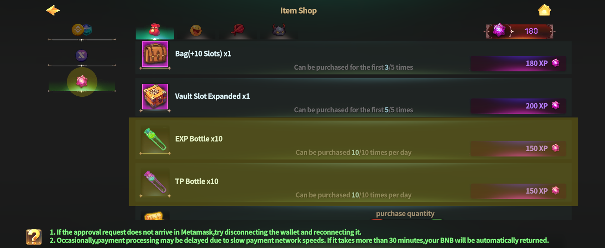
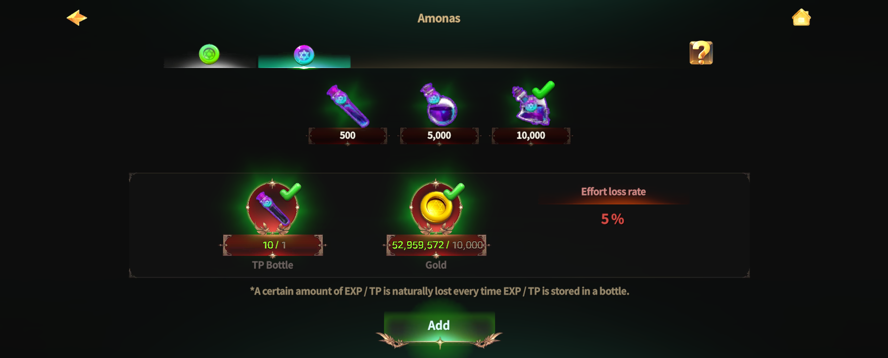

# 🫙 EXP/TP Magic Vial



### ◾ EXP / TP Magic Vial

EXP / TP Magic Vials are items that allow you to **store or trade a Hero’s EXP or TP**.

By using Magic Vials, you can store growth resources,\
use them on other Heroes when needed, or trade them on the Market.


## EXP / TP from **Trial Heroes cannot be stored**.


***

### ◾ Where to Use Magic Vials

EXP / TP Magic Vials can be used at the following location.

* [Rottenhill](../field-info/rotten-hill/) > [Magic Shop](../field-info/rotten-hill/magic-shop/) > [NPC **Amonas**](../field-info/rotten-hill/magic-shop/npc-magic-shop.md#amonas-amonasu)

<figure><figcaption></figcaption></figure>

After speaking with Amonas, you can proceed with storing EXP or TP.

<figure><figcaption></figcaption></figure>

***

### ◾ Storing EXP / TP

To store EXP or TP, you will need the corresponding item.

* EXP Storage: **EXP Bottle**
* TP Storage: **TP Bottle**

These items can be purchased using [**X Points**](../xto-token/xto-holding-service/x-points-earning-rate.md) **obtained through** [**XTO holding**](../xto-token/xto-holding-service/).

<figure><figcaption></figcaption></figure>

After speaking with Amonas, set the amount of EXP or TP you wish to store.


Please note that **storing a large amount at once may result in partial loss** of EXP or TP.


<figure><figcaption></figcaption></figure>

<figure><figcaption></figcaption></figure>

Once the process is complete, a Magic Vial containing EXP or TP\
will be created in your Inventory.

<figure><figcaption></figcaption></figure>

***

### ◾ Using EXP / TP Magic Vials

EXP / TP Magic Vials can be used in various ways.

* Using a Magic Vial instantly restores EXP or TP.
* Magic Vials can be listed on the Market and traded with other players.

Use EXP / TP Magic Vials strategically to grow your Heroes \
in ways that best suit your situation.



### ◾ EXP / TP 마법 호리병 (Magic Vial)

EXP / TP 마법 호리병은 영웅의 **EXP 또는 TP를 저장하거나 거래할 수 있는 아이템**입니다.

호리병을 활용하면 영웅 성장 자원을 보관하거나, \
필요에 따라 다른 영웅에게 사용하거나 마켓에서 거래할 수 있습니다.


## **트라이얼 영웅의 EXP / TP는 저장할 수 없습니다.**


***

### ◾ 호리병 사용 위치

EXP / TP 마법 호리병은 아래 위치에서 사용할 수 있습니다.

* [로튼힐](../field-info/rotten-hill/) > [마법 상점](../field-info/rotten-hill/magic-shop/) > [NPC **아모나스**](../field-info/rotten-hill/magic-shop/npc-magic-shop.md#amonas-amonasu)

<figure><figcaption></figcaption></figure>

아모나스와 대화하면 EXP / TP 저장을 진행할 수 있습니다.

<figure><figcaption></figcaption></figure>

***

### ◾ EXP / TP 저장하기

EXP 또는 TP를 저장하려면 각각 전용 아이템이 필요합니다.

* EXP 저장: **EXP 보틀**
* TP 저장: **TP 보틀**

해당 아이템은 [**XTO 홀딩**](../xto-token/xto-holding-service/)을 통해 얻는 [**X 포인트**](../xto-token/xto-holding-service/x-points-earning-rate.md)로 구매할 수 있습니다.

<figure><figcaption></figcaption></figure>

아모나스와 대화한 후, 저장하고 싶은 EXP 또는 TP의 양을 설정하세요.


한 번에 많은 양을 저장할 경우, EXP 또는 TP의 일부가 **소실될 수 있으니 주의**해 주세요.


<figure><figcaption></figcaption></figure>

<figure><figcaption></figcaption></figure>

저장이 완료되면, EXP 또는 TP가 담긴 호리병 아이템이 인벤토리에 생성됩니다.

<figure><figcaption></figcaption></figure>

***

### ◾ EXP / TP 마법 호리병 활용

EXP / TP 마법 호리병은 다양한 방식으로 활용할 수 있습니다.

* 호리병 아이템을 사용하면 EXP 또는 TP가 즉시 충전됩니다.
* 마켓에 등록하여 다른 플레이어와 거래할 수 있습니다.

EXP / TP 마법 호리병을 활용하여 상황에 맞는 방법으로 영웅을 성장시켜 보세요.



### ◾ EXP / TP 魔法の壺（Magic Vial）

EXP / TP 魔法の壺は、ヒーローの **EXP または TP を保存・取引できるアイテム**です。

魔法の壺を活用することで、成長リソースを保管したり、\
必要に応じて他のヒーローに使用したり、マーケットで取引することができます。


## トライアルヒーローの EXP / TP は保存できません。


***

### ◾ 魔法の壺の使用場所

EXP / TP 魔法の壺は、以下の場所で使用できます。

* [ロッテンヒル](../field-info/rotten-hill/) ＞ [魔法ショップ](../field-info/rotten-hill/magic-shop/) ＞ [NPC **アモナス**](../field-info/rotten-hill/magic-shop/npc-magic-shop.md#amonas-amonasu)

<figure><figcaption></figcaption></figure>

アモナスと会話すると、EXP / TP の保存を進行できます。

<figure><figcaption></figcaption></figure>

***

### ◾ EXP / TP を保存する

EXP または TP を保存するには、それぞれ専用のアイテムが必要です。

* EXP 保存：**EXP ボトル**
* TP 保存：**TP ボトル**

これらのアイテムは、\
[**XTO ホールディング**](../xto-token/xto-holding-service/)**で獲得できる** [**X ポイント**](../xto-token/xto-holding-service/x-points-earning-rate.md)を使用して購入できます。

<figure><figcaption></figcaption></figure>

アモナスと会話した後、保存したい EXP または TP の量を設定してください。


一度に大量の EXP または TP を保存した場合、\
一部が **消失する可能性** がありますのでご注意ください。


<figure><figcaption></figcaption></figure>

<figure><figcaption></figcaption></figure>

保存が完了すると、EXP または TP が入った魔法の壺アイテムが インベントリに作成されます。

<figure><figcaption></figcaption></figure>

***

### ◾ EXP / TP 魔法の壺の活用

EXP / TP 魔法の壺は、さまざまな方法で活用できます。

* 魔法の壺アイテムを使用すると、EXP または TP が即座に補充されます。
* マーケットに登録して、他のプレイヤーと取引することもできます。

EXP / TP 魔法の壺を活用し、状況に応じた方法で ヒーローを成長させてみましょう。



<em>※ This guide was written based on the game status as of January 7, 2026,</em>  <em>and its contents may change with future updates.</em>

