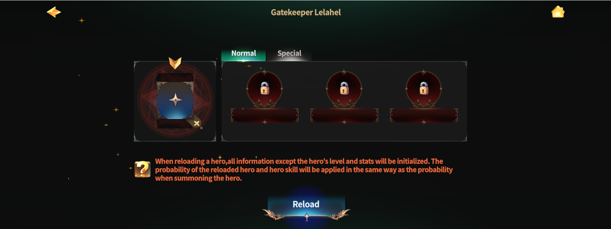

# 1️⃣ Hero Reload



### ◾ Hero Reload

Hero Reload is a system that allows you to operate an existing Hero in a new way.\
Through Reload,\
you can change the Hero’s type and skills to build various skill deck combinations.

***

### ◾ Hero Reload NPC Location

Hero Reload can be performed at the following location.

* Rottenhill > Magic Shop > **Ashurbanipal Library**

You can proceed with Hero Reload by talking to NPC **Lelahel** in the Ashurbanipal Library.

<figure><figcaption></figcaption></figure>

***

### ◾ How to Proceed with Hero Reload

After speaking with **Lelahel**, \
you can choose between **\[Hero Reload]** and **\[Succession Hero Reload]**.

<figure><figcaption></figcaption></figure>

\
On this page, select the **\[Hero]** button to proceed with Normal Hero Reload.

<figure><figcaption></figcaption></figure>

***

### ◾ Hero Reload Types

Hero Reload is divided into the following two types.\
.png>)

* Normal Reload
* Special Reload

<figure><figcaption></figcaption></figure>

<table><thead><tr><th width="267">Categories:</th><th>Normal</th><th>Special</th></tr></thead><tbody><tr><td><strong>1️⃣ Hero Level</strong></td><td>Maintain</td><td>Maintain</td></tr><tr><td><strong>2️⃣ Hero Type</strong></td><td><mark style="color:purple;"><strong>Reload</strong></mark></td><td><mark style="color:purple;"><strong>Reload</strong></mark></td></tr><tr><td><strong>3️⃣4️⃣ Hero Skill Type</strong></td><td><mark style="color:purple;"><strong>Reload</strong></mark></td><td><mark style="color:purple;"><strong>Reload</strong></mark></td></tr><tr><td><strong>3️⃣4️⃣ Hero Skill Level</strong></td><td><mark style="color:red;"><strong>Reset</strong></mark></td><td>Maintain</td></tr><tr><td><strong>5️⃣ Succession Information</strong></td><td>Maintain</td><td>Maintain</td></tr></tbody></table>


When performing Hero Reload, the **Hero’s level is maintained**.\
Accordingly, the **Hero’s stats and SP are also maintained**.

For Succession Heroes, all information related to Succession is maintained as well\
(including Succession skill types, Succession skill levels, Rune slots, and equipped Runes).


The materials required for each Reload type can be checked below.

| Normal                                                   | Special                                                    |
| -------------------------------------------------------- | ---------------------------------------------------------- |
| 
Legendary Scrolls x 1 (Purchase from XTO Shop)
 | 
1 Hero - Special Reload (Purchase from XTO Shop)
 |
| Broken Power x 10                                        |                                                            |
| 4.8M Gold                                                |                                                            |



### ◾ 영웅 리로드

영웅 리로드는 기존 영웅을 새로운 방식으로 다시 운용할 수 있는 시스템입니다.\
리로드를 통해 영웅의 종류와 스킬을 변경하여 다양한 스킬 덱 조합을 구성할 수 있습니다.

***

### ◾ 영웅 리로드 NPC 위치

영웅 리로드는 아래 위치에서 진행할 수 있습니다.

* 로튼힐 > 마법 상점 > **아슈르바니팔 도서관**

아슈르바니팔 도서관에 있는 NPC **레라엘**과 대화하면 영웅 리로드를 진행할 수 있습니다.

<figure><figcaption></figcaption></figure>

***

### ◾ 영웅 리로드 진행 방법

레라엘과 대화하면, **\[영웅 리로드]**&#xC640; **\[계승 영웅 리로드]** 중 하나를 선택할 수 있습니다.

<figure><figcaption></figcaption></figure>

\
이 페이지에서는 **\[영웅]** 버튼을 선택하여 일반 영웅 리로드를 진행합니다.

<figure><figcaption></figcaption></figure>

***

### ◾ 영웅 리로드 방식

영웅 리로드에는 아래 두 가지 방식이 존재합니다.\
.png>)

* 일반 리로드
* 스페셜 리로드

<figure><figcaption></figcaption></figure>

<table><thead><tr><th width="230">구분</th><th>일반</th><th>스페셜</th></tr></thead><tbody><tr><td><strong>1️⃣영웅 레벨</strong></td><td>유지</td><td>유지</td></tr><tr><td><strong>2️⃣영웅 종류</strong></td><td><mark style="color:purple;"><strong>리로드</strong></mark></td><td><mark style="color:purple;"><strong>리로드</strong></mark></td></tr><tr><td><strong>3️⃣4️⃣영웅 스킬 종류</strong> </td><td><mark style="color:purple;"><strong>리로드</strong></mark></td><td><mark style="color:purple;"><strong>리로드</strong></mark></td></tr><tr><td><strong>3️⃣4️⃣영웅 스킬 레벨</strong></td><td><mark style="color:red;"><strong>초기화</strong></mark></td><td>유지</td></tr><tr><td>5️⃣<strong>계승 정보</strong></td><td>유지</td><td>유지</td></tr></tbody></table>


영웅 리로드 시, **영웅의 레벨은 유지**됩니다. 이에 따라 영웅의 스탯과 SP 또한 동일하게 유지됩니다.\
계승 영웅의 경우, **계승과 관련된 모든 정보는 유지**됩니다. \
(계승 스킬 종류, 계승 스킬 레벨, 룬 슬롯, 룬 모두 포함)


각 리로드 방식에 필요한 재료는 아래 내용을 통해 확인할 수 있습니다.

| 일반                                  | 스페셜                                     |
| ----------------------------------- | --------------------------------------- |
| 
전설의 주문서 x 1 ( XTO 상점 구매 )
 | 
영웅 - 스페셜 리로드 x1 ( XTO 상점 구매 )
 |
| 부서진 힘 x10                           |                                         |
| 480만 골드                             |                                         |




### ◾ ヒーローリロード

ヒーローリロードは、既存のヒーローを 新しい形で運用できるシステムです。\
リロードを行うことで、ヒーローの種類やスキルを変更し、\
さまざまなスキルデッキの組み合わせを 構成できます。

***

### ◾ ヒーローリロードNPCの位置

ヒーローリロードは、以下の場所で行うことができます。

* ロッテンヒル ＞ 魔法ショップ ＞ **アシュルバニパル図書館**

アシュルバニパル図書館にいる NPC **レラヘル** と会話すると、ヒーローリロードを進行できます。

<figure><figcaption></figcaption></figure>

***

### ◾ ヒーローリロード進行方法

レラヘルと会話すると、\
&#xNAN;**\[ヒーローリロード]** &#x3068;**\[継承ヒーローリロード]** の いずれかを選択できます。

<figure><figcaption></figcaption></figure>

\
このページでは、**\[ヒーロー]** ボタンを選択して、通常のヒーローリロードを進行します。

<figure><figcaption></figcaption></figure>

***

### ◾ ヒーローリロード方式

ヒーローリロードには、以下の2つの方式があります。\
.png>)

* ノーマルリロード
* スペシャルリロード

<figure><figcaption></figcaption></figure>

<table><thead><tr><th width="277">区分:</th><th>通常</th><th>スペシャル</th></tr></thead><tbody><tr><td><strong>1️⃣ ヒーローレベル</strong></td><td>維持</td><td>維持</td></tr><tr><td><strong>2️⃣ ヒーローの種類</strong></td><td><mark style="color:purple;"><strong>リロード</strong></mark></td><td><mark style="color:purple;"><strong>リロード</strong></mark></td></tr><tr><td><strong>3️⃣4️⃣ ヒーロースキルの種類</strong></td><td><mark style="color:purple;"><strong>リロード</strong></mark></td><td><mark style="color:purple;"><strong>リロード</strong></mark></td></tr><tr><td><strong>3️⃣4️⃣ ヒーロースキルのレベル</strong></td><td><mark style="color:red;"><strong>リセット</strong></mark></td><td>維持</td></tr><tr><td><strong>5️⃣ 継承情報</strong></td><td>維持</td><td>維持</td></tr></tbody></table>


ヒーローリロードを行うと、ヒーローのレベルは維持されます。\
それに伴い、ヒーローのステータスおよびSPも 同様に維持されます。

継承ヒーローの場合、継承に関するすべての情報は 維持されます\
（継承スキルの種類、継承スキルのレベル、ルーンスロット、装着中のルーンを含む）。


各リロード方式に必要な素材は、以下の内容から確認できます。

| 通常                               | スペシャル                                       |
| -------------------------------- | ------------------------------------------- |
| 
伝説の書 x 1  (XTOショップで購入)
 | 
ヒーロー - スペシャルリロード x1  (XTOショップで購入)
 |
| 壊れた力 x 10                        |                                             |
| 480万ゴールド                         |                                             |




<em>※ This guide was written based on the game status as of January 6, 2026,</em>  <em>and its contents may change with future updates.</em>

