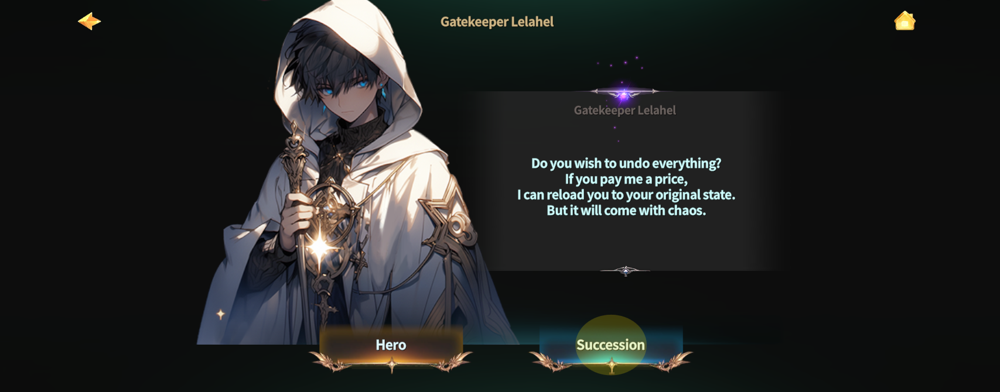
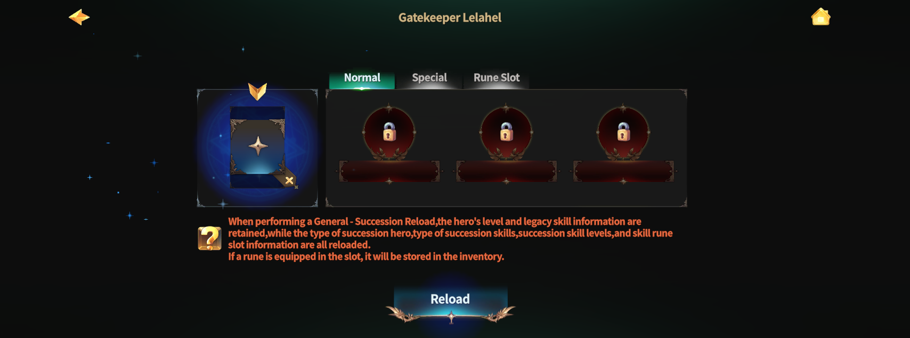
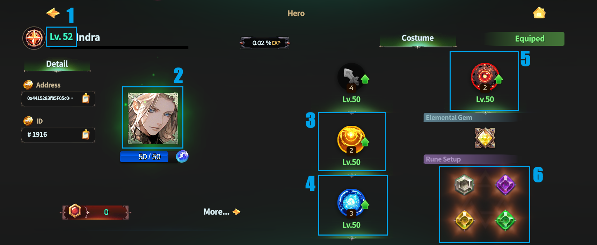

# 2️⃣ Succession Hero Reload



### ◾ Succession Hero Reload

Succession Hero Reload is a system that allows you\
to perform Reload on Heroes that have completed Succession.

Through Reload,\
you can change the skill setup of a Succession Hero to build various skill deck combinations.

***

### ◾ Succession Hero Reload NPC Location

Succession Hero Reload can be performed at the following location.

* Rottenhill > Magic Shop > **Ashurbanipal Library**

You can proceed with Succession Hero Reload by talking to NPC **Lelahel** \
in the Ashurbanipal Library.

<figure><figcaption></figcaption></figure>

***

### ◾ How to Proceed with Succession Hero Reload

After speaking with Lelahel,\
you can choose between **\[Hero Reload]** and **\[Succession Hero Reload]**.

<figure><figcaption></figcaption></figure>

On this page, select the **\[Succession]** button to proceed with Succession Hero Reload.

<figure><figcaption></figcaption></figure>

***

### ◾ Succession Hero Reload Types

Succession Hero Reload includes the following three types.\

* Normal Reload
* Special Reload
* Rune Slot Reload

<figure><figcaption></figcaption></figure>

<table><thead><tr><th width="264">Categories:</th><th>Normal</th><th>Special</th><th>Rune Slot</th></tr></thead><tbody><tr><td><strong>1️⃣ Succession Hero Level</strong></td><td>Maintain</td><td>Maintain</td><td>Maintain</td></tr><tr><td><strong>2️⃣ Succession Hero Type</strong></td><td><mark style="color:purple;"><strong>Reload</strong></mark></td><td><mark style="color:purple;"><strong>Reload</strong></mark></td><td>Maintain</td></tr><tr><td><strong>3️⃣4️⃣ Legacy Hero Skill Type &#x26; Level</strong></td><td>Maintain</td><td>Maintain</td><td>Maintain</td></tr><tr><td><strong>5️⃣ Succession Hero Skill Type</strong></td><td><mark style="color:purple;"><strong>Reload</strong></mark></td><td><mark style="color:purple;"><strong>Reload</strong></mark></td><td>Maintain</td></tr><tr><td><strong>5️⃣ Succession Hero Skill Level</strong></td><td><mark style="color:red;"><strong>Reset</strong></mark></td><td>Maintain</td><td>Maintain</td></tr><tr><td><strong>6️⃣ Succession - Rune Slot</strong></td><td><mark style="color:purple;"><strong>Reload</strong></mark></td><td>Maintain</td><td><mark style="color:purple;"><strong>Reload</strong></mark></td></tr></tbody></table>

***

### ◾ Information Maintained During Reload


Even when performing Succession Hero Reload, the **Hero’s level is maintained**.\
Accordingly, the Hero’s stats and SP are also maintained.


The materials required for each Reload type can be checked below.

| Normal                                                 | Special                                                          | Rune Slot                                                          |
| ------------------------------------------------------ | ---------------------------------------------------------------- | ------------------------------------------------------------------ |
| 
1 Legendary Elixirs (Purchase from XTO Shop)
 | 
1 Succession - Special Reload (Purchase from XTO Shop)
 | 
1 Succession - Rune Slot Reload (Purchase from XTO Shop)
 |
| 5 Crystals of Patience                                 |                                                                  |                                                                    |
| 4.8M Gold                                              |                                                                  |                                                                    |




### ◾ 계승 영웅 리로드

계승 영웅 리로드는 계승이 완료된 영웅을 대상으로 리로드를 진행할 수 있는 시스템입니다.\
리로드를 통해 계승 영웅의 스킬 구성을 변경하여 다양한 스킬 덱 조합을 구성할 수 있습니다.

***

### ◾ 계승 영웅 리로드 NPC 위치

계승 영웅 리로드는 아래 위치에서 진행할 수 있습니다.

* 로튼힐 > 마법 상점 > **아슈르바니팔 도서관**

아슈르바니팔 도서관에 있는 NPC **레라엘**과 대화하면 계승 영웅 리로드를 진행할 수 있습니다.

<figure><figcaption></figcaption></figure>

***

### ◾ 계승 영웅 리로드 진행 방법

레라엘과 대화하면, **\[영웅 리로드]**&#xC640; **\[계승 영웅 리로드]** 중 하나를 선택할 수 있습니다.

<figure><figcaption></figcaption></figure>

이 페이지에서는 **\[계승]** 버튼을 선택하여 계승 영웅 리로드 단계로 진입합니다.

<figure><figcaption></figcaption></figure>

***

### ◾ 계승 영웅 리로드 방식

계승 영웅 리로드에는 아래 **세 가지 방식**이 존재합니다.\

* 일반 리로드
* 스페셜 리로드
* 룬 슬롯 리로드

<figure><figcaption></figcaption></figure>

<table><thead><tr><th width="230">구분</th><th>일반</th><th>스페셜</th><th>룬 슬롯</th></tr></thead><tbody><tr><td><strong>1️⃣계승 영웅 레벨</strong></td><td>유지</td><td>유지</td><td>유지</td></tr><tr><td><strong>2️⃣계승 영웅 종류</strong></td><td><mark style="color:purple;"><strong>리로드</strong></mark></td><td><mark style="color:purple;"><strong>리로드</strong></mark></td><td>유지</td></tr><tr><td><strong>3️⃣4️⃣레거시 영웅 스킬 종류 &#x26; 레벨</strong></td><td>유지</td><td>유지</td><td>유지</td></tr><tr><td><strong>5️⃣계승 영웅 스킬 종류</strong></td><td><mark style="color:purple;"><strong>리로드</strong></mark></td><td><mark style="color:purple;"><strong>리로드</strong></mark></td><td>유지</td></tr><tr><td><strong>5️⃣계승 영웅 스킬 레벨</strong></td><td><mark style="color:red;"><strong>초기화</strong></mark></td><td>유지</td><td>유지</td></tr><tr><td><strong>6️⃣계승 - 룬 슬롯</strong></td><td><mark style="color:purple;"><strong>리로드</strong></mark></td><td>유지</td><td><mark style="color:purple;"><strong>리로드</strong></mark></td></tr></tbody></table>

***

### ◾ 리로드 시 유지되는 정보


계승 영웅 리로드를 진행해도 **영웅의 레벨은 유지**됩니다.\
이에 따라 영웅의 스탯과 SP 또한 동일하게 유지됩니다.


각 리로드 방식에 필요한 재료는 아래 내용을 통해 확인할 수 있습니다.

| 일반                                  | 스페셜                                     | 룬 슬롯                                    |
| ----------------------------------- | --------------------------------------- | --------------------------------------- |
| 
전설의 엘릭서 x 1 ( XTO 상점 구매 )
 | 
계승 - 스페셜 리로드 x1 ( XTO 상점 구매 )
 | 
계승 - 룬슬롯 리로드 x1 ( XTO 상점 구매 )
 |
| 인내의 결정 x 5                          |                                         |                                         |
| 480만 골드                             |                                         |                                         |




### ◾ 継承ヒーローリロード

継承ヒーローリロードは、\
継承を完了したヒーローを対象に リロードを行うことができるシステムです。

リロードを通じて、\
継承ヒーローのスキル構成を変更し、さまざまなスキルデッキの組み合わせを 構成できます。

***

### ◾ 継承ヒーローリロードNPCの位置

継承ヒーローリロードは、以下の場所で行うことができます。

* ロッテンヒル ＞ 魔法ショップ ＞ **アシュルバニパル図書館**

アシュルバニパル図書館にいる NPC **レラヘル** と会話すると、\
継承ヒーローリロードを進行できます。

<figure><figcaption></figcaption></figure>

***

### ◾ 継承ヒーローリロード進行方法

レラヘルと会話すると、\
&#xNAN;**\[ヒーローリロード]** と **\[継承ヒーローリロード]** の いずれかを選択できます。

<figure><figcaption></figcaption></figure>

このページでは、**\[継承]** ボタンを選択して、継承ヒーローリロードを進行します。

<figure><figcaption></figcaption></figure>

***

### ◾ 継承ヒーローリロード方式

継承ヒーローリロードには、以下の **3つの方式** があります。\

* ノーマルリロード
* スペシャルリロード
* ルーンスロットリロード

<figure><figcaption></figcaption></figure>

<table><thead><tr><th width="250">区分:</th><th>通常</th><th>スペシャル</th><th>ルーンスロット</th></tr></thead><tbody><tr><td><strong>1️⃣ 継承ヒーローレベル</strong></td><td>維持</td><td>維持</td><td>維持</td></tr><tr><td><strong>2️⃣ 継承ヒーローの種類</strong></td><td><mark style="color:purple;"><strong>リロード</strong></mark></td><td><mark style="color:purple;"><strong>リロード</strong></mark></td><td>維持</td></tr><tr><td><strong>3️⃣4️⃣ レガシーヒーロースキルの種類とレベル</strong></td><td>維持</td><td>維持</td><td>維持</td></tr><tr><td><strong>5️⃣ 継承ヒーロースキルの種類</strong></td><td><mark style="color:purple;"><strong>リロード</strong></mark></td><td><mark style="color:purple;"><strong>リロード</strong></mark></td><td>維持</td></tr><tr><td><strong>5️⃣ 継承ヒーロースキルのレベル</strong></td><td><mark style="color:red;"><strong>リセット</strong></mark></td><td>維持</td><td>維持</td></tr><tr><td><strong>6️⃣ 継承 - ルーンスロット</strong></td><td><mark style="color:purple;"><strong>リロード</strong></mark></td><td>維持</td><td><mark style="color:purple;"><strong>リロード</strong></mark></td></tr></tbody></table>

***

### ◾ リロード時に維持される情報


継承ヒーローリロードを行っても、ヒーローのレベルは維持されます。\
それに伴い、ヒーローのステータスおよびSPも 同様に維持されます。


各リロード方式に必要な素材は、以下の内容から確認できます。

| 通常                       | スペシャル                          | ルーンスロット                          |
| ------------------------ | ------------------------------ | -------------------------------- |
| 伝説のエリクサー x1 (XTOショップで購入) | 継承 - スペシャルリロード x1 (XTOショップで購入) | 継承 - ルーンスロットリロード x1 (XTOショップで購入) |
| 忍耐の結晶 x5                 |                                |                                  |
| 480万ゴールド                 |                                |                                  |




<em>※ This guide was written based on the game status as of January 6, 2026,</em>  <em>and its contents may change with future updates.</em>

