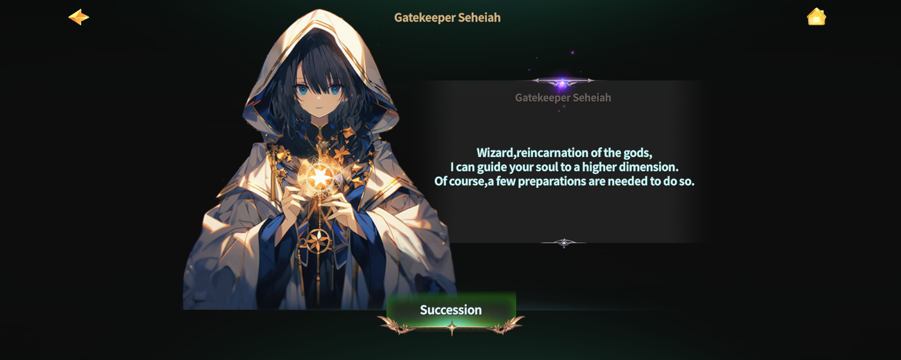
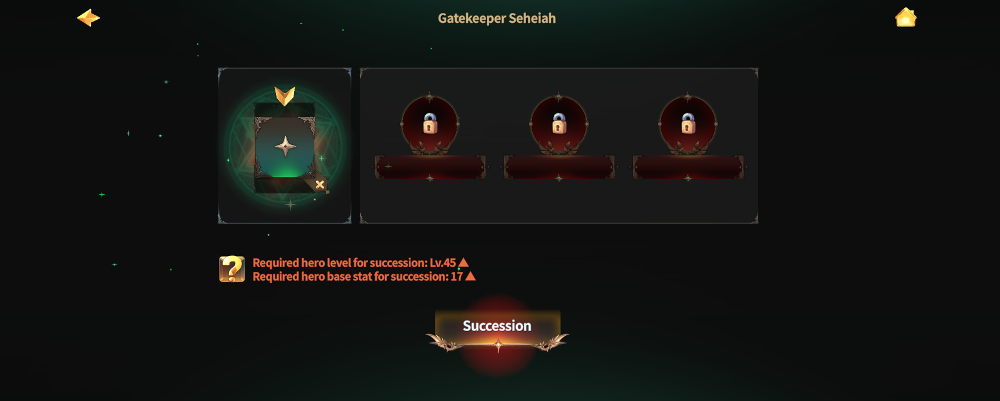
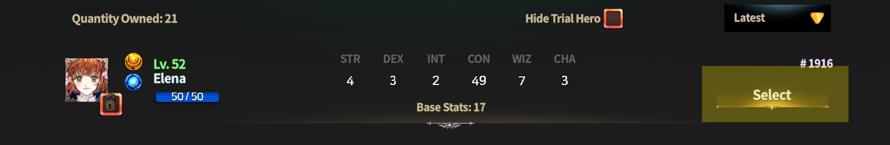
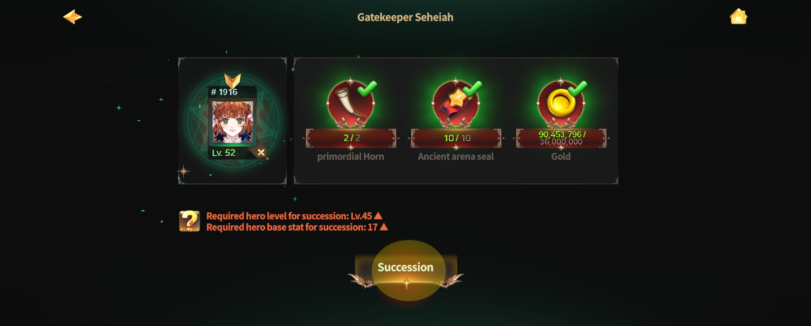
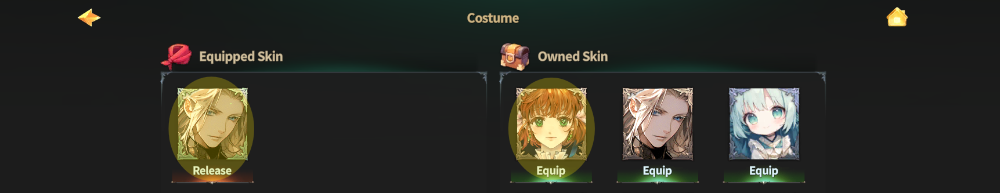

# 🐉 Succession



### ◾ Hero Succession

Hero Succession is a core system that allows your Hero to grow to the next stage.

Through Succession, you can unlock the Hero’s third skill slot\
and gain access to more powerful combat abilities.

***

### ◾ Succession Effects

When a Hero undergoes Succession, the following changes occur.

* The third skill slot is unlocked.
* One new active skill is acquired.
* Additional Skill Rune slots and Elemental Gem slots are unlocked.

All Succession skills are active skills, and equipping Skill Runes grants additional effects.

***

### ◾ Succession System Overview

Hero Succession works by overlaying a new Hero based on the seven base Heroes.\
When Succession is performed, one random Hero is obtained from the Succession Hero pool.

In addition,\
one random active skill is obtained from the acquired Hero’s skill pool.

_👇 For more detailed information about Succession Heroes and skills,_ \
_please check the related links._


[succession-heroes](../../heroes/succession-heroes/)


***

### ◾ How to Proceed with Succession

Hero Succession can be performed at the following location.

* Rottenhill > Magic Shop > **Ashurbanipal Library**

<figure><figcaption></figcaption></figure>

Talk to the [**NPC Seheiah**](../../../field-info/rotten-hill/magic-shop/ashurbanipal-library/npc-library.md#the-gatekeeper-of-succession) in the Ashurbanipal Library.

<figure><figcaption></figcaption></figure>

After speaking with **Seheiah**,
&#x20;the Succession guide window will appear.

<figure><figcaption></figcaption></figure>

Tap the **checked slot** in the guide window \
to move to the screen where you can select a Hero for Succession.

<figure><figcaption></figcaption></figure>

***


### Hero Succession Requirements

To proceed with Hero Succession, the following conditions must be met.

* Hero Level 45 or higher
* Base Stat 17 or higher


***

### ◾ Required Materials for Succession

The following materials are required for Hero Succession.

* Primordial Horn × 2
* Ancient Arena Seal × 10
* Gold 36,000,000

Once all required materials are prepared, tap the **\[Succession]** button to proceed.

<figure><figcaption></figcaption></figure>

***

### ◾ Succession Results

When a normal Hero is succeeded into a Succession Hero, the following changes are applied.

* The Succession skill slot is unlocked.
* New skill and Skill Rune slots are added.
* The Elemental Gem slot is expanded.

<figure><figcaption></figcaption></figure>

Equipping a Skill Rune in the Skill Rune slot\
activates additional effects when using the Succession skill.

Equipping an Elemental Gem in the Elemental Gem slot\
allows you to change the Hero’s element.

_👇 For more detailed information about slots and additional effects,_\
_please check the related links._


[skill-rune.md](skill-rune.md)



[skill-rune-crafting.md](skill-rune-crafting.md)



[elemental-gem.md](elemental-gem.md)


***

### ◾ Appearance Change Guide

If you wish to keep the original appearance after Succession,\
tap the **\[Costume]** button at the top to use the existing skin.

<figure><figcaption></figcaption></figure>



### ◾ 영웅 계승

영웅 계승은 영웅을 한 단계 더 성장시키는 핵심 시스템입니다.

계승을 통해 영웅의 **세 번째 스킬 슬롯**을 개방할 수 있으며,\
더 강력한 전투 능력을 사용할 수 있습니다.

***

### ◾ 계승 효과

영웅이 계승되면 다음과 같은 변화가 발생합니다.

* 세 번째 스킬 슬롯이 개방됩니다.
* 새로운 액티브 스킬 1종을 획득합니다.
* 스킬 룬 슬롯과 속성석 슬롯이 추가로 개방됩니다.

계승 스킬은 모두 **액티브 스킬**이며, 스킬 룬을 장착해 추가 효과를 부여할 수 있습니다.

***

### ◾ 계승 방식 안내

영웅 계승은 기초 영웅 7종을 기반으로 새로운 영웅이 덧씌워지는 방식으로 진행됩니다.\
계승을 진행하면, 계승 영웅 풀에서 **무작위 영웅 1종**을 획득합니다.\
또한, 해당 영웅이 가진 스킬 풀 중 **무작위 액티브 스킬 1종**이 함께 획득됩니다.

_👇계승 영웅과 스킬에 대한 자세한 정보는 관련 링크를 통해 확인할 수 있습니다._


[succession-heroes](../../heroes/succession-heroes/)


***

### ◾ 계승 진행 방법

영웅 계승은 아래 위치에서 진행할 수 있습니다.

* 로튼힐 > 마법 상점 > **아슈르바니팔 도서관**

<figure><figcaption></figcaption></figure>

아슈르바니팔 도서관에 있는 [**NPC 세헤이아**](../../../field-info/rotten-hill/magic-shop/ashurbanipal-library/npc-library.md#the-gatekeeper-of-succession)와 대화하세요.

<figure><figcaption></figcaption></figure>

세헤이아와 대화하면 계승 안내 창이 표시됩니다.

<figure><figcaption></figcaption></figure>

안내 창에서 **체크 표시된 슬롯**을 터치하면, 계승할 영웅을 선택할 수 있는 화면으로 이동합니다.

<figure><figcaption></figcaption></figure>

***


### 영웅 계승 조건

영웅 계승을 진행하려면 아래 조건을 충족해야 합니다.

* 영웅 레벨 45 이상
* 베이스 스탯 17 이상


***

### ◾ 계승에 필요한 재료

영웅 계승에는 다음 재료가 필요합니다.

* 태초의 뿔나팔 × 2
* 고대 아레나 인장 × 10
* 골드 36,000,000

모든 재료가 준비되면 **\[계승]** 버튼을 터치하여 계승을 진행할 수 있습니다.

<figure><figcaption></figcaption></figure>

***

### ◾ 계승 결과

일반 영웅이 계승 영웅으로 계승되면, 다음과 같은 변화가 적용됩니다.

* 계승 스킬 슬롯이 개방됩니다.
* 새로운 스킬과 스킬 룬 슬롯이 추가됩니다.
* 속성석 슬롯이 확장됩니다.

<figure><figcaption></figcaption></figure>

스킬 룬 슬롯에 룬을 장착하면 계승 스킬 사용 시 추가 효과가 발동합니다.\
속성석 슬롯에 엘리멘탈 젬을 장착하면 영웅의 속성을 변경할 수 있습니다.

_👇 슬롯과 추가 효과에 대한 자세한 정보는 관련 링크를 통해 확인할 수 있습니다._


[skill-rune.md](skill-rune.md)



[skill-rune-crafting.md](skill-rune-crafting.md)



[elemental-gem.md](elemental-gem.md)


***

### ◾ 외형 변경 안내

계승 후에도 기존 영웅의 외형을 유지하고 싶다면, \
상단의 **\[외형 변경]** 버튼을 터치하여 기존 스킨을 사용할 수 있습니다.

<figure><figcaption></figcaption></figure>



### ◾ ヒーロー継承

ヒーロー継承は、ヒーローを一段階成長させるための中核となるシステムです。

継承を行うことで、\
ヒーローの**3番目のスキルスロット**が解放され、\
より強力な戦闘能力を使用できるようになります。

***

### ◾ 継承効果

ヒーローが継承されると、以下の変化が発生します。

* 3番目のスキルスロットが解放されます。
* 新しいアクティブスキルを1種獲得します。
* スキルルーンスロットと属性石スロットが追加で解放されます。

継承スキルはすべてアクティブスキルであり、\
スキルルーンを装着することで追加効果を付与できます。

***

### ◾ 継承方式の案内

ヒーロー継承は、7種の基礎ヒーローを基準として、\
新しいヒーローが上書きされる方式で進行されます。

継承を行うと、継承ヒーロープールから ランダムでヒーロー1種を獲得します。

また、\
獲得したヒーローが持つスキルプールの中から、\
ランダムなアクティブスキル1種を同時に獲得します。

_👇 継承ヒーローおよびスキルの詳細は、関連リンクから確認できます。_


[succession-heroes](../../heroes/succession-heroes/)


***

### ◾ 継承の進行方法

ヒーロー継承は、以下の場所で行うことができます。

* ロトンヒル > 魔法ショップ > **アシュルバニパル図書館**

<figure><figcaption></figcaption></figure>

アシュルバニパル図書館にいる [**NPC セヘイア**](../../../field-info/rotten-hill/magic-shop/ashurbanipal-library/npc-library.md#the-gatekeeper-of-succession)と会話してください。

<figure><figcaption></figcaption></figure>

**セヘイア**と会話すると、継承案内ウィンドウが表示されます。

<figure><figcaption></figcaption></figure>

案内ウィンドウで チェック表示されたスロットをタップすると、\
継承するヒーローを選択する画面に移動します。

<figure><figcaption></figcaption></figure>

***


### ヒーロー継承条件

ヒーロー継承を行うには、以下の条件を満たす必要があります。

* ヒーローレベル **45** 以上
* ベースステータス **17** 以上


***

### ◾ 継承に必要な素材

ヒーロー継承には、以下の素材が必要です。

* 太初の角笛 × 2
* 古代アリーナの印章 × 10
* ゴールド 36,000,000

すべての素材が揃っている場合、**\[継承]** ボタンをタップして 継承を進めることができます。

<figure><figcaption></figcaption></figure>

***

### ◾ 継承結果

一般ヒーローが 継承ヒーローとして継承されると、以下の変化が適用されます。

* 継承スキルスロットが解放されます。
* 新しいスキルおよびスキルルーンスロットが追加されます。
* 属性石スロットが拡張されます。

<figure><figcaption></figcaption></figure>

スキルルーンスロットにルーンを装着すると, 継承スキル使用時に 追加効果が発動します。\
属性石スロットにエレメンタルジェムを装着すると, ヒーローの属性を変更できます。

_👇 スロットおよび追加効果の詳細は、関連リンクから確認できます。_


[skill-rune.md](skill-rune.md)



[skill-rune-crafting.md](skill-rune-crafting.md)



[elemental-gem.md](elemental-gem.md)


***

### ◾ 外見変更案内

継承後も\
既存ヒーローの外見を維持したい場合は、上部の **\[外見変更]** ボタンをタップして\
既存スキンを使用できます。

<figure><figcaption></figcaption></figure>



<em>※ This guide was written based on the game status as of January 6, 2026,</em>  <em>and its contents may change with future updates.</em>

