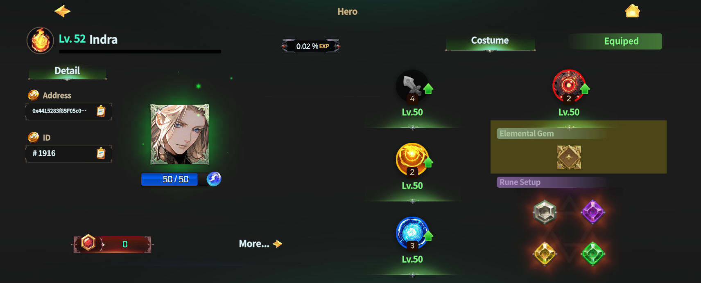
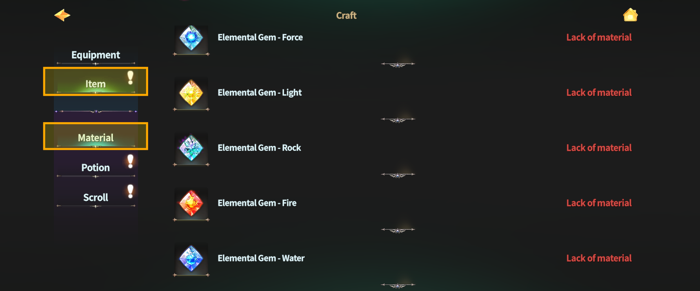
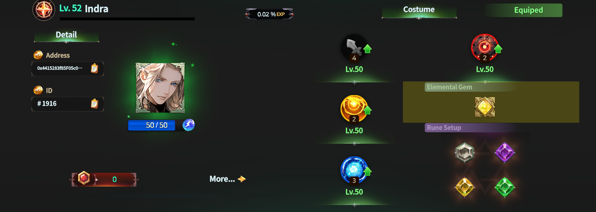

# 🪩 Elemental Gem



### ◾ Elemental Gems

Elemental Gems are a system that allows you to change the element of a **Succession Hero**.

After completing Hero Succession,\
you can freely change a Hero’s element by equipping **Elemental Gems**.

***

### ◾ How to Equip Elemental Gems

Elemental Gems can be equipped through the **Elemental Gem slot**\
on the Succession Hero’s information screen.

Elemental Gems are obtained through crafting.

<figure><figcaption></figcaption></figure>

***

### ◾ How to Craft Elemental Gems

To craft Elemental Gems,\
you must first learn the Elemental Gem crafting method through **Training > Monsterology**.\
The **Elemental Fragments** required for crafting can be obtained through raid content.

<figure><figcaption></figcaption></figure>

***

### ◾ Changing Elemental Gems

Tap the **Elemental Gem slot** to display a list of equippable Elemental Gems.\
If you own any Elemental Gems, you can select one from the list.

<figure><figcaption></figcaption></figure>

After selecting the Elemental Gem you want to use, \
tap the **\[Equip]** button to change the element.

<figure><figcaption></figcaption></figure>


Once an Elemental Gem is equipped,\
replacing it with another Gem will **destroy the previously equipped Gem**.

Please choose carefully when changing Elemental Gems.


***

### ◾ Element Change Complete

Once the element change is complete, the Succession Hero’s element is applied immediately.\
Use Elemental Gems to build strategies that match different combat situations.



### ◾ 엘리멘탈 젬 (속성석)

엘리멘탈 젬은 **계승된 영웅의 속성을 변경**할 수 있는 시스템입니다.\
계승을 완료한 영웅은 엘리멘탈 젬을 장착하여 속성을 자유롭게 변경할 수 있습니다.

***

### ◾ 엘리멘탈 젬 장착 방법

엘리멘탈 젬은 계승 영웅의 정보 화면에서 **속성석 슬롯**을 통해 장착할 수 있습니다.\
엘리멘탈 젬은 제작을 통해 획득할 수 있습니다.

<figure><figcaption></figcaption></figure>

***

### ◾ 엘리멘탈 젬 제작 방법

엘리멘탈 젬을 제작하려면, 먼저 **기술 연마 > 마물학**에서 엘리멘탈 젬 제작법을 습득해야 합니다.\
제작에 필요한 **속성 조각**은 [레이드 콘텐츠](../../../gamemode/field-raid-field-boss.md)를 통해 획득할 수 있습니다.

<figure><figcaption></figcaption></figure>

***

### ◾ 엘리멘탈 젬 변경하기

속성석 슬롯을 터치하면, 장착 가능한 엘리멘탈 젬이 목록으로 표시됩니다.\
보유 중인 엘리멘탈 젬이 있을 경우, 목록에서 원하는 젬을 선택할 수 있습니다.

<figure><figcaption></figcaption></figure>

변경할 엘리멘탈 젬을 선택한 후, **\[장착]** 버튼을 터치하면 속성이 변경됩니다.

<figure><figcaption></figcaption></figure>


엘리멘탈 젬은 한 번 장착하면, 다른 젬으로 교체할 경우 기존 젬이 **파괴**됩니다.\
젬 변경 시에는 신중하게 선택해 주세요.


***

### ◾ 속성 변경 완료

속성 변경이 완료되면, 계승 영웅의 속성이 즉시 반영됩니다.\
엘리멘탈 젬을 활용하여 전투 상황에 맞는 다양한 전략을 구성할 수 있습니다.



### ◾ エレメンタルジェム (属性石)

エレメンタルジェムは、継承されたヒーローの属性を変更できるシステムです。\
継承を完了したヒーローは、エレメンタルジェムを装着することで、属性を自由に変更できます。

***

### ◾ エレメンタルジェム装着方法

エレメンタルジェムは、継承ヒーローの情報画面にある **属性石スロット**から装着できます。\
エレメンタルジェムは、制作によって獲得できます。

<figure><figcaption></figcaption></figure>

***

### ◾ エレメンタルジェム制作方法

エレメンタルジェムを制作するには、まず **技術研磨 ＞ 魔物学** にて、\
エレメンタルジェムの制作方法を 習得する必要があります。

制作に必要な **属性の欠片**は、レイドコンテンツを通じて獲得できます。

<figure><figcaption></figcaption></figure>

***

### ◾ エレメンタルジェム変更

属性石スロットをタップすると、装着可能なエレメンタルジェムの一覧が表示されます。\
エレメンタルジェムを所持している場合、一覧から使用するジェムを選択できます。

<figure><figcaption></figcaption></figure>

変更するエレメンタルジェムを選択した後、**\[装着]** ボタンをタップすると、属性が変更されます。

<figure><figcaption></figcaption></figure>


エレメンタルジェムは、一度装着すると、別のジェムに変更した際、既存のジェムが **破壊** されます。

ジェムを変更する際は、慎重に選択してください。


***

### ◾ 属性変更完了

属性変更が完了すると、継承ヒーローの属性が 即座に反映されます。\
エレメンタルジェムを活用して、戦闘状況に応じた さまざまな戦略を構築できます。



<em>※ This guide was written based on the game status as of January 6, 2026,</em>  <em>and its contents may change with future updates.</em>

