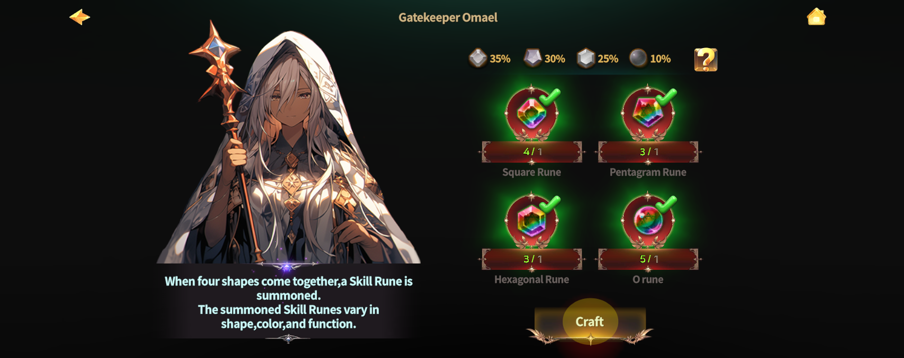
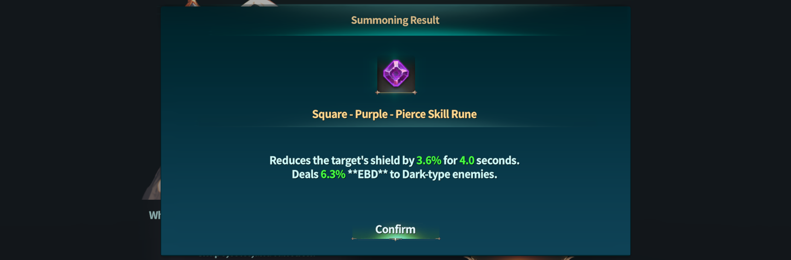
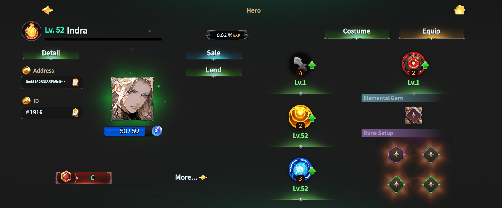

# 🪐 Skill Rune Crafting



### ◾ Skill Rune Crafting

Once you have completed [**Hero Succession**](./),\
you can craft Skill Runes to prepare for more strategic battles.

To craft Skill Runes,\
you must first learn the material crafting methods through [**Training**](../../../beginners-guide/gameplay-guide/training.md) **> Mineralogy**.

Crafting Skill Runes requires a total of **four different materials**.\
Please refer to the image below for the detailed material list.

<figure><figcaption></figcaption></figure>

***

### ◾ How to Craft Skill Runes

Once all required materials are prepared, move to the location below.

* Rottenhill > Magic Shop > [**Ashurbanipal Library**](../../../field-info/rotten-hill/magic-shop/ashurbanipal-library/)

After speaking with [**NPC Omael**](../../../field-info/rotten-hill/magic-shop/ashurbanipal-library/npc-library.md#the-rune-craftsman) in the Ashurbanipal Library,\
hand over the final Skill Rune materials to craft a **random Skill Rune**.

<figure><figcaption></figcaption></figure>

***

### ◾ Skill Rune Generation Method

Skill Runes are generated through a **random combination system** each time they are crafted.\
Details about the rune combination rules can be checked below.

***

### ◾ Skill Rune Combination System

Both Skill Runes and Skill Rune Slots have **4 different shapes** and **7 different colors**.

* Skill Rune Slots are randomly assigned during Hero Succession
* Only Skill Runes that match both the **shape and color** of the slot can be equipped

<figure><figcaption></figcaption></figure>

***

### ◾ Skill Rune Combination Process

#### 1. Shape-Based Special Effects

Each Skill Rune shape determines the type of special effects that can be obtained.

As the shape progresses from **square to circle**,\
the range of selectable special effects expands, and the rarity increases.

<table data-header-hidden data-full-width="true"><thead><tr><th width="104" align="center"></th><th width="133" align="center"></th><th width="230"></th><th></th></tr></thead><tbody><tr><td align="center"> Shape</td><td align="center">Loot Chance</td><td> Type pool</td><td> Type of Loot Chance</td></tr><tr><td align="center"> </td><td align="center">35%</td><td>Pierce Accuracy Increase Cooldown Facing up Flexibility Defense</td><td>💥<strong>value : 3% ~ 10%</strong> 🕓duration : 4s ~ 8s 🎯chance : 17; 17; 17; 17; 17; 15</td></tr><tr><td align="center"> </td><td align="center">30%</td><td>Pierce Accuracy Increase Cooldown  Facing up Flexibility Defense Anti Stun Anti Heal</td><td>💥<strong>value : 3% ~ 10%</strong> (Anti stun : 3% ~ 6%) 🕓duration : 4s ~ 8s 🎯chance : 16; 16; 16; 16; 16; 14; 6</td></tr><tr><td align="center"> </td><td align="center">25%</td><td>Pierce Accuracy Increase Cooldown Facing up Flexibility Defense Anti Stun Anti Heal Extension</td><td>💥<strong>value : 8% ~ 16%</strong> (Anti stun : 5% ~ 10%) 🕓duration : 5s ~ 10s (Extension : 1s ~ 4s) 🎯chance : 14; 14; 14; 14; 14; 10; 10; 5; 5</td></tr><tr><td align="center"> </td><td align="center">10%</td><td>Pierce Accuracy Increase Cooldown Facing up Flexibility Defense Anti Stun Anti Heal Extension Reload Digest</td><td>💥<strong>value : 8% ~ 16%</strong>  (Anti stun : 5% ~ 10%)  (Digest : 2% ~ 4%) 🕓duration : 5s ~ 10s (Extension : 0.5s ~ 3s) 🎯chance : 10; 10; 10; 10; 10; 10; 10; 10; 5; 5; 5</td></tr></tbody></table>

***

#### 2. Color Determination

After the Skill Rune’s shape and special effect are decided,\
its **color is assigned randomly**.

<table data-header-hidden data-full-width="false"><thead><tr><th width="139"></th><th width="145.33333333333331"></th><th></th></tr></thead><tbody><tr><td>Color</td><td>Loot Chance (%)</td><td>Effect</td></tr><tr><td>Red</td><td>16</td><td>Deals <strong>0.5%~8% additional elemental damage</strong> to <strong>Fire attribute enemies</strong>.</td></tr><tr><td>Blue</td><td>16</td><td>Deals <strong>0.5%~8% additional elemental damage</strong> to <strong>Water attribute enemies</strong>.</td></tr><tr><td>Green</td><td>16</td><td>Deals <strong>0.5%~8% additional elemental damage</strong> to <strong>Wood attribute enemies</strong>.</td></tr><tr><td>Purple</td><td>16</td><td>Deals <strong>0.5%~8% additional elemental damage</strong> to <strong>Dark attribute enemies</strong>..</td></tr><tr><td>Yellow</td><td>16</td><td>Deals <strong>0.5%~8% additional elemental damage</strong> to <strong>Light attribute enemies</strong>.다.</td></tr><tr><td>Gray</td><td>16</td><td>Deals <strong>0.5%~8% additional elemental damage</strong> to <strong>Earth attribute enemies</strong>.</td></tr><tr><td>White</td><td>4</td><td>Deals <strong>0.5%~8% additional elemental damage</strong> to <strong>all attribute enemies</strong>.</td></tr></tbody></table>

***

#### 3. Special Effect Probability

The special effects selected probabilistically in **Step 1** can be checked in the details below.

<table><thead><tr><th width="239">Name</th><th>Effect</th></tr></thead><tbody><tr><td><strong>Pierce</strong></td><td>Reduces the target’s <strong>damage reduction buff</strong> by <strong>n% for n seconds</strong>.</td></tr><tr><td><strong>Defense</strong></td><td>Reduces the target’s <strong>damage increase buff</strong> by <strong>n% for n seconds</strong>.  </td></tr><tr><td><strong>Accuracy</strong></td><td>Reduces the target’s <strong>AGI stat</strong> by <strong>n% for n seconds</strong>..</td></tr><tr><td><strong>Cooldown Increase</strong></td><td>Reduces the target’s <strong>cooldown reduction effect</strong> by <strong>n% for n seconds</strong>.</td></tr><tr><td><strong>Flexibility</strong></td><td>Reduces the target’s <strong>critical bonus</strong> by <strong>n% for n seconds</strong>.</td></tr><tr><td><strong>Facing Up</strong></td><td>Reduces the target’s <strong>skill critical bonus</strong> by <strong>n% for n seconds</strong>.</td></tr><tr><td><strong>Anti Stun</strong></td><td>When the target inflicts a <strong>stun effect</strong>, there is an <strong>n% chance to evade it for n seconds</strong>.</td></tr><tr><td><strong>Anti Heal</strong></td><td>When the target uses a <strong>healing skill</strong>, the healing amount is reduced by <strong>n% for n seconds</strong>.</td></tr><tr><td><strong>Reload</strong></td><td>Increases the <strong>Succession skill’s reload count</strong> by <strong>+1</strong>.</td></tr><tr><td><strong>Extension</strong></td><td>Increases the <strong>duration of Skill Rune effects on the user</strong> by <strong>n seconds each</strong>.</td></tr><tr><td><strong>Digest</strong></td><td>Has an <strong>n% chance to remove the target’s food buffs</strong>. </td></tr></tbody></table>

***

### ◾ Skill Rune Stack Effects

When multiple Skill Runes with the same effect are equipped, \
the effects are applied as follows:

* The **longest duration** is applied
* The **effect values are added together**

**Example)**\
Defense Rune A: Defense +10% for 3 seconds\
Defense Rune B: Defense +12% for 7 seconds

➡ **Final Effect:**\
Defense +22% for 7 seconds

_✨ Stack smart, and your power will speak for itself._



### ◾ 스킬 룬 제작

**영웅** [**계승**](./)을 완료했다면, 스킬 룬을 제작하여 더 전략적인 전투를 준비할 수 있습니다.\
스킬 룬을 제작하려면 먼저 [**기술 연마**](../../../beginners-guide/gameplay-guide/training.md) **> 광물학**에서 재료 제작 방법을 습득해야 합니다.

스킬 룬 제작에는 총 **4가지 재료**가 필요하며,\
자세한 재료 목록은 아래 이미지를 통해 확인할 수 있습니다.

<figure><figcaption></figcaption></figure>

***

### ◾ 스킬 룬 제작 방법

필요한 재료를 모두 준비했다면, 아래 위치로 이동하세요.

* 로튼힐 > 마법공방 > [**아슈르바니팔 도서관**](../../../field-info/rotten-hill/magic-shop/ashurbanipal-library/)

아슈르바니팔 도서관에서 [NPC **오마엘**](../../../field-info/rotten-hill/magic-shop/ashurbanipal-library/npc-library.md#the-rune-craftsman)과 대화한 후, \
최종 스킬 룬 재료를 건네면 **무작위 스킬 룬**을 제작할 수 있습니다.

<figure><figcaption></figcaption></figure>

***

### ◾ 스킬 룬 생성 방식

스킬 룬은 제작할 때마다 **랜덤 조합 시스템**을 통해 생성됩니다.\
룬의 조합 방식은 아래 내용을 통해 확인할 수 있습니다.

***

### ◾ 스킬 룬 조합 시스템

스킬 룬과 스킬 룬 슬롯은 각각 **4가지 모양**과 **7가지 색상**을 가집니다.\
스킬 룬 슬롯은 영웅 계승 시 무작위로 설정됩니다.\
슬롯의 **모양과 색상에 맞는 스킬 룬만** 장착할 수 있습니다.

<figure><figcaption></figcaption></figure>

***

### ◾ 스킬 룬 조합 방식

#### 1. 모양별 특수 효과

스킬 룬의 **모양**에 따라 획득 가능한 **특수 효과**가 정해져 있습니다.\
사각형에서 원형으로 갈수록 특수 효과의 선택 범위가 넓어지며, 희귀도가 상승합니다.

<table data-header-hidden data-full-width="true"><thead><tr><th width="104" align="center"></th><th width="133" align="center"></th><th width="230"></th><th></th></tr></thead><tbody><tr><td align="center"> Shape</td><td align="center">Loot Chance</td><td> Type pool</td><td> Type of Loot Chance</td></tr><tr><td align="center"> </td><td align="center">35%</td><td>관통(Pierce)  적중(Accuracy) 쿨타임증가(Increase cool)  직시(facing up)  유연성(Flexibility)  방어(Defense)</td><td>💥<strong>value : 3% ~ 10%</strong> 🕓duration : 4s ~ 8s 🎯chance : 17; 17; 17; 17; 17; 15</td></tr><tr><td align="center"> </td><td align="center">30%</td><td>관통(Pierce),  적중(Accuracy)  쿨타임증가(Increase cool)  직시(facing up)  유연성(Flexibility)  방어(Defense)  안티 스턴(Anti Stun)  안티 힐(Anti Heal)</td><td>💥<strong>value : 3% ~ 10%</strong> (Anti stun : 3% ~ 6%) 🕓duration : 4s ~ 8s 🎯chance : 16; 16; 16; 16; 16; 14; 6</td></tr><tr><td align="center"> </td><td align="center">25%</td><td>관통(Pierce),  적중(Accuracy) 쿨타임증가(Increase cool)  직시(facing up)  유연성(Flexibility)  방어(Defense)  안티 스턴(Anti Stun)  안티 힐(Anti Heal)  연장(Extension)</td><td>💥<strong>value : 8% ~ 16%</strong> (Anti stun : 5% ~ 10%) 🕓duration : 5s ~ 10s (Extension : 1s ~ 4s) 🎯chance : 14; 14; 14; 14; 14; 10; 10; 5; 5</td></tr><tr><td align="center"> </td><td align="center">10%</td><td>관통(Pierce),  적중(Accuracy)  쿨타임증가(Increase cool)  직시(facing up)  유연성(Flexibility)  방어(Defense)  안티 스턴(Anti Stun)  안티 힐(Anti Heal)  연장(Extension)  장전(Reload)  소화(Digest)</td><td>💥<strong>value : 8% ~ 16%</strong>  (Anti stun : 5% ~ 10%)  (Digest : 2% ~ 4%) 🕓duration : 5s ~ 10s (Extension : 0.5s ~ 3s) 🎯chance : 10; 10; 10; 10; 10; 10; 10; 10; 5; 5; 5</td></tr></tbody></table>

***

#### 2. 색상 결정

스킬 룬의 모양과 특수 효과가 결정된 후, **색상은 무작위로 결정됩니다.**

<table data-header-hidden><thead><tr><th width="139"></th><th width="145.33333333333331"></th><th></th></tr></thead><tbody><tr><td>Color</td><td>Loot Chance (%)</td><td>Effect</td></tr><tr><td>레드</td><td>16</td><td>화속성 적에게 0.5%~8% 추가 속성 데미지를 줍니다.</td></tr><tr><td>블루</td><td>16</td><td>물속성 적에게 0.5%~8% 추가 속성 데미지를 줍니다.</td></tr><tr><td>그린</td><td>16</td><td>목속성 적에게 0.5%~8% 추가 속성 데미지를 줍니다.</td></tr><tr><td>퍼플</td><td>16</td><td>암속성 적에게 0.5%~8% 추가 속성 데미지를 줍니다.</td></tr><tr><td>옐로우</td><td>16</td><td>광속성 적에게 0.5%~8% 추가 속성 데미지를 줍니다.</td></tr><tr><td>그레이</td><td>16</td><td>석속성 적에게 0.5%~8% 추가 속성 데미지를 줍니다.</td></tr><tr><td>화이트</td><td>4</td><td>모든 속성 적에게 0.5%~8% 추가 속성 데미지를 줍니다.</td></tr></tbody></table>

***

#### 3. 특수 효과 확률

1번 단계에서 확률적으로 선택되는 특수 효과는 아래 내용을 통해 확인할 수 있습니다.

<table><thead><tr><th width="239">Name</th><th>Effect</th></tr></thead><tbody><tr><td><strong>관통 (Pierce)</strong></td><td>타겟의 데미지 감소 버프 값을 n초간 n% 만큼 감소시킨다.</td></tr><tr><td><strong>방어 (Defense)</strong></td><td>타겟의 데미지 증가 버프 값을 n초간 n% 만큼 감소시킨다. </td></tr><tr><td><strong>적중 (Accuracy)</strong></td><td>타겟의 AGI 값을 n초간 n% 만큼 감소시킨다.</td></tr><tr><td><strong>쿨타임증가 (Cooldown increase)</strong></td><td>타겟의 쿨타임 감소 값을 n초간 n% 만큼 감소시킨다.</td></tr><tr><td><strong>유연성 (flexibility)</strong></td><td>타겟의 크리티컬 보너스 값을 n초간 n% 만큼 감소시킨다.</td></tr><tr><td><strong>직시 (Facing up)</strong></td><td>타겟의 스킬 크리티컬 보너스 값을 n초간 n% 만큼 감소시킨다.</td></tr><tr><td><strong>안티 스턴 (Anti Stun)</strong></td><td>타겟이 ‘스턴’ 효과를 발생 시켰을 때, n초간 n% 확률로 회피한다.</td></tr><tr><td><strong>안티 힐 (Anti Heal)</strong></td><td>타겟이 힐 스킬을 사용할 때, 힐 사용량을 n초간 n% 만큼 감소 시킨다. </td></tr><tr><td><strong>장전 (Reload)</strong></td><td>계승 스킬의 장전 횟수를 +1 증가시킨다.</td></tr><tr><td><strong>연장 (Extension)</strong></td><td>나에게 설치된 스킬 룬의 효과 지속 시간을 각각 n초씩 증가 시킨다. </td></tr><tr><td><strong>소화 (Digest)</strong></td><td>타겟의 음식 버프를 n% 확률로 삭제한다. </td></tr></tbody></table>

***

### ◾ 스킬 룬 중첩 효과

동일한 스킬 룬 효과를 여러 개 장착할 경우, 다음과 같이 적용됩니다.

* 효과 **지속 시간**은 가장 긴 값이 적용됩니다.
* 효과 **수치**는 서로 합산됩니다.

예시)\
방어 룬 A: 3초 동안 방어력 +10%\
방어 룬 B: 7초 동안 방어력 +12%

➡ 최종 효과:\
**7초 동안 방어력 +22%**



### ◾ スキルルーン制作

英雄の[**継承**](./)を完了すると、スキルルーンを制作し、より戦略的な戦闘に備えることができます。\
スキルルーンを制作するには、\
まず [**技術研磨**](../../../beginners-guide/gameplay-guide/training.md) **＞ 鉱物学** にて、素材制作方法を習得する必要があります。

スキルルーン制作には、**合計4種類の素材**が必要となり、\
詳しい素材一覧は下記の画像よりご確認いただけます。

<figure><figcaption></figcaption></figure>

***

### ◾ スキルルーン制作方法

必要な素材をすべて準備したら、以下の場所へ移動してください。

* ロッテンヒル ＞ 魔法工房 ＞ [**アシュルバニパル図書館**](../../../field-info/rotten-hill/magic-shop/ashurbanipal-library/)

アシュルバニパル図書館にいる [**NPC オマエル（Omael）**](../../../field-info/rotten-hill/magic-shop/ashurbanipal-library/npc-library.md#the-rune-craftsman) と会話し、\
最終スキルルーン素材を渡すことで、**ランダムなスキルルーン**を制作できます。

<figure><figcaption></figcaption></figure>

***

### ◾ スキルルーン生成方式

スキルルーンは、制作するたびに\
**ランダム組み合わせシステム**によって生成されます。

ルーンの組み合わせ方式は、以下の内容をご確認ください。

***

### ◾ スキルルーン組み合わせシステム

スキルルーンおよびスキルルーンスロットは、\
それぞれ **4種類の形状**と **7種類の色**を持っています。

* スキルルーンスロットは、英雄継承時にランダムで設定されます
* スロットの形状と色が一致するスキルルーンのみ装着可能です

<figure><figcaption></figcaption></figure>

***

### ◾ スキルルーン組み合わせ方式

#### 1. 形状別の特殊効果

スキルルーンの形状によって、獲得できる特殊効果の種類が決まっています。\
形状は **四角形から円形に近づくほど**、特殊効果の選択範囲が広がり、希少度も上昇します。

<table data-header-hidden data-full-width="true"><thead><tr><th width="104" align="center"></th><th width="133" align="center"></th><th width="230"></th><th></th></tr></thead><tbody><tr><td align="center"> Shape</td><td align="center">Loot Chance</td><td> Type pool</td><td> Type of Loot Chance</td></tr><tr><td align="center"> </td><td align="center">35%</td><td>貫通（Pierce）  命中（Accuracy） クールタイム増加(Increase Cooldown) 直視（Facing Up)  柔軟性(Flexibility) 防御（Defense）</td><td>💥<strong>value : 3% ~ 10%</strong> 🕓duration : 4s ~ 8s 🎯chance : 17; 17; 17; 17; 17; 15</td></tr><tr><td align="center"> </td><td align="center">30%</td><td>貫通（Pierce）  命中（Accuracy） クールタイム増加(Increase Cooldown) 直視（Facing Up） 柔軟性（Flexibility） 防御（Defense） スタン耐性(Anti Stun) 回復阻害(Anti Heal)</td><td>💥<strong>value : 3% ~ 10%</strong> (Anti stun : 3% ~ 6%) 🕓duration : 4s ~ 8s 🎯chance : 16; 16; 16; 16; 16; 14; 6</td></tr><tr><td align="center"> </td><td align="center">25%</td><td>貫通 (Pierce) 命中(Accuracy) クールタイム増加(Increase Cooldown) 直視(Facing Up) 柔軟性 (Flexibility) 防御(Defense)  スタン耐性(Anti Stun)  回復阻害(Anti Heal)  延長(Extension)</td><td>💥<strong>value : 8% ~ 16%</strong> (Anti stun : 5% ~ 10%) 🕓duration : 5s ~ 10s (Extension : 1s ~ 4s) 🎯chance : 14; 14; 14; 14; 14; 10; 10; 5; 5</td></tr><tr><td align="center"> </td><td align="center">10%</td><td>貫通(Pierce) 命中(Accuracy)  クールタイム増加(Increase Cooldown)  直視(facing up)  柔軟性(Flexibility)  防御(Defense)  スタン耐性(Anti Stun)  回復阻害(Anti Heal)  延長(Extension)  装填(Reload)  消化(Digest)</td><td>💥<strong>value : 8% ~ 16%</strong>  (Anti stun : 5% ~ 10%)  (Digest : 2% ~ 4%) 🕓duration : 5s ~ 10s (Extension : 0.5s ~ 3s) 🎯chance : 10; 10; 10; 10; 10; 10; 10; 10; 5; 5; 5</td></tr></tbody></table>

***

#### 2. 色の決定

スキルルーンの形状と特殊効果が決定した後、**色はランダムで決定**されます。

<table data-header-hidden><thead><tr><th width="139"></th><th width="145.33333333333331"></th><th></th></tr></thead><tbody><tr><td>Color</td><td>Loot Chance (%)</td><td>Effect</td></tr><tr><td>レッド</td><td>16</td><td><strong>火属性の敵に対して0.5%～8%の追加属性ダメージを与えます</strong>。</td></tr><tr><td>ブルー</td><td>16</td><td><strong>水属性の敵に対して0.5%～8%の追加属性ダメージを与えます</strong>。.</td></tr><tr><td>グリーン</td><td>16</td><td><strong>木属性の敵に対して0.5%～8%の追加属性ダメージを与えます</strong>。</td></tr><tr><td>パープル</td><td>16</td><td><strong>闇属性の敵に対して0.5%～8%の追加属性ダメージを与えます</strong>。</td></tr><tr><td>イエロー</td><td>16</td><td><strong>光属性の敵に対して0.5%～8%の追加属性ダメージを与えます</strong>。</td></tr><tr><td>グレー</td><td>16</td><td><strong>岩属性の敵に対して0.5%～8%の追加属性ダメージを与えます</strong>。</td></tr><tr><td>ホワイト</td><td>4</td><td><strong>全ての属性の敵に対して0.5%～8%の追加属性ダメージを与えます</strong>。</td></tr></tbody></table>

***

#### 3. 特殊効果の確率

1段階目で確率的に選択される特殊効果については、以下の内容をご確認ください。

<table><thead><tr><th width="239">Name</th><th>Effect</th></tr></thead><tbody><tr><td><strong>貫通 (Pierce)</strong></td><td><strong>対象のダメージ減少バフ</strong> を <strong>n秒間 n% 減少させます</strong>。</td></tr><tr><td><strong>防御 (Defense)</strong></td><td><strong>対象のダメージ増加バフ</strong> を <strong>n秒間 n% 減少させます</strong>。</td></tr><tr><td><strong>命中 (Accuracy)</strong></td><td><strong>対象のAGI（敏捷）値</strong> を <strong>n秒間 n% 減少させます</strong>。</td></tr><tr><td><strong>クールタイム増加 (Cooldown increase)</strong></td><td><strong>対象のクールタイム短縮効果</strong> を <strong>n秒間 n% 減少させます</strong>。</td></tr><tr><td><strong>柔軟性 (flexibility)</strong></td><td><strong>対象のクリティカルボーナス</strong> を <strong>n秒間 n% 減少させます</strong>。</td></tr><tr><td><strong>直視 (Facing up)</strong></td><td><strong>対象のスキルクリティカルボーナス</strong> を <strong>n秒間 n% 減少させます</strong>。</td></tr><tr><td><strong>スタン耐性 (Anti Stun)</strong></td><td><strong>対象が「スタン」効果を発生させた際、n秒間 n% の確率で回避</strong> します。</td></tr><tr><td><strong>回復阻害 (Anti Heal)</strong></td><td><strong>対象がヒールスキルを使用した際、回復量を n秒間 n% 減少</strong> させます。</td></tr><tr><td><strong>装填 (Reload)</strong></td><td><strong>继承スキルの装填回数を +1 増加</strong> させます。</td></tr><tr><td><strong>延長 (Extension)</strong></td><td><strong>自身に付与されたスキルルーン効果の持続時間をそれぞれ n秒延長</strong> します。</td></tr><tr><td><strong>消化 (Digest)</strong></td><td><strong>対象の食事バフを n% の確率で削除</strong> します。 </td></tr></tbody></table>

***

### ◾ スキルルーン重複効果

同一のスキルルーン効果を複数装着した場合、効果は以下のように適用されます。

* 効果の**持続時間は最も長い値**が適用されます
* 効果数値は**加算**されます

**例)**\
防御ルーンA：3秒間 防御力 +10%\
防御ルーンB：7秒間 防御力 +12%

➡ **最終効果**\
7秒間 防御力 +22%



<em>※ This guide was written based on the game status as of January 6, 2026,</em>  <em>and its contents may change with future updates.</em>

