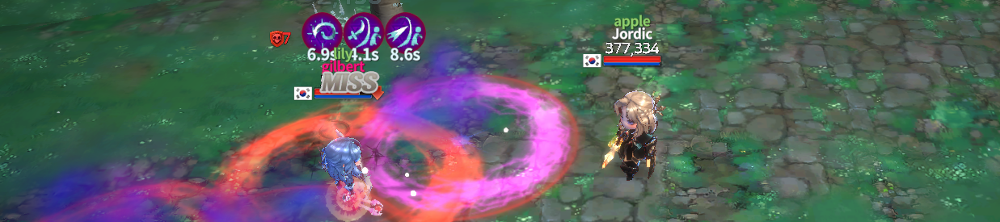
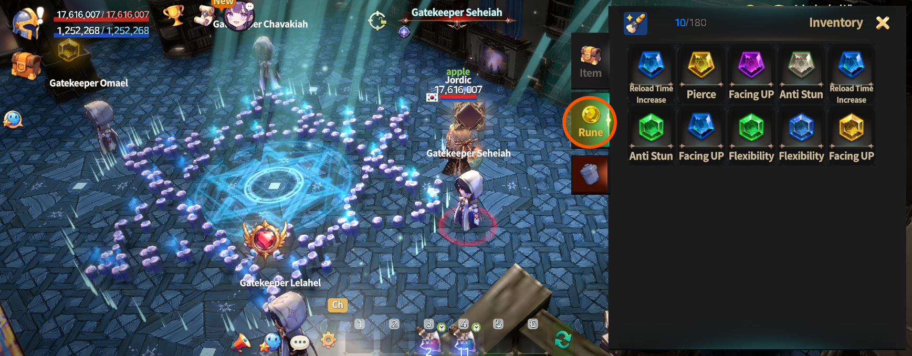
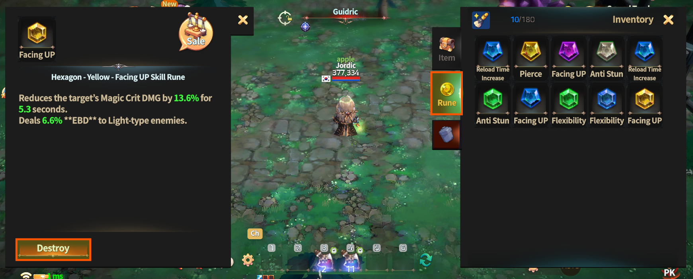
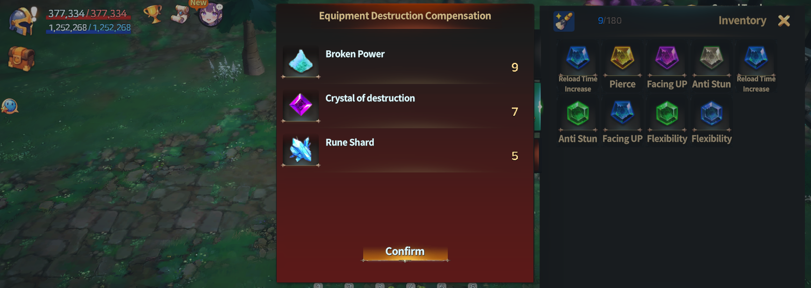
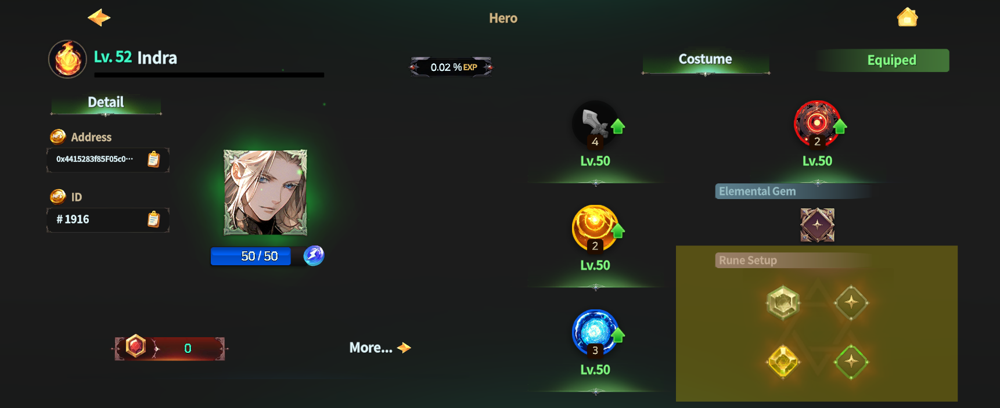
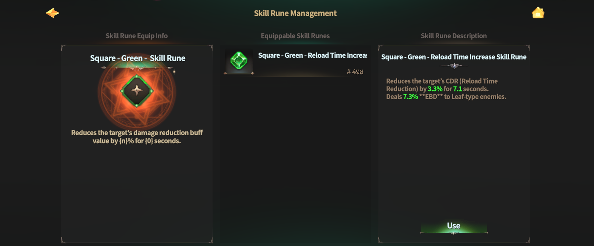
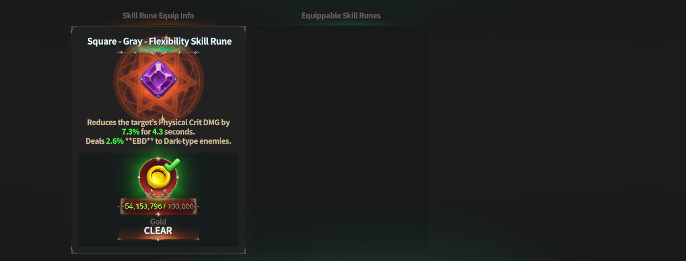

# 🎖️ Skill Rune

<figure><figcaption></figcaption></figure>



### **◾** Skill Runes

Skill Runes are a system that grants additional effects to the third skill of a Succession Hero.\
After performing Hero Succession, four Skill Rune slots are unlocked for the third skill.\
You can equip Skill Runes that you have crafted into these slots.

Most materials required to craft Skill Runes can be obtained through [dungeon](../../../gamemode/naraka-dungeon.md) content.

<figure><figcaption></figcaption></figure>

***

### **◾** Skill Rune Effects

The special effects of Skill Runes are activated **when the third skill is used**.

The effects are **applied to enemies hit by the skill** for a certain duration.\
Skill Rune effects apply only between the user and the affected target.\
When an effect is applied, an active effect indicator appears above the target’s head.

However, Skill Rune effects do not apply to normal monsters that do not have buff effects\
(such as damage increase or damage reduction).\
In this case, no indicator may appear above the target.

<figure><figcaption></figcaption></figure>

***

### **◾** Skill Rune Inventory Management

Skill Runes are managed separately from general items.\
Obtained Skill Runes are stored in the **Rune** **category** of the Inventory.\
&#xNAN;_&#x53;kill Runes are not dropped upon PK death._

<figure><figcaption></figcaption></figure>

When you select a Skill Rune from Inventory > Rune Category,\
the **\[Destroy]** button appears at the bottom of the screen.

<figure><figcaption></figcaption></figure>

Tapping the **\[Destroy]** button destroys the selected Skill Rune and grants byproducts.\
👉 [**Go to Skill Rune Destruction Probability Guide**](skill-rune.md#skill-rune-destruction-probability-guide)

<figure><figcaption></figcaption></figure>

***

### **◾** Equipping and Removing Skill Runes

To equip a Skill Rune, tap a Skill Rune slot on the Hero Information screen.

<figure><figcaption></figcaption></figure>

A list of equippable Skill Runes will be displayed.\
Tap the **\[Use]** button to equip the Rune immediately.

<figure><figcaption></figcaption></figure>

Once equipped, the image of the slot changes.\
Removing an equipped Skill Rune requires a Gold fee.

<figure><figcaption></figcaption></figure>

***

### **◾** Skill Rune Destruction Probability Guide

When destroying a Skill Rune, \
the item acquisition probabilities can be checked in the table below.

🔸 **Item Drop Rate Table upon Skill Rune Destruction**

|           | Broken Power |         | Crystal of Destruction |        | Crystal of Courage |        | Rune Fragment |       | EXP Bottle |     |
| :-------: | :----------: | :-----: | :--------------------: | :----: | :----------------: | :----: | :-----------: | :---: | :--------: | :-: |
|   SQUARE  |     100%     |  2 - 10 |           20%          |  1 - 3 |         20%        |  1 - 3 |      100%     | 1 - 2 |     5%     |  1  |
| PENTAGRAM |     100%     |  5 - 15 |           30%          |  2 - 6 |         30%        |  2 - 6 |      100%     | 2 - 3 |     6%     |  1  |
|  HEXAGON  |     100%     |  8 - 20 |           40%          |  4 - 8 |         40%        |  4 - 8 |      100%     | 4 - 5 |     8%     |  1  |
|   CIRCLE  |     100%     | 10 - 30 |           50%          | 6 - 10 |         50%        | 6 - 10 |      100%     | 5 - 6 |     10%    |  1  |



### **◾ 스킬 룬**

스킬 룬은 계승된 영웅의 **세 번째 스킬**에 추가 효과를 부여하는 시스템입니다.\
영웅을 계승하면, 세 번째 스킬에 **4개의 스킬 룬 슬롯**이 생성됩니다.\
이 슬롯에는 직접 제작한 스킬 룬을 장착할 수 있습니다.

스킬 룬 제작에 필요한 대부분의 재료는 [던전](../../../gamemode/naraka-dungeon.md) 콘텐츠를 통해 획득할 수 있습니다.

<figure><figcaption></figcaption></figure>

***

### **◾ 스킬 룬 효과**

스킬 룬의 특수 효과는 **세 번째 스킬 사용 시** 발동됩니다.

효과는 해당 스킬에 **피격된 대상**에게 일정 시간 동안 적용됩니다.\
스킬 룬 효과는 사용자와 피격 대상 사이에서만 적용되며,\
효과가 적용된 대상은 머리 위에 활성화 표시가 나타납니다.

단, 버프 효과(데미지 증가, 데미지 감소 등)가 없는 일반 몬스터에게는 스킬 룬 효과가 적용되지 않습니다.\
이 경우, 대상의 머리 위에는 별도의 표시가 나타나지 않을 수 있습니다.

<figure><figcaption></figcaption></figure>

***

### **◾ 스킬 룬 인벤토리 관리**

스킬 룬은 일반 아이템과 분리되어 관리됩니다.\
획득한 스킬 룬은 인벤토리의 **룬 카테고리**에 저장됩니다.\
&#xNAN;_&#xC2A4;킬 룬은 PK 사망 시에도 드롭되지 않습니다._

<figure><figcaption></figcaption></figure>

인벤토리 > 룬 카테고리에서 스킬 룬을 선택하면, 화면 하단에 **\[파괴]** 버튼이 표시됩니다.

<figure><figcaption></figcaption></figure>

**\[파괴]** 버튼을 터치하면 선택한 스킬 룬이 파괴되며, 부산물을 획득할 수 있습니다.\
👉 [**스킬 룬 파괴 확률 안내 바로가기**](skill-rune.md#undefined-6)

<figure><figcaption></figcaption></figure>

***

### **◾ 스킬 룬 장착 및 해제**

스킬 룬을 장착하려면, 영웅 정보 화면에서 스킬 룬 슬롯을 터치하세요.

<figure><figcaption></figcaption></figure>

장착 가능한 스킬 룬 목록이 표시되며, **\[사용]** 버튼을 터치하면 즉시 장착됩니다.

<figure><figcaption></figcaption></figure>

스킬 룬 장착 시 해당 슬롯의 이미지가 변경됩니다.\
장착된 스킬 룬을 해제할 경우, **골드 수수료**가 필요합니다.

<figure><figcaption></figcaption></figure>

***

### **◾ 스킬 룬 파괴 확률 안내**

스킬 룬을 파괴할 경우, 아이템 획득 확률은 아래 확률표를 통해 확인할 수 있습니다.

🔸 **스킬룬 파괴 시 아이템 확률표**&#x20;

| 스킬룬 | 부서진 힘 |         | 파괴의 결정 |        | 용기의 결정 |        | 룬의 조각 |       | EXP 보틀 |     |
| :-: | :---: | :-----: | :----: | :----: | :----: | :----: | :---: | :---: | :----: | :-: |
|  사각 |  100% |  2 - 10 |   20%  |  1 - 3 |   20%  |  1 - 3 |  100% | 1 - 2 |   5%   |  1  |
|  오각 |  100% |  5 - 15 |   30%  |  2 - 6 |   30%  |  2 - 6 |  100% | 2 - 3 |   6%   |  1  |
|  육각 |  100% |  8 - 20 |   40%  |  4 - 8 |   40%  |  4 - 8 |  100% | 4 - 5 |   8%   |  1  |
|  원  |  100% | 10 - 30 |   50%  | 6 - 10 |   50%  | 6 - 10 |  100% | 5 - 6 |   10%  |  1  |



### **◾** スキルルーン

スキルルーンは、継承されたヒーローの **3番目のスキルに 追加効果を付与**するシステムです。\
ヒーローを継承すると、3番目のスキルに 4つのスキルルーンスロットが解放されます。\
これらのスロットには、自分で制作したスキルルーンを 装着できます。

スキルルーン制作に必要な ほとんどの素材は、[ダンジョンコンテンツ](../../../gamemode/naraka-dungeon.md)を通じて 入手できます。

<figure><figcaption></figcaption></figure>

***

### **◾** スキルルーン効果

スキルルーンの特殊効果は、**3番目のスキル使用時**に発動します。

効果は、スキルが命中した対象に 一定時間適用されます。\
スキルルーン効果は、使用者と命中した対象の間でのみ 適用されます。\
効果が適用されると、対象の頭上に 有効化された効果表示が現れます。

ただし、ダメージ増加やダメージ減少などの バフ効果を持たない\
通常モンスターには、スキルルーン効果は適用されません。

この場合、対象の頭上に 表示が出ないことがあります。

<figure><figcaption></figcaption></figure>

***

### **◾** スキルルーンインベントリ管理

スキルルーンは、一般アイテムとは別に管理されます。\
獲得したスキルルーンは、インベントリの **ルーンカテゴリ**ーに保存されます。\
スキルルーンは、PKによる死亡時にも ドロップされません。

<figure><figcaption></figcaption></figure>

インベントリ > ルーンカテゴリーで スキルルーンを選択すると、\
画面下部に **\[破壊]** ボタンが表示されます。

<figure><figcaption></figcaption></figure>

**\[破壊]** ボタンをタップすると、選択したスキルルーンが破壊され、副産物を獲得できます。

👉 [**スキルルーン破壊確率案内はこちら**](skill-rune.md#sukirurn-2)

<figure><figcaption></figcaption></figure>

***

### **◾** スキルルーン装着および解除

スキルルーンを装着するには、ヒーロー情報画面で スキルルーンスロットをタップしてください。

<figure><figcaption></figcaption></figure>

装着可能なスキルルーンの一覧が表示されます。
\
\[**使用**] ボタンをタップすると、
即座に装着されます。

<figure><figcaption></figcaption></figure>

スキルルーン装着後は、
該当スロットの画像が変更されます。\
装着中のスキルルーンを解除する場合、ゴールド手数料が必要です。

<figure><figcaption></figcaption></figure>

***

### **◾** スキルルーン破壊確率案内

スキルルーンを破壊した際の アイテム獲得確率は、下記の確率表で確認できます。

🔸 **スキルルーン破壊時アイテム確率表**

|     | 壊れた力 |         | 破壊の結晶 |        | 勇気の結晶 |        | ルーンの欠片 |       | EXPボトル |     |
| :-: | :--: | :-----: | :---: | :----: | :---: | :----: | :----: | :---: | :----: | :-: |
|  四角 | 100% |  2 - 10 |  20%  |  1 - 3 |  20%  |  1 - 3 |  100%  | 1 - 2 |   5%   |  1  |
|  五角 | 100% |  5 - 15 |  30%  |  2 - 6 |  30%  |  2 - 6 |  100%  | 2 - 3 |   6%   |  1  |
|  六角 | 100% |  8 - 20 |  40%  |  4 - 8 |  40%  |  4 - 8 |  100%  | 4 - 5 |   8%   |  1  |
|  円形 | 100% | 10 - 30 |  50%  | 6 - 10 |  50%  | 6 - 10 |  100%  | 5 - 6 |   10%  |  1  |



<em>※ This guide was written based on the game status as of January 6, 2026,</em>  <em>and its contents may change with future updates.</em>

