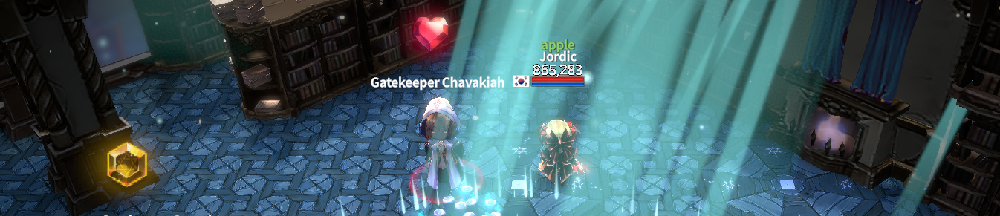
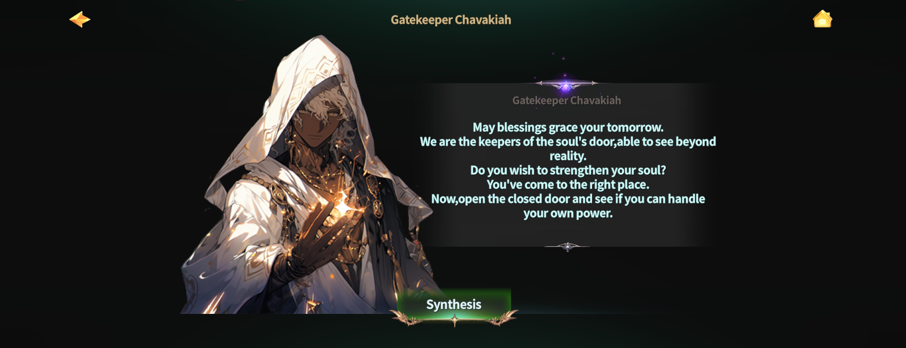
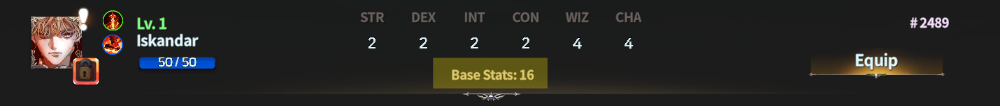

# 👬 Synthesis



### ◾ Hero Synthesis

Through Hero NFT Synthesis, you can grow your Hero into one with higher base stats.

***

### ◾ Why use Synthesis?

All Hero NFTs in EXTOCIUM have [base stats](../heroes/stats/special-stats/).\
Base stats affect the following content.

* [Mining](../mining-settings/) efficiency
* Combat efficiency
* [Succession](succession/) requirements

When a Hero is summoned, its base stats are determined **randomly based on probability**.\
Even Heroes with lower base stats can be upgraded step by step through Synthesis.

By using Hero NFTs with the same base stats as materials,\
you can increase the base stat by 1 level.

This page explains how **Hero Synthesis** works and the rules you need to know.

***

### ◾ Go to Synthesis

Hero Synthesis can be accessed at the following location:

* Rottenhill > [Magic Shop](../../field-info/rotten-hill/magic-shop/) > [**Ashurbanipal Library**](../../field-info/rotten-hill/magic-shop/ashurbanipal-library/)

<figure><figcaption></figcaption></figure>

Among the four NPCs in the Ashurbanipal Library, talk to [**Chavakiah**](../../field-info/rotten-hill/magic-shop/ashurbanipal-library/npc-library.md#the-weaver-of-synthesis).

<figure><figcaption></figcaption></figure>

After the conversation, tap the \[**Synthesis**] button to move to the Hero Synthesis screen.

<figure><figcaption></figcaption></figure>

***

### ◾ How to Synthesize

The Synthesis screen uses two slots to proceed.

<figure><figcaption></figcaption></figure>

#### ① Select the Target Hero

Select the **Hero NFT to be used as the main Hero** in Slot 1.\
The main Hero’s base stat will increase after synthesis.

#### ② Select the Material Hero

Select the **Hero NFT to be used as material** in Slot 2.\
The material Hero will be consumed.


#### Please choose the main Hero and material carefully when synthesizing.


***

#### Synthesis Process

* Tap Slot 1 to view a list of Heroes eligible for synthesis.\
  Tap the \[**Select**] button to choose the main Hero.

<figure><figcaption></figcaption></figure>

* Tap Slot 2 to view a list of Heroes that can be used as materials.\
  Heroes that do not meet the requirements or are currently equipped\
  will not appear in the list.

<figure><figcaption></figcaption></figure>

* Once all required Gold is prepared, tap the \[**Synthesize**] button to proceed.

<figure><figcaption></figcaption></figure>

***

#### Synthesis Result Example

As a result of synthesis, Hero #2489’s base stat increased from **15 → 16.**

<figure><figcaption></figcaption></figure>

***

### ◾ Synthesis Rules and Materials

You can check the required steps and materials for Hero Synthesis in the table below.\
&#xNAN;_&#x41; Hero’s base stat can be upgraded up to a maximum of 21._

<table><thead><tr><th width="148">Grade</th><th>Required Materials</th><th>Additional Materials</th></tr></thead><tbody><tr><td>15 ▶️16</td><td>Base Stat 15 - 1 Hero NFT</td><td>8.88 million gold</td></tr><tr><td>16▶️17</td><td>Base Stat 16 - 1 Hero NFT</td><td>8.88 million gold</td></tr><tr><td>17▶️18</td><td>Base Stat 17 - 1 Hero NFT</td><td>8.88 million gold</td></tr><tr><td>18▶️19</td><td>Base Stat 18 - 1 Hero NFT</td><td>8.88 million gold</td></tr><tr><td>19▶️20</td><td>Base Stat 19 - 1 Hero NFT</td><td>8.88 million gold</td></tr><tr><td>20▶️21</td><td>Base Stat 20 - 1 Hero NFT</td><td>8.88 million gold,  10 Breath of God</td></tr></tbody></table>



### ◾ 영웅 합성

영웅 NFT 합성을 통해 더 높은 **베이스 스탯**을 가진 영웅으로 성장시킬 수 있습니다.

***

### ◾ 왜 합성을 하나요?

EXTOCIUM의 모든 영웅 NFT에는 [**베이스 스탯**](../heroes/basic-heroes/#undefined-3)이 존재합니다.\
베이스 스탯은 다음과 같은 콘텐츠에 영향을 줍니다.

* [채굴](../mining-settings/) 효율
* 전투 효율
* [계승](succession/) 조건

영웅을 **소환**하면 베이스 스탯은 **확률에 따라 무작위로 결정**됩니다.\
베이스 스탯이 낮은 영웅도 합성을 통해 **단계적으로 성장**시킬 수 있습니다.\
같은 베이스 스탯을 가진 영웅 NFT를 재료로 사용하면, 베이스 스탯을 **1단계씩 상승**시킬 수 있습니다.

이 페이지에서는 영웅 합성 방법과 규칙을 안내합니다.

***

### ◾ 합성하러 가기

영웅 합성은 아래 위치에서 진행할 수 있습니다.

* 로튼힐 > [마법 상점](../../field-info/rotten-hill/magic-shop/) > [**아슈르바니팔 도서관**](../../field-info/rotten-hill/magic-shop/ashurbanipal-library/)

<figure><figcaption></figcaption></figure>

아슈르바니팔 도서관에 있는 4명의 NPC 중 ‘[**차바키아**](../../field-info/rotten-hill/magic-shop/ashurbanipal-library/npc-library.md#the-weaver-of-synthesis)’와 대화하세요.

<figure><figcaption></figcaption></figure>

대화 후, **\[합성]** 버튼을 터치하면 영웅 합성 화면으로 이동합니다.

<figure><figcaption></figcaption></figure>

***

### ◾ 합성하기

합성 화면에서는 두 개의 슬롯을 사용하여 합성을 진행합니다.

<figure><figcaption></figcaption></figure>

#### ① 합성 주체 선택

1번 슬롯에 **합성 주체가 될 영웅 NFT**를 선택합니다.\
합성 주체는 합성 후 **베이스 스탯이 증가**합니다.

#### ② 합성 재료 선택

2번 슬롯에 **합성 재료로 사용할 영웅 NFT**를 선택합니다.\
합성 재료로 사용된 영웅은 **소멸**됩니다.


#### 합성 시에는 주체와 재료를 신중하게 선택해 주세요.


***

#### 합성 진행 방법

* 1번 슬롯을 터치하면 합성이 가능한 영웅 NFT 목록이 표시됩니다.\
  &#xNAN;**\[선택]** 버튼을 터치하여 합성 주체를 선택하세요.

<figure><figcaption></figcaption></figure>

* 2번 슬롯을 터치하면 재료로 사용할 수 있는 영웅 NFT 목록이 표시됩니다.\
  조건에 맞지 않는 영웅이나 현재 장착 중인 영웅은 표시되지 않습니다.

<figure><figcaption></figcaption></figure>

* 필요한 골드가 모두 준비되었다면 **\[합성]** 버튼을 터치하여 합성을 진행하세요.

<figure><figcaption></figcaption></figure>

***

#### 합성 결과 예시

영웅 #2489의 합성 결과, 베이스 스탯이 **15 → 16**으로 상승하였습니다.

<figure><figcaption></figcaption></figure>

***

### ◾ 합성 규칙 및 재료

영웅 합성에 필요한 단계와 재료는 아래 도표를 통해 확인할 수 있습니다.\
&#xNAN;_&#xC601;웅의 베이스 스탯은 **최대 21까지** 업그레이드할 수 있습니다._

<table><thead><tr><th width="148">등급</th><th>필요 재료</th><th>부가 재료</th></tr></thead><tbody><tr><td>15 ▶️16</td><td>Base Stat 15 - Hero NFT 1종</td><td>888만 골드</td></tr><tr><td>16▶️17</td><td>Base Stat 16 - Hero NFT 1종</td><td>888만 골드</td></tr><tr><td>17▶️18</td><td>Base Stat 17 - Hero NFT 1종</td><td>888만 골드</td></tr><tr><td>18▶️19</td><td>Base Stat 18 - Hero NFT 1종</td><td>888만 골드</td></tr><tr><td>19▶️20</td><td>Base Stat 19 - Hero NFT 1종</td><td>888만 골드</td></tr><tr><td>20▶️21</td><td>Base Stat 20 - Hero NFT 1종</td><td>888만 골드, 신의 숨결 10개</td></tr></tbody></table>



### ◾ ヒーロー合成

ヒーローNFTを合成することで、\
より高い**ベースステータス**を持つヒーローへ成長させることができます。

***

### ◾ なぜ合成を行うのですか？

EXTOCIUMのすべてのヒーローNFTには [**ベースステータス**](../heroes/stats/special-stats/)が存在します。\
ベースステータスは、以下のコンテンツに影響します。

* [採掘](../mining-settings/)効率
* 戦闘効率
* [継承](succession/)条件

ヒーローを召喚すると、ベースステータスは確率に応じてランダムに決定されます。\
ベースステータスが低いヒーローでも、合成を通じて段階的に成長させることができます。

同じベースステータスを持つヒーローNFTを素材として使用すると、\
ベースステータスを1段階ずつ上昇させることができます。

このページでは、ヒーロー合成の方法とルールを案内します。

***

### ◾ 合成しに行く

ヒーロー合成は、以下の場所で行うことができます。

* ロトンヒル > [魔法ショップ](../../field-info/rotten-hill/magic-shop/) > [**アシュルバニパル図書館**](../../field-info/rotten-hill/magic-shop/ashurbanipal-library/)

<figure><figcaption></figcaption></figure>

アシュルバニパル図書館にいる 4人のNPCのうち、[**チャバキア**](../../field-info/rotten-hill/magic-shop/ashurbanipal-library/npc-library.md#the-weaver-of-synthesis)と会話してください。

<figure><figcaption></figcaption></figure>

会話後、\[**合成**]ボタンをタップすると ヒーロー合成画面に移動します。

<figure><figcaption></figcaption></figure>

***

### ◾ 合成する

合成画面では、2つのスロットを使用して合成を行います。

<figure><figcaption></figcaption></figure>

#### ① 合成主体の選択

1番スロットに、**合成主体となるヒーローNFT**を選択します。\
合成後、合成主体のベースステータスが上昇します。

#### ② 合成素材の選択

2番スロットに、**合成素材として使用するヒーローNFT**を選択します。\
合成素材として使用されたヒーローは消滅します。


#### 合成時は、主体と素材を慎重に選択してください。


***

#### 合成の進め方

*   1番スロットをタップすると、合成可能なヒーローNFTの一覧が表示されます。

    \[**選択**]ボタンをタップして 合成主体を選択してください。

<figure><figcaption></figcaption></figure>

*   2番スロットをタップすると、素材として使用できるヒーローNFTの一覧が表示されます。

    条件に合わないヒーローや、現在装備中のヒーローは表示されません。

<figure><figcaption></figcaption></figure>

* 必要なゴールドがすべて揃っている場合、\[**合成**]ボタンをタップして合成を進めてください。

<figure><figcaption></figcaption></figure>

***

#### 合成結果例

ヒーロー #2489の合成結果、ベースステータスが**15 → 16**に上昇しました。

<figure><figcaption></figcaption></figure>

***

### ◾ 合成ルールおよび素材

ヒーロー合成に必要な段階と素材は、下記の表で確認できます。\
ヒーローのベースステータスは 最大21までアップグレード可能です。

<table><thead><tr><th width="148">グレード</th><th>必要材料</th><th>追加材料</th></tr></thead><tbody><tr><td>15 ▶️16</td><td>Base Stat 15 - Hero NFT 1体</td><td>888万ゴールド</td></tr><tr><td>16▶️17</td><td>Base Stat 16 - Hero NFT 1体</td><td>888万ゴールド</td></tr><tr><td>17▶️18</td><td>Base Stat 17 - Hero NFT 1体</td><td>888万ゴールド</td></tr><tr><td>18▶️19</td><td>Base Stat 18 - Hero NFT 1体</td><td>888万ゴールド</td></tr><tr><td>19▶️20</td><td>Base Stat 19 - Hero NFT 1体</td><td>888万ゴールド</td></tr><tr><td>20▶️21</td><td>Base Stat 20 - Hero NFT 1体</td><td>888万ゴールド, 神の息吹 10個</td></tr></tbody></table>



<em>※ This guide was written based on the game status as of January 6, 2026,</em>  <em>and its contents may change with future updates.</em>

