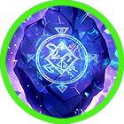
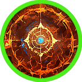
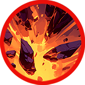

# 🪨 Aristo



<table data-card-size="large" data-view="cards"><thead><tr><th></th><th data-hidden data-card-cover data-type="files"></th><th data-hidden data-card-target data-type="content-ref"></th></tr></thead><tbody><tr><td></td><td><a href="../../../.gitbook/assets/Git_Hero_Aristo.png">Git_Hero_Aristo.png</a></td><td><a href="../">..</a></td></tr><tr><td></td><td><a href="../../../.gitbook/assets/Git_Hero_Aristo_stone.png">Git_Hero_Aristo_stone.png</a></td><td><a href="../stats/elemental-bonus-damage.md#elemental-bonus-damage-table">#elemental-bonus-damage-table</a></td></tr></tbody></table>



### 📒 Aristo: The Scholar in the Crossfire

"Knowledge is power. Power is a trap."

Aristo is the mind behind Asterica’s progress. A legendary scholar entrusted by the goddess Aruru to unlock the secrets of Extocium, he has spent his life in pursuit of the "next big thing." He was even Iskandal’s mentor, seeing the boy's potential long before the rest of the world did.

But Aristo’s ivory tower is crumbling. King Sargon, terrified of the monsters wielding Extocium on the battlefield, has given Aristo an impossible, unethical order: graft the power of Extocium onto the First Prince—a man with zero natural resonance.

Aristo knows this isn't about the kingdom’s safety; it’s about the King’s fear of Iskandal. Aristo is no longer a seeker of truth; he’s a pawn in a game of thrones. Caught between his loyalty to the crown and his duty to the laws of magic, Aristo is realizing that some secrets were meant to stay buried.



#### 📒아리스토 - 지식의 수호자와 갈등의 중심

아리스토는 아스테리카 왕국에서 손꼽히는 학자로, 여신 아루루의 명을 받아 엑스토시움과 그에 얽힌 고대 유적 연구를 총괄하는 인물이다. 그는 지식과 진보를 무엇보다 소중히 여기며, 새로운 기술을 탐구하고 이를 후학들에게 전하는 일에 평생을 바쳐왔다. 어린 시절 이스칸달의 스승이기도 했던 아리스토는, 제자에게서 뛰어난 재능과 위험한 가능성을 동시에 보아 왔다. 그의 삶은 언제나 학문과 책임 위에 놓여 있었지만, 최근 들어 그의 마음에는 쉽게 떨쳐낼 수 없는 무거운 고민이 자리 잡고 있다.

그 고민의 시작은 사르곤 왕의 비밀스러운 부탁이었다. 전선에서 엑스토시움의 힘을 자유자재로 다루는 괴물들을 목격한 사르곤은, 그 힘의 근원에 강한 집착을 보이기 시작했다. 괴물들을 사로잡아 연구하려는 시도는 실패로 끝났고, 결국 왕은 아리스토에게 불가능에 가까운 요구를 내린다. 엑스토시움에 반응하지 않는 첫 번째 왕자에게, 그 힘을 부여해 달라는 것이었다. 자연의 이치를 거스르는 이 요청에 아리스토는 깊은 혼란을 느꼈지만, 왕의 명령을 거역할 수 없어 결국 연구를 약속하고 만다.

그러나 아리스토의 마음속 불안은 쉽게 가라앉지 않는다. 사르곤의 의도가 단순한 부성애가 아니라는 사실을, 그는 이미 눈치채고 있었기 때문이다. 왕의 시선에는 이스칸달을 향한 두려움과 경계가 선명하게 담겨 있었다. 엑스토시움과 깊이 교감하며 점점 영향력을 키워 가는 이스칸달은, 사르곤에게 위협적인 존재가 되어 가고 있었다. 그제야 아리스토는 자신이 지식을 위한 연구자가 아니라, 왕의 정치적 계산 속 한 수로 이용되고 있음을 깨닫는다. 진실을 지키고자 하는 신념과 왕의 명령 사이에서, 아리스토는 깊은 갈등의 소용돌이 속으로 빠져든다.



#### 📒アリスト（Aristo）：智の守護者、葛藤の螺旋

「知識は諸刃の剣。賢者さえも、王の盤上の駒に過ぎぬのか。」

アステリカ王国最高の知性、アリスト。女神アルルの命を受け、エクストシウムと古代遺跡の研究を一手に引き受けてきた彼は、文明の進歩にその生涯を捧げてきました。かつて教え子であったイスカンダルの中に、眩い才能と共に「危うい野心」を見出していたのも、彼の鋭い観察眼ゆえのこと。

しかし、知を愛する彼の平穏は、サルゴン王からの密命によって打ち砕かれます。「エクストシウムに反応しない第一王子に、その力を無理やり植え付けろ」という、自然の理に背く禁忌の要求。それは、イスカンダルの台頭を恐れる王の、狂気じみた防衛本能でした。

学者としての倫理と、臣下としての忠誠。その狭間で、アリストは苦悩します。自分はもはや真理を追う探究者ではなく、醜い政治闘争の「道具」に成り下がってしまったのではないか。翻弄される賢者の選択が、王国の未来を大きく揺るがそうとしています。



### ❇️Aristo‘s skill list     &#x20;

<table data-full-width="true"><thead><tr><th width="209">Skill</th><th width="101" align="center">Icon</th><th width="112">Type</th><th width="469">contents</th><th align="center">loot prob</th></tr></thead><tbody><tr><td>Poetry of Rock 바위의 시학 岩の詩学 </td><td align="center"></td><td><mark style="color:green;">Buff</mark></td><td>
<strong>EN</strong> Generates a shield for a set duration that reduces the damage you take. While active, MP is consumed every second.

🔹 <strong>KR</strong> 정해진 시간 동안 받는 데미지를 감소시키는 실드를 생성합니다. 스킬이 유지되는 동안 매초 MP가 소모됩니다.

🔹 <strong>JP</strong> 一定時間、自身が受けるダメージを減少させるシールドを生成します。効果中は毎秒MPを消費します。
</td><td align="center">15%</td></tr><tr><td>4Elements of earth 4원소 중 흙 四元素中土</td><td align="center"></td><td><mark style="color:green;">Buff</mark></td><td>
<strong>EN</strong> For a set duration, your damage increases, and Critical Hit and Skill Critical Hit bonuses are increased. While active, MP is consumed every second.

🔹 <strong>KR</strong> 정해진 시간 동안 데미지가 증가하며, 치명타 및 스킬 치명타 보너스가 상승합니다. 스킬이 유지되는 동안 매초 MP가 소모됩니다.

🔹 <strong>JP</strong> 一定時間、ダメージが増加し、クリティカルおよびスキルクリティカルボーナスが上昇します。効果中は毎秒MPを消費します。
</td><td align="center">15%</td></tr><tr><td>Let’s study 공부하자 勉強しよう</td><td align="center"></td><td><mark style="color:blue;">Projectile</mark></td><td>
<strong>EN</strong> Mysterious theories, like a lullaby, are fired forward, dealing damage per projectile and stunning enemies.

🔹 <strong>KR</strong> 마치 자장가처럼 알 수 없는 이론들이 전방으로 발사되어 적에게 탄당 피해를 입히고, 적을 스턴 상태로 만듭니다.

🔹 <strong>JP</strong> 子守唄のような不思議な理論が前方に発射され、敵に弾ごとのダメージを与え、スタン状態にします。
</td><td align="center">15%</td></tr><tr><td>Lullaby 자장가 子守歌</td><td align="center"></td><td><mark style="color:blue;">Projectile</mark></td><td>
<strong>EN</strong> Fires the stone tablets of the School of Athens forward, dealing damage per projectile and knocking back the target. Elemental bonus damage is increased.

🔹 <strong>KR</strong> 아테네 학당의 석판을 전방으로 발사해 타겟에게 탄당 피해를 입히고, 넉백시킵니다. 상성에 따른 <strong>부가 데미지</strong>가 증가합니다.

🔹 <strong>JP</strong> アテネ学堂の石版を前方に発射し、ターゲットに弾ごとのダメージを与え、ノックバックさせます。属性相性に応じた<strong>追加ダメージ</strong>が増加します。
</td><td align="center">15%</td></tr><tr><td>Teachings of the earth 땅의 가르침 地の教え</td><td align="center"></td><td><mark style="color:red;">AoE</mark></td><td>
<strong>EN</strong> Random rocks rise from the ground across a wide area, dealing damage to enemies. Elemental bonus damage is increased.

🔹 <strong>KR</strong> 광범위한 범위에 무작위로 바위가 솟아나 적들에게 피해를 입힙니다. 상성에 따른 <strong>부가 데미지</strong>가 증가합니다.

🔹 <strong>JP</strong> 広範囲に無作為に岩が出現し、敵にダメージを与えます。属性相性に応じた<strong>追加ダメージ</strong>が増加します。
</td><td align="center">15%</td></tr><tr><td>War of words 설전 舌戦</td><td align="center"></td><td><mark style="color:blue;">Projectile</mark></td><td>
<strong>EN</strong> Engages in a philosophical debate between Plato and the Idea, dealing damage to enemies within the area. Elemental bonus damage is increased.

🔹 <strong>KR</strong> 플라톤과 이데아의 설전을 벌여 범위 내 적들에게 피해를 입힙니다. 상성에 따른 <strong>부가 데미지</strong>가 증가합니다.

🔹 <strong>JP</strong> プラトンとイデアの討論を繰り広げ、範囲内の敵にダメージを与えます。属性相性に応じた<strong>追加ダメージ</strong>が増加します。
</td><td align="center">15%</td></tr><tr><td>Metaphysics 형이상학 形而上学</td><td align="center"></td><td><mark style="color:purple;">Summon</mark></td><td>
<strong>EN</strong> Summons a stone golem from the transcendental realm for a set duration. The golem attacks nearby enemies with powerful strength. Elemental bonus damage is increased.

🔹 <strong>KR</strong> 초월계에서 돌 골렘을 소환합니다. 돌 골렘은 정해진 시간 동안 소환되어 강력한 힘으로 주변의 적을 공격합니다. 상성에 따른 <strong>부가 데미지</strong>가 증가합니다.

🔹 <strong>JP</strong> 超越界から石ゴーレムを一定時間召喚します。ゴーレムは強力な力で周囲の敵を攻撃します。属性相性に応じた<strong>追加ダメージ</strong>が増加します。
</td><td align="center">10%</td></tr></tbody></table>

<em>※ This guide was written based on the game status as of December 29, 2025,</em>  <em>and its contents may change with future updates.</em>

