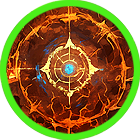
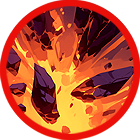

# 🪨 Aristo



<table data-card-size="large" data-view="cards"><thead><tr><th></th><th data-hidden data-card-cover data-type="files"></th><th data-hidden data-card-target data-type="content-ref"></th></tr></thead><tbody><tr><td></td><td><a href="../../../.gitbook/assets/Git_Hero_Aristo.png">Git_Hero_Aristo.png</a></td><td><a href="../">..</a></td></tr><tr><td></td><td><a href="../../../.gitbook/assets/Git_Hero_Aristo_stone.png">Git_Hero_Aristo_stone.png</a></td><td><a href="../stats/elemental-bonus-damage.md#elemental-bonus-damage-table">#elemental-bonus-damage-table</a></td></tr></tbody></table>



### 📒 Aristo: The Scholar in the Crossfire

"Knowledge is power. Power is a trap."

Aristo is the mind behind Asterica’s progress. A legendary scholar entrusted by the goddess Aruru to unlock the secrets of Extocium, he has spent his life in pursuit of the "next big thing." He was even Iskandal’s mentor, seeing the boy's potential long before the rest of the world did.

But Aristo’s ivory tower is crumbling. King Sargon, terrified of the monsters wielding Extocium on the battlefield, has given Aristo an impossible, unethical order: graft the power of Extocium onto the First Prince—a man with zero natural resonance.

Aristo knows this isn't about the kingdom’s safety; it’s about the King’s fear of Iskandal. Aristo is no longer a seeker of truth; he’s a pawn in a game of thrones. Caught between his loyalty to the crown and his duty to the laws of magic, Aristo is realizing that some secrets were meant to stay buried.



#### 📒아리스토 - 지식의 수호자와 갈등의 중심

아리스토는 아스테리카 왕국에서 손꼽히는 학자로, 여신 아루루의 명을 받아 엑스토시움과 그에 얽힌 고대 유적 연구를 총괄하는 인물이다. 그는 지식과 진보를 무엇보다 소중히 여기며, 새로운 기술을 탐구하고 이를 후학들에게 전하는 일에 평생을 바쳐왔다. 어린 시절 이스칸달의 스승이기도 했던 아리스토는, 제자에게서 뛰어난 재능과 위험한 가능성을 동시에 보아 왔다. 그의 삶은 언제나 학문과 책임 위에 놓여 있었지만, 최근 들어 그의 마음에는 쉽게 떨쳐낼 수 없는 무거운 고민이 자리 잡고 있다.

그 고민의 시작은 사르곤 왕의 비밀스러운 부탁이었다. 전선에서 엑스토시움의 힘을 자유자재로 다루는 괴물들을 목격한 사르곤은, 그 힘의 근원에 강한 집착을 보이기 시작했다. 괴물들을 사로잡아 연구하려는 시도는 실패로 끝났고, 결국 왕은 아리스토에게 불가능에 가까운 요구를 내린다. 엑스토시움에 반응하지 않는 첫 번째 왕자에게, 그 힘을 부여해 달라는 것이었다. 자연의 이치를 거스르는 이 요청에 아리스토는 깊은 혼란을 느꼈지만, 왕의 명령을 거역할 수 없어 결국 연구를 약속하고 만다.

그러나 아리스토의 마음속 불안은 쉽게 가라앉지 않는다. 사르곤의 의도가 단순한 부성애가 아니라는 사실을, 그는 이미 눈치채고 있었기 때문이다. 왕의 시선에는 이스칸달을 향한 두려움과 경계가 선명하게 담겨 있었다. 엑스토시움과 깊이 교감하며 점점 영향력을 키워 가는 이스칸달은, 사르곤에게 위협적인 존재가 되어 가고 있었다. 그제야 아리스토는 자신이 지식을 위한 연구자가 아니라, 왕의 정치적 계산 속 한 수로 이용되고 있음을 깨닫는다. 진실을 지키고자 하는 신념과 왕의 명령 사이에서, 아리스토는 깊은 갈등의 소용돌이 속으로 빠져든다.



#### 📒アリスト（Aristo）：智の守護者、葛藤の螺旋

「知識は諸刃の剣。賢者さえも、王の盤上の駒に過ぎぬのか。」

アステリカ王国最高の知性、アリスト。女神アルルの命を受け、エクストシウムと古代遺跡の研究を一手に引き受けてきた彼は、文明の進歩にその生涯を捧げてきました。かつて教え子であったイスカンダルの中に、眩い才能と共に「危うい野心」を見出していたのも、彼の鋭い観察眼ゆえのこと。

しかし、知を愛する彼の平穏は、サルゴン王からの密命によって打ち砕かれます。「エクストシウムに反応しない第一王子に、その力を無理やり植え付けろ」という、自然の理に背く禁忌の要求。それは、イスカンダルの台頭を恐れる王の、狂気じみた防衛本能でした。

学者としての倫理と、臣下としての忠誠。その狭間で、アリストは苦悩します。自分はもはや真理を追う探究者ではなく、醜い政治闘争の「道具」に成り下がってしまったのではないか。翻弄される賢者の選択が、王国の未来を大きく揺るがそうとしています。



### ❇️Aristo‘s skill list     &#x20;

<table data-full-width="true"><thead><tr><th width="209">Skill</th><th width="101" align="center">Icon</th><th width="112">Type</th><th width="469">contents</th><th align="center">loot prob</th></tr></thead><tbody><tr><td>Poetry of Rock 바위의 시학 岩の詩学 </td><td align="center"></td><td><mark style="color:green;">Buff</mark></td><td>
<strong>EN</strong> Generates a shield that reduces the damage I take by a certain amount for a period of time. While using the skill, a portion of this skill's MP cost is reduced every second.

🔹 <strong>KR</strong> 일정 시간 동안 내가 받는 데미지를 일정량 감소시키는 실드를 생성한다. 스킬 사용 중에는 1초마다 이 스킬의 MP소모값 일부가 감소된다.

🔹 <strong>JP</strong> 一定時間, 自分が受けるダメージを一定量減少させるシールドを生成する.スキル使用中は、1秒ごとにこのスキルのMP消費量の一部が減少する。
</td><td align="center">15%</td></tr><tr><td>4Elements of earth 4원소 중 흙 四元素中土</td><td align="center"></td><td><mark style="color:green;">Buff</mark></td><td>
<strong>EN</strong> For a period of time, your Damage increases by a certain amount, and your Physical Crit DMG and Magic Crit DMG increase by a certain amount. While using the skill, a portion of this skill's MP cost is reduced every second.

🔹 <strong>KR</strong> 일정 시간 동안 자신의 데미지가 일정량 상승하며, 물리 치명타 데미지 및 마법 치명타 데미지가 일정량 증가한다. 스킬 사용 중에는 1초마다 이 스킬의 MP소모값 일부가 감소된다.

🔹 <strong>JP</strong> 一定時間、自身のダメージが一定量上昇し、物理クリDMGと魔法クリDMGが一定量増加する。スキル使用中は、1秒ごとにこのスキルのMP消費量の一部が減少する。
</td><td align="center">15%</td></tr><tr><td>Let’s study 공부하자 勉強しよう</td><td align="center"></td><td><mark style="color:blue;">Projectile</mark></td><td>
<strong>EN</strong> Fires the Stone Tablet of the Academy of Athens forward. Each hit deals magic damage to the target and knocks them back. EBD+

🔹 <strong>KR</strong> 아테네 학당의 석판을 전방으로 발사한다. 타겟은 마법 피해를 입고, 넉백된다. EBD+

🔹 <strong>JP</strong> アテネ学堂の石板を前方に発射する。ターゲットは魔法ダメージを受け、ノックバックする。 EBD+
</td><td align="center">15%</td></tr><tr><td>Lullaby 자장가 子守歌</td><td align="center"></td><td><mark style="color:blue;">Projectile</mark></td><td>
<strong>EN</strong> Unknown theories, like lullabies, are launched. Deals magic damage to enemies and stuns them.

🔹 <strong>KR</strong> 마치 자장가와 같은 알 수 없는 이론들이 발사된다. 적에게 마법 피해를 입히고, 적을 스턴 상태로 만든다.

🔹 <strong>JP</strong> まるで子守唄のような未知の理論が発射される.敵に魔法ダメージをティックごとに与え, 敵をスタン状態にする.
</td><td align="center">15%</td></tr><tr><td>Teachings of the earth 땅의 가르침 地の教え</td><td align="center"></td><td><mark style="color:red;">AoE</mark></td><td>
<strong>EN</strong> Rocks erupt at random over a wide area. Deals magic damage to enemies. Enemies hit have their Physical Magical Critical Hit Rate reduced by a certain amount for a period of time. EBD+

🔹 <strong>KR</strong> 광범위한 범위에 무작위적으로 바위가 솟아나 적에게 마법 피해를 입힌다. 피해를 입은 적은 일정 시간 동안 물리 /마법 치명타 확률이 일정량 감소한다. EBD+

🔹 <strong>JP</strong> 広範囲にわたって、岩がランダムに地面から突き出す。敵に魔法ダメージを与える。ダメージを受けた敵は一定時間、物理魔法クリティカル率が一定量減少する。 EBD+
</td><td align="center">15%</td></tr><tr><td>War of words 설전 舌戦</td><td align="center"></td><td><mark style="color:blue;">Projectile</mark></td><td>
<strong>EN</strong> Engages in a philosophical debate between Plato and the Idea, dealing magic damage to all enemies within range. Enemies hit have their Evasion Rate reduced by a certain amount for a period of time. EBD+

🔹 <strong>KR</strong> 플라톤과 이데아의 설전을 벌인다. 범위 내 적에게 마법 피해를 입힌다. 피해를 입은 적은 일정 시간 동안 회피율이 일정량 감소한다. EBD+

🔹 <strong>JP</strong> プラトンとイデアの論戦を繰り広げ、範囲内の敵に魔法ダメージを与える。被弾した敵は一定時間、回避率が一定量減少する。 EBD+
</td><td align="center">15%</td></tr><tr><td>Metaphysics 형이상학 形而上学</td><td align="center"></td><td><mark style="color:purple;">Summon</mark></td><td>
<strong>EN</strong> Summons a Stone Golem from the Transcendent Realm. The golem remains summoned for a period of time and attacks nearby enemies with magic attack power. EBD+

🔹 <strong>KR</strong> 초월계에서 돌골렘을 소환한다. 돌골렘은 일정 시간 동안 소환되어 마법 공격력으로 가까운 적을 공격한다. EBD+

🔹 <strong>JP</strong> 超越界からストーンゴーレムを召喚する。ゴーレムは一定時間召喚され、魔法攻撃力で近くの敵を攻撃する。 EBD+
</td><td align="center">10%</td></tr></tbody></table>

<em>※ This guide was written based on the game status as of April 08, 2026,</em>  <em>and its contents may change with future updates.</em>

