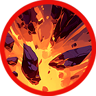

# 🔥 Skill fool - Aristo

### ❇️Video Guide



### ❇️Aristo‘s skill list     &#x20;

<table data-full-width="true"><thead><tr><th width="209">Skill</th><th width="101" align="center">Icon</th><th width="112">Type</th><th width="469">contents</th><th align="center">loot prob</th></tr></thead><tbody><tr><td>Poetry of Rock 바위의 시학 岩の詩学 </td><td align="center"></td><td>Buff</td><td>
Generates a shield for a set duration that reduces the damage you take. MP decreases every second while the skill is active. 

🔹 

정해진 시간 동안 내가 받는 데미지를 감소시키는 실드를 생성합니다. 스킬 사용 중에는 매 초마다 MP가 감소합니다. 

🔹 

一定時間、自身が受けるダメージを減少させるシールドを生成します。スキル使用中は毎秒MPが減少します。
</td><td align="center">15%</td></tr><tr><td>4Elements of earth 4원소 중 흙 四元素中土</td><td align="center"></td><td>Buff</td><td>
For a set duration, your damage increases, and critical hit and skill critical hit bonuses are increased. MP decreases every second while the skill is active. 

🔹 

정해진 시간 동안 자신의 데미지가 상승하며, 치명타 및 스킬 치명타 보너스가 증가합니다. 스킬 사용 중에는 매 초마다 MP가 감소합니다. 

🔹

 一定時間、自身のダメージが増加し、クリティカルおよびスキルクリティカルボーナスが増加します。スキル使用中は毎秒MPが減少します。
</td><td align="center">15%</td></tr><tr><td>Let’s study 공부하자 勉強しよう</td><td align="center"></td><td>Projectile</td><td>
Mysterious theories, like a lullaby, are fired, dealing damage per projectile and stunning enemies. 

🔹

 마치 자장가와 같은 알 수 없는 이론들이 발사되어 적에게 탄당 피해를 입히고, 적을 스턴 상태로 만듭니다. 

🔹

 子守唄のような不思議な理論が発射され、敵に弾ごとのダメージを与え、スタン状態にします。
</td><td align="center">15%</td></tr><tr><td>Lullaby 자장가 子守歌</td><td align="center"></td><td>Projectile</td><td>
Fires the stone tablets of the School of Athens forward, dealing damage per projectile and knocking back the target. Elemental bonus damage is increased. 

🔹 

아테네 학당의 석판을 전방으로 발사하여 타겟에게 탄당 피해를 입히고, 넉백시킵니다. 상성에 따른 부가 데미지가 증가합니다. 

🔹

 アテネ学堂の石版を前方に発射し、ターゲットに弾ごとのダメージを与え、ノックバックさせます。属性に応じた追加ダメージが増加します。
</td><td align="center">15%</td></tr><tr><td>Teachings of the earth 땅의 가르침 地の教え</td><td align="center"></td><td>AoE</td><td>
Random rocks rise from the ground in a wide area, dealing damage to enemies. Elemental bonus damage is increased. 

🔹

 광범위한 범위에 무작위적으로 바위가 솟아나 적에게 피해를 입힙니다. 상성에 따른 부가 데미지가 증가합니다. 

🔹 

広範囲に無作為に岩が出現し、敵にダメージを与えます。属性に応じた追加ダメージが増加します。
</td><td align="center">15%</td></tr><tr><td>War of words 설전 舌戦</td><td align="center"></td><td>Projectile</td><td>
Engages in a philosophical debate between Plato and the idea, dealing damage to enemies within the area. Elemental bonus damage is increased. 

🔹 

플라톤과 이데아의 설전을 벌여 범위 내 적에게 피해를 입힙니다. 상성에 따른 부가 데미지가 증가합니다. 

🔹 

プラトンとイデアの討論を繰り広げ、範囲内の敵にダメージを与えます。属性に応じた追加ダメージが増加します。
</td><td align="center">15%</td></tr><tr><td>Metaphysics 형이상학 形而上学</td><td align="center"></td><td>Summon</td><td>
Summons a stone golem from the transcendental realm. The golem attacks nearby enemies with its powerful strength for a set duration. Elemental bonus damage is increased. 

🔹 

초월계에서 돌골렘을 소환합니다. 돌골렘은 정해진 시간 동안 소환되어 가까운 적을 강력한 공격력으로 공격합니다. 상성에 따른 부가 데미지가 증가합니다. 

🔹 

超越界から石ゴーレムを召喚します。ゴーレムは一定時間召喚され、近くの敵に強力な攻撃力で攻撃します。属性に応じた追加ダメージが増加します。
</td><td align="center">10%</td></tr></tbody></table>
