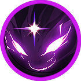
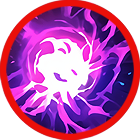
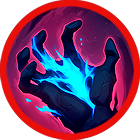
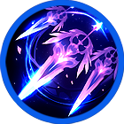
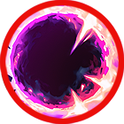

# 🔮 Aruru



<table data-card-size="large" data-view="cards"><thead><tr><th></th><th data-hidden data-card-cover data-type="files"></th><th data-hidden data-card-target data-type="content-ref"></th></tr></thead><tbody><tr><td></td><td><a href="../../../.gitbook/assets/Git_Hero_Aruru.png">Git_Hero_Aruru.png</a></td><td><a href="../">..</a></td></tr><tr><td></td><td><a href="../../../.gitbook/assets/Git_Hero_Aruru_dark.png">Git_Hero_Aruru_dark.png</a></td><td><a href="../stats/elemental-bonus-damage.md#elemental-bonus-damage-table">#elemental-bonus-damage-table</a></td></tr></tbody></table>



### 📒 Aruru: The Prophecy of Starlight

"The first to rise. The first to see the end."

It began with a gift. When Aruru was born, an old collector named Owen brought a small, violet stone to her cradle. The moment the stone neared the child, a star-shaped mark on its surface flared with blinding light, hovering over her tiny hand. In that silent, holy moment, everyone knew: this child was different.

Aruru became the first human to ever resonate with Extocium. She was the original Wizard, the founder of the Knights, and the shield of the kingdom. To some, she is a leader. To others, she is a goddess.

But the "Goddess" is afraid. Every night, the same nightmare returns: a colossal beast with black horns and wings, turning Asterica into a sea of ash. It’s a vision straight out of the forbidden texts. To save her people, Aruru must leave her throne and head toward the ruins of the lost Extocium Kingdom. The destiny that began under starlight is now racing toward a dark, uncertain dawn.



#### 📒아루루 - 별빛 속 운명의 위자드

골동품 수집가 오웬에게는 오랜 세월을 함께한 벗이 있었다. 어느 날, 그 벗에게 첫아이가 태어났다는 소식을 들은 오웬은 기쁜 마음으로 선물을 준비했다. 아이의 맑은 눈동자를 닮은, 보랏빛 빛을 머금은 작은 돌멩이였다. 그러나 벗의 집에 들어서자, 평온하던 아이는 갑자기 울음을 터뜨렸고, 오웬이 내민 돌멩이가 아이와 마주한 순간 놀라운 일이 벌어졌다. 돌에 새겨진 별 모양이 환하게 빛나며, 아이의 손 위에서 천천히 떠오른 것이다. 숨을 삼킨 채 그 장면을 바라보던 두 사람은, 이 아이가 특별한 운명을 타고났음을 직감했다. 그 아이가 바로 아루루였다.

아루루는 인류 최초로 **엑스토시움과 공명한 존재**, 그리고 최초의 위자드로 기록된다. 성장한 그녀는 아스테리카 왕국의 최고 위자드가 되었고, 엑스토시움에 반응하는 이들을 모아 **위자드 기사단**을 창설했다. 그녀의 지휘 아래 기사단은 왕국을 지키는 방패가 되었으며, 아루루는 강인한 의지와 따뜻한 지혜로 많은 이들의 신뢰를 받았다. 사람들은 그녀를 위자드이자 지도자로, 때로는 여신과 같은 존재로 바라보았다.

하지만 최근, 아루루의 평온했던 나날은 흔들리기 시작한다. 매일 밤 반복되는 꿈속에서, 검은 뿔과 날개를 지닌 거대한 괴물이 아스테리카를 잿더미로 만들고 있었다. 그 모습은 엑스토시움 고서에 기록된 오래된 전설 속 존재와 너무나도 닮아 있었다. 이 꿈이 단순한 환영이 아닌, 다가올 위기를 알리는 예언일지도 모른다는 두려움이 그녀의 마음을 짓누른다. 왕국을 지키고, 자신의 기원과 운명의 진실을 밝히기 위해, 아루루는 잊힌 엑스토시움 왕국의 유적을 향해 한 걸음을 내딛는다. 별빛 속에서 시작된 그녀의 운명은, 다시 한 번 세상의 흐름을 바꾸려 하고 있다.



#### 📒アルル（Aruru）：星光に導かれし運命の導師

「星が瞬く夜、運命は刻まれた。そして今、再び終焉の夢を見る。」

それは、一本の贈り物から始まりました。アルルが生まれた日、骨董商オーウェンが持ってきた淡い紫の小石。それを赤子の傍に寄せた瞬間、石に刻まれた星の紋章が眩い光を放ち、彼女の手の上で静かに浮かび上がったのです。その場にいた誰もが直感しました。この子は、星の運命を背負って生まれたのだと。

人類で初めてエクストシウムと共鳴し、最初の「ウィザード」となったアルル。彼女は魔導騎士団を創設し、王国の盾として人々の敬愛を集めました。時には指導者として、時には女神の如き存在として。

しかし、聖者のような彼女の日常を、凄惨な「悪夢」が蝕み始めます。黒い角と翼を持つ巨獣が、アステリカを灰へと変える予見の夢。それは古文書に記された「終焉」の姿そのものでした。王国を守り、自らのルーツと運命の真実を解き明かすため、アルルは再び歩み始めます。 忘れ去られた王国の遺跡、その先に待つのは救済か、それとも破壊か。



### ❇️Aruru‘s skill list     &#x20;

<table data-full-width="true"><thead><tr><th width="188">Skill</th><th width="100" align="center">Icon</th><th width="118"></th><th width="468">contents</th><th align="center">loot prob</th></tr></thead><tbody><tr><td>Goddess of all 만물의 여신 万物の女神</td><td align="center"></td><td><mark style="color:green;">Buff</mark></td><td>
<strong>EN</strong> Increases your damage and boosts Critical Rate and Skill Critical Rate for a set duration. While active, MP is consumed every second.

🔹 <strong>KR</strong> 정해진 시간 동안 데미지가 증가하고, 치명타 및 스킬 치명타 확률이 상승합니다. 스킬이 유지되는 동안 매초 MP가 소모됩니다.

🔹 <strong>JP</strong> 一定時間、ダメージが増加し、クリティカル率およびスキルクリティカル率が上昇します。効果中は毎秒MPを消費します。
</td><td align="center">15%</td></tr><tr><td>Clay of Enkidu 엔키두의 점토 エンキドゥの粘土</td><td align="center"></td><td><mark style="color:purple;">Summon</mark></td><td>
<strong>EN</strong> Summons the powerful warrior Enkidu for a set duration. Enkidu attacks nearby enemies with high attack power, and elemental bonus damage based on affinity is increased. While active, MP is consumed every second.

🔹 <strong>KR</strong> 강력한 전사 엔키두를 소환합니다. 엔키두는 정해진 시간 동안 소환되어 높은 공격력으로 주변의 적을 공격하며, 상성에 따른 부가 데미지가 증가합니다. 스킬이 유지되는 동안 매초 MP가 소모됩니다.

🔹 <strong>JP</strong> 強力な戦士エンキドゥを一定時間召喚します。エンキドゥは高い攻撃力で周囲の敵を攻撃し、属性相性に応じた**追加ダメージ（부가 데미지）**が増加します。効果中は毎秒MPを消費します。
</td><td align="center">15%</td></tr><tr><td>Friend of Enkidu 엔키두의 절친 エンキドゥの親友</td><td align="center"></td><td><mark style="color:purple;">Summon</mark></td><td>
<strong>EN</strong> Summons Gilgamesh, Enkidu’s close companion, for a set duration. Gilgamesh fires powerful star fragments forward, dealing damage per projectile to enemies within the area. While active, MP is consumed every second.

🔹 <strong>KR</strong> 엔키두의 절친인 길가메시를 소환합니다. 길가메시는 정해진 시간 동안 소환되어 전방으로 강력한 별의 파편을 발사하며, 범위 내 적들에게 탄당 피해를 입힙니다. 스킬이 유지되는 동안 매초 MP가 소모됩니다.

🔹 <strong>JP</strong> エンキドゥの親友であるギルガメッシュを一定時間召喚します。ギルガメッシュは前方に強力な星の破片を発射し、範囲内の敵に弾ごとのダメージを与えます。効果中は毎秒MPを消費します。
</td><td align="center">15%</td></tr><tr><td>Absolute Fear 절대적인 공포 絶対的な恐怖</td><td align="center"></td><td><mark style="color:red;">AoE</mark></td><td>
<strong>EN</strong> Fires a powerful dark orb, dealing damage to enemies and knocking them back. Elemental bonus damage is increased.

🔹 <strong>KR</strong> 강력한 암흑구를 발사해 적에게 피해를 입히고 넉백시킵니다. 속성 상성에 따른 부가 데미지가 증가합니다.

🔹 <strong>JP</strong> 強力な暗黒球を発射し、敵にダメージを与えてノックバックさせます。属性相性に応じた追加ダメージが増加します。
</td><td align="center">15%</td></tr><tr><td>Awakening Despair 깨어나는 절망 目覚める絶望</td><td align="center"></td><td><mark style="color:red;">AoE</mark></td><td>
<strong>EN</strong> Places a field in front of you that reduces enemy movement speed. Enemies standing on the field take damage per tick.

🔹 <strong>KR</strong> 전방에 적의 이동 속도를 감소시키는 장판을 설치합니다. 장판 위에 있는 적들은 틱당 피해를 입습니다.

🔹 <strong>JP</strong> 前方に敵の移動速度を低下させるフィールドを設置します。フィールド上にいる敵はティックごとにダメージを受けます。
</td><td align="center">10%</td></tr><tr><td>Destroying Star 파괴되는 별 破壊される星</td><td align="center"></td><td><mark style="color:blue;">Projectile</mark></td><td>
<strong>EN</strong> Powerful star fragments are fired forward. Enemies within the area take damage per projectile, and elemental bonus damage is increased.

🔹 <strong>KR</strong> 전방으로 강력한 별의 파편이 발사됩니다. 범위 내 적들은 탄당 피해를 입으며, 속성 상성에 따른 부가 데미지가 증가합니다.

🔹 <strong>JP</strong> 前方に強力な星の破片が発射されます。範囲内の敵は弾ごとのダメージを受け、属性相性に応じた**追加ダメージ（※부가 데미지 의미）**が増加します。
</td><td align="center">15%</td></tr><tr><td>Black Light 흑광 黒鉱</td><td align="center"></td><td><mark style="color:red;">AoE</mark></td><td>
<strong>EN</strong> Fires an absorbing dark orb that pulls enemies within the area for a set duration. Enemies caught in the area take damage per tick.

🔹 <strong>KR</strong> 흡인 효과를 지닌 암흑구를 발사해 범위 내 적들을 일정 시간 동안 끌어당깁니다. 범위 안에 있는 적들은 틱당 피해를 입습니다.

🔹 <strong>JP</strong> 吸引効果を持つ暗黒球を発射し、範囲内の敵を一定時間引き寄せます。範囲内にいる敵はティックごとにダメージを受けます。
</td><td align="center">15%</td></tr></tbody></table>

<em>※ This guide was written based on the game status as of December 29, 2025,</em>  <em>and its contents may change with future updates.</em>

