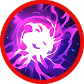
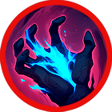
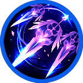
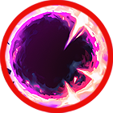

# 🔮 Aruru



<table data-card-size="large" data-view="cards"><thead><tr><th></th><th data-hidden data-card-cover data-type="files"></th><th data-hidden data-card-target data-type="content-ref"></th></tr></thead><tbody><tr><td></td><td><a href="../../../.gitbook/assets/Git_Hero_Aruru.png">Git_Hero_Aruru.png</a></td><td><a href="../">..</a></td></tr><tr><td></td><td><a href="../../../.gitbook/assets/Git_Hero_Aruru_dark.png">Git_Hero_Aruru_dark.png</a></td><td><a href="../stats/elemental-bonus-damage.md#elemental-bonus-damage-table">#elemental-bonus-damage-table</a></td></tr></tbody></table>



### 📒 Aruru: The Prophecy of Starlight

"The first to rise. The first to see the end."

It began with a gift. When Aruru was born, an old collector named Owen brought a small, violet stone to her cradle. The moment the stone neared the child, a star-shaped mark on its surface flared with blinding light, hovering over her tiny hand. In that silent, holy moment, everyone knew: this child was different.

Aruru became the first human to ever resonate with Extocium. She was the original Wizard, the founder of the Knights, and the shield of the kingdom. To some, she is a leader. To others, she is a goddess.

But the "Goddess" is afraid. Every night, the same nightmare returns: a colossal beast with black horns and wings, turning Asterica into a sea of ash. It’s a vision straight out of the forbidden texts. To save her people, Aruru must leave her throne and head toward the ruins of the lost Extocium Kingdom. The destiny that began under starlight is now racing toward a dark, uncertain dawn.



#### 📒아루루 - 별빛 속 운명의 위자드

골동품 수집가 오웬에게는 오랜 세월을 함께한 벗이 있었다. 어느 날, 그 벗에게 첫아이가 태어났다는 소식을 들은 오웬은 기쁜 마음으로 선물을 준비했다. 아이의 맑은 눈동자를 닮은, 보랏빛 빛을 머금은 작은 돌멩이였다. 그러나 벗의 집에 들어서자, 평온하던 아이는 갑자기 울음을 터뜨렸고, 오웬이 내민 돌멩이가 아이와 마주한 순간 놀라운 일이 벌어졌다. 돌에 새겨진 별 모양이 환하게 빛나며, 아이의 손 위에서 천천히 떠오른 것이다. 숨을 삼킨 채 그 장면을 바라보던 두 사람은, 이 아이가 특별한 운명을 타고났음을 직감했다. 그 아이가 바로 아루루였다.

아루루는 인류 최초로 **엑스토시움과 공명한 존재**, 그리고 최초의 위자드로 기록된다. 성장한 그녀는 아스테리카 왕국의 최고 위자드가 되었고, 엑스토시움에 반응하는 이들을 모아 **위자드 기사단**을 창설했다. 그녀의 지휘 아래 기사단은 왕국을 지키는 방패가 되었으며, 아루루는 강인한 의지와 따뜻한 지혜로 많은 이들의 신뢰를 받았다. 사람들은 그녀를 위자드이자 지도자로, 때로는 여신과 같은 존재로 바라보았다.

하지만 최근, 아루루의 평온했던 나날은 흔들리기 시작한다. 매일 밤 반복되는 꿈속에서, 검은 뿔과 날개를 지닌 거대한 괴물이 아스테리카를 잿더미로 만들고 있었다. 그 모습은 엑스토시움 고서에 기록된 오래된 전설 속 존재와 너무나도 닮아 있었다. 이 꿈이 단순한 환영이 아닌, 다가올 위기를 알리는 예언일지도 모른다는 두려움이 그녀의 마음을 짓누른다. 왕국을 지키고, 자신의 기원과 운명의 진실을 밝히기 위해, 아루루는 잊힌 엑스토시움 왕국의 유적을 향해 한 걸음을 내딛는다. 별빛 속에서 시작된 그녀의 운명은, 다시 한 번 세상의 흐름을 바꾸려 하고 있다.



#### 📒アルル（Aruru）：星光に導かれし運命の導師

「星が瞬く夜、運命は刻まれた。そして今、再び終焉の夢を見る。」

それは、一本の贈り物から始まりました。アルルが生まれた日、骨董商オーウェンが持ってきた淡い紫の小石。それを赤子の傍に寄せた瞬間、石に刻まれた星の紋章が眩い光を放ち、彼女の手の上で静かに浮かび上がったのです。その場にいた誰もが直感しました。この子は、星の運命を背負って生まれたのだと。

人類で初めてエクストシウムと共鳴し、最初の「ウィザード」となったアルル。彼女は魔導騎士団を創設し、王国の盾として人々の敬愛を集めました。時には指導者として、時には女神の如き存在として。

しかし、聖者のような彼女の日常を、凄惨な「悪夢」が蝕み始めます。黒い角と翼を持つ巨獣が、アステリカを灰へと変える予見の夢。それは古文書に記された「終焉」の姿そのものでした。王国を守り、自らのルーツと運命の真実を解き明かすため、アルルは再び歩み始めます。 忘れ去られた王国の遺跡、その先に待つのは救済か、それとも破壊か。



### ❇️Aruru‘s skill list     &#x20;

<table data-full-width="true"><thead><tr><th width="188">Skill</th><th width="100" align="center">Icon</th><th width="118"></th><th width="468">contents</th><th align="center">loot prob</th></tr></thead><tbody><tr><td>Goddess of all 만물의 여신 万物の女神</td><td align="center"></td><td><mark style="color:green;">Buff</mark></td><td>
<strong>EN</strong> For a period of time, your Damage increases by a certain amount, and your Physical Crit Chance and Magic Crit Chance increase by a certain amount. While the skill is active, a portion of its MP cost is gradually reduced.

🔹 <strong>KR</strong> 일정 시간 동안 자신의 데미지가 일정량 증가하며, 물리 치명타 확률과 마법 치명타 확률이 일정량 증가한다. 스킬 사용 중에는 MP 소모값 일부가 지속적으로 감소한다.

🔹 <strong>JP</strong> 一定時間、自身のダメージが一定量上昇し、物理クリティカル確率と魔法クリティカル確率が一定量増加する。スキル使用中は、MP消費量の一部が継続的に減少する。
</td><td align="center">15%</td></tr><tr><td>Clay of Enkidu 엔키두의 점토 エンキドゥの粘土</td><td align="center"></td><td><mark style="color:purple;">Summon</mark></td><td>
<strong>EN</strong> Summons the mighty warrior Enkidu. Enkidu remains summoned for a period of time and attacks nearby enemies with magic attack power. While the skill is active, a portion of its MP cost is gradually reduced. EBD+

🔹 <strong>KR</strong> 강력한 전사 엔키두를 소환한다. 엔키두는 일정 시간 동안 소환되어 마법 공격력으로 가까운 적을 공격한다. 스킬 사용 중에는 MP 소모값 일부가 지속적으로 감소한다. EBD+

🔹 <strong>JP</strong> 強力な戦士「エンキドゥ」を召喚する。エンキドゥは一定時間召喚され、魔法攻撃力で近くの敵を攻撃する。スキル使用中は、MP消費量の一部が継続的に減少する。EBD+
</td><td align="center">15%</td></tr><tr><td>Friend of Enkidu 엔키두의 절친 エンキドゥの親友</td><td align="center"></td><td><mark style="color:purple;">Summon</mark></td><td>
<strong>EN</strong> Summons Gilgamesh, the close friend of Enkidu. Gilgamesh remains summoned for a period of time and fires powerful Star Fragments forward. Enemies within range take magic damage. While the skill is active, a portion of its MP cost is gradually reduced.

🔹 <strong>KR</strong> 엔키두의 절친 길가메시를 소환한다. 길가메시는 일정 시간 동안 소환되어 전방으로 강력한 별의 파편을 발사한다. 범위 내 적들은 마법 피해를 입는다. 스킬 사용 중에는 MP 소모값 일부가 지속적으로 감소한다.

🔹 <strong>JP</strong> エンキドゥの親友であるギルガメッシュを召喚する。ギルガメッシュは一定時間召喚され、前方に強力な星の破片を放つ。範囲内の敵は魔法ダメージを受ける。スキル使用中は、MP消費量の一部が継続的に減少する。
</td><td align="center">15%</td></tr><tr><td>Absolute Fear 절대적인 공포 絶対的な恐怖</td><td align="center"></td><td><mark style="color:red;">AoE</mark></td><td>
<strong>EN</strong> Fires a powerful dark orb, dealing magic damage to enemies and knocking them back. Enemies hit have their MP consumption increased by a certain amount for a period of time. EBD+

🔹 <strong>KR</strong> 강력한 암흑구를 발사해 적에게 마법 피해를 입히고, 넉백시킨다. 피해를 입은 적은 일정 시간 동안 MP소모량이 일정량 증가한다. EBD+

🔹 <strong>JP</strong> 強力な闇のオーブを発射し、敵に魔法ダメージを与えてノックバックさせる。被弾した敵は一定時間、MP消費量が一定量増加する。 EBD+
</td><td align="center">15%</td></tr><tr><td>Awakening Despair 깨어나는 절망 目覚める絶望</td><td align="center"></td><td><mark style="color:red;">AoE</mark></td><td>
<strong>EN</strong> Throws a slate that reduces the enemy's movement speed by a certain amount in front. Enemies on the board take magic damage.

🔹 <strong>KR</strong> 전방에 적의 이동속도가 일정량 감소하는 장판을 설치한다. 장판 위에 있는 적들은 마법 피해를 입는다.

🔹 <strong>JP</strong> 前方に敵の移動速度が一定量減少するカーペットを設置する.カーペットの上にいる敵は魔法ダメージを受ける.
</td><td align="center">10%</td></tr><tr><td>Destroying Star 파괴되는 별 破壊される星</td><td align="center"></td><td><mark style="color:blue;">Projectile</mark></td><td>
<strong>EN</strong> Fires powerful star fragments forward. Enemies within range take magic damage. Enemies hit have their Evasion Rate reduced by a certain amount for a period of time. EBD+

🔹 <strong>KR</strong> 전방으로 강력한 별의 파편들이 발사된다. 범위 내 적들은 마법 피해를 입는다. 피해를 입은 적은 일정 시간 동안 회피율이 일정량 감소한다. EBD+

🔹 <strong>JP</strong> 前方に強力な星の破片を放つ。範囲内の敵は魔法ダメージを受ける。被弾した敵は一定時間、回避率が一定量減少する。 EBD+
</td><td align="center">15%</td></tr><tr><td>Black Light 흑광 黒鉱</td><td align="center"></td><td><mark style="color:red;">AoE</mark></td><td>
<strong>EN</strong> Fires a dark sphere that draws in enemies within range for a period of time. Enemies within range take magic damage.

🔹 <strong>KR</strong> 흡성하는 암흑구를 발사해 범위 내 적들을 일정 시간 동안 끌어당긴다. 범위 내 적들은 마법 피해를 입는다.

🔹 <strong>JP</strong> 吸星する暗黒球を発射し, 範囲内の敵を一定時間引き寄せる.範囲内の敵は魔法ダメージを受ける.
</td><td align="center">15%</td></tr></tbody></table>

<em>※ This guide was written based on the game status as of April 08, 2026,</em>  <em>and its contents may change with future updates.</em>

