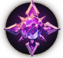

# 🔮 Aruru



💡[**Compatibility :** ](../stats/elemental-bonus-damage.md)[**Dark**](../stats/elemental-bonus-damage.md)




<figure><figcaption></figcaption></figure>

#### 📒Aruru - The Starlit Wizard of Fate

Owen, a seasoned collector of antiquities, had a dear friend from days long past. When he heard that his friend had welcomed a child, Owen set out with a special gift: a striking purple stone that echoed the newborn’s radiant eyes. Yet, as he crossed the threshold of his friend’s home, the delicate little girl let out a mighty cry. Then, something miraculous unfolded—when the stone met the child’s gaze, the star etched upon it flared with light and rose gently above her tiny hand. Owen and his friend stood frozen, awestruck by the sight. That child was Aruru.

Aruru emerged as the first human to resonate with the enigmatic substance known as Extocium, earning her the title of the first wizard. Rising to become the supreme wizard of the Kingdom of Asterica, she gathered others who shared her unique bond with Extocium and forged the Wizard Knights. Under her steady leadership, the order became the kingdom’s unwavering guardians, and Aruru herself a beacon of strength and sagacity, admired by all.

Lately, however, her peace has been shattered by vivid, troubling dreams. Each night, she sees a monstrous being with black horns and wings tearing Asterica apart—a figure eerily similar to one described in the ancient Extocium chronicles. Driven by unease, Aruru has begun poring over the old texts and seeking out the lost ruins of the fabled Extocium Empire. She fears these visions are no mere nightmares but a warning of impending calamity. To safeguard her kingdom and uncover the truth of her own destiny, Aruru steps boldly into the unknown.




<figure><figcaption></figcaption></figure>

#### 📒아루루 - 별빛 속 운명의 위자드

골동품 수집가 오웬에게는 오랜 세월을 함께한 벗이 있었다. 그 벗에게 첫아이가 태어났다는 소식을 듣고, 오웬은 기쁜 마음으로 선물을 준비했다. 그가 고른 것은 아이의 맑은 눈동자를 닮은 보랏빛 돌멩이로, 신비로운 빛을 품은 작은 보물이었다. 그러나 오웬이 벗의 집에 발을 들이자, 사랑스러운 꼬마 아이가 갑자기 울음을 터뜨렸다. 그 순간, 오웬이 내민 돌멩이가 아이와 마주하자 놀라운 일이 벌어졌다. 돌에 새겨진 별 모양이 환하게 빛나며 아이의 손 위에서 둥실 떠오른 것이다. 오웬과 그의 벗은 숨을 멈추고 그 광경을 바라봤다. 그 아이가 바로 아루루였다.

아루루는 인류 최초로 엑스토시움이라는 신비한 물질과 공명한 존재이자, 최초의 위자드로 기록되었다. 그녀는 아스테리카 왕국의 최고 위자드로 우뚝 서며, 엑스토시움에 반응하는 이들을 한데 모아 위자드 기사단을 창설했다. 그녀의 지휘 아래 기사단은 왕국의 방패가 되었고, 아루루는 그 강인한 의지와 따뜻한 지혜로 백성들의 마음을 사로잡았다.

하지만 최근, 그녀의 평온했던 나날은 흔들리기 시작했다. 매일 밤 반복되는 꿈속에서 검은 뿔과 날개가 돋아난 거대한 괴물이 아스테리카를 잿더미로 만든다. 그 모습은 엑스토시움 고서에 적힌 오래된 전설 속 존재와 너무나 닮아 있었다. 불안에 사로잡힌 아루루는 고서를 샅샅이 뒤지고, 전설 속 엑스토시움 왕국의 잊힌 유적을 찾아 나섰다. 이 꿈이 단순한 환영이 아니라, 다가올 위기를 알리는 예언일지도 모른다는 두려움이 그녀를 짓누른다. 왕국을 지키고 자신의 뿌리를 밝히기 위해, 아루루는 운명의 길을 걷기 시작했다.




<figure><figcaption></figcaption></figure>

#### 📒アルル - 星に導かれしウィザード

骨董品を愛する収集家オーウェン（Owen）には、かつてより親しい友がいた。友に子が生まれたと聞き、オーウェンは贈り物として美しい紫の石を選び、彼の家へと向かった。その石は、新たな命の瞳に映る輝きと重なるような、不思議な魅力を湛えていた。だが、オーウェンが家に足を踏み入れると、愛らしい赤ん坊が突然大きな声で泣き出した。すると、目の前で信じがたい光景が広がった。オーウェンの持つ石が赤ん坊に近づいた瞬間、石に刻まれた星の紋様が輝きを放ち、彼女の手の上でふわりと浮かんだのだ。オーウェンと友は、驚愕のあまり言葉を失った。その子こそ、アルルだった。

アルルは人類で初めてエクストシウムと共鳴した者であり、最初のウィザードとして歴史に名を刻んだ。彼女はアステリカ王国の最高ウィザードとなり、エクストシウムに反応する者たちを結集させ、ウィザード騎士団を立ち上げた。その指導のもと、騎士団は王国を守る強固な盾となり、アルルは深い知恵と優れた力で人々から敬慕される存在となった。

しかし近頃、彼女の心は暗い影に覆われている。毎夜のように見る夢の中で、黒い角と翼を持つ怪物がアステリカを破壊し尽くす。その姿は、エクストシウムの古文書に記された伝説の記述とあまりにも似ていた。不安に駆られたアルルは、古文書を細かく調べ、伝説に謳われるエクストシウム王国の遺跡へと足を踏み入れた。この夢がただの悪夢ではなく、近い将来の危機を告げるものではないかという恐怖が、彼女を突き動かす。王国を護り、自らの定めを知るため、アルルは星の導きに従い旅立つ。



### ❇️Aruru‘s skill list     &#x20;

<table data-full-width="true"><thead><tr><th width="188">Skill</th><th width="100" align="center">Icon</th><th width="118"></th><th width="468">contents</th><th align="center">loot prob</th></tr></thead><tbody><tr><td>Goddess of all 만물의 여신 万物の女神</td><td align="center"></td><td><mark style="color:green;">Buff</mark></td><td>Increases your damage for a set duration, and critical hit rate and skill critical hit rate are increased. While using this skill, MP decreases every second. 🔹 정해진 시간 동안 자신의 데미지가 증가하고, 치명타 및 스킬 치명타 확률이 상승합니다. 스킬 사용 중에는 매 초마다 MP가 감소합니다. 🔹 一定時間、自分のダメージが増加し、クリティカル率およびスキルクリティカル率が上昇します。スキル使用中は、毎秒MPが減少します。</td><td align="center">15%</td></tr><tr><td>Clay of Enkidu 엔키두의 점토 エンキドゥの粘土</td><td align="center"></td><td><mark style="color:purple;">Summon</mark></td><td>Summons the powerful warrior Enkidu. Enkidu is summoned for a set duration and attacks nearby enemies with high attack power, with additional damage based on affinity. While using this skill, MP decreases every second. 🔹 강력한 전사 엔키두를 소환합니다. 엔키두는 정해진 시간 동안 소환되어 높은 공격력으로 가까운 적을 공격하며, 상성에 따른 부가 데미지가 증가합니다. 스킬 사용 중에는 매 초마다 MP가 감소합니다. 🔹 強力な戦士エンキドゥを召喚します。エンキドゥは一定時間召喚され、高い攻撃力で近くの敵を攻撃し、属性に応じた追加ダメージが増加します。スキル使用中は、毎秒MPが減少します。</td><td align="center">15%</td></tr><tr><td>Friend of Enkidu 엔키두의 절친 エンキドゥの親友</td><td align="center"></td><td><mark style="color:purple;">Summon</mark></td><td>Summons Gilgamesh, the best friend of Enkidu. Gilgamesh is summoned for a set duration and fires powerful star fragments forward. Enemies within the area take damage per projectile. MP decreases every second while the skill is active. 🔹 엔키두의 절친 길가메시를 소환합니다. 길가메시는 정해진 시간 동안 소환되어 전방으로 강력한 별의 파편을 발사합니다. 범위 내 적들은 탄당 피해를 입습니다. 스킬 사용 중에는 매 초마다 MP가 감소합니다. 🔹 エンキドゥの親友ギルガメッシュを召喚します。ギルガメッシュは一定時間召喚され、前方に強力な星の破片を発射します。範囲内の敵は弾ごとにダメージを受けます。スキル使用中は毎秒MPが減少します。</td><td align="center">15%</td></tr><tr><td>Absolute Fear 절대적인 공포 絶対的な恐怖</td><td align="center"></td><td><mark style="color:red;">AoE</mark></td><td>Fires a powerful dark orb, dealing damage to the enemy and knocking them back. Elemental bonus damage is increased. 🔹 강력한 암흑구를 발사하여 적에게 피해를 입히고, 넉백시킵니다. 상성에 따른 부가 데미지가 증가합니다. 🔹 強力な暗黒球を発射して敵にダメージを与え、ノックバックさせます。属性に応じた追加ダメージが増加します。</td><td align="center">15%</td></tr><tr><td>Awakening Despair 깨어나는 절망 目覚める絶望</td><td align="center"></td><td><mark style="color:red;">AoE</mark></td><td>Places a field in front that reduces enemy movement speed. Enemies standing on the field take damage per tick. 🔹 전방에 적의 이동속도가 감소하는 장판을 설치합니다. 장판 위에 있는 적들은 틱당 피해를 입습니다. 🔹 前方に敵の移動速度が減少するフィールドを設置します。フィールド上の敵はティックごとにダメージを受けます。</td><td align="center">10%</td></tr><tr><td>Destroying Star 파괴되는 별 破壊される星</td><td align="center"></td><td><mark style="color:blue;">Projectile</mark></td><td>Powerful star fragments are fired forward. Enemies within the area take damage per projectile, and elemental bonus damage is increased. 🔹 전방으로 강력한 별의 파편들이 발사됩니다. 범위 내 적들은 탄당 피해를 입으며, 상성에 따른 부가 데미지가 증가합니다. 🔹 前方に強力な星の破片が発射されます。範囲内の敵は弾ごとにダメージを受け、属性に応じた追加ダメージが増加します。</td><td align="center">15%</td></tr><tr><td>Black Light 흑광 黒鉱</td><td align="center"></td><td><mark style="color:red;">AoE</mark></td><td>Fires an absorbing dark orb that pulls enemies within the area for a set duration. Enemies within the area take damage per tick. 🔹 흡성하는 암흑구를 발사하여 범위 내 적들을 일정 시간 동안 끌어당깁니다. 범위 내 적들은 틱당 피해를 입습니다. 🔹 吸引する暗黒球を発射し、範囲内の敵を一定時間引き寄せます。範囲内の敵はティックごとにダメージを受けます。</td><td align="center">15%</td></tr></tbody></table>
