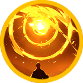

# 🌀 Elena



<table data-card-size="large" data-view="cards"><thead><tr><th></th><th data-hidden data-card-cover data-type="files"></th><th data-hidden data-card-target data-type="content-ref"></th></tr></thead><tbody><tr><td></td><td><a href="../../../.gitbook/assets/Git_Hero_Elena.png">Git_Hero_Elena.png</a></td><td><a href="../">..</a></td></tr><tr><td></td><td><a href="../../../.gitbook/assets/Git_Hero_Elena_force.png">Git_Hero_Elena_force.png</a></td><td><a href="../stats/elemental-bonus-damage.md#elemental-bonus-damage-table">#elemental-bonus-damage-table</a></td></tr></tbody></table>



#### 📒Elena: The Chaos Mage of RottenHill

"A single mistake. A world of ash. A destiny awakened."

In the dusty western corner of the continent, tucked away in the RottenHill orphanage, lived Elena. She was a whirlwind of red hair and restless energy—the kind of girl who was impossible to ignore. But behind her bright smiles, Elena was fighting a silent war with herself. She lived in the shadow of her best friend, Ishtar. To Elena, Ishtar was the perfect ideal: beautiful, poised, and naturally gifted. Elena, by contrast, felt like a clumsy footnote.

Elena was one of the rare few who could resonate with Extocium, the world’s most volatile resource. Yet, while other mages commanded the elements with surgical precision, Elena’s mana was a formless, chaotic mess. She spent her days just trying not to break things.

That fragile effort shattered during a journey with Ishtar. In a moment of panic, a single misfired mana bolt didn't just flicker—it detonated, reducing the manor of the powerful noble Rahan to cinders in seconds. Buried under a debt she could never pay, Elena was forced into a secret mission for the man whose home she destroyed. As she heads toward the Wizard Knights Order, her heart is heavy with doubt. But at the edge of this disaster, Elena might finally realize that her "clumsiness" was actually a power too great to be contained.



#### 📒엘레나: 붉은 머리의 서툰 마법사&#x20;

대륙의 서쪽 끝, 로튼힐의 작은 고아원에서 자란 붉은 머리 소녀 엘레나는 활기찬 성격으로 늘 사람들의 눈길을 끌었다. 웃음도 많고 행동도 앞서는 아이였지만, 그녀의 마음 한켠에는 늘 친구 이슈타르에 대한 동경과 열등감이 함께 자리하고 있었다. 아름답고 강하며 마법을 자유롭게 다루는 이슈타르는 엘레나에게 늘 닿을 수 없는 이상처럼 보였고, 그에 비해 엘레나는 스스로를 서툰 마법사라 여기곤 했다.

엘레나는 귀한 자원 엑스토시움에 반응하는 드문 인간이었지만, 마나를 다루는 재능은 부족했다. 다른 마법사들의 마법에는 뚜렷한 속성이 있었지만, 그녀의 마법은 속성조차 없이 늘 불안정했다. 이슈타르처럼 되고 싶다는 마음과 달리, 실수하지 않는 것만 해도 다행인 날들이 이어졌다. 그러던 어느 날, 이슈타르와 함께한 여행 중 마법 연습을 하다 잘못된 마나볼이 폭발하며, 지방 귀족 라한의 별장을 한순간에 잿더미로 만들어 버리고 만다.

어린 나이에 감당할 수 없는 배상금을 떠안게 된 엘레나는, 그 대가로 라한에게서 비밀 임무를 제안받는다. 위자드 기사단으로 향해야 하는 그녀의 발걸음은 무겁지만, 이 여정의 끝에서 엘레나는 어쩌면 자신의 잠재력을 깨닫고, 언젠가는 이슈타르처럼 강하고 멋진 마법사가 될 수 있을지도 모른다. 실수로 시작된 이 여행이, 그녀에게는 인생을 바꾸는 첫 걸음이 될 것이다.



#### 📒 エレナ（Elena）：未熟な魔力に宿る、無限の可能性

「たった一度の過ち、灰色の世界。そこから私の運命は動き出した。」

大陸の西の果て、ロッテンヒルの小さな孤児院で育った赤髪の少女、エレナ。明るく活発な彼女は、どこにいても周囲を照らす太陽のような存在でした。しかし、その笑顔の裏には、親友イシュタルに対する「憧れ」と、決して拭えない「劣等感」が静かに渦巻いていました。美しく、何でも器用にこなすイシュタルは、エレナにとって遥か遠い理想郷そのもの。自分はいつも一歩後ろを歩く、不器용な魔法使いに過ぎないと感じていたのです。

エレナは稀少資源「エクストシウム」と共鳴できる数少ない資質を持っていましたが、その魔力制御は壊滅的でした。他の魔導師たちが鮮やかに元素を操る傍らで、彼女の魔法は形も属性も持たず、ただ不安定に揺らめくだけ。「今日は失敗しませんように」――それが彼女のささやかな日常でした。

しかし、その危うい平穏はイシュタルとの旅路で崩れ去ります。放たれたマナの奔流は制御を失い、あろうことか地方貴族ラハンの別邸を一瞬にして灰燼に帰してしまったのです。子供には到底背負いきれない代償。その代わりに突きつけられたのは, ラハンからの「極秘任務」でした。魔導騎士団へと向かうエレナの足取りは重く、迷いに満ちています。けれど、この望まぬ旅の果てに、彼女は気づくことになるでしょう。その「未熟さ」こそが、世界を塗り替える真の力の胎動であったことに。



### ❇️Elena‘s skill list&#x20;

<table data-full-width="true"><thead><tr><th width="161.54547119140625">Skill</th><th width="117" align="center">Icon</th><th width="115">Type</th><th width="500">contents</th><th align="center">loot prob</th></tr></thead><tbody><tr><td>Rush 돌격 突撃</td><td align="center"></td><td><mark style="color:blue;">Projectile</mark></td><td>
<strong>EN</strong> Charges forward, dealing damage to enemies within the area and knocking them back.

🔹 <strong>KR</strong> 전방으로 돌진해 범위 내 적들에게 피해를 입히고, 넉백시킵니다.

🔹 <strong>JP</strong> 前方に突進し、範囲内の敵にダメージを与えてノックバックさせます。
</td><td align="center">15%</td></tr><tr><td>Meditation 명상 瞑想</td><td align="center"></td><td><mark style="color:green;">Buff</mark></td><td>
<strong>EN</strong> Upon use, recovers HP and MP per second for a set duration, and increases damage.

🔹 <strong>KR</strong> 사용 시 정해진 시간 동안 HP와 MP를 초당 회복하고, 데미지가 증가합니다.

🔹 <strong>JP</strong> 使用すると、一定時間、毎秒HPとMPが回復し、ダメージが増加します。
</td><td align="center">10%</td></tr><tr><td>Power attack 파워어택 パワーアタック</td><td align="center"></td><td><mark style="color:yellow;">Melee</mark></td><td>
<strong>EN</strong> Swings a powerful sword forward, dealing damage to enemies within the area and knocking them back.

🔹 <strong>KR</strong> 전방으로 강력한 검을 휘둘러 범위 내 적들에게 피해를 입히고, 넉백시킵니다.

🔹 <strong>JP</strong> 前方に強力な剣を振り、範囲内の敵にダメージを与えてノックバックさせます。
</td><td align="center">15%</td></tr><tr><td>Throwing bombs 폭탄던지기 爆弾投げ</td><td align="center"></td><td><mark style="color:red;">AoE</mark></td><td>
<strong>EN</strong> Throws multiple bombs forward, dealing damage to enemies within the area.

🔹 <strong>KR</strong> 전방으로 다수의 폭탄을 던져 범위 내 적들에게 피해를 입힙니다.

🔹 <strong>JP</strong> 前方に多数の爆弾を投げ、範囲内の敵にダメージを与えます。
</td><td align="center">15%</td></tr><tr><td>Wrong mana ball 잘못 만든 마나볼 間違って作ったMana Ball</td><td align="center"></td><td><mark style="color:blue;">Projectile</mark></td><td>
<strong>EN</strong> Throws a massive mana ball forward, dealing damage per tick to enemies within the area and knocking them back.

🔹 <strong>KR</strong> 전방으로 거대한 마나볼을 던져 범위 내 적들에게 틱당 피해를 입히고, 넉백시킵니다.

🔹 <strong>JP</strong> 前方に巨大なマナボールを投げ、範囲内の敵にティックごとのダメージを与えてノックバックさせます。
</td><td align="center">15%</td></tr><tr><td>Mana error 마나 조절 실패 Mana調節失敗</td><td align="center"></td><td><mark style="color:blue;">Projectile</mark></td><td>
<strong>EN</strong> Fires multiple powerful mana balls forward, dealing damage per projectile to enemies within the area.

🔹 <strong>KR</strong> 전방으로 강력한 마나볼을 다수 발사해 범위 내 적들에게 탄당 피해를 입힙니다.

🔹 <strong>JP</strong> 前方に強力なマナボールを多数発射し、範囲内の敵に弾ごとのダメージを与えます。
</td><td align="center">15%</td></tr><tr><td>Mysterious revelation 의문의 부름 疑問の呼び掛け</td><td align="center"></td><td><mark style="color:yellow;">Melee</mark></td><td>
<strong>EN</strong> A powerful aura of light emanates around Elena, dealing damage to enemies within the area and stunning them.

🔹 <strong>KR</strong> 엘레나의 주변으로 강력한 빛의 가호가 퍼져 나가 범위 내 적들에게 피해를 입히고, 스턴 상태로 만듭니다.

🔹 <strong>JP</strong> エレナの周囲に強力な光の加護が広がり、範囲内の敵にダメージを与え、スタン状態にします。
</td><td align="center">15%</td></tr></tbody></table>

<em>※ This guide was written based on the game status as of December 29, 2025,</em>  <em>and its contents may change with future updates.</em>

