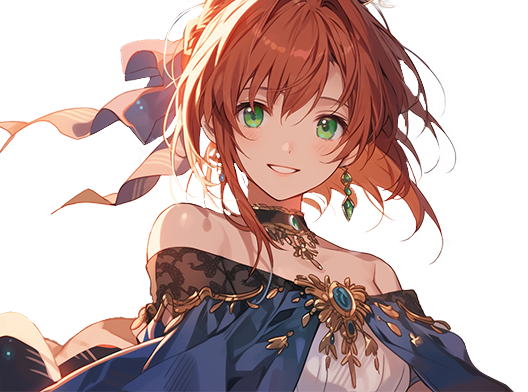

# 🌀 Elena

<figure><figcaption></figcaption></figure>

💡[**Compatibility : Force**](../../stats/elemental-bonus-damage.md)


[skill-pool-elena](skill-pool-elena/)




#### 📒Elena: The Red-Haired Novice&#x20;

Elena, a spirited red-haired girl, grew up in a humble orphanage in Rotten Hill, a remote village at the western edge of the continent. Though lively and bold, she lived in the shadow of her best friend Ishtar, a stunning and powerful mage who seemed to have it all—beauty, strength, and mastery over magic. Elena longed to be like her, but her own abilities fell short.

Blessed with the rare gift of reacting to Extocium, Elena should have been extraordinary. Yet, her mana control was shaky, and unlike other mages whose spells carried elemental flair, her magic felt plain and unrefined. She dreamed of matching Ishtar’s grace, but avoiding disaster was her bigger challenge. One day, while practicing magic on a journey with Ishtar, Elena misfired a clumsy mana ball that obliterated the villa of a local noble, Rahan, in a fiery blast.

Burdened with a staggering debt at such a young age, Elena was given a secret mission by Rahan as repayment. Now, she must join the Wizard Knights, her steps heavy with doubt. Still, this path might be her chance to unlock her hidden potential and rise to become someone as strong and radiant as Ishtar.



#### 📒엘레나: 붉은 머리의 서툰 마법사&#x20;

대륙의 서쪽 끝, 로튼힐의 작은 고아원에서 자란 붉은 머리 소녀 엘레나는 활기찬 성격으로 늘 눈에 띄었다. 그러나 그녀의 마음속에는 친구 이슈타르에 대한 동경과 열등감이 뒤섞여 있었다. 이슈타르는 아름답고 강하며 마법을 자유롭게 다루는 완벽한 존재였지만, 엘레나는 그저 서툰 마법사일 뿐이었다.

엘레나는 귀한 엑스토시움에 반응하는 드문 인간이었지만, 마나 조절에 서툴러 마법은 늘 불완전했다. 다른 마법사들의 마법엔 속성이 있다는데, 그녀의 마법은 속성조차 없었다. 이슈타르처럼 되고 싶었지만, 실수하지 않는 것만 해도 다행이었다. 어느 날, 이슈타르와의 여행 중 마법 연습을 하다 잘못된 마나볼이 폭발하며 지방 귀족 라한의 별장을 잿더미로 만들어버렸다.

어린 나이에 천문학적인 배상금을 떠안게 된 엘레나는 그 대가로 라한에게서 비밀 임무를 받았다. 이제 위자드 기사단으로 향해야 하는 그녀의 발걸음은 무겁다. 하지만 이 여정에서 엘레나는 어쩌면 자신의 잠재력을 깨닫고, 이슈타르처럼 강하고 멋진 사람이 될지도 모른다.



📒エレナ：赤毛の未熟な魔法使い

大陸の西の果て、ロッテンヒルの小さな孤児院で育った赤毛の少女、エレナ。元気で明るい性格の彼女は目立つ存在でしたが、心の中では親友イシュタルへの憧れと劣等感が入り混じっていました。イシュタルは美しく、強く、魔法を自由に操る完璧な存在。エレナはそんな彼女のようになりたいと願っていました。

エレナは貴重なエクストシウムに反応する珍しい人間でしたが、マナのコントロールが下手で、魔法はいつも不安定でした。他の魔法使いの魔法には属性があるというのに、彼女の魔法にはそれすらありませんでした。イシュタルのように輝きたいと思いつつも、失敗を避けるのが精一杯でした。ある日、イシュタルと旅をしながら魔法の練習中、失敗したマナボールが爆発し、地方貴族ラハンの別荘を一瞬で吹き飛ばしてしまいました。

幼いながらも莫大な賠償金を背負ったエレナは、その代償としてラハンから秘密の任務を託されます。そして今、ウィザード騎士団へ向かう彼女の足取りは重い。それでも、この旅が彼女に秘めた力を見出すきっかけとなり、イシュタルのように強く美しい存在になれる可能性を秘めているのかもしれません。



