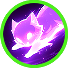
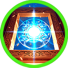

# ✴️ Ishtar



<table data-card-size="large" data-view="cards"><thead><tr><th></th><th data-hidden data-card-cover data-type="files"></th><th data-hidden data-card-target data-type="content-ref"></th></tr></thead><tbody><tr><td></td><td><a href="../../../.gitbook/assets/Git_Hero_Ishtar.png">Git_Hero_Ishtar.png</a></td><td><a href="../">..</a></td></tr><tr><td></td><td><a href="../../../.gitbook/assets/KakaoTalk_20250918_153624149.png">KakaoTalk_20250918_153624149.png</a></td><td><a href="../stats/elemental-bonus-damage.md#elemental-bonus-damage-table">#elemental-bonus-damage-table</a></td></tr></tbody></table>



### 📒 Ishtar: The Star That Refused to Fade

"Beauty is a cage. Curiosity is the key."

Ishtar was born to be noticed. With lilac hair that flowed like liquid light and eyes the color of ancient glacial ice, she was a vivid splash of color against the grey, crumbling walls of RottenHill. To the villagers, she was a masterpiece. To her friend Elena, she was a goddess. But Ishtar didn't want to be a masterpiece; she wanted to be a pioneer.

She felt the walls of the orphanage closing in. Her heart thrived on the stories of Parasiel, a traveling merchant who brought tales of the Kingdom of Asterica and the legendary Wizard Knights. She didn't just want to hear about the world—she wanted to own it.

When Parasiel arrived with the mysterious Extocium, everything changed. Ishtar felt the dormant power within her pulse for the first time. In that moment, the hesitation she had carried her whole life vanished. Grabbing Elena’s hand, she stepped out into the unknown. For Ishtar, this isn't just a trip to join the Knights; it’s the moment she takes the pen and starts writing her own legend.



#### 📒이슈타르: 로튼힐의 빛나는 별

연보라빛으로 찰랑이는 머릿결과, 만년설 아래 얼음굴을 떠올리게 하는 희푸른 눈동자를 지닌 이슈타르는 로튼힐 고아원에서 태어나 자란 소녀였다. 황량하고 무너져 가는 마을 풍경 속에서도 그녀의 모습은 유난히 선명했고, 그 아름다움은 마치 어두운 밤하늘에 떠 있는 별처럼 사람들의 시선을 사로잡았다. 가장 가까운 친구 엘레나조차도, 이슈타르의 고혹적인 자태 앞에서는 감탄을 숨기지 못하곤 했다.

그러나 이슈타르는 단지 아름다운 소녀로 머물 아이가 아니었다. 그녀의 내면에는 끝없는 호기심과, 세상 너머를 향한 강한 갈망이 늘 타오르고 있었다. 작은 고아원의 울타리 안에서 자라며, 이슈타르는 언젠가 드넓은 대륙을 누비는 강하고 당당한 존재가 되기를 꿈꿨다. 마을을 찾는 상인 파라시엘이 들려주는 아스테리카 왕국과 위자드 기사단의 이야기는 그녀의 가슴을 뛰게 했고, 그가 들려주는 모험담은 이슈타르의 마음속에 아직 가보지 못한 세계를 또렷하게 그려 주었다.

그러던 어느 날, 파라시엘이 신비로운 엑스토시움을 들고 로튼힐을 찾는다. 그를 통해 이슈타르와 엘레나는 자신들 안에 위자드의 재능이 잠들어 있다는 사실을 알게 된다. 그 순간, 이슈타르의 마음속에서 망설임은 사라졌다. 더 이상 이곳에 머물 이유는 없었다. 그녀는 엘레나의 손을 단단히 붙잡고, 위자드 기사단을 향한 여정을 시작한다. 이슈타르에게 이 길은 단순한 여행이 아니라, 자신의 운명을 스스로 써 내려가기 시작하는 첫 장이었다.



#### 📒 イシュタル（Ishtar）：ロッテンヒルに舞い降りた蒼き星

「美しさは籠の中。渇望こそが、外の世界へ続く鍵。」

光を湛えた淡い紫の髪、万年雪の奥底に眠る氷窟のような瞳。ロッテンヒルの荒廃した景色の中で、イシュタルの存在はあまりにも鮮烈でした。暗闇に浮かぶ一筋の恒星のように、誰もが彼女に目を奪われ、親友のエレナでさえも、その眩しさに溜息を漏らすほどでした。

しかし、イシュタルはただ愛でられるだけの少女ではありませんでした。その内側には、孤児院の壁の向こう側――まだ見ぬ広い世界への止まらない好奇心が燃え盛っていました。行商人パラシエルが語るアステリカ王国や魔導騎士団の武勇伝。彼女はその物語を糧に、いつか大陸を自由に駆け巡る自らの姿を夢見ていたのです。

ある日、パラシエルが持ち込んだ神秘の資源「エクストシウム」。それが彼女の中に眠る魔導師の資質を呼び覚ました瞬間、イシュタルの心から迷いは消え去りました。もう、ここに留まる理由はない。エレナの手を強く引き、彼女は魔導騎士団への一歩を踏み出します。それは単なる旅ではありません。イシュタルという名の物語を、自らの手で綴り始めるためのプロローグなのです。



### ❇️Ishtar‘s skill list &#x20;

<table data-full-width="true"><thead><tr><th width="208">Skill</th><th width="111" align="center">Icon</th><th>Type</th><th width="475">Contents</th><th align="center">loot prob</th></tr></thead><tbody><tr><td>Beautiful Star 아름다운 별 美しい星</td><td align="center"></td><td><mark style="color:green;">Buff</mark></td><td>
<strong>EN</strong> For a set duration, your damage increases. While active, MP is consumed every second.

🔹 <strong>KR</strong> 정해진 시간 동안 데미지가 증가합니다. 스킬이 유지되는 동안 매초 MP가 소모됩니다.

🔹 <strong>JP</strong> 一定時間、ダメージが増加します。効果中は毎秒MPを消費します。
</td><td align="center">15%</td></tr><tr><td>Little Demon 장난꾸러기 いたずら坊主</td><td align="center"></td><td><mark style="color:green;">Buff</mark></td><td>
<strong>EN</strong> For a set duration, your movement speed and damage increase. While active, MP is consumed every second.

🔹 <strong>KR</strong> 정해진 시간 동안 이동 속도와 데미지가 증가합니다. 스킬이 유지되는 동안 매초 MP가 소모됩니다.

🔹 <strong>JP</strong> 一定時間、移動速度とダメージが増加します。効果中は毎秒MPを消費します。
</td><td align="center">15%</td></tr><tr><td>Rage 격노 激怒</td><td align="center"></td><td><mark style="color:blue;">Projectile</mark></td><td>
<strong>EN</strong> Fires multiple light orbs forward, dealing damage per projectile to enemies. Elemental bonus damage is increased.

🔹 <strong>KR</strong> 전방으로 다수의 빛 구를 발사해 적들에게 탄당 피해를 입힙니다. 상성에 따른 <strong>부가 데미지</strong>가 증가합니다.

🔹 <strong>JP</strong> 前方に多数の光の球を発射し、敵に弾ごとのダメージを与えます。属性相性に応じた<strong>追加ダメージ</strong>が増加します。
</td><td align="center">15%</td></tr><tr><td>Ishtar Gate 이슈타르의 문 Ishtarの門</td><td align="center"></td><td><mark style="color:green;">Buff</mark></td><td>
<strong>EN</strong> Quickly teleports behind the target. For a set duration, your AP and SAP increase, and AGI is boosted.

🔹 <strong>KR</strong> 타겟의 등 뒤로 재빠르게 텔레포트합니다. 정해진 시간 동안 AP와 SAP가 증가하고, 민첩성(AGI)이 증가합니다.

🔹 <strong>JP</strong> ターゲットの背後に素早くテレポートします。一定時間、APとSAPが増加し、敏捷性（AGI）が上昇します。
</td><td align="center">10%</td></tr><tr><td>Babylon's Cry 바빌론의 함성 バビロンの歓声</td><td align="center"></td><td><mark style="color:red;">AoE</mark></td><td>
<strong>EN</strong> A broad area is struck by a radiant cry, dealing damage per tick to enemies within the area. Elemental bonus damage is increased.

🔹 <strong>KR</strong> 넓은 범위에 빛의 함성이 내려쳐 범위 내 적들에게 틱당 피해를 입힙니다. 상성에 따른 부가 데미지가 증가합니다.

🔹 <strong>JP</strong> 広範囲に光の叫びが降り注ぎ、範囲内の敵にティックごとのダメージを与えます。属性相性に応じた追加ダメージが増加します。
</td><td align="center">15%</td></tr><tr><td>Glare 섬광 閃光</td><td align="center"></td><td><mark style="color:blue;">Projectile</mark></td><td>
<strong>EN</strong> Fires multiple light orbs in a 360-degree radius, dealing damage per projectile to enemies and knocking them back. Elemental bonus damage is increased.

🔹 <strong>KR</strong> 360도 전방위로 다수의 빛 구를 발사해 적들에게 탄당 피해를 입히고, 넉백시킵니다. 상성에 따른 부가 데미지가 증가합니다.

🔹 <strong>JP</strong> 360度全方位に光の球を多数発射し、敵に弾ごとのダメージを与えてノックバックさせます。属性相性に応じた追加ダメージが増加します。
</td><td align="center">15%</td></tr><tr><td>Annihilation 섬멸 殲滅</td><td align="center"></td><td><mark style="color:yellow;">Melee</mark></td><td>
<strong>EN</strong> Swings a powerful sword in a 360-degree radius, dealing damage to enemies. Elemental bonus damage is increased.

🔹 <strong>KR</strong> 360도 전방위로 강력한 검을 휘둘러 적들에게 피해를 입힙니다. 상성에 따른 <strong>부가 데미지</strong>가 증가합니다.

🔹 <strong>JP</strong> 360度全方位に強力な剣を振り、敵にダメージを与えます。属性相性に応じた<strong>追加ダメージ</strong>が増加します。
</td><td align="center">15%</td></tr></tbody></table>

<em>※ This guide was written based on the game status as of December 29, 2025,</em>  <em>and its contents may change with future updates.</em>

