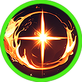

# ✴️ Ishtar



💡[**Compatibility : L**](../stats/elemental-bonus-damage.md)[**ight**](../stats/elemental-bonus-damage.md)




<figure><figcaption></figcaption></figure>

#### 📒Ishtar: The Radiant Star of Rotten Hill

Ishtar, with her lavender hair cascading like a twilight waterfall and pale blue eyes reminiscent of glacial caverns beneath eternal snow, was born and raised in the dilapidated orphanage of Rotten Hill. Amid the village’s crumbling ruins and bleak desolation, her beauty stood out like a beacon of light, enchanting all who laid eyes on her. Even Elena, her dearest companion, couldn’t help but be awestruck by her ethereal charm.

Yet, Ishtar’s allure runs deeper than her appearance. Within her burns an unquenchable curiosity and a fierce desire to conquer the vast world beyond her humble beginnings. Raised within the confines of Rotten Hill’s orphanage, she yearned to become someone powerful and extraordinary, her spirit restless with dreams of adventure. The rare visits from Paracil, a wandering merchant, were the highlights of her days. His tales of the Kingdom of Asterica and the legendary Wizard Knights ignited her imagination, planting seeds of longing to one day join their ranks.

Then came the day Parasiel arrived bearing Extocium, unveiling the hidden truth: both Ishtar and Elena possessed the rare gift of wizardry. Her heart surged with wild excitement, a fire kindled within her soul. No longer could she remain bound to Rotten Hill. Grasping Elena’s hand with unwavering resolve, Ishtar embarked on a journey to join the Wizard Knights—a quest that marked not just an adventure, but the beginning of her legacy.




<figure><figcaption></figcaption></figure>

#### 📒이슈타르: 로튼힐의 빛나는 별

연보라빛으로 찰랑이는 머릿결과 만년설 아래 얼음굴을 가져다놓은 듯한 희푸른 눈동자를 가진 이슈타르는 로튼힐 고아원에서 태어나 자란 소녀다. 황량하고 무너져가는 로튼힐의 풍경 속에서 그녀의 아름다움은 마치 밤하늘의 별처럼 유난히 도드라졌다. 절친한 친구 엘레나조차 이슈타르의 고혹적인 자태에 감탄을 금치 못할 정도였다.

하지만 이슈타르는 외모만으로 정의되지 않는다. 그녀의 내면에는 끝없는 호기심과 세상 너머의 이야기를 향한 뜨거운 열망이 불타고 있다. 작은 고아원의 울타리 안에서 자라며, 그녀는 드넓은 대륙을 누비는 강하고 멋진 존재가 되기를 꿈꿨다. 마을에 찾아오는 상인 파라시엘이 들려주는 아스테리카 왕국과 위자드 기사단의 이야기는 그녀의 가슴을 뛰게 하는 원동력이었다. 그의 목소리를 통해 전해지는 모험담은 이슈타르의 상상력을 깨우며, 언젠가 자신도 그 세계의 주인공이 되고 싶다는 바람을 키웠다.

그러던 어느 날, 파라시엘이 신비로운 엑스토시움을 들고 찾아왔다. 그를 통해 이슈타르와 엘레나는 자신들에게 위자드의 재능이 잠재되어 있음을 알게 되었다. 그 순간, 이슈타르의 마음은 억누를 수 없을 만큼 요동쳤다. 더 이상 로튼힐에 갇혀 있을 수 없다는 확신이 그녀를 사로잡았고, 그녀는 엘레나의 손을 굳게 잡은 채 위자드 기사단에 입단하기 위한 여정을 시작했다. 이슈타르에게 이 길은 단순한 여행이 아니라, 운명을 스스로 써 내려가는 첫 페이지였다.




<figure><figcaption></figcaption></figure>

#### 📒イシュタル：ロッテンヒルの輝く星

薄紫色の髪が柔らかく揺れ、万年雪の下に眠る氷窟のような淡い青の瞳を持つイシュタルは、ロッテンヒルの小さな孤児院で生まれ育ちました。朽ち果てたロッテンヒルの寂しい風景の中でも、彼女の美しさはまるで夜空に瞬く星のように際立っていました。最も親しい友であるエレナでさえ、イシュタルの可憐な姿に心を奪われるほどでした。

だが、イシュタルの魅力は外見だけに留まりません。彼女の心には尽きることのない好奇心と、広い世界への強い憧れが息づいています。小さな孤児院で育ちながら、彼女はいつか力強く、素晴らしい存在になることを夢見ていました。時折村を訪れる商人パラシエルが語るアステリカ王国やウィザード騎士団の物語は、彼女にとって何よりの宝物でした。彼の言葉はイシュタルの想像をかき立て、いつか自分もその冒険の一部になりたいという願いを膨らませてくれました。

ある日、パラシエルがエクストシウムを持って現れ、イシュタルとエレナにウィザードの才能が秘められていることが明らかになりました。その瞬間、イシュタルの心は抑えきれずに高鳴りました。もうロッテンヒルに留まることはできないと悟った彼女は、エレナの手をしっかりと握り、ウィザード騎士団への入団を目指す旅に出ることを決意しました。イシュタルにとって、この旅は冒険以上のもの――自らの運命を切り開く第一歩だったのです。



### ❇️Ishtar‘s skill list &#x20;

<table data-full-width="true"><thead><tr><th width="208">Skill</th><th width="111" align="center">Icon</th><th>Type</th><th width="475">Contents</th><th align="center">loot prob</th></tr></thead><tbody><tr><td>Beautiful Star 아름다운 별 美しい星</td><td align="center"></td><td><mark style="color:green;">Buff</mark></td><td>For a set duration, your damage increases. MP decreases every second while the skill is active.  🔹 정해진 시간 동안 자신의 데미지가 상승합니다. 스킬 사용 중에는 매 초마다 MP가 감소합니다.  🔹 一定時間、自身のダメージが増加します。スキル使用中は毎秒MPが減少します。</td><td align="center">15%</td></tr><tr><td>Little Demon 장난꾸러기 いたずら坊主</td><td align="center"></td><td><mark style="color:green;">Buff</mark></td><td>For a set duration, your movement speed and damage increase. MP decreases every second while the skill is active. 🔹  정해진 시간 동안 이동속도와 데미지가 증가합니다. 스킬 사용 중에는 매 초마다 MP가 감소합니다.  🔹  一定時間、自身の移動速度とダメージが増加します。スキル使用中は毎秒MPが減少します。</td><td align="center">15%</td></tr><tr><td>Rage 격노 激怒</td><td align="center"></td><td><mark style="color:blue;">Projectile</mark></td><td>Fires multiple light orbs forward, dealing damage per projectile to enemies. Elemental bonus damage is increased. 🔹  전방으로 다수의 빛 구를 발사하여 적에게 탄당 피해를 입힙니다. 상성에 따른 부가 데미지가 증가합니다.  🔹  前方に多数の光の球を発射し、敵に弾ごとのダメージを与えます。属性に応じた追加ダメージが増加します。</td><td align="center">15%</td></tr><tr><td>Ishtar Gate 이슈타르의 문 Ishtarの門</td><td align="center"></td><td><mark style="color:green;">Buff</mark></td><td>Quickly teleports behind the target.  For a set duration, your AP and SAP increase, and AGI is boosted. 🔹  타겟의 등 뒤로 재빠르게 텔레포트합니다.  정해진 시간 동안 AP와 SAP가 증가하고, 민첩성이 증가합니다. 🔹  ターゲットの背後に素早くテレポートします。 一定時間、APとSAPが増加し、敏捷性（AGI）が上昇します。</td><td align="center">10%</td></tr><tr><td>Babylon's Cry 바빌론의 함성 バビロンの歓声</td><td align="center"></td><td>AoE</td><td>A broad area is struck by a radiant cry, dealing damage per tick to enemies within the area. Elemental bonus damage is increased.  🔹  넓은 범위에 함성의 빛이 떨어져 범위 내 적들에게 틱당 피해를 입힙니다. 상성에 따른 부가 데미지가 증가합니다.  🔹  広範囲に叫びの光が降り注ぎ、範囲内の敵にティックごとにダメージを与えます。属性に応じた追加ダメージが増加します。</td><td align="center">15%</td></tr><tr><td>Glare 섬광 閃光</td><td align="center"></td><td>Pr<mark style="color:blue;">ojectile</mark></td><td>Fires multiple light orbs in a 360-degree radius, dealing damage per projectile to enemies and knocking them back. Elemental bonus damage is increased.  🔹  360도 범위로 다수의 빛 구를 발사하여 적에게 탄당 피해를 입히며 넉백시킵니다. 상성에 따른 부가 데미지가 증가합니다.  🔹  360度にわたり光の球を多数発射し、敵に弾ごとのダメージを与え、ノックバックさせます。属性に応じた追加ダメージが増加します。</td><td align="center">15%</td></tr><tr><td>Annihilation 섬멸 殲滅</td><td align="center"></td><td>Melee</td><td>Swings a powerful sword in a 360-degree radius, dealing damage to enemies. Elemental bonus damage is increased. 🔹  360도 범위로 강력한 검을 휘둘러 적에게 피해를 입힙니다. 상성에 따른 부가 데미지가 증가합니다.  🔹  360度にわたり強力な剣を振り、敵にダメージを与えます。属性に応じた追加ダメージが増加します。</td><td align="center">15%</td></tr></tbody></table>

