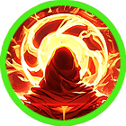
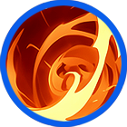

# ❤️‍🔥 Iskandar



<table data-card-size="large" data-view="cards"><thead><tr><th></th><th data-hidden data-card-cover data-type="files"></th><th data-hidden data-card-target data-type="content-ref"></th></tr></thead><tbody><tr><td></td><td><a href="../../../.gitbook/assets/Git_Hero_Iskandar.png">Git_Hero_Iskandar.png</a></td><td><a href="../">..</a></td></tr><tr><td></td><td><a href="../../../.gitbook/assets/Git_Hero_Iskandar_fire.png">Git_Hero_Iskandar_fire.png</a></td><td><a href="../stats/elemental-bonus-damage.md#elemental-bonus-damage-table">#elemental-bonus-damage-table</a></td></tr></tbody></table>



### 📒 Iskandal: The Unwanted Fire

"A throne built on politics. A power built on flame."

Iskandal is the seventh prince of Asterica, but he is far from a spare. He is the only royal capable of resonating with Extocium, and his power is terrifying. Rumor has it that even Aruru, the kingdom’s greatest warrior, breaks a sweat when sparring with him. With the presence of a king and a spirit that burns like a wildfire, Iskandal should be the obvious heir.

But his strength is exactly what makes him a target. The First Prince is weak and easily controlled, which is exactly how the noble factions like it. If Iskandal takes the throne, the old power structures will burn. Supported by the ambitious noble Rahan, Iskandal finds himself at the center of a deadly political chess match.

Can a man built for the battlefield survive the poisoned whispers of the court? \
Will his flame be the light that saves the kingdom, \
or the fire that reduces the monarchy to dust?



#### 📒이스칸달: 왕좌를 향한 불꽃

아스테리카 왕국의 왕족 중 서열 7위에 위치한 이스칸달은, 단순한 왕위 계승 후보로 불리기에는 너무나 강한 존재였다. 그는 왕족 가운데 유일하게 신비로운 엑스토시움과 반응하는 능력을 지녔으며, 그 마법의 힘은 왕궁 안에서도 누구도 쉽게 따라올 수 없을 만큼 압도적이었다. 왕궁에서 가장 강한 전사로 알려진 아루루조차 이스칸달과의 대련에서 고전했다는 소문이 돌 정도로, 그의 실력은 이미 널리 알려져 있었다. 왕좌에 어울리는 위엄을 지닌 외모와, 불꽃처럼 타오르는 투지는 그를 더욱 돋보이게 만들었다.

문제는 그의 능력이었다. 왕위 계승 서열 1위의 왕자는 아직 어리고 소심해, 이스칸달과 비교조차 되지 않는 존재였다. 만약 이스칸달이 왕위에 오르게 된다면, 그를 지지하는 강력한 귀족 라한의 영향력이 지나치게 커질 수밖에 없다. 이는 현재 권력을 쥐고 있는 귀족 분파들에게 치명적인 위협이었다. 결국 이스칸달은 왕궁 안에서 수많은 왕족과 귀족들의 견제를 한 몸에 받게 되었고, 그의 앞길은 점점 더 험난해져 갔다.

능력만으로는 왕이 될 수 없는 자리, 그리고 불꽃처럼 타오르는 야망과 정치의 소용돌이. 이스칸달은 과연 이 모든 압박을 견뎌내고 왕좌에 오를 수 있을 것인가. \
그의 불꽃은, 왕국을 밝히는 불이 될 것인가, 아니면 모든 것을 태워버릴 불길이 될 것인가.



#### 📒イスカンダル（Iskandal）：王座を焼き尽くす野心の炎

「力だけでは届かぬ玉座。渦巻く計略の中で、獅子は牙を剥く。」

アステリカ王位継承順位第七位、イスカンダル。しかし、その数字だけで彼を推し量る者は一人もいません。王族で唯一エクストシウムと共鳴し、その圧倒的な魔力は王宮最強の戦士アルルですら手合わせを躊躇うほど。王としての威厳を纏い、戦士の闘志を宿した彼は、紛れもなく次代の覇者にふさわしい器でした。

しかし、そのあまりの強さが彼を窮地へと追い込みます。第一継承者である王子は脆弱で臆病。もしイスカンダルが王座に就けば、彼を支持する貴族ラハンの勢力は制御不能になるでしょう。既得権益を守ろうとする派閥にとって、イスカンダルは排除すべき「劇薬」だったのです。

王宮に張り巡らされる陰湿な包囲網。力だけでは辿り着けない至高の椅子。 若き獅子の野心は、国を照らす希望の灯火となるのか。 それとも、すべてを焼き尽くし、秩序を崩壊させる業火となるのでしょうか。



### ❇️Iskandar‘s skill list &#x20;

<table data-full-width="true"><thead><tr><th width="206">Skill</th><th width="109" align="center">Icon</th><th width="102">Type</th><th width="489">contents</th><th align="center">loot prob</th></tr></thead><tbody><tr><td>Great Conqueror 위대한 정복자 偉大な征服者</td><td align="center"></td><td>Buff</td><td>
<strong>EN</strong> Generates a shield for a set duration that reduces enemy damage by a fixed amount. While active, MP is consumed every second.

🔹 <strong>KR</strong> 정해진 시간 동안 적이 주는 데미지를 일정량 감소시키는 실드를 생성합니다. 스킬이 유지되는 동안 매초 MP가 소모됩니다.

🔹 <strong>JP</strong> 一定時間、敵の与えるダメージを一定量減少させるシールドを生成します。効果中は毎秒MPを消費します。
</td><td align="center">15%</td></tr><tr><td>End of the world 세상의 끝 世界の終わり</td><td align="center"></td><td>Projectile</td><td>
<strong>EN</strong> Throws a long-range flaming shuriken forward, dealing damage per projectile to enemies. Elemental bonus damage is increased.

🔹 <strong>KR</strong> 사거리가 긴 불타는 표창을 전방으로 투척해 적들에게 탄당 피해를 입힙니다. 상성에 따른 <strong>부가 데미지</strong>가 증가합니다.

🔹 <strong>JP</strong> 長射程の燃える手裏剣を前方へ投げ、敵に弾ごとのダメージを与えます。属性相性に応じた<strong>追加ダメージ</strong>が増加します。
</td><td align="center">15%</td></tr><tr><td>Wandering 유랑 流浪</td><td align="center"></td><td>Projectile</td><td>
<strong>EN</strong> Charges forward, dealing damage to enemies within the area and knocking them back.

🔹 <strong>KR</strong> 전방으로 돌진해 범위 내 적들에게 피해를 입히고, 넉백시킵니다.

🔹 <strong>JP</strong> 前方に突進し、範囲内の敵にダメージを与えてノックバックさせます。
</td><td align="center">15%</td></tr><tr><td>Wrath of fire 화염의 분노 火炎の怒り</td><td align="center"></td><td>Buff</td><td>
<strong>EN</strong> For a set duration, your skill reload time is reduced, movement speed increases, and damage increases. While active, MP is consumed every second.

🔹 <strong>KR</strong> 정해진 시간 동안 스킬 재사용 대기 시간이 감소하고, 이동 속도와 데미지가 증가합니다. 스킬이 유지되는 동안 매초 MP가 소모됩니다.

🔹 <strong>JP</strong> 一定時間、スキルのリロード時間が短縮され、移動速度とダメージが増加します。効果中は毎秒MPを消費します。
</td><td align="center">15%</td></tr><tr><td>Fighting Spirit 화염의 투지 火炎の闘志</td><td align="center"></td><td>Buff</td><td>
<strong>EN</strong> For a set duration, your damage increases. While active, MP is consumed every second.

🔹 <strong>KR</strong> 정해진 시간 동안 데미지가 증가합니다. 스킬이 유지되는 동안 매초 MP가 소모됩니다.

🔹 <strong>JP</strong> 一定時間、ダメージが増加します。効果中は毎秒MPを消費します。
</td><td align="center">15%</td></tr><tr><td>Will Destroy 멸망시키리라 滅ぼします</td><td align="center"></td><td>Projectile</td><td>
<strong>EN</strong> Fires a massive firestorm forward, dealing damage per tick to enemies within the area and knocking them back. Elemental bonus damage is increased.

🔹 <strong>KR</strong> 전방으로 거대한 화염 폭풍을 날려보내 범위 내 적들에게 틱당 피해를 입히고, 넉백시킵니다. 상성에 따른 <strong>부가 데미지</strong>가 증가합니다.

🔹 <strong>JP</strong> 前方に巨大な火炎嵐を放ち、範囲内の敵にティックごとのダメージを与えてノックバックさせます。属性相性に応じた<strong>追加ダメージ</strong>が増加します。
</td><td align="center">15%</td></tr><tr><td>Red Bombardment 붉은 폭격 赤い爆撃</td><td align="center"></td><td>AoE</td><td>
<strong>EN</strong> Summons a fiery meteor over a wide area, dealing damage per tick to enemies within the area. Elemental bonus damage is increased.

🔹 <strong>KR</strong> 광범위한 지역에 화염 운석을 소환해 범위 내 적들에게 틱당 피해를 입힙니다. 상성에 따른 <strong>부가 데미지</strong>가 증가합니다.

🔹 <strong>JP</strong> 広範囲に火炎の隕石を召喚し、範囲内の敵にティックごとのダメージを与えます。属性相性に応じた<strong>追加ダメージ</strong>が増加します。
</td><td align="center">10%</td></tr></tbody></table>
