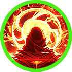
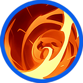

# ❤️‍🔥 Iskandar



<table data-card-size="large" data-view="cards"><thead><tr><th></th><th data-hidden data-card-cover data-type="files"></th><th data-hidden data-card-target data-type="content-ref"></th></tr></thead><tbody><tr><td></td><td><a href="../../../.gitbook/assets/Git_Hero_Iskandar.png">Git_Hero_Iskandar.png</a></td><td><a href="../">..</a></td></tr><tr><td></td><td><a href="../../../.gitbook/assets/Git_Hero_Iskandar_fire.png">Git_Hero_Iskandar_fire.png</a></td><td><a href="../stats/elemental-bonus-damage.md#elemental-bonus-damage-table">#elemental-bonus-damage-table</a></td></tr></tbody></table>



### 📒 Iskandal: The Unwanted Fire

"A throne built on politics. A power built on flame."

Iskandal is the seventh prince of Asterica, but he is far from a spare. He is the only royal capable of resonating with Extocium, and his power is terrifying. Rumor has it that even Aruru, the kingdom’s greatest warrior, breaks a sweat when sparring with him. With the presence of a king and a spirit that burns like a wildfire, Iskandal should be the obvious heir.

But his strength is exactly what makes him a target. The First Prince is weak and easily controlled, which is exactly how the noble factions like it. If Iskandal takes the throne, the old power structures will burn. Supported by the ambitious noble Rahan, Iskandal finds himself at the center of a deadly political chess match.

Can a man built for the battlefield survive the poisoned whispers of the court? \
Will his flame be the light that saves the kingdom, \
or the fire that reduces the monarchy to dust?



#### 📒이스칸달: 왕좌를 향한 불꽃

아스테리카 왕국의 왕족 중 서열 7위에 위치한 이스칸달은, 단순한 왕위 계승 후보로 불리기에는 너무나 강한 존재였다. 그는 왕족 가운데 유일하게 신비로운 엑스토시움과 반응하는 능력을 지녔으며, 그 마법의 힘은 왕궁 안에서도 누구도 쉽게 따라올 수 없을 만큼 압도적이었다. 왕궁에서 가장 강한 전사로 알려진 아루루조차 이스칸달과의 대련에서 고전했다는 소문이 돌 정도로, 그의 실력은 이미 널리 알려져 있었다. 왕좌에 어울리는 위엄을 지닌 외모와, 불꽃처럼 타오르는 투지는 그를 더욱 돋보이게 만들었다.

문제는 그의 능력이었다. 왕위 계승 서열 1위의 왕자는 아직 어리고 소심해, 이스칸달과 비교조차 되지 않는 존재였다. 만약 이스칸달이 왕위에 오르게 된다면, 그를 지지하는 강력한 귀족 라한의 영향력이 지나치게 커질 수밖에 없다. 이는 현재 권력을 쥐고 있는 귀족 분파들에게 치명적인 위협이었다. 결국 이스칸달은 왕궁 안에서 수많은 왕족과 귀족들의 견제를 한 몸에 받게 되었고, 그의 앞길은 점점 더 험난해져 갔다.

능력만으로는 왕이 될 수 없는 자리, 그리고 불꽃처럼 타오르는 야망과 정치의 소용돌이. 이스칸달은 과연 이 모든 압박을 견뎌내고 왕좌에 오를 수 있을 것인가. \
그의 불꽃은, 왕국을 밝히는 불이 될 것인가, 아니면 모든 것을 태워버릴 불길이 될 것인가.



#### 📒イスカンダル（Iskandal）：王座を焼き尽くす野心の炎

「力だけでは届かぬ玉座。渦巻く計略の中で、獅子は牙を剥く。」

アステリカ王位継承順位第七位、イスカンダル。しかし、その数字だけで彼を推し量る者は一人もいません。王族で唯一エクストシウムと共鳴し、その圧倒的な魔力は王宮最強の戦士アルルですら手合わせを躊躇うほど。王としての威厳を纏い、戦士の闘志を宿した彼は、紛れもなく次代の覇者にふさわしい器でした。

しかし、そのあまりの強さが彼を窮地へと追い込みます。第一継承者である王子は脆弱で臆病。もしイスカンダルが王座に就けば、彼を支持する貴族ラハンの勢力は制御不能になるでしょう。既得権益を守ろうとする派閥にとって、イスカンダルは排除すべき「劇薬」だったのです。

王宮に張り巡らされる陰湿な包囲網。力だけでは辿り着けない至高の椅子。 若き獅子の野心は、国を照らす希望の灯火となるのか。 それとも、すべてを焼き尽くし、秩序を崩壊させる業火となるのでしょうか。



### ❇️Iskandar‘s skill list &#x20;

<table data-full-width="true"><thead><tr><th width="206">Skill</th><th width="109" align="center">Icon</th><th width="102">Type</th><th width="489">contents</th><th align="center">loot prob</th></tr></thead><tbody><tr><td>Great Conqueror 위대한 정복자 偉大な征服者</td><td align="center"></td><td><mark style="color:green;">Buff</mark></td><td>
<strong>EN</strong> Generates a shield that reduces enemy damage by a certain amount for a period of time. While the skill is active, a portion of its MP cost is gradually reduced.

🔹 <strong>KR</strong> 일정 시간 동안 적의 데미지를 일정량 감소시키는 실드를 생성한다. 스킬 사용 중에는 MP 소모값 일부가 지속적으로 감소한다.

🔹 <strong>JP</strong> 一定時間、敵のダメージを一定量減少させるシールドを生成する。スキル使用中は、MP消費量の一部が継続的に減少する。
</td><td align="center">15%</td></tr><tr><td>End of the world 세상의 끝 世界の終わり</td><td align="center"></td><td><mark style="color:blue;">Projectile</mark></td><td>
<strong>EN</strong> Throws a blazing shuriken forward with extremely long range. Each hit deals magic damage to enemies. Enemies hit have their Evasion Rate reduced by a certain amount for a period of time. EBD+

🔹 <strong>KR</strong> 전방으로 사거리가 굉장히 긴 불타는 표창을 투척한다. 적에게 마법 피해를 입힌다. 피해를 입은 적은 일정 시간 동안 회피율이 일정량 감소한다. EBD+

🔹 <strong>JP</strong> 非常に射程の長い燃える手裏剣を前方に投げ放つ。敵に魔法ダメージを与える。被弾した敵は一定時間、回避率が一定量減少する。 EBD+
</td><td align="center">15%</td></tr><tr><td>Wandering 유랑 流浪</td><td align="center"></td><td><mark style="color:blue;">Projectile</mark></td><td>
<strong>EN</strong> Charges forward, dealing magic damage to enemies within range, and knocks back enemies.

🔹 <strong>KR</strong> 전방으로 돌진하며 범위 내 적들에게 마법 피해를 입히며, 적을 넉백시킨다.

🔹 <strong>JP</strong> 前方に突進し, 範囲内の敵に魔法ダメージを与え, 敵をノックバックさせます.
</td><td align="center">15%</td></tr><tr><td>Wrath of fire 화염의 분노 火炎の怒り</td><td align="center"></td><td><mark style="color:green;">Buff</mark></td><td>
<strong>EN</strong> For a period of time, your Skill Reload Time is reduced by a certain amount, your Movement Speed increases by a certain amount, and your Damage increases by a certain amount. While the skill is active, a portion of its MP cost is gradually reduced.

🔹 <strong>KR</strong> 일정 시간 동안 자신의 스킬 재장전 시간이 일정량 감소하고, 이동 속도와 데미지가 일정량 증가한다. 스킬 사용 중에는 MP 소모값 일부가 지속적으로 감소한다.

🔹 <strong>JP</strong> 一定時間、自身のスキルリロード時間が一定量減少し、移動速度とダメージが一定量上昇する。スキル使用中は、MP消費量の一部が継続的に減少する。
</td><td align="center">15%</td></tr><tr><td>Fighting Spirit 화염의 투지 火炎の闘志</td><td align="center"></td><td><mark style="color:green;">Buff</mark></td><td>
<strong>EN</strong> For a period of time, your Damage increases by a certain amount. While the skill is active, a portion of its MP cost is gradually reduced.

🔹 <strong>KR</strong> 일정 시간 동안 자신의 데미지가 일정량 증가한다. 스킬 사용 중에는 MP 소모값 일부가 지속적으로 감소한다.

🔹 <strong>JP</strong> 一定時間、自身のダメージが一定量上昇する。スキル使用中は、MP消費量の一部が継続的に減少する。
</td><td align="center">15%</td></tr><tr><td>Will Destroy 멸망시키리라 滅ぼします</td><td align="center"></td><td><mark style="color:blue;">Projectile</mark></td><td>
<strong>EN</strong> Unleashes a massive firestorm forward, dealing magic damage to enemies within range and knocking them back. If a target hit is under a damage buff, that damage buff is reduced by a certain amount for a period of time. EBD+

🔹 <strong>KR</strong> 전방으로 거대한 화염폭풍을 날려, 범위내 적들에게 마법 피해를 입히며 넉백시킨다. 피해를 입은 대상이 데미지 버프를 받고 있다면, 일정 시간 동안 데미지 버프가 일정량 감소된다. EBD+

🔹 <strong>JP</strong> 前方へ巨大な火炎嵐を放ち、範囲内の敵に魔法ダメージを与え、ノックバックさせる。ダメージを受けた対象がダメージバフを受けている場合、一定時間、そのダメージバフが一定量減少する。 EBD+
</td><td align="center">15%</td></tr><tr><td>Red Bombardment 붉은 폭격 赤い爆撃</td><td align="center"></td><td><mark style="color:red;">AoE</mark></td><td>
<strong>EN</strong> Summons fiery meteors over a wide area. Deals magic damage to all enemies within range. EBD+

🔹 <strong>KR</strong> 광역 범위에 화염 운석을 소환하여 범위 내 적들에게 마법 피해를 입힌다. EBD+

🔹 <strong>JP</strong> 広範囲に炎の隕石を召喚する。範囲内の敵にティックごとに魔法ダメージを与える。 EBD+
</td><td align="center">10%</td></tr></tbody></table>

<em>※ This guide was written based on the game status as of April 08, 2026,</em>  <em>and its contents may change with future updates.</em>

